# Create certificates for the RSAT certificate-based authentication

This article explains how to set up the certificate that is required for certificate-based authentication for Regression suite automation tool (RSAT) 2.8.

## About certificates

Digital certificates are digital "ID cards" that help establish trust online. They bind a public key to an entity's identity. That entity might be a website, an individual, or an organization. By using cryptography and ensuring secure communication across networks, certificates serve as a fundamental building block in modern security and form part of a broader public key infrastructure (PKI) that underpins secure communications across the internet. By providing a way to verify identity and establish encrypted channels, they help protect sensitive data from malicious actors.

Certificates are arranged as trees that are known as *chains of trust*. A chain of trust includes a root certificate (or CA certificate), an intermediate certificate, and an end-entity certificate (or user certificate), as shown in the following diagram.


The binding of intermediate and user certificates to a securely managed root certificate helps secure the foundational trust of your PKI. In addition, it helps make certificate issuance, management, and eventual revocation more efficient and resilient to potential security breaches. This layered approach is core to modern digital security practices. It helps maintain trust at the same time that it allows for scalability and flexibility across complex environments.

## Use existing certificates 

You may already have a root certificate that was procured from a certificate authority (CA) that issues certificates based on the identity of the applicant. If so, skip the section below on creating a root certificate. You still need to generate an intermediate and a user certificate from this root certificate, which is described in the sections below.

When you submit a certificate signing request to a CA, the CA provides a Secure Sockets Layer (SSL) certificate that is signed by using the CA's root certificate and private key. The certificate has a defined life span. If you have a certificate from a CA, you can use it instead of creating a self-signed certificate. You can also generate certificates from Active Directory Certificate Services (AD CS).

If you don't have a root certificate you must create one, as described in the section below.

## Create certificates

This section explains how to generate a self-signed certificate that is needed to set up the RSAT system. After you create a root certificate, an intermediate certificate, and a user certificate, you upload them into Microsoft Entra and install them on the local computer that is running RSAT 2.8.

### Create a root certificate

The root certificate (or CA certificate) is used to sign any number of intermediate certificates.

Use the following PowerShell script to generate a self-signed CA certificate.

```powershell
# Create a Root CA certificate (self-signed)
$rootCert = New-SelfSignedCertificate `
  -Subject "CN=ContosoRootCA, O=Contoso, OU=IT, C=US" `
  -KeyExportPolicy Exportable `
  -KeyUsage CertSign, CRLSign, DigitalSignature `
  -Type Custom `
  -KeyAlgorithm RSA `
  -KeyLength 2048 `
  -HashAlgorithm SHA256 `
  -NotAfter (Get-Date).AddYears(10) `
  -CertStoreLocation "Cert:LocalMachine\My" `
  -TextExtension @("2.5.29.19={critical}{text}ca=true&pathlength=1")

Export-Certificate -Cert $rootCert -FilePath "C:\Temp\ContosoRootCA.cer"
```

Here's an explanation of the script.

1. **Certificate creation**

    ```powershell
    $rootCert = New-SelfSignedCertificate 
    ```

    This line calls the new self-signed certificate cmdlet and assigns the generated certificate object to the `\$rootCert` variable.

1. **Subject**

    ```powershell
    -Subject "CN=ContosoRootCA, O=Contoso, OU=IT, C=US" 
    ```

    The `Subject` parameter sets the distinguished name (DN) for the certificate. The DN has the following components:

    - **Common name (`CN`)** – The label for the certificate. This label is typically used as the primary identifier. In this example, the common name is ContosoRootCA.
    - **Organization (`O`)** – The organization. In this example, the organization is Contoso.
    - **Organizational unit (`OU`)** – A specific department or division in the organization. In this example, the organizational unit is the IT department.
    - **Country (`C`):** – The country/region code. In this example, the country/region is the United States.

1. **Key export policy**

    ```powershell
    -KeyExportPolicy Exportable 
    ```

    The `KeyExportPolicy` parameter determines whether the private key can be exported. A value of `Exportable` specifies that the private key can be extracted from the certificate store as it's needed.

1. **Key usage**

    ```powershell
    -KeyUsage CertSign, CRLSign, DigitalSignature 
    ```

    The `KeyUsage` parameter specifies what the certificate's key can be used for. The following uses are typical for a CA certificate:

    - `CertSign` – The key enables the certificate to sign other certificates.
    - `CRLSign` - The key allows for signing certificate revocation lists (CRLs).
    - `DigitalSignature` – The key enables the certificate to be used to create digital signatures.

1. **Type**

    ```powershell
    -Type Custom 
    ```

    The `Type` custom setting indicates that no predefined template was used to create the certificate. Instead, the certificate was created with customized properties.

1. **Key algorithm**

    ```powershell
    -KeyAlgorithm RSA 
    ```

    The `KeyAlgorithm` parameter defines the algorithm for creating the key pair. RSA is one of the most widely used public-key cryptographic algorithms.

1. **Key length**

    ```powershell
    -KeyLength 2048 
    ```

    The `KeyLength` parameter sets the size of the cryptographic key in bits. A 2048-bit key is a common standard that offers a strong balance between security and performance.

1. **Hash algorithm**

    ```powershell
    -HashAlgorithm SHA256 
    ```

    The `HashAlgorithm` parameter specifies the algorithm that is used during certificate creation (when the certificate is signed). SHA256 is a secure and widely adopted hash algorithm.

1. **Validity period**

    ```powershell
    -NotAfter (Get-Date).AddYears(10) 
    ```

    The `NotAfter` parameter sets the expiration date of the certificate. A value of `(Get-Date).AddYears(10)` specifies that the certificate is valid for 10 years from the current date. Root certificates that have a long validity period are common.

1. **Certificate store location**

    ```powershell
    -CertStoreLocation "Cert:\LocalMachine\My" 
    ```

    The `CertStoreLocation` parameter indicates where the new certificate is put in the certificate store. The value `\"Cert:\\LocalMachine\\My\"` refers to the personal certificate store for the local computer account.

1. **Text extension**

    ```powershell
    -TextExtension @("2.5.29.19={critical}{text}ca=true&pathlength=1")
    ```

    The `TextExtension` parameter is used to add custom certificate extensions in a text-based format. In this example, the value consists of the following parts:

    - `2.5.29.19` – The object identifier (OID) of the basic constraints extension.
    - `{critical}` – The extension is critical. If a client doesn't understand the extension, it shouldn't trust the certificate.
    - `{text}ca=true&pathlength=1` – The certificate is a CA certificate (`ca=true`) that has a path length constraint of 1 (`pathlength=1`). The path length constraint limits the number of subordinate certificate issuers that can follow in the chain.

1. **Certificate export**

    ```powershell
    Export-Certificate -Cert $rootCert -FilePath "C:\Temp\ContosoRootCA.cer"
    ```

    This command exports the certificate that is created to a file. The file contains the public portion of the certificate, without the private key. It's stored in C:\\Temp\\ContosoRootCA.cer, in a standard certificate file format (usually Base-64 encoded).

When you run this script, it creates a self-signed root CA certificate that has appropriate settings for a CA:

- An exportable key that can be used for signing operations
- A strong cryptographic setup (the RSA public-key cryptographic algorithm, a 2048-bit key, and the SHA256 hash algorithm)
- A defined validity period

### Create an intermediate certificate

Use the following PowerShell script to generate an intermediate certificate that is signed by using the root certificate.

```powershell
# Create an Intermediate CA certificate (self-signed)
$rootSubject = "CN=ContosoRootCA, O=Contoso, OU=IT, C=US"

$rootCert = Get-ChildItem -Path Cert:\LocalMachine\My | Where-Object { $_.Subject -eq $rootSubject -and $_.HasPrivateKey }

if (-not $rootCert) {
    Write-Error "Root CA certificate with subject '$rootSubject' not found in LocalMachine\My."
    return
}

$intermediateCert = New-SelfSignedCertificate `
  -Subject "CN=ContosoIntermediateCA, O=Contoso, OU=IT - Americas, C=US" `
  -KeyExportPolicy Exportable `
  -KeyUsage CertSign, CRLSign, DigitalSignature `
  -Type Custom `
  -KeyAlgorithm RSA `
  -KeyLength 2048 `
  -HashAlgorithm SHA256 `
  -NotAfter (Get-Date).AddYears(5) `
  -CertStoreLocation "Cert:\LocalMachine\My" `
  -Signer $rootCert `
  -TextExtension @("2.5.29.19={critical}{text}ca=true&pathlength=0")

Export-Certificate -Cert $intermediateCert -FilePath "C:\Temp\.cer"
```

Here's an explanation of the script.

1. **Definition of the root subject**

    ```powershell
    $rootSubject = "CN=ContosoRootCA, O=Contoso, OU=IT, C=US"
    ```

    The `\$rootSubject` variable stores the distinguished name (DN) of the root CA certificate that you previously created. The DN has the following components:

    - **Common name (`CN`)** – The label for the certificate. In this example, the common name is ContosoRootCA.
    - **Organization (`O`)** – The organization. In this example, the organization is Contoso.
    - **Organizational unit (`OU`)** – A specific department or division in the organization. In this example, the organizational unit is the IT department.
    - **Country (`C`):** – The country/region code. In this example, the country/region is the United States.

1. **Retrieval of the root certificate from the certificate store**

    ```powershell
    $rootCert = Get-ChildItem -Path Cert:\LocalMachine\My | Where-Object { $_.Subject -eq $rootSubject -and $_.HasPrivateKey }
    ```

    This command searches the personal certificate store for the local computer account (Cert:\\LocalMachine\\My). It looks for certificates that match the subject that is defined in the `\$rootSubject` variable and that have an associated private key. The private key is critical because you need it to sign the intermediate certificate and therefore establish a chain of trust. The script can continue with signing only if a matching certificate is found.

### Create a user certificate

Use the following PowerShell script to create a user certificate that is validated by the previously created intermediate certificate.

```powershell
# Edit the details as needed
$account = "testuser"
$tenant = "Contoso"
$userUPN = "$account@$tenant.onmicrosoft.com"
$subjectPrefix = "$account.$tenant."
$subject = "CN=$subjectPrefix User Certificate, O=$tenant, OU=Users, C=US"

# Find the Intermediate CA in the cert store
$intermediateSubject = "CN=ContosoIntermediateCA, O=Contoso, OU=IT - Americas, C=US"
$intermediateCert = Get-ChildItem -Path Cert:\LocalMachine\My |  Where-Object { $_.Subject -eq $intermediateSubject -and $_.HasPrivateKey }

if (-not $intermediateCert) {
    Write-Error "Intermediate CA cert not found in Cert:\LocalMachine\My."
    return
}

$userCert = New-SelfSignedCertificate `
  -Subject $subject `
  -KeyAlgorithm RSA `
  -KeyLength 2048 `
  -HashAlgorithm SHA256 `
  -CertStoreLocation "Cert:\LocalMachine\My" `
  -Type Custom `
  -KeyExportPolicy Exportable `
  -TextExtension @(
"2.5.29.19={critical}{text}ca=false",  # Basic Constraints (not a CA)
"2.5.29.37={text}1.3.6.1.5.5.7.3.2",   # EKU: Client Authentication
"2.5.29.17={text}email=$userUPN"       # SAN: RFC822Name (email)
) `
  -Signer $intermediateCert `
  -NotAfter (Get-Date).AddYears(1)
 
Export-Certificate -Cert $userCert -FilePath "C:\Temp\$subjectPrefix-UserCert.cer"
$certpwd = ConvertTo-SecureString -String 'yourreqpwdhere' -force -AsPlainText
Export-PfxCertificate -Cert $userCert -FilePath "C:\Temp\$subjectPrefix-UserCert.pfx" -password $certpwd
```

Here's an explanation of the script.

1. **User identity construction**

    The script builds the required identity details for a user certificate, to ensure consistent naming. Those details are the distinguished name (DN) and the user principal name (UPN). The certificate is valid for one year after the creation date.

1. **Intermediate CA integration**

    The script finds an existing intermediate CA certificate in the local computer store. This step is crucial because the intermediate certificate is used to sign the new user certificate and therefore maintain a chain of trust.

1. **Certificate creation**

    After the user identity and signer are in place, the script creates a new self-signed but subordinate certificate that is intended for client authentication. Custom text extensions clarify the usage and ensure that the certificate can't act as a CA certificate.

1. **Certificate export**

    The script exports the certificate as both a .cer file and a .pfx file. The .cer file includes only public information and is used for distribution and validation purposes. The .pfx file includes the private key and is secured by a password. It's used for import or backup purposes.

### Import the root certificate

After the certificates are generated, configure the PKI by importing the root certificate.

1. Sign in to the [Microsoft Entra admin center](https://entra.microsoft.com/).
1. On the **Protection** tab, select **Show more**, and then select **Security center**.
1. Select **Create PKI**. 
1. In the security center, go to **Manage** \> **Public key infrastructure (Preview)**.
1. In the upper-right corner, select **Create PKI**. 
1. Enter a display name for the PKI, and then select **Create**.

    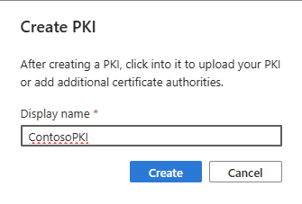

1. Select the new PKI. Notice that no CAs are listed for it in the grid on the **CAs** tab.

    

1. Add certificate authorities by following these steps:

    1. Select **Add certificate authority**.
    1. In the **Certificate** field, select the root CA that you created earlier. Then, under **Is this certificate authority the root?**, select the **Yes** option.

        

    1. Select **Save**.
    1. Select **Add certificate authority** again. 
    1. In the **Certificate** field, select the intermediate certificate that you created earlier. Then, under **Is this certificate authority the root?**, select the **No** option.

        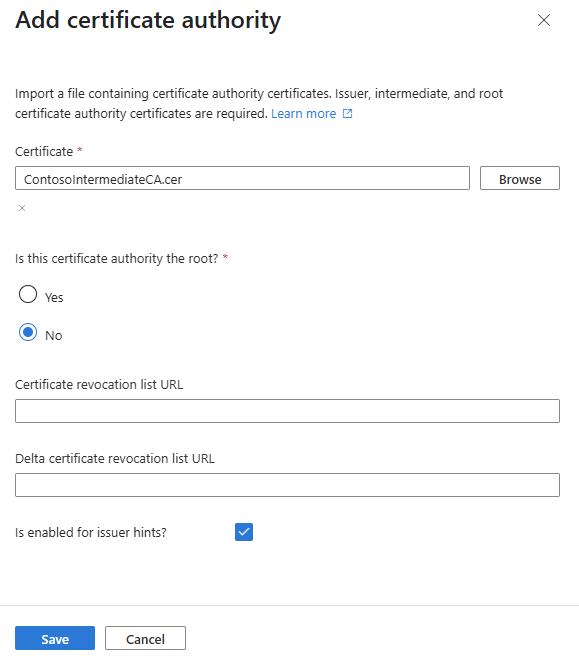

    Both certificates should now be listed for the PKI.

    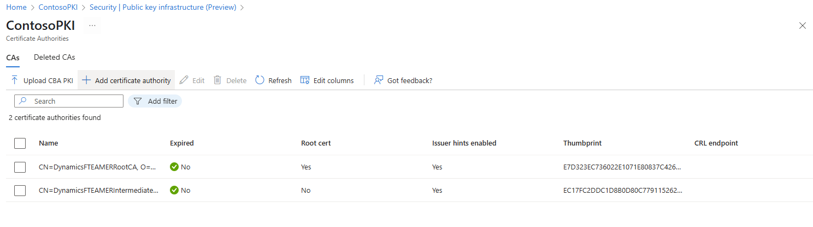

1. Set up the authentication methods by following these steps:

    1. Go to **Security center** \> **Manage** \> **Authentication methods**.
    1. In the left pane, select **Policies**.

        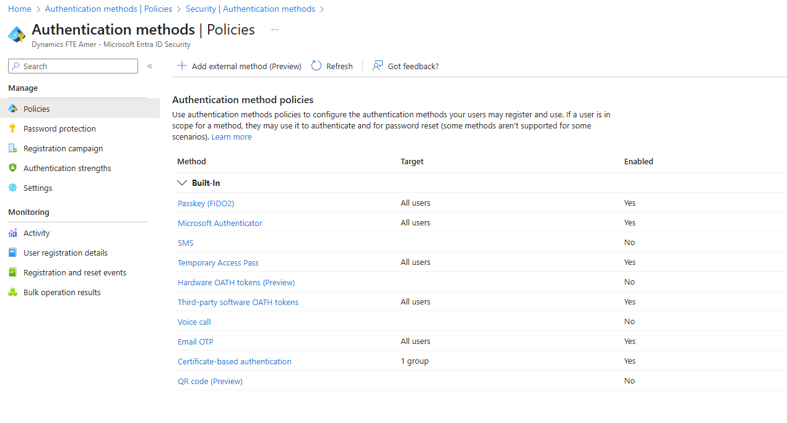

    1. In the grid, select **Certificate-based authentication**.
    1. On the **Enable and Target** tab, turn on the **Enable** option.
    1. Select **Add groups** to add the group to the grid.

        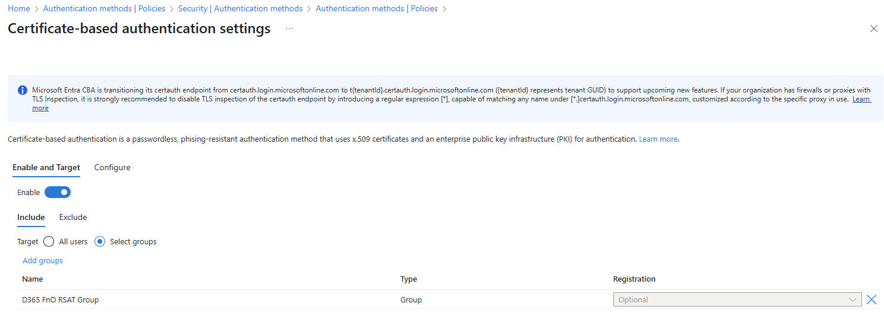

    1. On the **Configure** tab, select **Add rule**.

       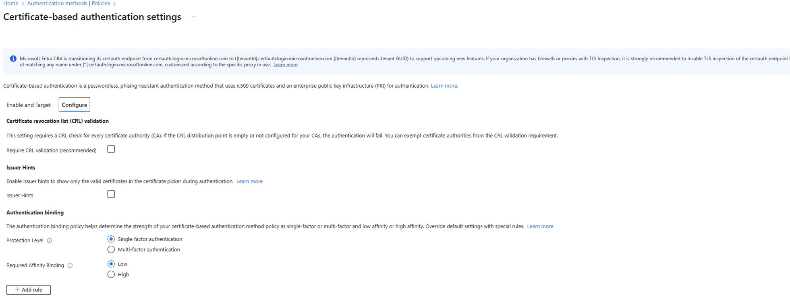

    1. Select the **Certificate issuer** checkbox.
    1. Optional: If you have many certificates, use the **Filter CAs by PKI** field to filter the CAs by PKI.
    1. In the **Certificate issuer** field, select the intermediate certificate.
    1. Under **Authentication strength**, select the **Multi-factor authentication** option.
    1. Under **Affinity binding**, select the **Low** option.

        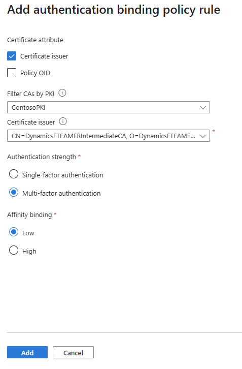

    1. Select **Add**.
    1. A message asks you to ensure that users who are enabled for certificate-based authentication (CBA) have a valid certificate. It also asks you to acknowledge that you disabled Transport Layer Security (TLS) inspection. Select **I Acknowledge**.
 
       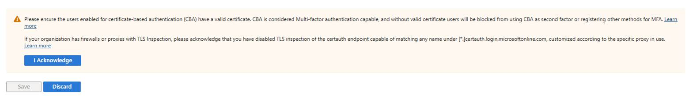

    1. Select **Save**. The certificate-based authentication can now be classified as multifactor authentication (MFA).

    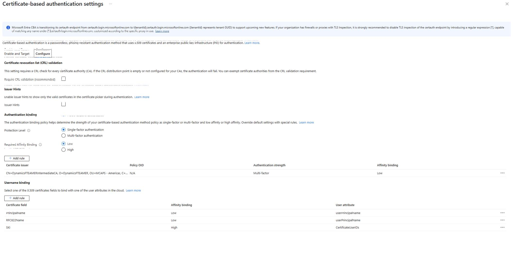

### Install the certificates on the computer that is running RSAT

Next, install the certificates on the computer where you run RSAT.

> [!NOTE]
> Root CA certificates must be installed only if they're self-signed.

1. Import the root CA (.cer file) and intermediate CA (.cer file) into **Local machine** \> **Trusted Root Certification Authorities**.
1. Import the .pfx file for the user certificate into **Local user** \> **Personal**.
1. Import the .cer file for the user certificate into **Local machine** \> **Trusted Root Certification Authorities**.
1. To enable automatic certificate sign-in for the tenant, follow these steps:
   - In the following PowerShell scripts, edit the parts for the tenant ID (guid) and the user certificate subject (use the script for your choice of browser):
  
     **Microsoft Edge**

       ```powershell
       New-Item -Path "HKLM:\SOFTWARE\Policies\Microsoft\Edge\AutoSelectCertificateForUrls" -Force
       
       New-ItemProperty -Path "HKLM:\SOFTWARE\Policies\Microsoft\Edge\AutoSelectCertificateForUrls" `
       -Name "1" `
       -Value '{"pattern":"[*.]microsoftonline.com/f30eb649-xxxx-41bc-91af-139e4fd1d9f6","filter":{"SUBJECT":{"CN":"testuser.Contoso.User Certificate"}}}' `
       -PropertyType String -Force
       ```

     **Google Chrome**

       ```powershell
       New-Item -Path "HKLM:\SOFTWARE\Policies\Google\Chrome\AutoSelectCertificateForUrls" -Force
       
       New-ItemProperty -Path "HKLM:\SOFTWARE\Policies\Google\Chrome\AutoSelectCertificateForUrls" `
       -Name "1" `
       -Value '{"pattern":"[*.]microsoftonline.com/f30eb649-xxxx-41bc-91af-139e4fd1d9f6","filter":{"SUBJECT":{"CN":"testuser.Contoso.User Certificate"}}}' `
       -PropertyType String -Force
       ```
       
   - In the scripts above, the value `f30eb649-xxxx-41bc-91af-139e4fd1d9f6` is the tenant ID, and `testuser.Contoso.User Certificate` is the user certificate subject
   - Once you have made the edits, run the script. This inserts the relevant registry key entries as required. 

### Configure RSAT

In the following example, manual selection is used as the authentication method. Therefore, it's important that you provide the thumbprint from the user certificate.

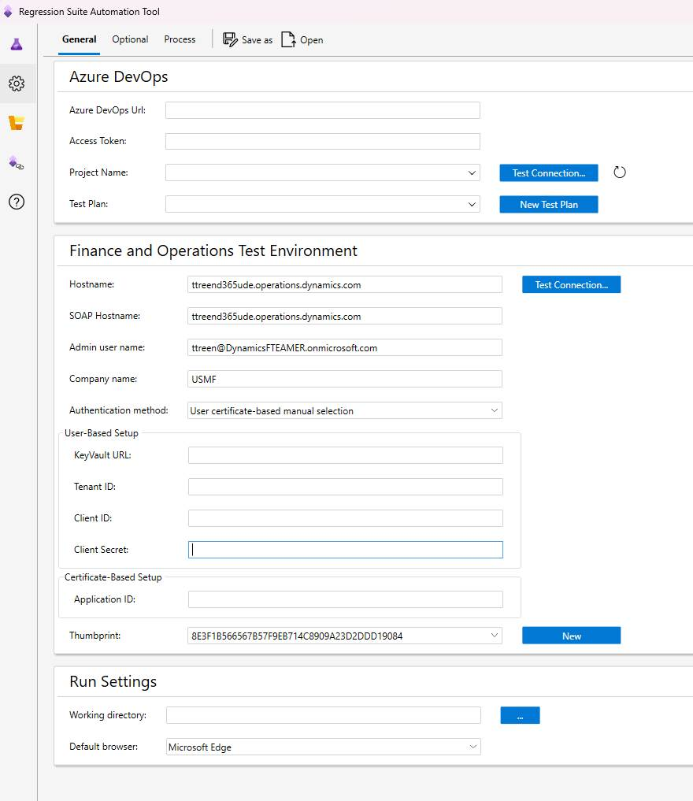

When you select **Test connection**, you should receive a message that states that the connection was successful.

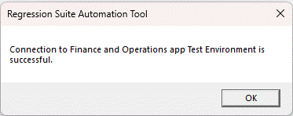

### RSAT certification modes

RSAT supports three modes for certificate-based authentication (CBA) during test execution. Each mode determines how certificates are selected and how registry policies are managed:

- **Automated selection (Recommended)** 
   - RSAT automatically selects the appropriate certificate using the AutoSelect certificate policy.
   - This policy is added to the current user’s registry before each test case runs.
   - Recommended for both interactive and non-interactive RSAT executions.
   >[!Important]
   >If an AutoSelect policy exists under the local machine registry, it must be removed before using automated mode to avoid conflicts.

- **Predefined selection**
   - RSAT doesn't modify any registry settings.
   - Relies on a preconfigured AutoSelect certificate policy in the local machine registry, which can be shared across all users on the device.
   - Users must ensure these policies are correctly configured before running RSAT.
   - Useful when centralized policy management is preferred.

- **Manual selection**
   - RSAT removes any AutoSelect certificate policy from the current user’s registry before playback.
   - Introduces a 10-second window for manual certificate selection when certauth requests authorization.
   - Not recommended for non-interactive RSAT pipeline executions due to the manual step required.
