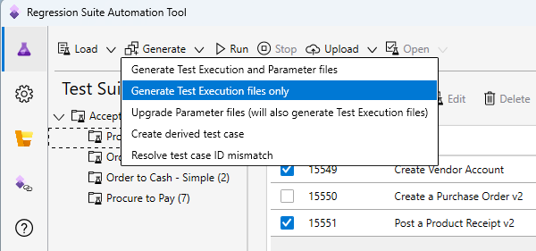
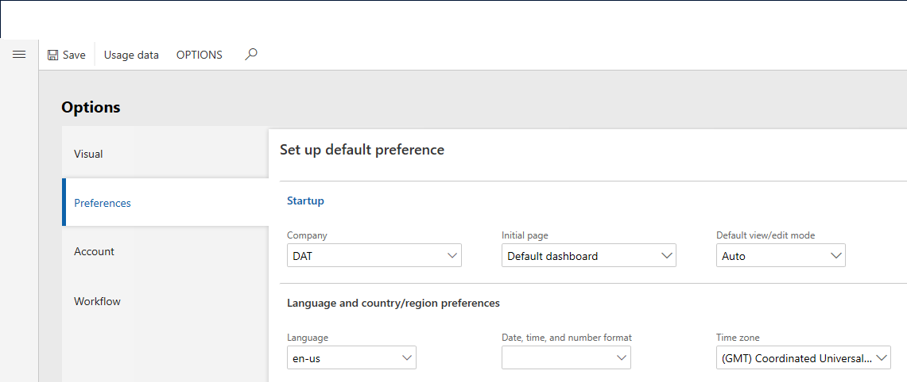
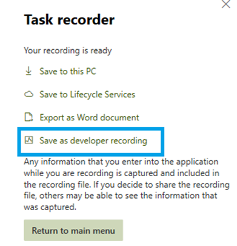
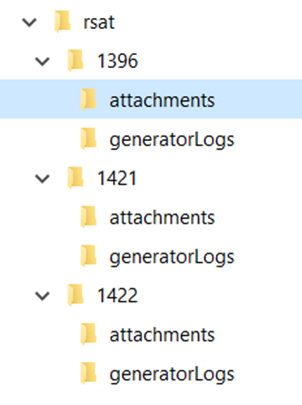
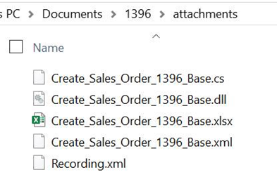
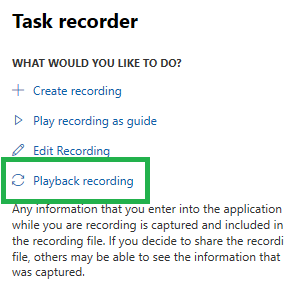
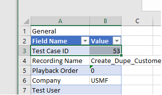
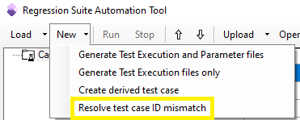

# Regression suite automation tool best practices

[!include [banner](../../includes/banner.md)]

This article describes best practices and common use cases of the Regression suite automation tool (RSAT) and Task recorder.

## Author test cases using the Task recorder

When you author task recordings for RSAT, follow these practices:

1. Make sure all your recordings start on the main dashboard.
2. Keep individual recordings short and focus on a business task performed by one user, like creating a sales order. This simplifies maintainability and reusability of test cases.
3. Chart controls are not supported. Any task recording actions related to charts will be ignored by RSAT during test case playback.
4. When creating a recording, make sure to select a tab header even if the tab is already open. For example, you can switch to another tab and then select the needed tab again to activate it before using a control on it. This will make your recording more reliable during test case playback.
5. RSAT cannot play back any test step that is not recognized by the task recorder. For example, you cannot upload a file from the local disk during play back of a test case.
6. RSAT cannot play back a **page refresh** step. Avoid refreshing a page while recording your test.

## Best practices when using the Regression suite automation tool

1. Upon opening the tool for the first time, select **Settings** and ensure that you have all the needed settings.
2. Before installing a new version of the tool, it is recommended to close and uninstall the previous version.
3. When you install a new version of the tool, regenerate **all** test execution files.

    

    It is not necessary to regenerate Microsoft Excel parameter files unless you want to take advantage of new features available in a newer format of parameter files.

4. For test parameters that need a unique value, for example, the product receipt number in the **Product Receipt** form or the invoice number in the **Vendor Invoice** form, use the **RandBetween(a,b)** Excel function to generate a unique number every time the test case is executed.
5. The default values in Excel come from the task recording. For **Reference Group** controls such as storage dimensions or tracking dimensions, it stores the key of the lookup instead of the value, for example, **2** instead of **SiteWH**. We recommend that you update these fields with the actual value in Excel so that the test is more robust and resilient to changes.
6. It is recommended to set the same locale for **Language** and **Date, time, and number format** settings of your environment prior to running RSAT. If these values are inconsistent, it may result in validation errors.

    

## Manage local recording files

RSAT relies on Azure DevOps to store and manage test recording files (also known as task recordings). When RSAT loads a test plan from Azure DevOps, associated files are downloaded to the current **working directory** on your local computer. (This working directory is defined in RSAT settings.)

In version 1.200.42264.6 and later, it's easier to manage local recording files. You can make changes in Task recorder and then use RSAT to test them, without having to go through the Business process modeler (BPM) or Azure DevOps. When you use Task recorder, after you've finished authoring or modifying a recording, you can save it directly to your local disk as a developer recording.

Put the recording file under the working directory that is associated with the test case. For example, if your configured working directory is `C:\Users\<username>\Documents\RSAT`, put the recording file for test case 1234 under `C:\Users\<username>\Documents\RSAT\1234\attachments`. You must name the developer recording file **Recording.xml**. Alternatively, you can name the recording file **-Test Case Title-.xml**, where **-Test Case Title-** is the title of the test case in Azure DevOps.

The following illustration shows an example of a working directory folder structure. You can open the directory directly from RSAT by clicking the folder symbol.

Each test case has its own folder, which is named after the ID of the test case. Test case attachments (recording files, automation files, and Excel parameter files) are downloaded into an attachments folder. Here is an example.

The generatorLogs directory contains log files. It doesn't contain any files that users can modify. You can ignore this directory unless RSAT support explicitly asks you to provide log files from it.

### Commit a recording file to Azure DevOps

After a recording has been tested and finalized, use RSAT to upload it and commit it to Azure DevOps. The upload button has two options: **Upload automation files** and **Upload recording file**. The second option uploads only your recording file to Azure DevOps.

> [!NOTE]
> If you're using a version of RSAT that is earlier than 1.200.37255.0, and you upgrade to the latest version, you must reload your test cases from Azure DevOps to download them into the correct directory. Otherwise, RSAT will fail, and you will receive a "File not found" error.
>
> If you're working across several DevOps projects, we recommend that you use a different working directory for each project. Otherwise, attachment files from multiple projects can become commingled in the same directory structure.

## Modify (Edit) a Task recording

If you want to modify an existing task recording, note these best practices.

In the web client, open the Task recorder pane and start editing the recording using the **Edit Recording** option.

When you've finished editing the recording, play it back in the client, and verify that all the steps work correctly. Playback is required.

After you've finished playing back an edited recording, save it. It's then ready to be used by RSAT.

## Copy test cases in Azure DevOps

As you are building your test suites in Azure DevOps, it is handy and common to duplicate test cases along with their
attachments. If a copied test case contains an existing Excel parameter file attached, RSAT cannot execute it without
manual edits to the Excel file. The **Test Case ID** in the Excel parameter file must match the Azure DevOps test case ID.
You will need to edit all copied Excel parameter files. In the following image, the Excel file is associated with
Test Case number 53 in Azure DevOps.

As of RSAT version 1.210, this process is easier. To automatically fix all occurrences of a mismatch, select the
desired test cases in the grid, and then select **Resolve test case ID mismatch** in the **New** menu.

[!INCLUDE[footer-include](../../../../includes/footer-banner.md)]
