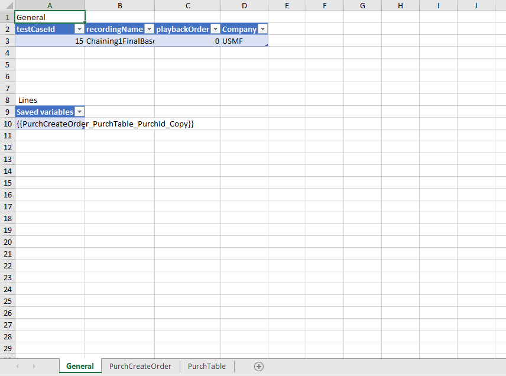
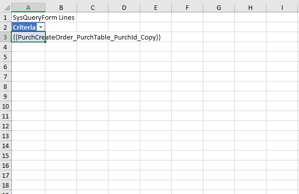
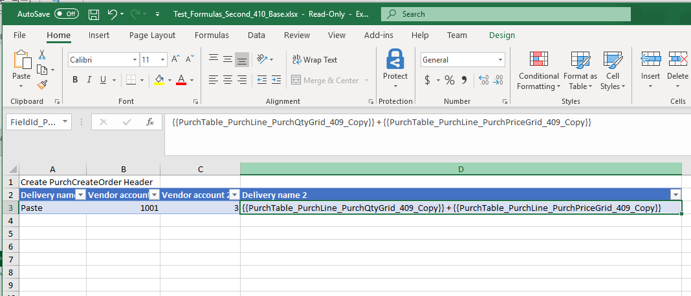
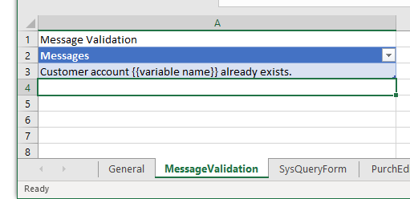

# Copy variables to chain test cases

[!include [banner](../../includes/banner.md)]

One of the key features of the Regression Suite Automation Tool is the chaining of test cases, that is, the ability of a test to pass values to other tests. Test cases are executed according to their defined order in the Azure DevOps test plan, which can also be updated in the test tool itself. It is important to correctly order the tests if you want to pass variables from one test case to the other.

To save the value of a variable while recording the test in Task Recorder, right-click the field and select **Task recorder > Copy**, as shown in the following image. Copying will save the variable in the recording file. This variable can be used in subsequent tests.

:::image type="content" source="media/task-recorder-copy.png" alt-text="Copy menu item in task recorder.":::

When RSAT generates the Excel parameters file, saved variables appear in the **Saved variables** table on the **General** Tab. These variables also appear in the context of the test case steps in the **TestCaseSteps** tab. In the image below, the purchase order ID value was copied during the recording of the test case (step 5). This value is stored in a variable named **{{PurchCreateOrder_PurchTable_PurchId_86_Copy}}**.

To reuse these variables during test playback, copy the variable name and use it in place of a parameter value in the data file of another test (or the same test), as shown below.

Variables can be used in the same test case where they are defined and can also be passed between tests during the same test run.

## Support for formulas of saved variables

You can create formulas that contain saved (copied) variables. If you have been using an older version of the Regression Suite Automation Tool, you will need to regenerate new Excel parameter files to take advantage of this functionality. Supported operators are `+`, `-`, `/` and '\'. Only numerical variables can be used in the Regression Suite Automation Tool formulas. Strings or dates are not supported. Always specify variable names within double braces `{{varname}}`. For example, `{{var1}} + {{var2}}`.

In the image below, two different variables are used in a formula.

As of RSAT version 1.220, you can also use Excel functions, such as **ROUND**, **CONCAT**, and **UPPER**, to create formulas with RSAT variables. This feature is implemented using the Excel formula evaluation functionality, so any function supported by Excel is supported by RSAT.

For example,

+ To round a value into the nearest whole number, use:

    `=ROUND({{Item_Price_3274_Copy}}, 0)`

+ To concatenate strings, use:

    `=CONCATENATE({{AccountNum_3274_Copy}}, " ", {{ AddressBP_Locator_3274_Copy}})`

+ To calculate and format a date and convert it to a string, use:

    `=TEXT(DATEVALUE({{SystemDate_CurrentDate_3276_Copy}}) - 1, "mm/dd/yyyy")`

    Always convert RSAT date values to text for reliable test case execution.

RSAT evaluates these formulas during test execution, so you must precede the formula with a single quote **\'** to prevent Excel from attempting to prematurely calculate the formula. An example is shown in this image.

## Use variables in message validation

You can also use a saved variable as part of a string in the Message Validation tab. Here is an example that validates that the message `Customer account {{variable name}} already exists.`. It appears in the Infolog during test execution. `{{variable name}}` is a variable that is copied during the recording.

Saved (Copied) variables can be used within the same test case or across more than one test case in the same test suite.

[!INCLUDE[footer-include](../../../../includes/footer-banner.md)]
