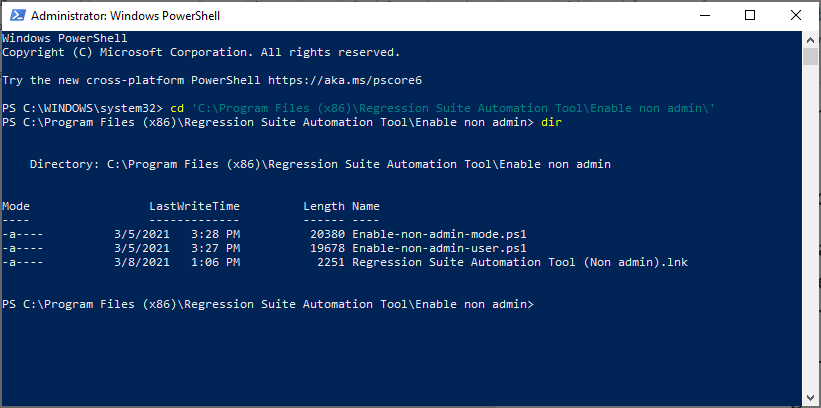

# Configure non-administrator users to use RSAT

[!include [banner](../../includes/banner.md)]

The Regression suite automation tool (RSAT) uses privileged resources on the machine that it is running on. A user must be an administrator on the machine to run RSAT tests. This article explains how to grant these privileged resources to users if you are using **RSAT version 2.2 or later**. The non-administrator user can run RSAT tests without being an administrator on the machine.

These instructions will not allow a non-administrator user to install RSAT. The instructions only enable using RSAT after it has been installed. This situation includes first-time use of RSAT where the Selenium framework is installed, or with new browser driver installation after updating browser versions. Those installation steps still require running RSAT with administrator privileges.

When RSAT is installed on a virtual machine (VM) that is shared by multiple users, then users can become blocked when multiple users run RSAT at the same time. For example, a user might hold resources while running tests cases, which then blocks access to other users. These instructions do not change that behavior.

## Enable non-administrator RSAT use

To enable non-administrator RSAT use, you need two PowerShell scripts and a new shortcut file. These files are in the RSAT installation folder in the subfolder named **Enable non admin**.

1. Open Windows PowerShell as Administrator.
2. Change the folder to **Enable non admin** in the RSAT installation folder. The installation folder is named according to the localized Windows running on the machine, for example **C:\Program Files (x86)\Regression Suite Automation Tool\Enable non admin**.

    

3. In the folder **Enable non admin** you will find these files:

    + Enable-non-admin-mode.ps1
    + Enable-non-admin-user.ps1
    + Regression Suite Automation Tool (Non admin).lnk

4. The first file, **Enable-non-admin-mode.ps1** is a PowerShell script that enables non-administrator mode for the machine. Run this file once on each machine.

    Run the script **Enable-non-admin-mode.ps1** directly from the **Enable non admin** folder, using these required parameters:

    + **action**: (string) Option to enable or disable non-administrator mode. Valid values are **enable** and **disable**.
    + **thumbprint**: (string) Certificate thumbprint. This value must be the same value that is specified in RSAT under General settings.

    Here's an example.

    ```powershell
    .\Enable-non-admin-mode.ps1 "enable" "23055S5DXXXXXXXXXXXXXXXXXXXXXX"
    ```

    To get help, execute this command.

    ```powershell
    help .\Enable-non-admin-mode.ps1 -full
    ```

    > [!IMPORTANT]
    > DO NOT remove or copy this PowerShell script from the **Enable non admin** folder. Run it only from this folder.

5. The second file, **Enable-non-admin-user.ps1** is a PowerShell script that enables non-administrator mode for a user. Run this script for each user that is going to use RSAT on the machine.

    Run the script **Enable-non-admin-user.ps1** directly from the **Enable non admin** folder, using these required parameters:

    + **action**: (string) Option to enable or disable non-administrator mode. Valid values are **enable** and **disable**.
    + **thumbprint**: (string) Certificate thumbprint. This value must be the same value that is specified in RSAT under General settings.
    + **user**: (string) The local username in the format `domain\userName`.

    Here's an example.

    ```powershell
    .\Enable-non-admin-user.ps1 "enable" "TESTDOMAIN\testuser" "23055S5DXXXXXXXXXXXXXXXXXXXXXX"
    ```

    To get help, execute this command.

    ```powershell
    help .\Enable-non-admin-user.ps1 -full
    ```

    > [!IMPORTANT]
    > DO NOT remove or copy this PowerShell script from the **Enable non admin** folder. Run it only from this folder.

6. Close PowerShell.

7. Copy the shortcut file **Regression Suite Automation Tool (Non admin).lnk** to the user's desktop. (The old shortcut calls a Visual Basic script that some users may not be allowed to execute. The new shortcut will call the executable file directly.)

    > [!IMPORTANT]
    > DO NOT remove the old shortcut, because it is a shared file that is used by all users on the machine. If you remove the file, then it will disappear for all users. It is fine to remove the old shortcut if all users will be enabled to run as a non-administrator. However, the shortcut will reappear every time a new version of RSAT is installed.

8. When you start RSAT the first time, you must download and install the Selenium framework and the drivers that match the version of your browser. Users that are not administrators might not be able to download and install these components. In this case, RSAT might fail and generate exceptions. To download and install the components, run RSAT with administrator privileges to complete the installation. To run with administrator privileges, right-click the new shortcut **Regression Suite Automation Tool (Non admin)** and select **Run as administrator**. After the installation finishes, close RSAT and then have the user start RSAT again.

9. Use the new shortcut **Regression Suite Automation Tool (Non admin)** to starting RSAT.

## Disable non-administrator RSAT use

If you need to revert the machine back to run with administrator use, then run the PowerShell script **Enable-non-admin-mode.ps1** with the **action** parameter set to **disable**.

```powershell
.\Enable-non-admin-mode.ps1 "disable"
```

## Future versions of RSAT

Currently, we are collecting feedback from users running RSAT with this non-administrator mode. In the future, we might change the installation process to automatically include the steps that enable non-administrator users.

[!INCLUDE[footer-include](../../../../includes/footer-banner.md)]
