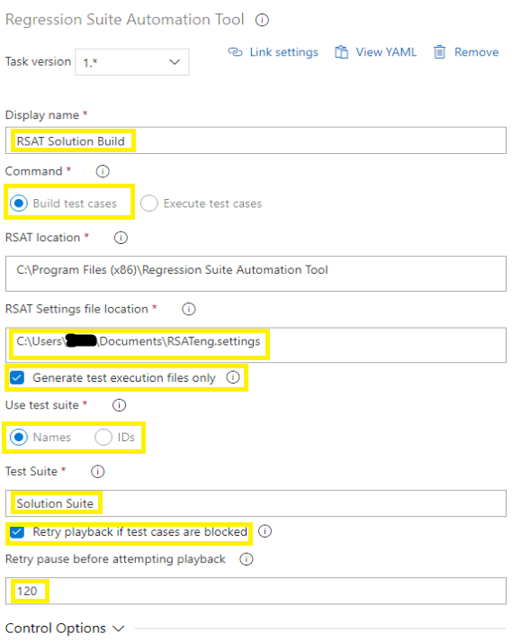

# Integrate RSAT with Azure Pipelines

[!include[banner](../../includes/banner.md)]

You can set up Microsoft Azure Pipelines to seamlessly automate the scheduling and execution of test suites via the Regression suite automation tool (RSAT).

Azure DevOps pipeline jobs can use the RSAT command-line program (Microsoft.Dynamics.RegressionSuite.ConsoleApp.exe, also referred to as the RSAT console app) to run RSAT via Windows PowerShell tasks. You can also add preconfigured RSAT tasks that are available in the Visual Studio Marketplace to your Azure Pipelines. In this way, you can build or run RSAT test suites without having to write custom Windows PowerShell scripts.

This article assumes that you're familiar with the management of Azure DevOps organizations and [pipelines](/azure/devops/pipelines). It also assumes that you're familiar with RSAT functionality.

## Prerequisite: Install an Azure DevOps self-hosted Windows agent

To configure Azure Pipelines to include RSAT tasks, you must configure a self-hosted Windows agent on a machine where RSAT is installed. For more information about this process, see [Azure Pipelines agents](/azure/devops/pipelines/agents/agents). For information about how to set up a self-hosted Windows agent, see [Self-hosted Windows agents](/azure/devops/pipelines/agents/v2-windows).

When you configure the Azure DevOps agent, follow these guidelines:

- Create a dedicated agent pool that uses a single agent. In this way, you ensure that the same machine is used across pipelines tasks. Additionally, capabilities can be ignored. Install a 64-bit version of the agent software on the RSAT client machine.
- Run only a single agent on each RSAT client machine.
- Ensure that the agent runs as a local Windows administrator user account. Don't use the network service to run it. If you're an administrator on the RSAT client machine, you might consider using your own user account.
- Decide whether you want the agent to run interactively or as Windows service. It's easier to set up the agent to run interactively. Additionally, this approach provides manual control when the agent runs. A few more steps are required to set up the agent to run as a Windows service. However, this approach enables agent runs to be automated.
- If the agent runs as a Windows service, follow these extra steps:

    > [!IMPORTANT]
    > Make sure that the same Windows administrator user account is used throughout the setup.

    1. In Windows, find and open the Component Services app.

        First, you must configure the agent service to run under the selected Windows administrator user account.

    2. Select **Services (Local)**, and then find the agent service. The name of the service resembles one of these formats:

        - Azure Pipelines Agent \<name of your agent\>
        - VSTS Agent \<name of your agent\>
        - vstsagent.\<organization name\>.\<name of your agent\>

    3. Select and hold (or right-click) the agent service, and then select **Properties**.
    4. On the **Identity** tab, select the **This user** option, and then specify the local administrator user that your Azure DevOps agent runs as. Use the format *domain\\username*. Then enter and confirm the password.

## Configure Azure Pipelines to run RSAT tasks

When you configure Azure Pipelines to run RSAT tasks, you have two options:

- Use the Azure DevOps RSAT extension that is available in the [Visual Studio Marketplace](https://marketplace.visualstudio.com/azuredevops/). This extension includes easily configured tasks that let you build and run RSAT test suites without having to write custom Windows PowerShell scripts.
- Use custom Windows PowerShell tasks, and create your own script that uses the RSAT console app. This option provides maximum flexibility but requires more expertise.

## Install the Azure DevOps RSAT extension

The Azure DevOps RSAT extension is a Visual Studio Marketplace package that includes RSAT tasks that build and run RSAT test suites. To use out-of-box RSAT tasks, you must install this extension. It requires RSAT version 2.4.11480.52 or later.

### Install the extension

1. In Azure DevOps, open your organization settings.
2. Select the **Extensions** tab, and then select **Browse marketplace** on the right side of the page.
3. Search for "RSAT," and find the extension that is named **Regression Suite Automation Tool**. If you're an administrator or owner of the Azure DevOps organization, select the extension, and then select **Get it free** to install it.

After the extension is installed in your Azure DevOps organization, you can create pipelines that use the RSAT tasks that the extension provides. You can add RSAT tasks to either a new pipeline that you create or an existing pipeline that you edit. 

## Create a pipeline

After you've set up the Azure Dev Ops agent, follow these steps to create a pipeline.

1. In Azure DevOps, select the project that should host the pipeline. Then go to **Pipelines**, and select **New pipeline** in the upper-right corner.

    Pipelines can be designed by using YAML. Although this approach is powerful, it requires some experience to master. Because the purpose of this article isn't to provide in-depth information about pipeline design but to help you get started, this procedure shows how to build a basic pipeline without using YAML.

2. Select the **Use the classic editor** link to create a pipeline without using YAML.

    

3. Select any repository source, and then select **Continue**.

    

4. On the next page, select the **Empty job** link to create an empty pipeline that has no tasks.

    

5. Select the pipeline item. Enter a name for the pipeline, and specify the agent pool that you created earlier.

    

6. Select the agent job item. Enter a display name for the job. Leave the **Agent pool** field set to **\<inherit from pipeline\>** to use the same agent pool throughout the pipeline. In the **Parallelism** field group, leave the **None** option selected.

    

## Add RSAT tasks to a pipeline

This procedure shows how to add RSAT tasks to an existing pipeline job. RSAT tasks are part of the Azure DevOps RSAT extension that is available in the Visual Studio Marketplace. These tasks are easy to configure, and let you build and run RSAT test suites without having to write custom scripts.

1. In Azure DevOps, select the project that hosts the pipeline. Then go to **Pipelines**.
2. Select the plus sign (**+**) for the job item that you want to add a new task to.

    

3. Search for "RSAT," find the **Regression Suite Automation Tool** task, and select **Add**.

    

    The RSAT task can run in two modes:

    - **Build** – Generate test automation files for one or more RSAT test suites. A build task is required after you make changes to your recordings or install a new version of RSAT.
    - **Execute** – Run one or more RSAT test suites.

    Pipelines that include both build tasks and execute tasks use build tasks before execute tasks, so that the execution files are prepared.

4. Configure the RSAT task as either a build task or an execute task by using one of the following procedures.

### Option 1: Build test suites

1. Enter a display name for the task.
2. In the **Command** field group, select the **Build test cases** option to create a task that builds test suites. This task generates test execution files and upload them to Azure DevOps test cases. This task is required after you make changes to your recordings or install a new version of RSAT.
3. In the **RSAT location**, double-check the RSAT installation folder.
4. Enter the location of the RSAT settings files. Settings files can be saved from the RSAT settings dialog box. They contain information such as the location of the test plan, the URL of the finance and operations test environment, and the preferred browser.
5. Select the **Download** checkbox to download files from Azure DevOps. Leave this checkbox cleared only if all files have already been downloaded to the agent environment.
6. Select the **Upload** checkbox to upload edited files after the build process has run to Azure DevOps. Common practice is to have this checkbox selected, and to leave it cleared only if the pipelines include an execute task that follows, where the **Download** checkbox is cleared.
7. Select the **Generate test execution files only** checkbox if you don't want to regenerate or overwrite existing Excel parameter files. This scenario is the most common, and the checkbox is selected by default.
8. In the **Use test suite** field group, select whether you want to specify test suites by name or ID.
9. Enter the name or ID of the test suite that you want to build. To specify multiple test suites, use commas to separate the values.
10. To manage situations where a test case is being used when the task is run, select the **Retry playback if test cases are blocked** checkbox, and then enter a number of seconds in the **Retry pause before attempting playback** field. The build task then pauses for the specified number of seconds before it tries to resume.

### Option 2: Run test suites

1. Enter a display name for the task.
2. In the **Command** field group, select the **Execute test cases** option to create a task that runs test suites that are ready for execution.
3. In the **RSAT location**, double-check the RSAT installation folder.
4. Enter the location of the RSAT settings files. Settings files can be saved from the RSAT settings dialog box. They contain information such as the location of the test plan, the URL of the finance and operations test environment, and the preferred browser.
5. Select the **Download** checkbox if you want to download attachments (test execution and parameter files) from the Azure DevOps test cases before execution starts. Clear the checkbox if files were downloaded from an earlier build task. In this case, the current files in the working directory are used.
6. Select the **Update WebDriver for browser** checkbox to automate the download of new required WebDrivers that match the browser version. Common practice is to have this checkbox selected.
7. In the **Use test suite** field group, select whether you want to specify test suites by name or ID.
8. Enter the name or ID of the test suite that you want to run. To specify multiple test suites, use commas to separate the values.
9. Optional: Enter text in the **Comments** field. You can include Azure DevOps variables. The text is recorded in the test run summary and test case results for later reference.

## Add a custom Windows PowerShell task

If you want to use your own custom scripts, you can add a Windows PowerShell task to a pipeline job instead of using an RSAT task. If you're planning to create your own scripts, you don't need the RSAT Azure DevOps extension.

1. In Azure DevOps, select the project that hosts the pipeline. Then go to **Pipelines**.
2. Select the plus sign (**+**) for the job item that you want to add a new task to.
3. Search for "powershell," find the **PowerShell** task, and select **Add**.

    

4. Select the PowerShell script task. In the **Type** field group, select the **Inline** option, and then create your script using the RSAT console app (Microsoft.Dynamics.RegressionSuite.ConsoleApp.exe). Alternatively, select the **File Path** option, and then enter the path of your Windows PowerShell script.

    

## Schedule a pipeline

After Azure Pipelines are created, they can be manually triggered, scheduled, or configured to run on a predefined recurring schedule.

## Using the RSAT console app

The RSAT console app (Microsoft.Dynamics.RegressionSuite.ConsoleApp.exe) lets you programmatically run RSAT functionality that is otherwise available through the RSAT Windows app. It's located in the RSAT installation folder (by default, C:\\Program Files (x86)\\Regression Suite Automation Tool\\). It can be used in either interactive mode or command mode.

For more information about RSAT commands, see [Regression suite automation tool (RSAT) - Advanced scripting](rsat-tutorial.md#advanced-scripting).

### Interactive mode and help

To use the RSAT console app in interactive mode, run Microsoft.Dynamics.RegressionSuite.ConsoleApp.exe by using either a Command Prompt window or Windows PowerShell. Interactive mode is useful when you want to test commands or get help.

1. Open a Command Prompt window or Windows PowerShell as an administrator.
2. Go to the RSAT installation folder.
3. Run `Microsoft.Dynamics.RegressionSuite.ConsoleApp.exe` to open the app in interactive mode.

    

4. Use the `help` command to get help for any of the available RSAT commands. Here are some examples:

    - `help playbacksuite`

        

    - `help generatetestsuite`

        

### Command mode

Command mode is useful when you want to run a single command or use RSAT commands in your custom Windows PowerShell scripts.

Here are some examples:

- `.\Microsoft.Dynamics.RegressionSuite.ConsoleApp.exe playbacksuite /byid 47`
- `.\Microsoft.Dynamics.RegressionSuite.ConsoleApp.exe listtestsuitenames`

### Run the console app with a specific settings file

By default, the console app uses settings configured by the user account via the RSAT user interface. To specify a different settings file, use the `settings` parameter, as shown in the following example.

`.\Microsoft.Dynamics.RegressionSuite.ConsoleApp.exe /settings "C:\Users\rob\Documents\RSAT\SettingFiles\Canaryenv.settings" playbacksuite "Acceptance Test Suite 1"`

