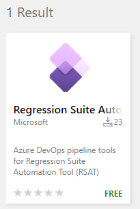

# Integrate RSAT with Azure DevOps pipelines

[!include[banner](../../includes/banner.md)]

You can set up Azure DevOps pipelines to seamlessly automate the scheduling and execution of test suites via the Regression suite automation tool (RSAT).

Azure DevOps pipeline jobs can use the RSAT command line program (Microsoft.Dynamics.RegressionSuite.ConsoleApp.exe) to run RSAT via Windows PowerShell tasks. In addition, pre-configured RSAT tasks are available in the Visual Studio Marketplace; these RSAT tasks can be added to your Azure DevOps pipelines allowing you to build or execute RSAT test suites without writing custom PowerShell scripts.

This article assume you are familiar with managing Azure DevOps organizations and [pipelines](/azure/devops/pipelines). This article also assumes you are familiar with RSAT functionality.

## Pre-requisite: Install Azure DevOps self-hosted Windows agent

To configure Azure DevOps pipelines to include RSAT tasks, you need to configure a self-hosted Windows agent on a machine where RSAT is installed. If you are not familiar with this process, you can find more information in [Azure Pipelines agents](/azure/devops/pipelines/agents/agents?view=vsts). For Windows self-host agent setup, see [arSelf-hosted Windows agentsticle](https://docs.microsoft.com/en-us/azure/devops/pipelines/agents/v2-windows).

When configuring the DevOps agent:

1.  Create a dedicated agent pool that uses a single agent. The benefits of a dedicated agent pool with a single agent ensure the same machine is used across pipelines tasks. This also means capabilities can be ignored. Install 64-bit version of agent software on the RSAT client machine.

2.  Run only a single agent on each RSAT client machine.

3.  Ensure the agent is run as a local Windows administrator user account. Do not run the agent using the network service. If you are an administrator on the RSAT client machine, then you may consider using your own user account.

4.  Decide between running the agent interactively or as Windows service. Running the agent interactively is easier to set up and offer manual control when running the agent. Running the agent as a Windows service requires a few more setup steps, however it allows the agent to run automated.

5.  Follow these additional steps when running an agent as a Windows service:

    1.  Ensure the same Windows administrator user account is used throughout the setup.

    2.  Find and open the Component services app.
    
        

    3.  Configure the service to run under the chosen Windows administrator user account.

    4.  Locate the agent service under the Services (local). Right-click it and select **Properties**.  
          
        The service will have a name similar to:
        
        - **Azure Pipelines Agent (name of your agent)** 
        - **VSTS Agent (name of your agent)**
        - **vstsagent.(organization name).(name of your agent)**  
          
        

    5.  On the **Identity** tab, specify the user (domain\\username) of the local administrator user your Azure DevOps agent will be running as. 
    
        

    6.  Give the service permission to access Microsoft Excel COM objects. Here is an example of how to do that.

    7.  Open DCOM Config.
      
        

    8.  Find Microsoft Excel Application (or "000208D5-0000-0000-C000-000000000046". This value can be different depending on version of Excel installed on your computer.  
        

    9.  Right-click -&gt; Properties

    10. On the Security tab select Customize, click Edit and provide full access to the user (repeat for all the 3 permission categories)  
          

## Configure Azure DevOps pipelines with RSAT

When configuring Azure DevOps pipelines to run RSAT tasks, you have 2 options:

- Use the Azure DevOps RSAT extension that is available in the [Visual Studio Marketplace](https://marketplace.visualstudio.com/azuredevops/). This extension includes easy to configure tasks that allow you to build and execute RSAT test suites without the need to write custom PowerShell scripts.

- Use custom PowerShell tasks and create your own script that uses the RSAT console app. These provide maximum flexibility, but require a lot more expertise.

## Install the Azure DevOps RSAT extension

The RSAT Azure DevOps extension is a Visual Studio Marketplace package that provides RSAT tasks that build and execute RSAT test suites. You need to install this extension to use out-of-the-box RSAT tasks. The RSAT extension requires use of RSAT version 2.4.11480.52 or later.

### Install the extension

1. Open your Azure DevOps organization settings, then select the **Extensions** tab. 
2. Select the **Browse marketplace** action located on the right side of the screen.

     

3. Search for "RSAT" to locate the extension. If you are an administrator or owner of the Azure DevOps organization, select the extension and then select **Get it free** to go through installation of this extension.

    

    

When the extension is installed in your Azure DevOps organization, then you can create pipelines with the easy tasks this provides.

## Create a pipeline

You can edit an existing pipeline or create a new pipeline to add RSAT tasks.

Once you have set up the Azure Dev Ops agent, follow these steps to create a pipeline.

1.  Select the DevOps project that should host the pipelines and go to **Pipelines** and select **New Pipeline** in the top right corner.

    

2.  Pipelines can be designed using a YAML design, which is quite powerful yet requires some experience to master. The objective of this article is not to provide in depth insight into pipeline design. The focus in this article is to get you going by building basic pipelines.

3.  Click **Use the classic editor** to create a simple pipeline without using YAML.

    

4.  Select any repository source, and select **Continue**.

    

5.  On the next screen, click on **Empty job**.

    

6.  This creates an empty pipeline without tasks. Select the pipeline item, provide a name for the pipeline, and specify the agent pool created earlier.

    

7.  Select the agent job item. Name the job by providing a display name. Leave the agent pool as inherit from pipeline to use the same throughout the pipeline. Leave parallelism as None.

    

## Add RSAT tasks to pipelines

The next steps illustrate how to add RSAT tasks to a pipeline job. RSAT tasks are part of the Azure DevOps RSAT extension available in the Visual Studio Marketplace. This extension includes easy-to-configure tasks, which allow you to build and execute RSAT test suites without the need to write custom scripts.

1.  Click on the **+** sign to add a task to the job.

    

2.  Search for "RSAT" and select the **Regression Suite Automation Tool** task and select **Add**.

    

The RSAT task can run in 2 modes:

-  **Build**: Generate test automation files of one or more RSAT test suites. This task is needed after you make changes to your recordings, or you install a new version of RSAT.

-  **Execute**: Execute one or more RSAT test suites.

Pipelines tasks where both these modes are included will use build tasks before execute tasks to first prepare execution files.

Configure the RSAT tasks as described in the following procedures.

### Option 1: Build test suite(s)

1.  Specify a display name for the task.

2.  Select **Build test cases** to create a task that builds a test suite. This generates test execution files and uploads them to Azure DevOps test cases. This task is needed after you make changes to your recordings, or you install a new version of RSAT.

3.  Double-check the RSAT installation folder (RSAT location).

4.  Enter the RSAT settings file location. Settings files can be saved from the RSAT settings dialog. They contain information like location of test plan, URL of the Finance and Operations test environment, preferred browser, etc.

5.  Select **Generate test execution files only** if you do not want to regenerate or overwrite existing Excel parameter files. This is the default and is the most common scenario.

6.  Select if you want to specify suites by name or ID.

7.  Enter the test suite name or ID you want to build. You can select more than one test suite using comma separated values.

8.  Select **Retry playback if test cases are blocked** to manage the situation where a test case happens to be used when the task is run. This will cause building to pause the number of seconds specified under **Retry pause before attempting playback**, and building will retry and resume after this time.

### Option 2: Execute test suite(s)

1.  Specify a display name for the task.

2.  Select **Execute test cases** to create a task that executes test suites that are ready for execution.

3.  Double-check the RSAT installation folder (RSAT location).

4.  Enter the RSAT settings file location. Settings files can be saved from the RSAT settings dialog. They contain information like location of test plan, URL of the Finance and Operations test environment, preferred browser, etc.

5.  Check **Download** if you want to download attachments (test execution and parameter files) from the Azure DevOps test cases before execution starts. Otherwise, it will use the current files in the working directory. Optionally, uncheck this if file have been downloaded from an earlier build task.

6.  Select if you want to specify suites by name or ID.

7.  Enter the test suite name or ID you want to execute. You can select more than one test suite using comma separated values.

8.  Optionally, enter a text into the **Comments** field. This value can be composed to include DevOps variables. This text will be recorded into test runs summary and test case results for later reference.

## Add a custom Windows PowerShell task

In case you want to use your own custom scripts, you can add a Windows PowerShell task to a pipeline job instead of using an RSAT task. You do not need the RSAT Azure DevOps extension if you are planning to author your own scripts.

1.  Select the **+** sign on the job item to add a task to the job

2.  Enter "powershell" in the search field and select **Add** to add a PowerShell task.

    

3.  Select the PowerShell script task and set **Type** to **inline**. Author your script using the Microsoft.Dynamics.RegressionSuite.ConsoleApp.exe. Alternatively, you can set **Type** to "**File Path**" and enter a path to your PowerShell script.

    

## Schedule pipeline

Once created, Azure DevOps pipelines can be triggered manually, scheduled, or configured to run on a pre-defined recurring schedule.

## RSAT Console application usage

The RSAT console application (Microsoft.Dynamics.RegressionSuite.ConsoleApp.exe) allows you to programmatically execute RSAT functionality that is otherwise available through the RSAT Windows app. It can be used in interactive mode or command mode. It is located in the RSAT installation folder (default is C:\\Program Files (x86)\\Regression Suite Automation Tool\\).

For more information about RSAT commands, see [Regression suite automation tool (RSAT) - Advanced scripting](rsat-tutorial.md#advanced-scripting).

### Interactive mode and help

You can use the RSAT console application in interactive mode by running Microsoft.Dynamics.RegressionSuite.ConsoleApp.exe using Command Prompt or Windows PowerShell. Interactive mode is useful to test out some commands or for getting help.

1.  Run Command Prompt or PowerShell as an administrator.

2.  Navigate to the RSAT installation folder.

    

3.  Run *Microsoft.Dynamics.RegressionSuite.ConsoleApp.*exe, you will enter Interactive mode of the application.

    

4.  Get help with any of the available commands, for example:

    -   *help playbacksuite*
    -   *help generatetestsuite*

    

    

### Command mode

Command mode is useful when you want to run a single command or use RSAT commands in your custom PowerShell scripts.

Example:

-   *.\\Microsoft.Dynamics.RegressionSuite.ConsoleApp.exe playbacksuite /byid 47*
-   *.\\Microsoft.Dynamics.RegressionSuite.ConsoleApp.exe listtestsuitenames*

### Running with specific settings file

By default, the console app uses the from the last settings file, where via the RSAT user interface of command line. To specify a difference settings file, using the settings parameter as shown here.

-   *.\\Microsoft.Dynamics.RegressionSuite.ConsoleApp.exe /settings "C:\\Users\\rob\\Documents\\RSAT\\SettingFiles\\Canaryenv.settings" playbacksuite "Acceptance Test Suite 1"*
