# Set up and install Regression suite automation tool tutorial

This article is a tutorial that helps you get setup and get started with RSAT and the tools associated with using RSAT.

[!include [banner](../../includes/banner.md)]

> [!NOTE]
> Use your internet browser tools to download and save this page in PDF format.

## Key concepts

- Understand the installation and prerequisite setup that are required for the various applications that support Regression suite automation tool (RSAT).
- Understand how the Task recorder feature, together with Microsoft Dynamics Lifecycle Services (LCS) and Microsoft Azure DevOps, let you create, configure, run, investigate, and report on test cases.
- Empower functional users to record business tasks by using Task recorder, and then convert the task recordings into a suite of automated tests, without having to write source code.

## Before you begin

### Prerequisites

- An environment that runs Microsoft Dynamics 365 for Finance and Operations version 10.0 (April 2019) or later is required for this tutorial. For customers who are using Microsoft Dynamics 365 for Finance and Operations, Enterprise edition 7.3, Platform update 20 (PU20) or later is also supported.
- The user must have admin rights to the environment.
- You must have access to the customer tenant LCS and Azure DevOps (previously known as Microsoft Visual Studio Team Services \[VSTS\]).
- The user that is creating and managing tests suites must have an Azure DevOps Test Plans or Test Manager license. The following licenses will also give you access to Test Plans:
    - Visual Studio Enterprise license
    - Visual Studio Test Professional license
    - MSDN Platforms subscriber license
- RSAT must have access to the test environment via a web browser.
- To generate and edit test parameters, you must have Microsoft Excel installed.

## Configure Azure DevOps

### User eligibility

Make sure that the user is created in Azure DevOps and has a subscription level that provides access to Azure Test Plans. An Azure DevOps Test Plans license is required only if the user will create and manage test cases (that is, not all RSAT users require this license). For information about the license requirements, see [License requirements](/azure/devops/test/manual-test-permissions#license-requirements).

### Create a new Azure DevOps project

RSAT uses Azure Devops for test case and test suite management, reporting, and investigating test run results.

> [!NOTE]
> You can use an existing Azure DevOps project. However, if your existing Azure DevOps project is set up so that it has a custom template, you will receive a "VSTS Sync Failure" error when you sync test cases from Business process modeler (BPM) to Azure DevOps (see the [Test the synchronization from BPM to Azure DevOps](#test-the-synchronization-from-bpm-to-azure-devops) section). If the following best practices have been followed for the custom template, you will be able to sync the test cases to Azure DevOps. (These best practices are listed in the error message.)

- Do not delete any work item types or out-of-the-box fields.
- Do not delete any state of a work item type.
- Do not add any required fields to a work item type.


Otherwise, for this tutorial, we recommend that you create a new Azure DevOps project. For more information, see [Issues when syncing to BPM using a custom Azure DevOps (VSTS) process template](https://blogs.msdn.microsoft.com/lcs/2018/11/28/issues-when-syncing-to-bpm-using-a-custom-azure-devops-vsts-process-template/).

1. Open the Azure DevOps URL (`https://dev.azure.com/<Azure DevOps Name>`).
2. Select **Create project** in the upper-right corner of the Azure DevOps page.

    

3. Fill in the following fields, and then select **Create**:

    - **Project name**
    - **Version control** – Select **Team Foundation Version Control**. Note that the default option, **Git**, isn't supported.
    - **Work item process**

    

### Create a personal access token

In this tutorial, you will use the LCS Business Process Modeler (BPM) to create a test case library and synchronize your test cases with Azure DevOps. You will need a personal access token to sync BPM with Azure DevOps.

1. Select the profile icon in the upper-right corner of the page for your Azure DevOps project, and then select **Security**.

    

2. In the left pane, under **Security**, select **Personal access tokens**. Then select **New Token**.

    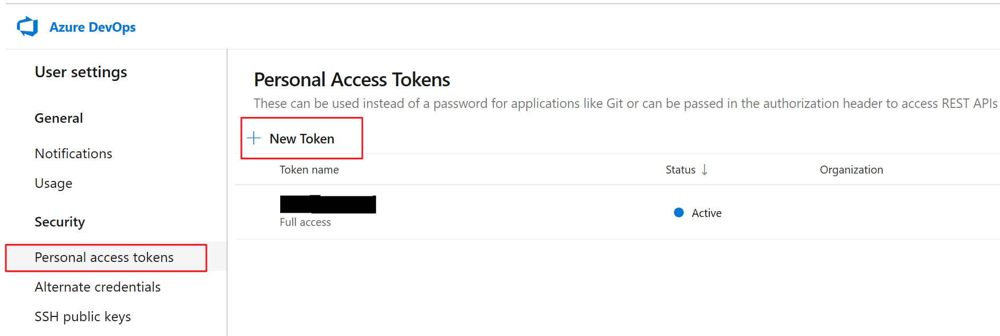

3. Fill in the following fields, and then select **Create**:

    - **Name**
    - **Expiration (UTC)** – Select **Custom defined**, and then use the date picker to select the last available date.
    - **Scopes** – Select the **Full access** option.

    

    > [!NOTE]
    > Make a note of the personal access token that is created. You will need it later when you set up the RSAT configuration.

    

## Configure the LCS project

You need a Lifecycle Services (LCS) project for your master test library. The LCS Business Process Modeler (BPM) is used as the master library for your test cases. BPM is used to manage and distribute test libraries across LCS projects. For example, a Microsoft partner or independent software vendor (ISV) building test libraries will release test cases in the form of BPM libraries. In BPM, test cases are organized by business process. BPM doesn't define the execution order or frequency of your test pass. These details are managed in Azure DevOps, as described later in this article.  

For your LCS project, you can use an existing customer implementation or partner project.

### Update the LCS language

> [!NOTE]
> For the user interface (UI) to correctly show business processes, the LCS preferred language must be set to **English (United States)**.

1. Go to the LCS implementation project.
2. Select the **Settings** button (the gear symbol) in the upper-right corner, and then select **Language preference**.

    

3. In the **Preferred language** field, select **English (United States)**, and then select **Save**.

    

### Configure LCS to connect to the Azure DevOps project

If you created a new Azure DevOps project earlier, configure the LCS project to connect to it. Otherwise, if your LCS project is already connected to your Azure DevOps project, you can continue to the next section.

1. Go to the LCS implementation project.
2. Select the **Menu** button, and then select **Project settings**.

    

3. In the left pane, select **Visual Studio Team Services**, and then select **Setup Visual Studio Team Services**.

    

4. In the **Azure DevOps site URL** field, enter the URL of the Azure DevOps site. In the **Personal access token** field, enter the personal access token that was created earlier.

    > [!NOTE]
    > Although VSTS is now known as Azure DevOps, to connect LCS to your Azure DevOps project, use the old URL. For example, the Azure DevOps URL that is used in this tutorial is `https://dev.azure.com/D365FOFastTrack/`. However, in the following illustration, it's entered as `https://D365FOFastTrack.visualstudio.com/`.

    

5. Select **Continue**.
6. In the **Visual Studio Team Services project** field, select the VSTS project on the selected site to link with the LCS project. The **Process template** field is set to **Agile** by default. For a custom template, review the best practice guidance in the [Create a new Azure DevOps project](#create-a-new-azure-devops-project) section. Then select **Continue**.

    

7. Review your settings, and then select **Save**.

    

8. Select **Authorize** to authorize LCS to access the configured Azure DevOps site on your behalf and to turn on features that integrate with VSTS.

    

9. A message box appears that states, "You are about to be redirected to an eternal site to authorize LCS to connect to Visual Studio Team Services on your behalf. Proceed?" Select **Yes**.

    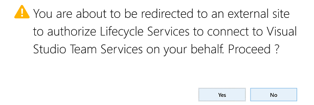

10. Select **Accept**.

    

11. If you're authorized as a user, the UI should you return to the LCS project settings page.

    

### Create a new BPM library

1. Go to the LCS implementation project.
2. Select the **Menu** button, and then select **Business process modeler**.

    

3. Select **New library**.

    

4. In the **Library name** field, enter a name, and then select **Create**. For this tutorial, name the BPM library **RSAT**.

    

5. Open the new **RSAT** BPM library.
6. Select the **Sample Core Business Process** process, and then, on the right, select **Edit mode**.

    

7. Change the value of both the **Name** field and the **Description** field to **Create a product**. Then select **Save**.

    

## Environment

### Version requirement

A test or sandbox environment that runs version 10 is required. For customers that are using version 7.3, Platform update 20 or later is also supported.

> [!NOTE]
> RSAT must have access to your test environment via a web browser.

### User criteria

The user must have admin rights to this environment.

### Set up Help settings to connect with LCS

This step is required in order to connect with LCS so that task recordings can be saved to the appropriate BPM library in LCS through the client.

1. Open the client.
2. Go to **System Administration \> Setup \> System parameters**.
3. On the **Help** tab, in the **Lifecycle Services help configuration** field, select the relevant LCS project (**RSAT** for this tutorial).

    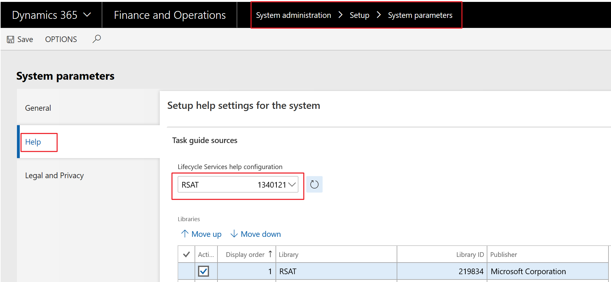

    BPM libraries are filled in under the appropriate LCS project.

4. Select **Save**.
5. You might have to refresh the browser to see the updated Help content.

    

## Task recordings

> [!NOTE]
> Make sure that all your task recordings start on the main dashboard. Keep individual recordings short, and focus on one business task, such as creating a sales order.

### Create a task recording and save it to the BPM library

Create a corresponding task recording that you can attach to the simple business process that was created in the new BPM library.

1. Open the client.
2. On the main dashboard, select the **Settings** button (the gear symbol), and then select **Task recorder**.

    

3. Select **Create recording**.

    

4. Fill in the **Recording name** and **Recording description** fields, and then select **Start**.

    

5. Record the steps for creating a product. When you've finished, select **Stop** to stop recording.

    

6. Select **Save to Lifecycle Services**.

    

    Library information is loaded from LCS.

    

7. Select the BPM library to associate the task recording with. For this tutorial, select the **RSAT** BPM library that was created earlier and the **Create a product** business process under it. Then select **OK**.

    

    A "Saving to Lifecycle Services was successful" message appears.

    

8. If you want to save the task recording locally and then upload it to BPM through LCS, follow these steps:

    1. After the recording is completed, select **Save to this PC**.

        

    2. In the browser's Notification bar, select **Save** or **Save As** to save the file on your local computer.

        

    3. Go to the **RSAT** BPM library, and select the business process to save the task recording against.
    4. On the **Overview** tab, select **Upload**.

        

    5. Select **Browse**, and select the .axtr file that you saved earlier. Then select **Upload**.

        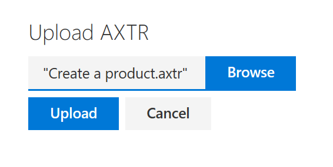

### Test the synchronization from BPM to Azure DevOps

Now that a task recording is attached to the business process, you must validate that the business process and the associated task recording can be synced to Azure DevOps as a feature and a test case (respectively) by using the VSTS sync feature in LCS.

> [!NOTE]
> The corresponding work item type that is created in Azure DevOps will vary, depending on the process template that you selected when you configured the LCS project with Azure DevOps, as described in the [Create a new Azure DevOps project](#create-a-new-azure-devops-project) section.

1. Go to the BPM library, and open the **RSAT** library that you created earlier.
2. Select the ellipsis button (**...**), and select **VSTS sync**.

    

    After VSTS sync is completed, a **Requirements** tab appears on the left side and includes the corresponding Azure DevOps work item.

    > [!NOTE]
    > The work item that is created in Azure DevOps will have the BPM library name as the title prefix.

    

3. Refresh the page.
4. Select the ellipsis button (**...**). You will see an additional option, **Sync test cases**. Select this option.

    

    > [!NOTE]
    > If the **Sync test cases** option isn't available after you refresh the page, go to main page for BPM, and select **Sync test cases** for the whole library itself. In this way, you effectively force a synchronization for the whole library.
    >
    > 

    After Sync test cases is completed, a new test case is created on the **Requirements** tab.

    

5. Go to your Azure DevOps project, and select **Boards \> Work Items**.

    

6. Validate that the work item and test case that you created through BPM synchronization exist.

    

## Install and Configure RSAT

RSAT can be installed on any computer that runs Windows 10 and that can connect to the environment via a web browser (Internet Explorer or Google Chrome).

> [!NOTE]
> Before you install a new version of the tool, we recommend that you uninstall the previous version.

### Install an authentication certificate

To enable authentication, you must generate and install a certificate on the same computer that RSAT is running on.

#### Generate a certificate

1. To generate a certificate file, open a Microsoft Windows PowerShell window as an admin, and run the following command.

    ```powershell
    $certificate = New-SelfSignedCertificate -dnsname 127.0.0.1 -CertStoreLocation cert:\LocalMachine\My -FriendlyName "D365 Automated testing certificate" -Provider "Microsoft Strong Cryptographic Provider"
    ```

2. Open certificate manager by entering **certlm.msc** in the **Run** dialog box, and confirm that the **D365 Automated testing certificate** certificate is created under **Personal \> Certificates**.

    > [!NOTE]
    > Be sure to enter **certlm.msc**, not **certmgr.msc**, because the certificates are stored on the local computer.

    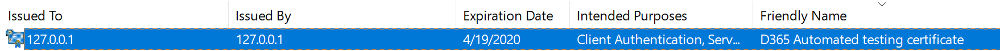

3. Right-click the certificate, and then select **Copy**.
4. Go to **Trusted Root Certification Authorities \> Certificates**.

    

5. On the **Action** menu, select **Paste** to copy the certificate to the **Trusted Root Certification Authorities** location.

    

6. To get the thumbprint of the installed certificate, but without spaces or special characters, open a Windows PowerShell window as an admin, and run the following commands.

    ```powershell
    cd Cert:\LocalMachine\My

    Get-ChildItem | Where-Object { $_.Subject -like "CN=127.0.0.1" }
    ```

    > [!NOTE]
    > Save the thumbprint, because you will need it later when you update the .wif files for Application Object Server (AOS) and set up the RSAT configuration.

#### Configure the AOS computer to trust the connection

> [!NOTE]
> If the environment is a Tier 2+ environment, the certificate thumbprint must be updated in the wif.config file for **all** AOS computers for the environment.

1. Establish a Remote Desktop Protocol (RDP) connection to the AOS computer. Sign-in details are available on the environment details page in LCS.
2. Open Microsoft Internet Information Services (IIS), and find **AOSService** in the list of sites.

    

3. Right-click **Explore** to open the **\<Drive\>: \\AosService\\WebRoot** folder. Find the **wif.config** file.

    

4. Update the **wif.config** file by adding a new authority entry for your certificate and authority name, as shown in the following example.

    ```Xml
    <issuerNameRegistry type="Microsoft.Dynamics.AX.Security.SharedUtility.AxIssuerNameRegistry,Microsoft.Dynamics.AX.Security.SharedUtility">
        <authority name="CN=127.0.0.1">
            <keys>
                <add thumbprint="xxxxxxxxxxxxxxxxxxxx" />
                <add thumbprint="xxxxxxxxxxxxxxxxxxxx" />
            </keys>
            <validIssuers>
                <add name="CN=127.0.0.1" />
            </validIssuers>
        </authority>
    ```

    > [!NOTE]
    > If multiple users are using the same application, each user must generate separate thumbprints, and each of those thumbprints must be added in the **\<keys\>** section.

5. If there is more than one AOS computer, repeat steps 3 through 4 for each additional computer.

    > [!NOTE]
    > Unlike older Tier 2 environments, new Tier 2 environments are deployed with two AOS instances.

6. Run **iisreset** on all the AOS computers.

    > [!NOTE]
    > If you don't have admin rights to run **iisreset** on a Tier 1 computer, on the Environment details page in LCS, select Maintain > Restart services.

#### Tier 2+ environment

If a Tier 2+ (Standard Acceptance Test sandbox or higher) environment is used, verify or set the following registry setting on the computer where RSAT is installed. This step is required because it helps you avoid authentication or RSAT connection errors.

```PowerShell
if ((Test-Path HKLM:\SOFTWARE\Wow6432Node\Microsoft\.NETFramework\v4.0.30319))
{
    Set-ItemProperty HKLM:\SOFTWARE\Wow6432Node\Microsoft\.NETFramework\v4.0.30319 -Name SchUseStrongCrypto -Value 1 -Type dword -Force -Confirm:$false
}
```

### Install RSAT

1. Go to <https://www.microsoft.com/download/details.aspx?id=57357>, and select **Download**.
2. Select all the files, and then select **Next**.

    

3. Double-click the .msi package to run the installer. Then, when the installation is completed, select **Finish**.

    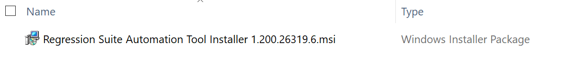

### Install Selenium and browser drivers

In older versions of RSAT, you had to install Selenium and browser drivers. You no longer have to install these drivers because they are automatically installed.

1. The first time that you open RSAT, you're prompted to automatically download and install Selenium. For more information, see the [Configure RSAT](#configure-rsat) section.
2. Before you can run a test case, you're prompted to automatically download and install the browser driver that corresponds to the default browser that is selected in the RSAT configuration. For more information, see the [Load and run test cases](#load-and-run-test-cases) section.

## Get started with RSAT

### Create a test plan and test suites

1. Go to the Azure DevOps project, and select **Test Plans**.

    

2. Select **New Test Plan**.

    

3. Fill in the **Name** field, and then select **Create**. For this tutorial, name the test plan **RSAT Test Plan**.

    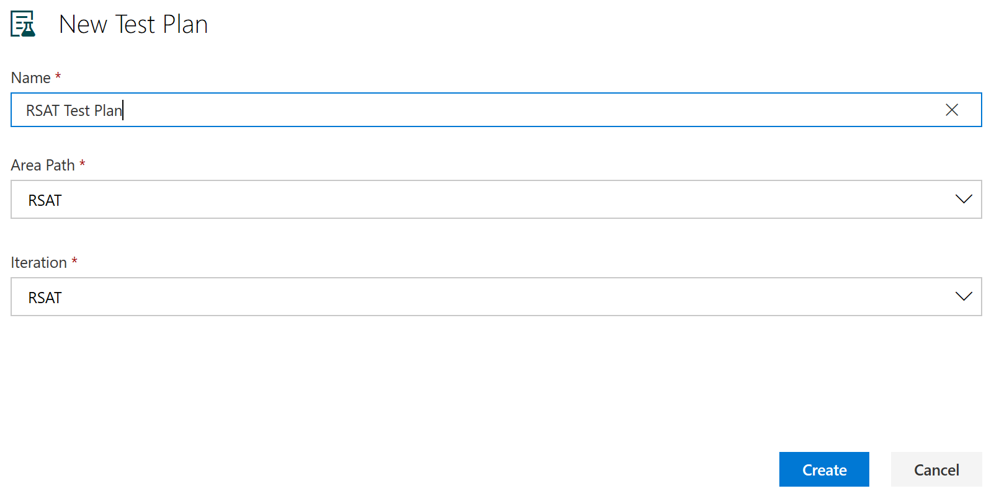

4. Select the plus sign (**+**), and then select **Static suite** to create a static suite under the new test plan. Name the new test suite **T01 – Make to Stock**.

    > [!NOTE]
    > You can also create a query-based suite, if you want the new test cases from BPM to be automatically pulled into the RSAT test suite.

    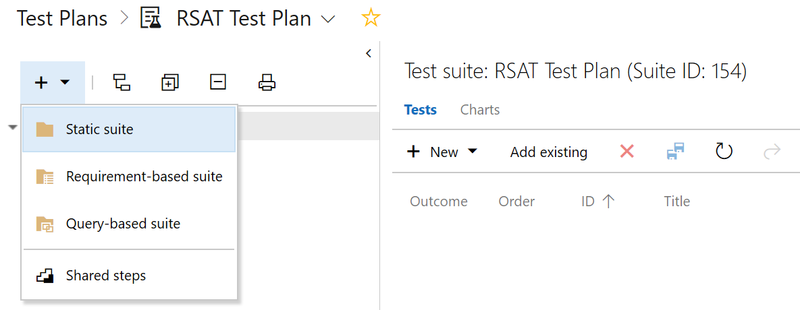

### Attach test cases to test suites

1. Select **Add existing** on the right side to add existing test cases to the test suite.

    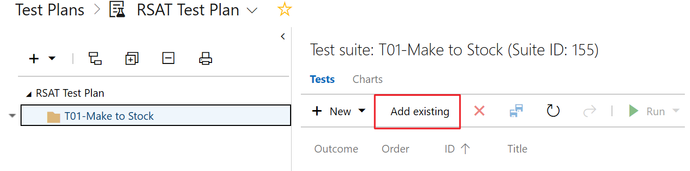

2. On the **Add test cases to suite** page, select **Run query**, and then select the test case to add to the test suite. For this tutorial, select the **Create a new product** test case. Then select **Add test cases** in the lower-right corner of the page (this button isn't shown in the following illustration).

    

    The test case is added to the **T01-Make to Stock** test suite.

    

### Configure RSAT

1. Open RSAT.

    

2. You receive a warning message that states, "The Regression Suite Automation Tool requires Selenium, do you want to automatically download and install it now?" Select **Yes**.

    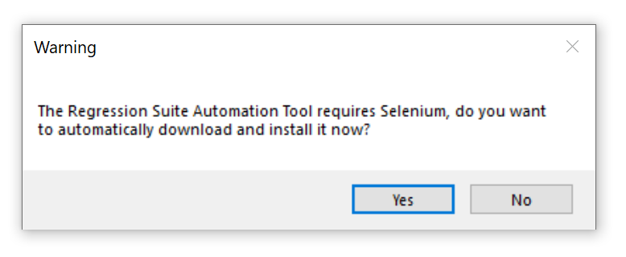

3. Select the **Settings** button (the gear symbol) in the upper-right corner, and then, in the dialog box that appears, fill in the following fields:

    - **Azure DevOps Url** – Enter the URL of your Azure DevOps project, such as `https://yourAzureDevOpsUrlHere.visualStudio.com`.
    - **Access Token** – Enter the access token that lets the tool connect to Azure DevOps. Use the personal access token that you created earlier in this tutorial. For more information, see [Authenticate access with personal access tokens](https://www.visualstudio.com/docs/setup-admin/team-services/use-personal-access-tokens-to-authenticate).
    - **Project Name** – Select the name of your Azure DevOps project.
    - **Test Plan** – Select the Azure DevOps test plan that contains your test cases. For more information, see [Create test plans and test suites](https://www.visualstudio.com/docs/test/manual-exploratory-testing/getting-started/create-a-test-plan). After you select a test plan, select **Test Connection** to test your connection to Azure DevOps.
    - **Hostname** – Enter the host name of the test environment, such as **\<myaos\>.cloudax.dynamics.com**. Don't include the **https://** or **http://** prefix.
    - **SOAP Hostname** – Enter the SOAP host name of the test environment. Typically, the SOAP host name is the same as the host name, but it has a **soap** suffix. Here is an example: **\<myaos\>soap.cloudax.dynamics.com**. Don't include the **https://** or **http://** prefix.

        > [!NOTE]
        > To find the host name and SOAP host name, open IIS Manager, right-click **Sites \> AOSService**, and then select **Edit bindings**. The values in the **Host Name** column give you the host name and SOAP host name (the SOAP host name has the suffix **soap** in the URL).

        

    - **Admin user name** – Enter the email address of an admin user in the test environment.
    - **Thumbprint** – Enter the thumbprint of the authentication certificate, as described earlier in this tutorial.
    - **Working directory** – Specify the folder location for storing test automation files, such as Excel test data files. For example, enter or select **C:\\Temp\\RegressionTool**.

        > [!NOTE]
        > If the name of the folder has spaces, execution will fail because the folder can't be found. This issue is a known issue and should be fixed in the latest version of the tool.

    - **Default browser** – Select either **Internet Explorer** or **Google Chrome**. Make sure that the appropriate browser drivers have been installed.
    - **Test run timeout** – Specify the time-out period, in minutes, for test runs. When the time-out period elapses, all active windows are closed, and pending test cases fail.
    - **Test action timeout** – This field controls the time-out period, in minutes, for Finance and Operation environment server requests. Usually, the default value (2 minutes) should be enough. However, for slower environments, you might want to increase the value if errors that are related to time-outs occur.
    - **Company name** – Enter the company name to use as your default company when Excel parameter files are created. You can change the company later by editing the Excel parameter file.

    

4. Select **Apply** to apply and save your settings.

    To save your current settings to a configuration file on your computer, select **Save as**. To restore your settings from a configuration file on your computer, select **Open**.

5. Select **Close** to close the dialog box.

### Load and run test cases

1. Select **Load** to load the **RSAT Test Plan** test plan from the Azure DevOps project.

    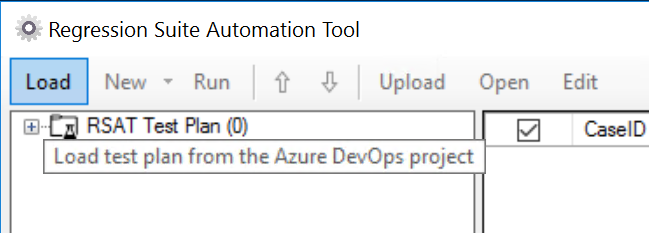

2. Select the **Create a new product** test case from the test suite, and then select **New \> Generate Test Execution and Parameter files**.

    

    The Excel parameter file is created in the local folder that you specified in the RSAT configuration (for example, **C:\\Temp\\RegressionTool**).

    

3. If you want to save the parameter files, select **Upload**. Test automation files of all selected test cases are uploaded to Azure DevOps for future use. (These files include Excel test parameter files.)

    In this way, you can select **Load** to load the parameter files (and automation files) from the test case directly from Azure DevOps. You don't have to regenerate the parameter files. This approach will become important later, when you want to keep the modifications in the parameter file and don't want them to be overwritten.

4. To verify that the automation files and parameter files are saved to Azure DevOps, go to the Azure DevOps project, select **Boards \> Work Items**, and select the **Create a new product** test case. On the **Attachments** tab, you should see four files:

    - **.cs** – C\# automation file
    - **.dll** – Compiled automation file as an assembly
    - **.xlsx** – Excel parameter file
    - **.xml** – Recording file

    

5. Select the test case to run, and then select **Run**.

    > [!NOTE]
    > Before you run test cases, if you're using Internet Explorer as the browser, make sure that your desktop resolution is set to **100%** at **Windows Display settings \> Scale and layout**. If you can't change this setting on a virtual machine (VM), change it on the client (laptop) that you're trying to access the VM from. The resolution settings will then be inherited by the VM display settings.

    

6. If the browser drivers aren't installed in the system, you receive a warning message that states, "This operation requires the \<browser name\> driver. Do you want to automatically downloads and install it now?" Select **Yes**.

    

    

    > [!NOTE]
    > If you're using Chrome as the browser and receive an error message that states that the session wasn't created because the Chrome version isn't correct, download the latest Chrome driver from <http://chromedriver.chromium.org/downloads> to the **C:\\Program Files (x86)\\Regression Suite Automation Tool\\Common\\External\\Selenium** folder.

    

    The test case is run, and the **Result** field is updated.

    

    If you've followed this tutorial as it's written, the **Create a new product** test case will fail, because the task recording for creating a product saved the product name as a hard-coded value. If you rerun the same test case, you should receive an error message, because the product already exists.

    

### View the test results

1. Double-click the failed test case.

    You receive an error message.

    

2. Select **Details** to view the whole error message.

    

3. To view a detailed version of the error message in Azure DevOps, select **Open in Azure DevOps**. In Azure DevOps, you can view the status of the test case and the detailed error message.

    

4. To view the test results directly in the Azure DevOps project, go to **Test Plans \> Test Plans \> Runs**. Double-click the test run that you want to see more details for.

    

5. The **Run summary** tab indicates that the test case failed, but it doesn't provide the actual error message. To view the detailed error message, select the **Test results** tab.

    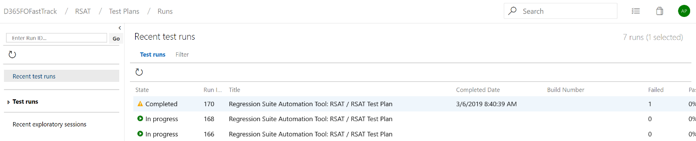

    The **Test results** tab provides the test case information, together with the outcome and the error message.

    

6. Double-click the relevant record to view the detailed error message.

    

    > [!NOTE]
    > All error messages are also available locally in **C:\\Users\\\$YourUserName\\AppData\\Roaming\\regressionTool\\errormsg-.txt**.

7. You can also export the test run results from the test plan level by selecting **Export**.

    

### Modify the Excel parameter file

1. Open RSAT.
2. Select the test case, and then select **Edit** to open the Excel parameter file.

    On the **EcoResProductCreate** sheet, notice that the value of the **Product number** field is hard-coded. You must update this field to a new product number before you run the test case again.

3. To generate a unique product number for each run without having to reopen the Excel parameter file and manually update the product number every time, use the following Excel formula.

    ```vba
    ="RSAT_"&TEXT(NOW(),"yyymmddhhmm")
    ```

    > [!NOTE]
    > In addition to the **General** tab, the Excel parameter file contains a data tab for every form page the test case visits.

    

4. Select **Save**, and then close the Excel workbook.
5. Select **Upload** to save the Excel parameter file to Azure DevOps.

    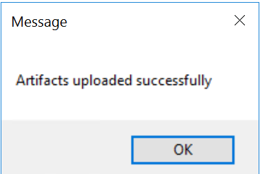

    > [!NOTE]
    > To run test cases in a specific user context, enter the user's email ID in the **Test User** field on the **General** tab of the Excel parameter file. In the latest version of RSAT, the layout of the fields in the Excel parameter file has been updated, but the concept remains the same.
    >
    > 

### Validate the results

- Select **Run** to rerun the test case, and verify that the test case has passed. You can view the test results as described in the [View the test results](#view-the-test-results) section.

    

### Chaining of test cases

One key feature of RSAT is the chaining of test cases (that is, the capability of a test to pass values to other tests). Test cases are run according to their defined order in the Azure DevOps test plan. (This order can also be updated in the test tool itself.) Therefore, if you want to pass variables from one test case to another, it's very important that the tests be in the correct order.

In this section, you will create a saved variable in the first test case, create a second test case, and pass the saved variable from the first test case to the second test case. You will then run the test cases as a chained test case in RSAT.

#### Modify an existing task recording to create a saved variable

1. Open the client.
2. Select the **Settings** button (the gear symbol), and then select **Task recorder**.
3. Select **Edit Recording**.

    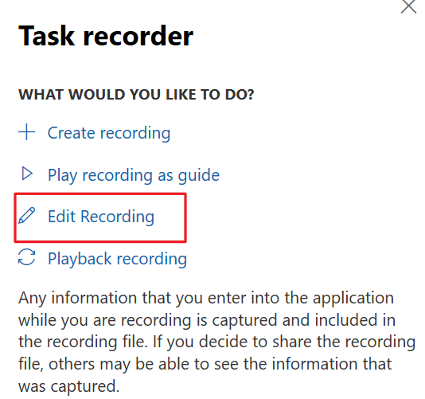

4. Select **Open from Lifecycle Services**.

    

5. Select **Select the Lifecycle Services library**.

    

    BPM libraries are loaded from LCS.

    

6. After the BPM libraries are loaded from LCS, select the **RSAT** BPM library and the **Create a new product** business process that the task recording was associated with. Then select **OK**.

    

7. The name of the appropriate task recording is entered in the **Recording name** field. Select **Start**.

    

8. Go to **Product information management \> Products**, and select **New** to open the page where the original task recording, **Create a product**, was recorded.
9. Select **Insert step**.

    > [!NOTE]
    > The new step is inserted **after** the step that you selected in the pane.

    

10. Right-click the **Product number** field, and then select **Task recorder \> Copy**.

    

11. A new step is added in the pane. Make a note of the value in the **Product number** field, because you will need it later.

    

12. Select **Done editing**.
13. Select **Save to Lifecycle Services**, and associate the new task recording with the same BPM library and business process that the original task recording was associated with. For more information, see the [Create a task recording and save it to the BPM library](#create-a-task-recording-and-save-it-to-the-bpm-library) section.
14. Go to the BPM library, and select **Sync testcases** to overwrite the task recording that is attached to the test case in Azure DevOps, as described in the [Test the synchronization from BPM to Azure DevOps](#test-the-synchronization-from-bpm-to-azure-devops) section.
15. Open RSAT, and select **Load** to reload all the test cases in the test suite. You must regenerate the automation and parameter files for the appropriate test case by selecting the test case and then selecting **New \> Generate Test Execution and Parameter files**, as described in the [Load and run test cases](#load-and-run-test-cases) section.

    > [!NOTE]
    > If the Excel parameter file was left open, regeneration will fail. Therefore, make sure that the Excel parameter file for the test case is closed before you generate the new Excel parameter file.

16. Select **Edit** to open the new Excel parameter file. You will see a new **Saved variable** entry on line 9. This variable, **{{EcoResProductCreate\_Identification\_ProductNumber\_Copy}}**, is saved in the task recording's XML file and can be used in subsequent tests.

    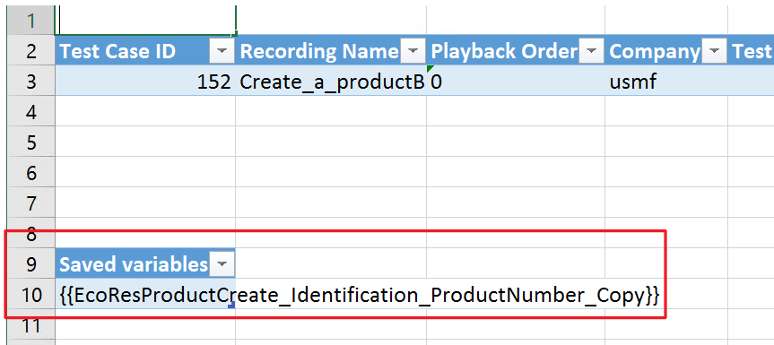

#### Create a new test case

1. Go to the **RSAT** BPM library.
2. Select the **Sample Support Business Process** process, and then, on the right, select **Edit mode**.
3. Change the value of both the **Name** field and the **Description** field to **Release a product**. Then select **Save**.

    

#### Create a new task recording that has a Validate function

- Create a task recording to release the product that was created earlier to the USRT legal entity. For more information, see the [Create a task recording and save it to the BPM library](#create-a-task-recording-and-save-it-to-the-bpm-library) section.

    > [!NOTE]
    > For chained test cases, we always recommend that you find or filter for the record that you require by *manually typing the value of the field*. In that way, the tool can determine the record that the action must be taken against in the subsequent test case.

    

    As the preceding illustration shows, after the product is found by using the Quick Filter, but before you select **Release products**, you validate the value of the **Product number** field to make sure that the product ID is the product ID that was created earlier. To validate the value, right-click the **Product number** field, and then select **Task recorder \> Validate \> Current Value**.

    

#### Save the task recording to BPM

1. After the task recording is completed, select **Save to Lifecycle Services**.

    

2. Library information is loaded from LCS.

    

3. Select the BPM library to associate the task recording with. For this tutorial, select the **RSAT** BPM library that was created earlier and the **Release a product** business process under it. Then select **OK**.

#### Sync BPM to Azure DevOps

1. Go to the BPM library, and open the **RSAT** library.
2. Select **VSTS sync** and then **Sync test cases**. For more information, see the [Test the synchronization from BPM to Azure DevOps](#test-the-synchronization-from-bpm-to-azure-devops) section.

    After the synchronization is completed, the new work item and the corresponding test case for the **Release a product** business process appear in Azure DevOps at **Boards \> Work Items**.

#### Add the new test case to the existing test suite

1. Go to **Test plans \> Test plans**, and select the **RSAT Test Plan** plan.
2. Select **Add existing**.
3. On the **Add test cases to suite** page, select **Run query**.
4. Select the new test case that was created for **Release a product**, and then select **Add test cases** in the lower-right corner of the page (this button isn't shown in the following illustration).

    

    The test suite now has two test cases.

    

#### Load test cases into RSAT

1. Open RSAT, and select **Load**.
2. The test cases are loaded, and you receive a warning that states, "This action will overwrite Excel test data files, local changes will be lost. Do you want to proceed?" Select **Yes** to update the Excel parameter files in the local system but not the Excel parameter files that were uploaded to Azure DevOps.

    

    Both the test cases are loaded, together with the Excel parameter file for the first test case. Because you selected **Upload** in the last run, the parameter files are pulled from Azure DevOps.

    

3. Select only the second test case, and then select **New \> Generate test execution and parameter files**.

#### Edit the Excel parameter file

1. Select only the second test case, and then select **Edit** to open the corresponding Excel parameter file.
2. Copy the **{{EcoResProductCreate\_Identification\_ProductNumber\_Copy}}** saved variable (see the [Modify an existing task recording to create a saved variable](#modify-an-existing-task-recording-to-create-a-saved-variable) section) from the first test case into all the fields where the product number is used. In this case, you copy the variable into the **Product number** and **Validate Product number** fields on the **EcoResProductListPage** sheet.

    

    > [!NOTE]
    > Variables can be passed between tests only during the same test run. The names of the variables must match exactly.

3. Select **Save**, and then close the Excel workbook.
4. Select **Upload** to save the changes that you made to the Excel parameter file.

#### Run the chained test cases

1. Select both the test cases, and then select **Run**.
2. Verify that both test cases have passed.

    


[!INCLUDE[footer-include](../../../../includes/footer-banner.md)]
