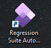
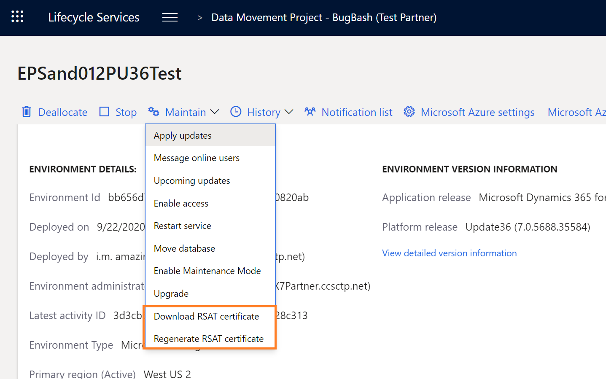

# Regression Suite Automation Tool installation and configuration

[!include [banner](../../includes/banner.md)]

This article contains information about how to install and configure the Regression suite automation tool (RSAT).

## Prerequisites

### Test environment (Prerequisite)

Your test environment must be running Platform update 15 or newer. The Regression suite automation tool must have access to your test environment via a web browser.

### Excel

You need Microsoft Excel installed to generate and edit test parameters.

### Azure DevOps (Prerequisite)

You must have an Azure DevOps project to store and manage your test cases, test plans, and test case results. You will need an Azure DevOps Test Manager or Test Plans license. For example, if you have a Visual Studio Enterprise subscription, you already have a license to Test Plans. For more information, see [Pricing for Azure DevOps Services](https://azure.microsoft.com/pricing/details/devops/azure-devops-services/) or [Pricing for Azure DevOps Server](https://azure.microsoft.com/pricing/details/devops/server/).

### Authentication Certificate

RSAT is designed to be installed on any Windows 10 computer and connect remotely via a web browser to an environment.


To enable secure authentication, RSAT requires a certificate to be installed on the RSAT client computer. The RSAT settings dialog box allows you to automatically create and install the authentication certificate. You will also need to configure the virtual machine (VM) to trust the connection. Follow the instructions in the next sections to install and configure RSAT.

## Installation

### Installer

Download the .msi file from the [Regression Suite Automation Tool Download](https://www.microsoft.com/download/details.aspx?id=57357) to your machine and double-click it to run the installer.

> [!NOTE]
> If you're using Azure DevOps Server, download and install version 1.210.48249.4 or later.

### Selenium and Browser Drivers

RSAT requires Selenium and web browser driver libraries. RSAT will prompt you if needed libraries are missing and will automatically install them for you. Select Yes when you see the following (or similar) messages.


RSAT uses [Selenium 3.13.1](https://selenium-release.storage.googleapis.com/3.13/selenium-dotnet-strongnamed-3.13.1.zip). The web driver library and browser-specific drivers are downloaded to **C:\Program Files (x86)\Regression Suite Automation Tool\Common\External\Selenium**.

## Configuration

1. Open RSAT from your desktop.

    

2. Select the **Settings** tab on the upper left to configure RSAT.

    

### General settings

These settings are required.

#### Azure DevOps (General settings)

Configure your connection to the Azure DevOps project and test plan.

+ **Azure DevOps URL** - This is the URL of your Azure DevOps organization. For example, `https://yourAzureDevOpsUrlHere.visualStudio.com`.

    > [!NOTE]
    > If you're using Azure DevOps Server, add **/DefaultCollection** to the end of your Azure DevOps URL.

+ **Access Token** - The access token that allows the tool to connect to Azure DevOps. You need to create a personal access token or use an existing one that you have saved. It is recommended you create this with scope selected as Full Access. For more information, see [Authenticate access with personal access tokens](/azure/devops/organizations/accounts/use-personal-access-tokens-to-authenticate#create-a-pat).
+ **Project Name** - The name of your Azure DevOps project. RSAT will automatically detect project names and test plans available based the Azure DevOps URL specified. You can then select the Test Project and Test Plan.
+ **Test Plan** - The Azure DevOps test plan that contains your test cases. For more information, see [Create test plans and test suites](https://www.visualstudio.com/docs/test/manual-exploratory-testing/getting-started/create-a-test-plan).

Select **Test Connection** to test your connection to Azure DevOps.

#### Test environment (General settings)

Configure your connection to the test environment.

+ **Hostname** – The hostname of the test environment, such as myhost.cloudax.dynamics.com. Don't include the https:// or http:// prefix.
+ **SOAP Hostname** – The SOAP hostname of the test environment.
    + For demo and development environments (also known as one-box environments), add a **soap** suffix to the hostname. For example, if your hostname is `myhost.cloudax.dynamics.com`, use `myhost.soap.cloudax.dynamics.com` as the SOAP hostname.
    + If you don't know the SOAP hostname of your test environment, you can find it in the web.config file for the AOS server in Infrastructure.SoapServicesUrl.
    + If your test environment is a user acceptance testing (UAT) or higher-tier sandbox environment that has no Remote Desktop access, the SOAP hostname is equal to the hostname.

+ **Admin User Name** – The email address of an admin user in the test environment. The admin user name must be the email address of a user who belongs to the System Administrator role on the finance and operations test environment that RSAT is connecting to. The user account (email address) must also belong to the same tenant as the test environment. For example, if your test environment's default tenant is contoso.com, the admin user must end with @constoso.com.

+ **Thumbprint** – The thumbprint of the authentication certificate that you're using.
 If you don't have Remote Desktop Protocol (RDP) access to your environment, follow the steps lower in this article to download the certificate from Lifecycle Services and paste the thumbprint here.
 Otherwise, if you do have RDP access to the environment, follow these steps to generate a self-signed certificate.

    1. Select **New** to create and install a new authentication certificate. When prompted, place the .cer file somewhere so you have it saved for your records.
    2. When the process completes, the new certification is installed in the local machine's trusted root store.

        

    3. The thumbprint of the newly created certificate is automatically inserted on this form. Copy this thumbprint, you will use it in the next section to configure the AOS to trust the connection.

+ **Company name** – Specify a company name to use as your default company during creation of Excel parameters files. It can be changed later by editing an Excel file.

#### Run setting

Configure your local settings.

+ **Working directory** - Folder location for storing test automation files, including Excel test data files. For example: **C:\Temp\RegressionTool**.
+ **Default browser** - Select the browser to use for test execution. RSAT supports (the new) Microsoft Edge, Microsoft Internet Explorer, and Google Chrome. We recommend Microsoft Edge, which you can download from [Introducing the new Microsoft Edge](https://www.microsoft.com/edge).

Select **Ok** to apply your settings and close the dialog box. Select **Cancel** to cancel your changes and close the dialog. The **Save As** and **Open** buttons allow you to save your settings for reuse later. Select **Save As** to save your current settings into a configuration file on your computer. Select **Open** to restore your settings from a configuration file.

### Optional settings

Select the **Optional** tab to configure optional settings.

+ **Test Run Prefix** – RSAT reports test run results to Azure DevOps. Test runs are named using the following convention: **\<Run ID\> \<Prefix\> \<Test Suite\>**. Use this setting to set the **\<Prefix\>**.
+ **Test Run Timeout** – The time-out (in minutes) of a test run. All active windows are closed and pending test cases fail when this time-out is reached.
+ **Test Action Timeout** – The time-out (in minutes) of individual test steps. When a test step times out, the test case fails.
+ **Pause between steps** – The number of seconds to pause between test steps during automated execution of a test case. The default value is **0** (zero). Set this value to force a pause during test execution, for auditing or investigative purposes. You can also specify a pause for an individual test case by changing the **Pause between steps (Seconds)** parameter on the **General** tab of the Excel parameter file for the test case.
+ **Fail test on first validation error** – By default, if a test case has multiple validation steps, and there is a validation failure, the test case stops running when the first failure occurs. The test case is then marked as failed. If you want test cases to continue to run until all validations are completed, clear this option. The test case can then evaluate all validations.
+ **Fail test on Infolog error** - Check this option to force test cases to fail when an error is encountered in the finance and operations Infolog during test case execution.
+ **Abort test suite execution on failure** – By default, a test suite run continues even if one of the test cases fails. If you check this setting, the test run is aborted if a test case fails. All the remaining test cases will have a status of **Not Executed**.
+ **Enable local file validation rules** - Check this setting to validate whether your test cases are ready for execution. See [Validate readiness of test automation files](rsat-run.md#validate-readiness-of-test-automation-files) for more details.
+ **Enable upload to Azure DevOps** - To prevent accidental upload to Azure DevOps (therefore overriding project-wide recordings and automation files), you can uncheck this setting. This is especially useful when RSAT is deployed on a client machine for execution purposes only, and you want to prevent users from making permanent changes to the test cases.
+ **Cloud provider** – Select the provider of the cloud tenant of your test environment. Supported providers are **Global** (Public cloud) and **China** (Sovereign cloud).

    > [!IMPORTANT]
    > The **Cloud provider** setting is required, and the selected value must be **China** if your finance and operations apps were deployed in 21Vianet.

### Configure the test environment to trust the connection

#### If your AOS allows for Remote Desktop connections

After creating the certificate, configure AOS to trust the test automation connection. On a multi-AOS environment, repeat the following steps for all AOS machines.

1. Open a Remote Desktop connection to the AOS machine.
2. Open IIS and find AOSService in the list of sites.

    

3. Right-click **AOSService**, then select **Explore**.
4. Open and find the file **wif.config**.

    

5. Update the **wif.config** file by adding a new authority entry, as shown in the following example. Use **127.0.0.1** for the authority name and paste your certificate thumbprint.

    ```xml
    <issuerNameRegistry type="Microsoft.Dynamics.AX.Security.SharedUtility.AxIssuerNameRegistry, Microsoft.Dynamics.AX.Security.SharedUtility">
        <authority name="CN=127.0.0.1">
            <keys>
                <add thumbprint="ccbc124d0a119xxxxxxxxxxxxxxxxxxxx841e797" />
            </keys>
                <validIssuers>
                    <add name="CN=127.0.0.1" />
                </validIssuers>
        </authority>
    ```

#### If you have no Remote Desktop access to the server

In cases where your Remote Desktop Protocol (RDP) access is removed, such as Microsoft-managed or self-service type sandboxes, Microsoft will generate the certificate for your environment and have it pre-configured. Follow these steps to retrieve the RSAT certificate and use it using the LCS user interface. For automation, there is information on the [Fetch an environment's RSAT certificate in a zip file](../../lifecycle-services/api/v1/reference-download-rsat-certificate.md) API reference page.

1. Under **Maintain** on your environment details page in Lifecycle Services you'll see two new options.

    - Download RSAT certificate
    - Regenerate RSAT certificate



Use the **Download** button to retrieve the certificate bundle as a .zip file.

2. You'll receive a warning that a clear-text password will be displayed on your screen. You will need the password in subsequent steps.  Select **Yes** to continue.

3. Copy the clear-text password for later use. You'll see the .zip file has been downloaded. Inside the .zip file is a certificate (.cer) and a personal information exchange (.pfx) file. Unzip the file.

4. Install the certificate in the local machine's trusted root store:
    + Double-click the certificate (.cer) to open it, and then select **Install Certificate**. 
    + Select **local machine**, and then browse to the **Trusted Root Certification Authorities** store to install it in the trusted root store.

5. Install the pfx file in the local machine's personal store:
   + Double-click the personal information exchange (.pfx) file to open it, and select **Local Machine**. 
   + Enter the password saved in step 2, and browse to the **Personal** store.

6. Double-click the certificate file to open it. Browse to the **Details** tab, and scroll down until you see the **Thumbprint** section. Select **Thumbprint**, and note the ID in the text box. Select or paste this thumbprint in RSAT settings.


You can now run your tests against the environment using this certificate. The certificate will be autorotated by Microsoft before it expires, at which time you will need to download a new version of this certificate starting from step 1 above. For self-service environments, this will be rotated every 60 days during a downtime window that is closest to the expiry. These downtime windows include customer initiated package deployment, and database movement operations that target the environment.

## Manual configuration of authentication certificates

Optionally, you can manually configure the RSAT authentication certificate.

If you are not familiar with this process, get help from your system administrator. Make sure you have Windows Kits installed on your machine. If you do not have Windows Kits installed on your machine, you can download the Windows 10 SDK from [Windows 10 SDK](https://developer.microsoft.com/windows/downloads/windows-10-sdk). You will need these components for the steps described in this document.

+ Windows SDK Signing Tools for Desktop Apps
+ Windows SDK for UWP-Managed Apps.

### Generate the certificate

You must generate the certificate file on the RSAT client computer. **The certificate must be generated on the same computer that the test tool is running on.** To generate the certificate file, follow these steps:

1. Create the **C:\Temp** folder if it does not already exist on your computer.
2. Open a command-line window as Administrator.
3. Go to the folder where you installed the Windows SDK. Your exact folder may be different, depending on where you have installed the windows SDK). You can also use Windows Kits 8.1.

    ```Console
    cd c:\Program Files (x86)\Windows Kits\10\bin\10.0.17763.0\x64
    ```

4. Run the following command. When you are prompted to enter a private key password, enter **None**.

    ```Console
    makecert.exe -n "CN=127.0.0.1" -ss My -sr LocalMachine -a sha256 -len 2048 -cy end -r -eku 1.3.6.1.5.5.7.3.1 c:\temp\authCert.cer
    ````

### Install the certificate to the Trusted Root

To install the certificate, follow these steps:

1. Double-click **authCert.cer** to install the certificate.
2. Select **Install Certificate**.
3. Select **Local Machine > Place all certificates in the following Store > Browse > Trusted Root Certification Authorities** and select **Next** through each screen.
4. Leave the **Password** field blank.
5. In the **Certificate** dialog box, browse to **Details** and look for **Thumbprint**.

    

6. Copy and save the thumbprint. You will need it to configure the AOS as described earlier in this article.


[!INCLUDE[footer-include](../../../../includes/footer-banner.md)]

