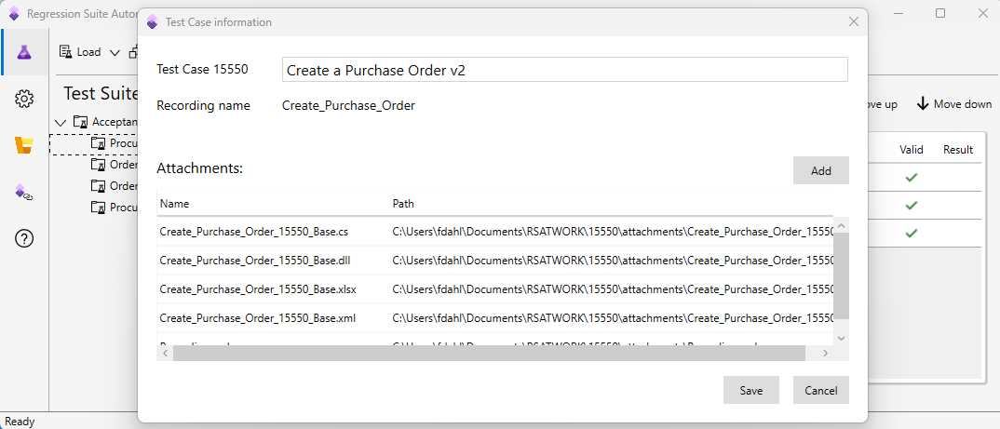
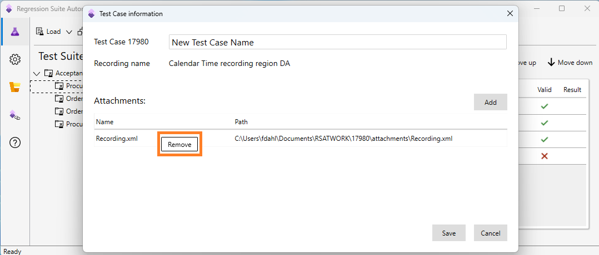

# Maintain test cases within Regression suite automation tool

[!include [banner](../../includes/banner.md)]

Regression suite automation tool (RSAT) version 2.2 and later lets you maintain test cases and attachments within RSAT. This improves usability and productivity significantly compared to earlier versions where you had to shift between using Azure DevOps for maintaining test cases and RSAT for running tests. Many operations can be done fully within RSAT and it's a simpler way of working with test suites.

Test plans and test suites continue to be maintained in DevOps.

The option **Enable upload to Azure DevOps** must be enabled to use this feature. Changes made in RSAT will automatically upload to DevOps and be available in DevOps. This way, tests suites will include the updated test cases available to other users or for running in DevOps by pipeline.

## View test case information

To view test case information, use the context menu that is in the test cases grid. Locate the relevant test case and hover the mouse until the ellipsis appears between the **Title** and **Parameters File** columns, as shown in the following screenshot.

Select the context menu to display the two options, **Open Test Case** and **Delete Test Case**, as shown in the following screenshot.

Select **Open Test Case** to open **Test Case information** form.

The **Test Case information** form shows details the test case.

+ The name assigned in the test suite is shown at the top and can be changed within this form.
+ The recording name is shown from the recording Xml that was used when the recording was made in the Task Recorder within the Finance and Operations app or by using the POS client.
+ The list of the attachment files available with the test case is shown. You can also find this list by using the Directory action under the attachments subfolder.

## Create test case with attachments

You add a new test case using RSAT by selecting **New Test Case**. It adds a new test case to the highlighted test case, as shown in the following screenshot for **Procure to Pay – v2**.

Select **New Test Case** to open the **Test Case information** form. On the form, you supply the test case name and add attachment files that include the recording Xml file with steps for the case. To add attachment files, select **Add** to open a file dialogue for picking the files to add. An example is shown in the following screenshot.

When you are done, select **Save** to save the test case, or **Cancel** to discard the test case.

When you save a new test case, RSAT copies the attachment files you selected into your local RSAT working directory and maintains that copy to be used with the test case.

There is no automatic feature to clone test cases from one suite to another, but you can do it manually, by following these steps:

1. Create a new case as explained including adding the recording xml.
2. Then save the test case and note the assigned **caseID**.
3. You can add a parameter Excel file to the case, but it must match the caseID. Copy the parameter Excel file from the case you are cloning, and change the file name of the copy to match the new caseID.
4. Open the file and change all instances of the old caseID to the new caseID.
5. After you update caseID, select **Add** to attach the prepared parameter file to the new case.

An alternative approach is to generate a parameter file with the new case first, and manually edit this file to match the parameter file you are cloning.

## Remove attachment from a test case

You can remove attachments from a test case when you don't need them anymore. Right-click on the line with the attachment file in the **Test Case information** form, and in the context menu that will open, select **Remove**.

You might want to do this if you have edited the recording Xml and want to upload a new version to the case. In this case, remove the existing file first and then add the new file.

## Delete test case

To delete a test case, open the test cases grid. Locate the relevant test case and hover the mouse until the ellipsis appears between the **Title** and **Parameters File** columns.

Select **Delete Test Case**, as shown in the following screenshot.

Confirm that you want to delete the test case, and optionally, include a reason.

Deleting a test case in RSAT removes the test case from the current test suite both locally and in DevOps.

In DevOps, work items represent test cases, and test suites contain links to the test case work items. A test case is reused by linking to it from more than one test suite. When a test case is deleted within RSAT, RSAT determines if the test case is linked with one or more test suites. If the test case is used only by the current test suite, then RSAT deletes the DevOps work item representing the test case. If the test case is used in other test suites, then RSAT deletes the only link to the work item. It does not delete the work item, because it is still used in the other test suites.

[!INCLUDE[footer-include](../../../../includes/footer-banner.md)]
