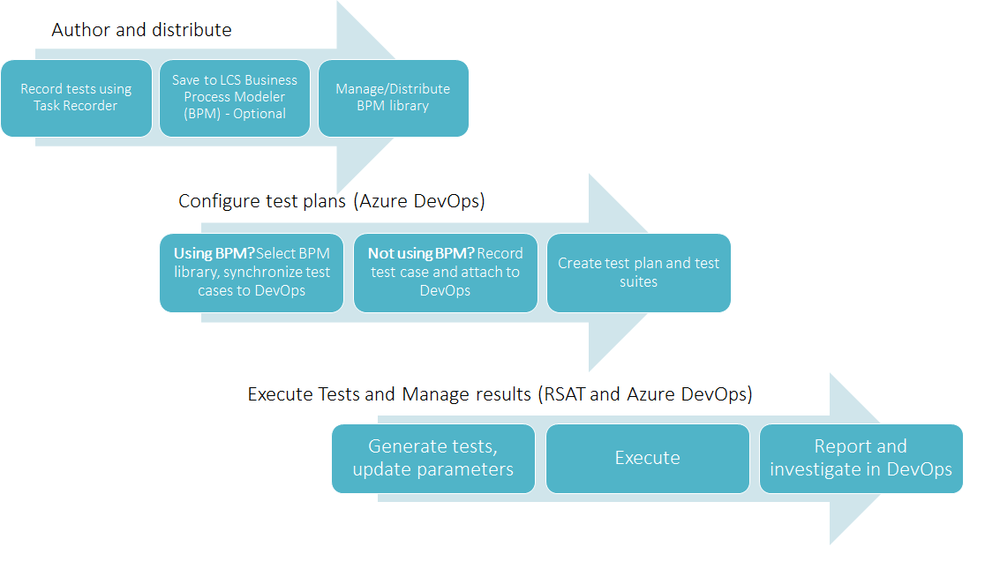
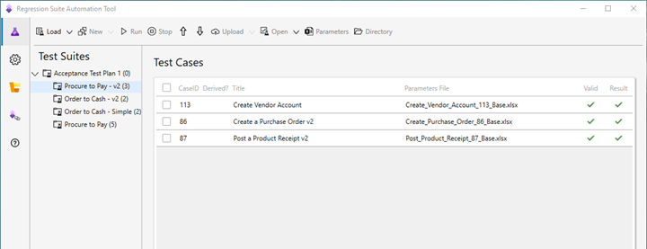

# Regression suite automation tool (RSAT)

[!include [banner](../../includes/banner.md)]

The Regression suite automation tool (RSAT) significantly reduces the time and cost of user acceptance testing (UAT) of finance and operations apps. UAT is typically required before you take a Microsoft application update, or before you apply custom code and configurations to your production environment. RSAT lets functional power users record business tasks by using Task recorder and then convert the recordings into a suite of automated tests, without having to write source code. For more information about Task recorder, see [Task recorder resources](../../user-interface/task-recorder.md).

RSAT is fully integrated with Microsoft Azure DevOps for test execution, reporting, and investigation. Test parameters are decoupled from test steps and stored in Microsoft Excel files.

In addition to this article, RSAT usage is described in these topics:

+ [Regression suite automation tool (RSAT) installation and configuration](rsat-install-configure.md)
+ [User-Based authentication](rsat-user-based-authentication.md)
+ [Run Regression suite automation tool (RSAT) test cases](rsat-run.md)
+ [Run Regression suite automation tool (RSAT) with parallel execution](rsat-parallel-execution.md)
+ [Maintain test cases within Regression suite automation tool (RSAT)](rsat-maintain-test-cases.md)
+ [Trial mode without Azure DevOps](rsat-trial-without-devops.md)
+ [Validate expected values](rsat-validate-expected.md)
+ [Chain test cases](rsat-chain-test-cases.md)
+ [Derived test cases](rsat-derived-test-cases.md)
+ [Configure nonadministrator users to use RSAT](rsat-configure-nonadmin.md)
+ [Upgrade the parameter files](rsat-upgrade-parameter-files.md)
+ [Regression suite automation tool (RSAT) best practices](rsat-best-practices.md)
+ [Troubleshoot the Regression suite automation tool (RSAT)](rsat-troubleshooting.md)
+ [Integrate RSAT with Azure Pipelines](rsat-devops-extension.md)

## Getting started videos

These videos help introduce RSAT and get you started.

### Use task recorder to create a test case for RSAT

> [!VIDEO https://www.microsoft.com/en-us/videoplayer/embed/RE4uM5U]

The [How to use task recorder to create a test case for the Regression suite automation tool (RSAT)](https://youtu.be/bBr4BXAxTNI) video is included in the [finance and operations playlist](https://www.youtube.com/playlist?list=PLcakwueIHoT_SYfIaPGoOhloFoCXiUSyW) available on YouTube.

### Create a test plan in Azure DevOps to use with RSAT

> [!VIDEO https://www.microsoft.com/en-us/videoplayer/embed/RE4vx0I]

The [How to create a test plan in Azure DevOps to use with the Regression suite automation tool (RSAT)](https://youtu.be/3jIuBleAnQk) video is included in the [finance and operations playlist](https://www.youtube.com/playlist?list=PLcakwueIHoT_SYfIaPGoOhloFoCXiUSyW) available on YouTube.

### How to use RSAT

> [!VIDEO https://www.microsoft.com/en-us/videoplayer/embed/RE4vl8Z]

The [How to use the Regression suite automation tool (RSAT)](https://youtu.be/uhN9JItzGAk) video is included in the [finance and operations playlist](https://www.youtube.com/playlist?list=PLcakwueIHoT_SYfIaPGoOhloFoCXiUSyW) available on YouTube.

### The improved Excel experience in RSAT 2.0

> [!VIDEO https://www.microsoft.com/en-us/videoplayer/embed/RE4Gi0V]

The [Improved Excel experience in RSAT 2.0](https://youtu.be/fcEkSIVQ1Bg) video is included in the [finance and operations playlist](https://www.youtube.com/playlist?list=PLcakwueIHoT_SYfIaPGoOhloFoCXiUSyW) available on YouTube.

## End-to-end flow

RSAT is part of the end-to-end flow described below. RSAT, Microsoft Dynamics Lifecycle Services (LCS), and Azure DevOps provide a set of tools for test case authoring (using Task recorder), distribution, configuration, execution, investigation, and reporting.

To learn more about this process, see [Create and automate user acceptance tests](../../lifecycle-services/using-task-guides-and-bpm-to-create-user-acceptance-tests.md).

## LCS, BPM, and Task Recordings

You aren't required to use the Business process modeler (BPM) tool in LCS. BPM is recommended if you want to enable the management and distribution of test libraries across projects and tenants. These capabilities are especially useful for Microsoft partners and independent software vendors (ISVs). BPM enables the distribution of test libraries as part of LCS solutions.

If you aren't using BPM, you can manually create test cases in Azure DevOps and attach developer recording files to your Azure DevOps test cases. You can create developer recording files directly from the Task recorder pane.

You must name the developer recording file **Recording.xml** before attaching it to the Azure DevOps test case. Alternatively, you can name the recording file **-Test Case Title-.xml**, where **-Test Case Title-** is the DevOps title of the test case.

## Intended usage and test classification

### Business cycle (business process) testing

RSAT is intended to be used for business cycle tests and scenario tests (multiple component tests) that usually occur at the end of the development lifecycle. This testing is also referred to as *user acceptance testing*. As the following illustration shows, business cycle testing consists of fewer test cases than component testing or unit testing.

### Cloud POS

In addition to testing processes recorded using the finance and operations Task recorder, RSAT also supports testing of Cloud POS processes in Dynamics 365 Commerce. For more information about RSAT with Cloud POS, see [Test recorder and Regression suite automation tool for Cloud POS](../../../../commerce/dev-itpro/pos-rsat.md).

### Warehouse mobile app

You can use RSAT in combination with the Warehouse App Task Validation Framework to automate the testing of warehouse processes. This [Tech Talk](https://community.dynamics.com/365/b/techtalks/posts/finance-and-operations-warehouse-app-task-validation-framework-october-23-2019) is a good reference to get started.

### Unit and component testing

For unit tests, we don't recommend that you use RSAT. Instead, use the SysTest framework and the build/test automation tools. For component tests, take advantage of the [Acceptance test library resources](../acceptance-test-library.md) (ATL). ATL is a library of X++ test helpers. When used with the SysTest framework, it offers the following benefits:

+ Lets you create consistent test data.
+ Increases the readability of test code.
+ Provides improved discoverability of the methods that are used to create test data.
+ Hides the complexity of setting up prerequisites.
+ Supports high performance of test cases.

For more information, see [Continuous delivery home page](../../dev-tools/continuous-delivery-home-page.md).

### Data integration testing

Don't use RSAT for integration tests, instead rely on the data management framework (also known as DIXF). The [Data task automation](../../data-entities/data-task-automation.md) framework enables you to configure and automate the testing of your data integration scenarios.

## RSAT User interface overview

RSAT 2.6 introduced a modern user interface that simplifies navigation through the main components of the app, including a **Quick links** tab, and quick navigation to DevOps test suites and test runs.

Use the left navigation pane to navigate between the test plan, settings, Cloud POS settings and the quick links page.

### Test Plan

The **Test plan** tab is the main tab that allows you to interact with and execute test cases.

The **Test Plan** tab is where the main page is located. Here, tests are managed and run, and test results are inspected. You can navigate between elements on this page by tapping (or clicking). Alternatively, for improved productivity, you can use the available keyboard shortcuts. Some shortcuts are active only when a test case is selected.

| Action                                                                                                                   | Shortcut |
|--------------------------------------------------------------------------------------------------------------------------|----------|
| Load (Load test plan from Azure DevOps project)                                                                          | ALT+L    |
| Generate (Create local automation files \[execution files only\]) – This action is the same as selecting **New** in earlier RSAT versions. | ALT+G    |
| Run                                                                                                                      | ALT+R    |
| New (Add new Test Case)                                                                                                  | ALT+N    |
| Parameters                                                                                                               | ALT+P    |
| Edit (Open test case details page)                                                                                       | ALT+E    |
| Delete (Delete test case) – A message box prompts you to confirm deletion.                                                           | ALT+D    |

### Settings

Select the **Settings** tab to configure RSAT settings. Use the top bar to navigate between general, optional and process settings. You don't need to save your settings. Settings are automatically saved as soon as you navigate out of the settings page. You can also save your settings in an RSAT settings file or open an existing settings file.

### Cloud POS Settings

Select the **Cloud POS Settings** tab to configure RSAT to execute Cloud POS test cases. You don't need to save your settings. Settings are automatically saved as soon as you navigate out of the settings page.

### Useful links

The **Links** tab provides new functionality. Select the **Links** tab to quickly navigate to your finance and operations environment, Cloud POS, or go to useful Azure DevOps pages showing recent test runs, the last test run, and current test plan. There's a link to the RSAT docs page.

### Quick navigation to Azure DevOps

When you work with your test plan, the **Open** button now provides three options.

+ Open the selected test case in Azure DevOps.
+ Open the selected test suite.
+ Open the recent test runs.

This tab provides quick access to the most relevant pages in Azure DevOps.

[!INCLUDE[footer-include](../../../../includes/footer-banner.md)]

