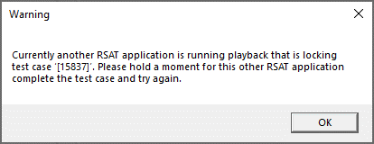
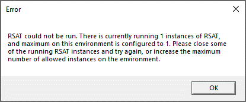

# Run Regression suite automation tool (RSAT) with parallel execution

[!include [banner](../../includes/banner.md)]

Regression suite automation tool (RSAT) version 2.3 and later provide the ability for users to run multiple RSAT apps in parallel.

## What is parallel RSAT execution and where can it be used?

You may be just fine today by using RSAT on your own machine and only run the application once. This may cover your needs. By with  parallel execution, you can do more.

### One user running two RSAT apps

When parallel execution is enabled, you can start the RSAT app more than once on your environment. This offers you the option of running tests with one or more RSAT apps, while at the same time use an RSAT app to create or maintain tests.

### Multiple users share environment they use for running RSAT app

Parallel execution allows multiple users that share the same environment to run RSAT tests at the same time. This makes it possible to create fewer VM environments and share these with users to use with RSAT rather than each user themselves need to maintain an RSAT installation on their own machines.

### Azure DevOps validation pipelines

Companies often set up DevOps validation pipelines to run their test suites. The benefit of this is that pipelines can be started at a scheduled time or triggered as part of a build pipeline or similar.

The parallel execution feature invite to split the full set of tests to run into smaller pipelines and run multiple of these pipelines in parallel such that they potentially may complete faster than earlier where all tests were run in a sequence.

## Why should parallel RSAT execution excite you?

There are many reasons the new parallel execution can may it easier for you.

Create shared environments rather than each user create an RSAT installation on each their machines. This means you get to benefit from only needed to install RSAT and certificates, configure RSAT settings, and renew certificates every 60 days on each shared environment resulting in less overhead time and better TCO.

Note that new certificates still require non-admin scripts are run for each non-admin user on the environment.

When you may have limited machines available, then sharing these helps ensure that you make great use of your resources.

Shared environments are not typically used to full capacity, and individual users benefit then from running multiple RSAT applications that make good use of the capacity. Running multiple RSAT apps in parallel has the potential of completing test runs faster, compared to running each test in sequence. This can also be used with DevOps validation pipelines that run in parallel for faster completion time of validation passes.

Even users that continue to run on their own dedicated machines benefit from the new parallel execution, if they run part of their tests in parallel such that they may complete faster causing less time waiting and a potential for being more productive.

## What was been done to RSAT to enable parallel execution?

We made some quite fundamental changes to how RSAT communicates with the test environment. Technically, RSAT communicates with a Finance and Operations environment through a port #745 is used to communicate with the web. This port was used exclusively each time RSAT was starting a test run.

With new changes we no longer use this port exclusively but have technically added endpoints with each test run. The endpoints provide isolation from other test runs and each have their own dedicated browser window where Finance and Operation process. Everything is neatly isolated in the communication without intervening or blocking anymore.

RSAT run tests from local files in the working directory specified under settings. When test runs perform some files are changes and new files added with results. This cause issues if two or more RSAT apps run the case test case in the same working directory at the same time. The result is files that are overridden and potentially information lost.

The new RSAT release introduce new logic to manage files and will detect if another RSAT test run current use a specific test case and block this to avoid risk of overriding files. Should this happen you run into this, then the following message is shown, and the second test run will stop.



There is a switch which can be specified when running RSAT by the command line (CLI):

/retry=[seconds]

What this will do is if a test case is blocked, then RSAT will wait for the specified number of seconds and try again. RSAT will only retry once, and if the second time fail too then the error message will occur.

> [!NOTE]
> Tip: Avoid file locking issues by using separate working directories with each running RSAT app. Each user should use their own working directory on machines they share with other. DevOps pipelines that run in parallel on the same machine should use each their own settings with specific working directories.

## When should you enable parallel execution?

First consider upgrading to the new RSAT version 2.3. There is no good reason not to upgrade to the new version, but it is practical to coordinate between users and upgrade version at the same time. It is practical to upgrade at the same time because test case executable files are generated to match only the RSAT version they are created by, and if you mix and match different versions then executable files may need to be regenerated multiple times to match a running RSAT version.

There is one case where upgrade to RSAT version 2.3 directly change relative to earlier versions. This is if you have run multiples version of RSAT version 2.2 or earlier on your environment at the same time. It was possible to open RSAT multiple times, but not to run test cases from more than one app. With the new RSAT version 2.3 this will be blocked unless you enable parallel execution on the environment. This error message will be shown when running a second RSAT app.



Each user can run only one RSAT app version 2.3 at a time. That is until the parallel execution feature is enabled. For these reasons, coordinate between RSAT users when it is a good time to upgrade, and consider upgrading together.

Notice you can revert to an earlier version of RSAT like version 2.2 again should you need this. This will require that you first uninstall the RSAT version 2.3 and then install the RSAT version you need. Do not worry your settings file will remain through this process. You will experience that any test executable files generated while using RSAT version 2.3 will need to be regenerated under the installed version to match this.

When you have installed RSAT version 2.3, then next steps to consider is when to enable the parallel execution. The parallel execution is only benefits for all users, but it needs to be explicitly configured on with this release because there are some preconditions to consider. With RSAT version 2.5 we expect to enable parallel execution automatically.

There are some hard conditions to meet before installing parallel execution:

- Only run RSAT version 2.3 or later versions on environment where parallel execution is enabled. RSAT will not work well with earlier versions with parallel execution enabled.

- Only use test environments of Finance and Operations running app version 10.0.21 & platform PU45 or later. RSAT depend upon platform features.

Notice enabling parallel execution does not mean you start using it right away, this will make the option available for you to use when you are ready with your suite of tests.

## How do I enable parallel execution?

Enabling parallel exertion is done once with each environment used for running RSAT tests. This is enabled separately for RSAT running with the user experience and for RSAT running using the command line interface (CLI).

Make sure only RSAT client’s version 2.3 or later is used on the environment. This is particularly relevant when enabling the parallel execution on shared environments.

> [!Warning]
> Make sure to close all running RSAT apps on the environment while making changes to config files.

You need to locate the relevant config file to enable parallel execution. This is found under the RSAT installation folder. On US/English machines this is found at: \Program Files (x86)\Regression Suite Automation Tool

Here you enable parallel execution for RSAT running with the user experience by editing the Microsoft.Dynamics.RegressionSuite.WpfApp.exe.config file.

And you enable parallel execution for RSAT running by command line interface (CLI) by editing the Microsoft.Dynamics.RegressionSuite.ConsoleApp.exe.config file.

The main setting, it to set the value to “true” for the element “ParallelExecution” like this line:

```xml
 <add key="ParallelExecution" value="true" />
 ```
 
There are 3 other new settings that have been added with parallel execution which are:

 ```xml
    <add key="SupportedInstances" value="5" /><br>
    <add key="SupportedUsers" value="10" />
    <add key="SupportedTestCasesForEachInstanceSimultaneously" value="10000" />
 ```

These 3 other settings are available to configure how much RSAT is allowed to run in parallel on the environment. The environment may have limitations on resources where you may want to constrain use of the parallel execution.

The element "SupportedInstances" determine how many RSAT apps are allowed to be run on the environment at the same time. This is a number shared by all users on the environment, so with the standard value 5 one user may start 3 RSAT apps, then a second user will only have 2 available RSAT apps to start.

The element “SupportedUsers” is used to limit how many concurrent users are allowed to start an RSAT app on the environment. The standard value is 10 users.

The element “SupportedTestCasesForEachInstanceSimultaneously” is set to a very high number and should rarely need to be considered. This element control how many test cases can be started to run on an environment at the same time. We assume the standard value of 10000 is sufficient for most use. The number result in some memory consumption on the environment, but nothing of any particular concern.

RSAT will automatically use new settings saved to these config files, next time it is started.

## Using parallel execution best practices

The first best practice is not specific to parallel execution, but immediately after installing RSAT version 2.3 then consider starting RSAT and check your settings are fine. If this is fine, then return to your test suites to save the settings. Why is this relevant, well the new parallel execution attempt to isolate test runs and some settings was earlier stored in the file called CloudEnvironment.config. This file will no longer be the source for this data, but the data is instead moving to the user credential manager. This way RSAT can dynamically change CloudEnvironment.config to match each test run which to support multiple users.

Consider organizing your tests into suites that are independent of each other. This means that one suite should try to avoid a data dependency from another suite, and as such be able to run before or in parallel with the other suite. It is likely you will see some work required to change your tests to become independent to enable them to run in parallel.

Only maintain tests from a single RSAT app at a time. When you maintain tests then this result in changing local files, which later needs to be uploaded. There is risk that you may cause one RSAT app can override files from another RSAT app, if two RSAT apps are used to maintain tests at the same time. Please consider only using one RSAT app to maintain tests, additional other RSAT apps may be used to run tests.

When using multiple RSAT apps to run tests, then consider they each use their own working directory. This reduce the risk that files are overridden between RSAT apps. This is particularly relevant for RSAT run by command like interface (CLI) and consider using separate settings that specify dedicated working directories to minimize the risk of file conflicts.

Test cases on DevOps are assigned unique IDs but it is possible to reuse a test case with multiple test suites. This cause risk for two test runs may need to run the same test case and resulting in a blocked case. RSAT will abort execution for the second RSAT app trying to run a case while another RSAT app is currently doing this. As earlier attempt to avoid conflicts which means minimize any use of reusing test cases. Unfortunately, local files are organized by test case IDs and can result in conflicts. When there is no way around this, then consider using the retry command line switch to help RSAT manage the situation.

Shared environment can only be configured to interact with a single, test Finance and Operations environment at a time. Each test environment is having its own set of certificates and changing to use another environment means installing new certificates on the environment. Users that have administrative access on the environment will be allowed to do this themselves but users that did not have administrative access will need help to install new certificates and to run non-admin scripts on the environment each time you want to change test environment that is used for an environment running RSAT. This may be cumbersome to go through exchanging what test environment is used and consider if feasible to devote at least one shared environment per test environment to avoid exchanging test environment regularly.

Notice an environment used for running RSAT can only be configured to work with a single test environment at a time. This is because the certificates used to access the test environment needs to be bound to the communication port #745 and only a single set of certificates from one test environment can be bound at a time.

Remember when a new user is let loose on a shared environment, that if this user is a non admin user that you will need to run the non-admin script for the user to enable the user access to RSAT critical resources.
