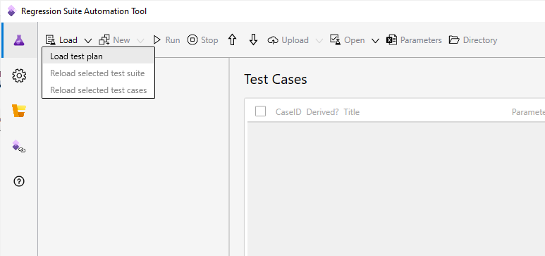
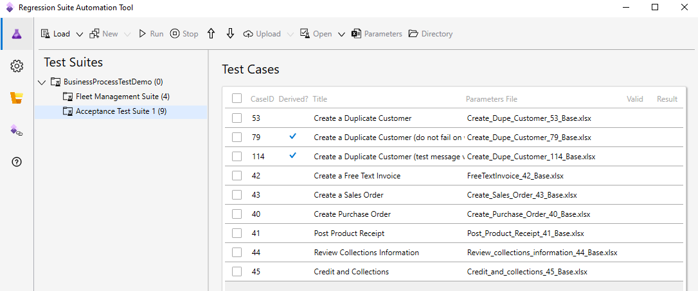
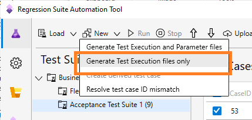
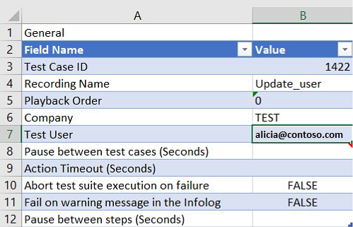
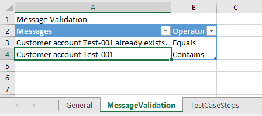
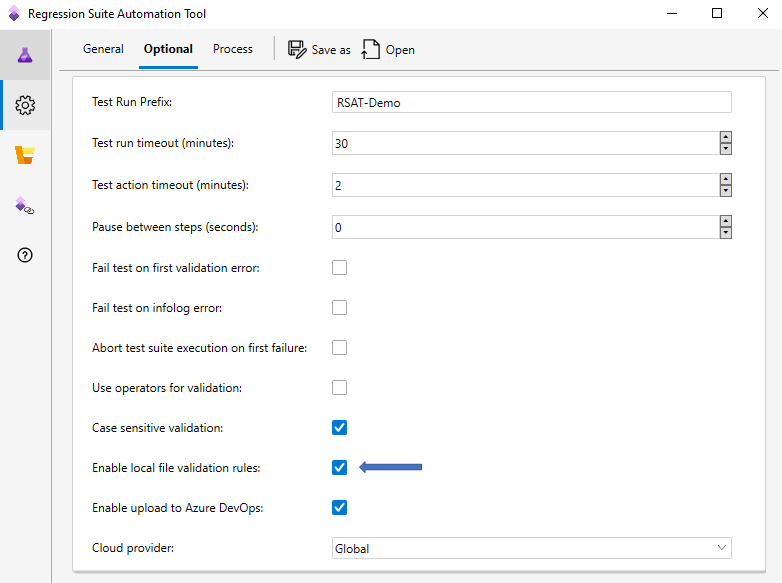
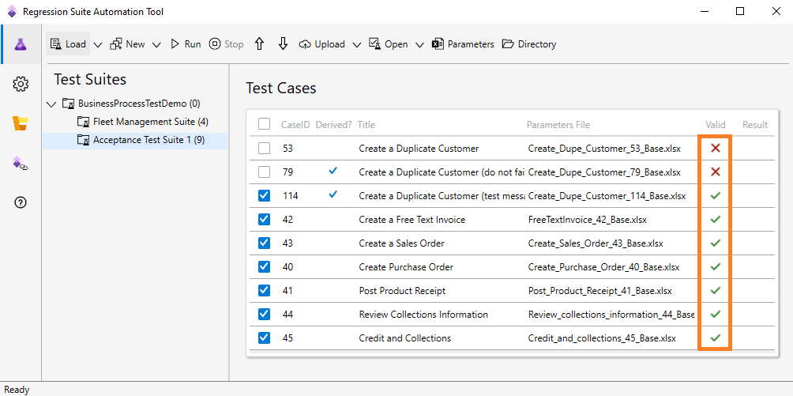
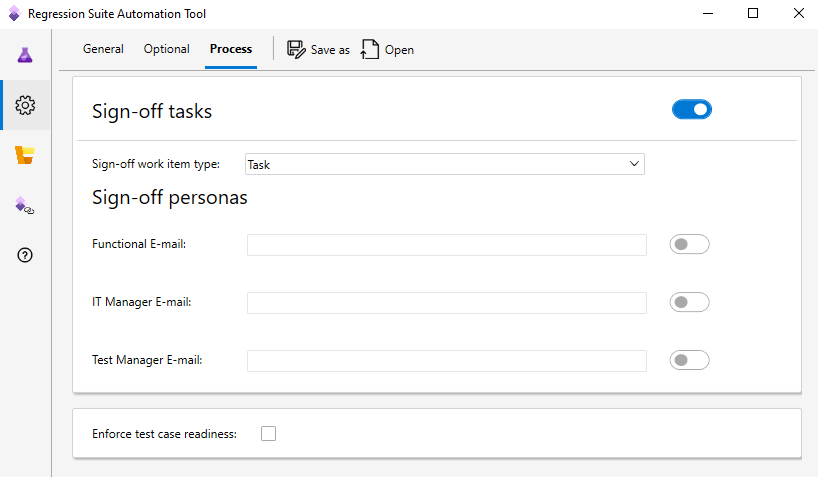

# Use the Regression suite automation tool (RSAT)

[!include [banner](../../includes/banner.md)]

This article explains how to load test cases from Azure DevOps, generate automation files, modify test parameters, run and investigate results, and save your work back to Azure DevOps.

## Load test cases and create automation files

In RSAT, select the **Test Plans** tab and then select **Load** to download test cases and test case automation files. All test cases (and their corresponding attachments) belonging to the test plan specified in the **Settings** tab are downloaded to the local working directory.

Test cases are organized by test suites under a common test plan. These are test suites you created in your Azure DevOps project. Using this tool, you can work with one test suite at a time.

If the tool fails to load any test case, verify that your test plan in Azure DevOps is properly created and contains the desired test suites and test cases.

If this is the first time you are using this test plan, the **Parameters File** column will be blank. You must create test automation files for your test cases.

A test case requires the following attachments for successful execution:

+ A **recording file**: This is the recording file created by the finance and operations Task recorder. It defines the steps of your test case. It is typically named **recording.xml** or but you can also name it to match the test case title in Azure DevOps. It is attached to the test case in Azure DevOps and downloaded into the **attachment** folder of the local working directory of the test case.
+ **Test automation files** consisting of **a test parameter file** (Microsoft Excel file) containing configurable test case parameters and **test execution files**: These files are generated by RSAT to enable automated execution of the test recording. Filenames are suffixed by **_Base.cs**, **_Base.xml**, and **_Base.dll**.

When you select **New**, test automation files are generated in your working directory. The Excel test parameter files will appear on the grid under **Parameters File**.

You can also generate **test execution files** only, without overwriting your parameter files. Select **New \> Generate Execution Files** to regenerate only execution files and leave Excel files unaffected.

You must generate test execution files when you install a new version of the tool, and when you modify or load a new version of the recording file. In this way, you update your execution files but also preserve the test parameter files.

## Modify test parameters

This section describes how to modify Excel files to specify input and validation parameters for your test run. Select one or more test cases to modify, and then select the **Parameters** button (Microsoft Excel symbol) on the toolbar. An Excel window opens for each test case that you selected. Alternatively, you can open the Excel files directly from the working directory.

In addition to the **General** tab, the Excel parameter file contains a **MessageValidation** tab and a **TestCaseSteps** tab.

Select the **TestCaseSteps** tab to configure input and validation parameters of your test case. Input and validation parameters are placed directly next to their corresponding test case step, enabling test authors with context and a simple experience. When you modify parameters, it is clear what steps of the test case you are affecting. You can enter values or formulas in context. Color coding differentiates input parameters from validation steps.

Reusable variables that are copied while recording the test case are also shown in context of the test case step. You can easily locate a variable and copy it to use in subsequent steps and formulas. For more information, see [Copy variables to chain test cases](rsat-chain-test-cases.md).

Save the Excel files when you are done making edits.

### Run a test as a specific user

By default, tests are executed using the admin role. If you want to run the test as a specific security role, specify the email address of a user under the **Test User** parameter in the **General** tab of the Excel parameter file. The **Test User** must be a valid user of the environments you are connecting to. The test will run under the security roles that the specific user belongs to. You need version 1.200 or newer for this feature to be functional.

### Run a test in the context of a specific company

The **General** tab of the Excel parameter file also allows you to specify the name of a legal entity (Company). The test will run in the context of this company. You can specify your default company in the **Settings** dialog box of the tool.

### Pause after a specific test step

You can insert a pause between specific test steps. Navigate to the **TestCaseSteps** tab of the Excel parameters file and insert a value (in seconds) in the pause column of a test step. This will pause test cases execution after the test step is completed.

If you don’t see the **Pause** column, you are using an older version of the Excel parameters file and need to regenerate it. Select the desired test case, then go to **New > Generate Test Execution and Parameter Files**. This may override edits you have made to the parameters file, so you should back up the existing Excel file first.

### Other notable test case execution settings

You may find the following settings useful. They are available on the **General** tab of the Excel parameter file.

+ **Fail on warning message in the Infolog**: By default, test cases fail when an error occurs or a validation step fails. If you also want a test case to fail in response to a warning message, set the **Fail on warning message in the Infolog** option to **True** . This is useful, for example, if a test case adds a duplicate customer record. The default setting is **False**.
+ **Abort test suite execution on failure**: If you set the **Abort test suite execution on failure** option to **True**, execution of the test suite is aborted if the test case fails. All the remaining test cases will have a status of **Not Executed**. The default setting is **False**.
+ **Pause between steps**: The number of seconds to pause between test steps. This will affect every test step. The default value is **0** (zero).

### Infolog and message validation

Excel parameter files that are generated using version 1.200 or newer contain a **MessageValidation** tab.

You can enter messages in this tab under **Message Validation**. After a test case completes execution, it validates that the messages specified here appear in the Infolog. The test case will fail if these messages are not found.

You can specify any expected messages including error messages. Any message specified in this section will cause a test case to fail unless it is found in the Infolog during execution. Two operators are available: **Equals** and **Contains**. If you use **Equals**, then RSAT performs a string comparison with all messages in the Infolog and fails validation if the full message is not found. If you use **Contains**, then RSAT will validate that at least one message in the Infolog contains the string you specify.

You can configure whether string comparison is case sensitive or not in the **Optional** page of the **Settings** tab.

## Run

Select **Run** to execute the selected test cases. Only test cases with existing automation files can be run. The tool will open and execute these tests with the data you entered in Excel.

You can modify the order in which test cases are executed using the up and down arrow buttons.

### Pause prior to a test case run

You can add a pause before a test case starts execution. If you want to pause, update the cell **Pause (seconds)** on the **General** tab of the Excel parameters file of the desired test case.

### Stop a run

When a test run is in progress, you can select the **Stop** button on the toolbar to cancel the run. Execution stops after the currently running test case completes. The remaining test cases will be marked as **Not Executed** in Azure DevOps.

### Validate readiness of test automation files

Optionally, you can turn on a setting that validates whether your test cases are ready for execution. This setting prevents unknown errors related to the validity of recordings and test automation files. This option is available as of RSAT version 1.210. You can enable this by selecting the **Settings** tab and then selecting the **Optional** tab.

When enabled, a background process continuously validates the following for each test case.

+ The local working directory exists.
+ The Excel parameter file exists.
+ Test automation files (binary and Xml files) needed for execution exist.
+ Test automation files are compatible with current version of RSAT. You must regenerate test automation files
when you install a new version of RSAT.
+ Test case ID specified in the Excel parameter file matches the test cases ID in Azure DevOps.

The Valid column in the grid indicates the result of the validation process. If validation fails, click on the **X** in the **Valid** column to view the error and recommended action.

## Investigate results

When all test cases complete execution, **Pass** or **Fail** will be populated in the **Result** column. You can click on the result to see error messages.

Additional investigation details are available in Azure DevOps. To view this information, from your Azure DevOps project page, go to **Test > Runs**.

Select the desired test run. It will include the results of all tests that were executed during that run.

You can open a failed test result and review the **ErrorMessage** section for information about the failure.

All error messages are also available locally under `C:\Users\$YourUserName\AppData\Roaming\regressionTool\errormsg-<TestCaseId>.txt`.

### Test response times

In addition to execution logs, the duration of a test case is also available in the test result.

You can also review the response time of each step of the test case by opening the **BaseTime.xml** file attached to the test result.

You need version 1.200 or newer for response times to be available.

## Upload to Azure DevOps to commit your work

To commit your work to Azure DevOps, select **Upload**. This uploads recordings and test automation files, including Excel test parameter files, of all selected test cases to Azure DevOps for future use. After test automation files are uploaded to Azure DevOps, the next time you use the Regression suite automation tool, even from a different computer, you can simply use **Load** and then **Run**, without generating test execution files or editing Excel parameter files.

In the upload menu, you also have the option to upload recording files (Task recordings) only.

If you are unsure what test cases to select, and you want to commit all changes (since last load) to Azure DevOps, select **Upload all modified automation files** in the upload menu.

## Process compliance

RSAT provides capabilities for managing the readiness of test cases. It also provides a sign-off process for test runs. This is configurable in the **Process** tab under Settings.

### Enforce test case readiness

You can set up the test case so that it isn't run unless it has a status of **Ready** in Azure DevOps. Select the **Enforce test case readiness** check box. By default, the check box is cleared.

### Signoffs

When your test run is complete, RSAT can create sign-off work items in Azure DevOps. Select the **Sign-off tasks** check box. Then set the type of work item that should be created for each person who signs off. You can select the **Functional**, **IT Manager**, or **Team Manager** role for sign-offs, and then specify appropriate email addresses. Work items will then be created in Azure DevOps and assigned to owners for approval.

[!INCLUDE[footer-include](../../../../includes/footer-banner.md)]
