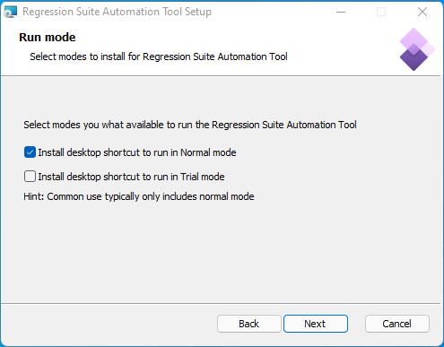
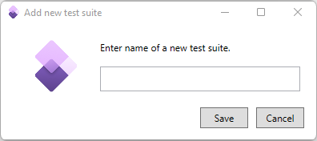
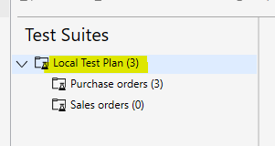
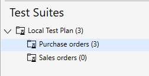

# Trial mode without Azure DevOps

[!include [banner](../../includes/banner.md)]

The Regression suite automation tool (RSAT) can be used in a trial mode. The benefit of trial mode is that it doesn't require connections to Microsoft Azure DevOps.

Organizations that are new to RSAT will be able to explore the tool without having to commit to subscribing to Azure DevOps. In this way, you can experience the value of test automation, decide whether RSAT is the right tool for you, and then add Azure DevOps and Test Plan subscriptions to users if this approach makes sense for your organization.

It's important to note that trial mode isn't time limited. If you find a long-term use for trial mode, keep it installed. Some organizations might even be fully satisfied with what trial mode offers, so that they continue to use it without ever subscribing to Azure DevOps and integrating RSAT with it.

RSAT in trial mode is based on the RSAT in Normal mode that is known from earlier versions. In fact, the binary application is the same, but the name differs when it runs in the new trial mode. You can think of trial mode as a trimmed-down version of the functionality that is available in Normal mode to produce a simplified application that doesn't require Azure DevOps to run.

RSAT in trial model is limited in some ways. For more information, see the [Differences when RSAT is run in trial mode instead of Normal mode](#differences) section later in this article.

During the installation process, you select which of the RSAT modes you want to be available. Both modes will be installed, and each will have its own shortcut on the desktop. Both modes can be installed on the same machine, and they can be used interchangeably.

RSAT will continue to work exactly as it used to work when it was run in Normal mode.

Trial mode isolates all test suites and cases under a single dedicated test plan that is named **Local Test Plan**. Currently, no exchange of test suites or cases between trial mode and Normal mode is supported. In other words, when RSAT is run in trial mode, it works without any type of integration with RSAT in Normal mode. However, in the RSAT 2.5 release, a new function that is planned will enable export and import of test suites together with cases. When this function is implemented, you will be able to transfer test suites and cases between the two RSAT modes. You will even be able to transfer them from one environment to another.

## Install RSAT in trial mode

The RSAT installer program now includes an extra page where you select which RSAT modes you want to be available. By default, this page is configured so that only Normal mode is installed. However, you can select to install trial mode too. You can also clear the selection of Normal mode if it isn't required. The installation program will create a shortcut for each selected mode in the environment. Note that the installation is done for the full environment, and the shortcuts that are created are shared by all users in that environment.

Icons that appear on the desktop act as shortcuts that call RSAT in the selected modes. Just select the shortcut for the mode that you want to run. Notice that the icon for trial mode includes a band that has the word "Trial." The following illustration shows the icons that appear if both modes are selected and installed. 

## Differences when RSAT is run in trial mode instead of Normal mode

When RSAT is run in trial mode instead of Normal mode, the user experience is trimmed down. Actions and settings that are related to Azure DevOps are removed from the user experience.

The following table summarizes the features (commands, settings, and links) that are **not** available in trial mode.

| Feature | Reason why it isn't available |
|---------|-------------------------------|
| **Load** menu | There is no connection to Azure DevOps in trial mode. |
| **Create derived test case** command on the **New** menu | Trial mode doesn't support derived test cases. |
| **Upload** menu | There is no connection to Azure DevOps in trial mode. |
| **Open** menu | There is no connection to Azure DevOps in trial mode. |
| **Add existing test case** command on the **New test case** menu | Trial mode doesn't support adding test cases by referencing an existing case ID. |
| Paragraph for Azure DevOps in the trial mode settings | |
| **Enable upload to Azure DevOps** optional setting | |
| **Azure DevOps** section with links | |

RSAT in trial mode can't run against test environments that run on OneBox developer Virtual Hard Disks (VHDs). If this capability is required, you must run RSAT in Normal mode. However, RSAT in trial mode can run against cloud-hosted developer boxes. Typically, RSAT in trial mode uses cloud-hosted sandbox (Tier-2) environments.

Some functions that are provided by Azure DevOps had to be made available directly in RSAT in trial mode.

When a new test case is created, the ID that is assigned is determined based on the next available folder name in the trial directory.

When RSAT runs in trial mode, only one test plan is available. This test plan is automatically named **Local Test Plan**. Multiple test plans are supported only when RSAT runs in Normal mode and there is a connection to Azure DevOps.

When RSAT runs in trial mode, test suites aren't created in Azure DevOps. Therefore, the RSAT toolbar includes a new command that is named **New test suite**. This command opens a dialog box where you can specify the name of the suite to create.

Note that, in trial mode, you can add test suites directly to the **Local Test Plan** test plan only. Additionally, the **New test suite** command is available only when the node for that test plan has been selected in the tree on the left, as shown in the following illustration.

Another new command that is named **Delete test suite** lets you remove test suites. However, you can use this command only for test suites that contain no test cases. If a test suite contains test cases, you must delete those cases individually before you can delete the suite.

The **Save as** and **Open** commands that are available under **Settings** let you save and load all available RSAT settings, even Azure DevOps settings that are hidden in trial mode. These commands can be useful, because they let you reuse settings from Normal mode and share them with other users, who can open them in trial mode, for example.

## Using RSAT in trial mode

To open RSAT in trial mode, select the desktop shortcut that has a "Trial" band on the icon. If you've used previous versions of RSAT, the application will seem very familiar. However, fewer commands will be available.

Trial mode works without a connection to Azure DevOps, and tests are maintained exclusively by local files. When you run RSAT in trial mode, you run an installation as a single user. Tests that you make aren't exchanged with other users. We recommend that you not share working directories between users.

The RSAT 2.5 release plan includes the addition of a function that will enable test suites to be exported and imported. In this way, you will be able to exchange test suites and cases.

When you open RSAT in trial mode for the first time, no test suites or cases are shown. There is just a single test plan that is named **Local Test Plan**. The test cases for trial mode are in a **Trial** folder under the working directory that you specified in RSAT settings. Each test case has its own subfolder in the **Trial** folder. The name of the subfolder indicates the ID of the case.

You can add one or more test suites under the **Local Test Plan** test plan by using the **New test suite** command. Although you can add test cases to the test plan, we highly recommend that you create test suites instead, and then add test cases to them. Tests are always added to the node that is currently selected in the tree on the left. For example, in the following illustration, tests will be added to the **Purchase order** test suite.

To add, edit, and delete test cases, you use the same commands that were available in release 2.2 of RSAT in Normal mode. For more information, see [Maintain test cases within Regression suite automation tool (RSAT)](rsat-maintain-test-cases.md).

Maintenance of test cases in trial mode differs from maintenance in Normal mode in very few ways. Basically, there are two limitations in trial mode:

- Derived test cases aren't available.
- Test cases can't be added as linked to an existing test case.

It's important to note that, in trial mode, you can't add new tests just by adding new files to the file system. In fact, direct interaction with files isn't advised, because RSAT maintains an internal database for all files that are used. Therefore, any changes that are made outside RSAT, directly in the file system, can't be cataloged correctly. Instead, you should always use the commands that are available in RSAT to add new test cases and attachments. Likewise, to open and interact with parameter files, use the command that is available in RSAT.

To run a test in trial mode, select **Run** on the RSAT toolbar. The results are presented only to the user who is running the test. They appear only in the list that shows test cases and aren't saved anywhere. Additionally, the results are available only while RSAT is left open. If RSAT is closed and reopened, the results will no longer be visible. Although Azure DevOps lets users save results from test runs, so that those results can be shared with other users, RSAT in trial mode doesn't provide a way to share results. If you must share results of test runs, consider using RSAT in Normal mode.

Settings for RSAT in trial mode are shared with RSAT in Normal mode. The only real difference is that the specific settings for connecting to Azure DevOps are hidden in trial mode. Nevertheless, if you save and open setting files, they will include all settings in RSAT. It doesn't matter which mode you run when you save or apply setting files.

RSAT in trial mode includes two new commands that let you create and delete test suites directly in RSAT. For the current release, these commands are available only in trial mode. However, Microsoft has received feedback that requests these commands for Normal mode too. We will consider adding them to Normal in an upcoming release.

As has been mentioned, although you can add test cases directly to the test plan, the recommended approach is to organize your tests under test suites. This approach will ensure that you can export tests and exchange them with RSAT in Normal mode, with other users, or even with other organizations.
