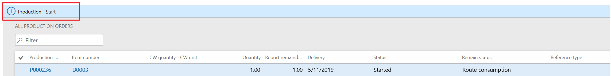
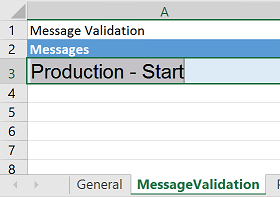
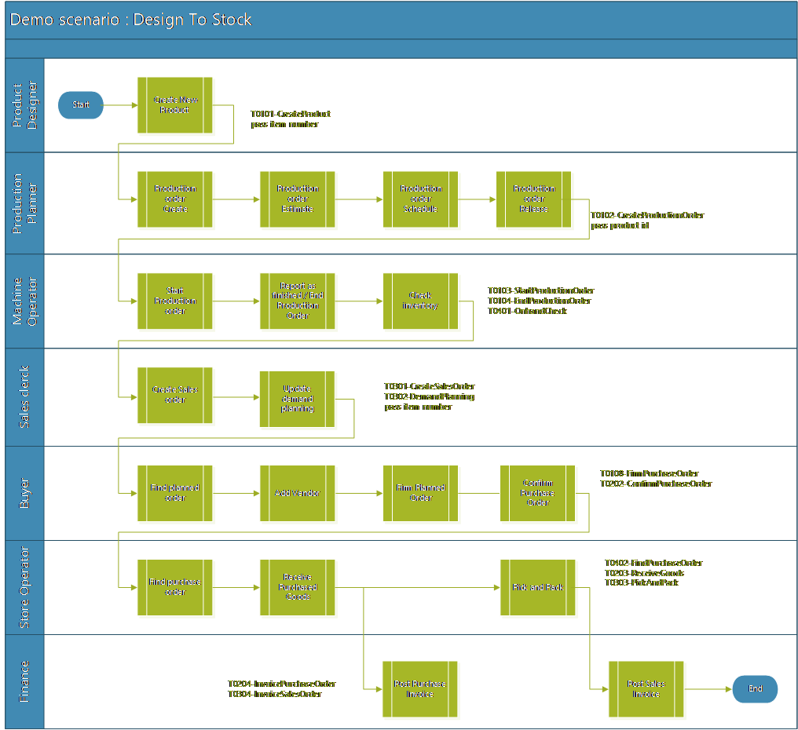
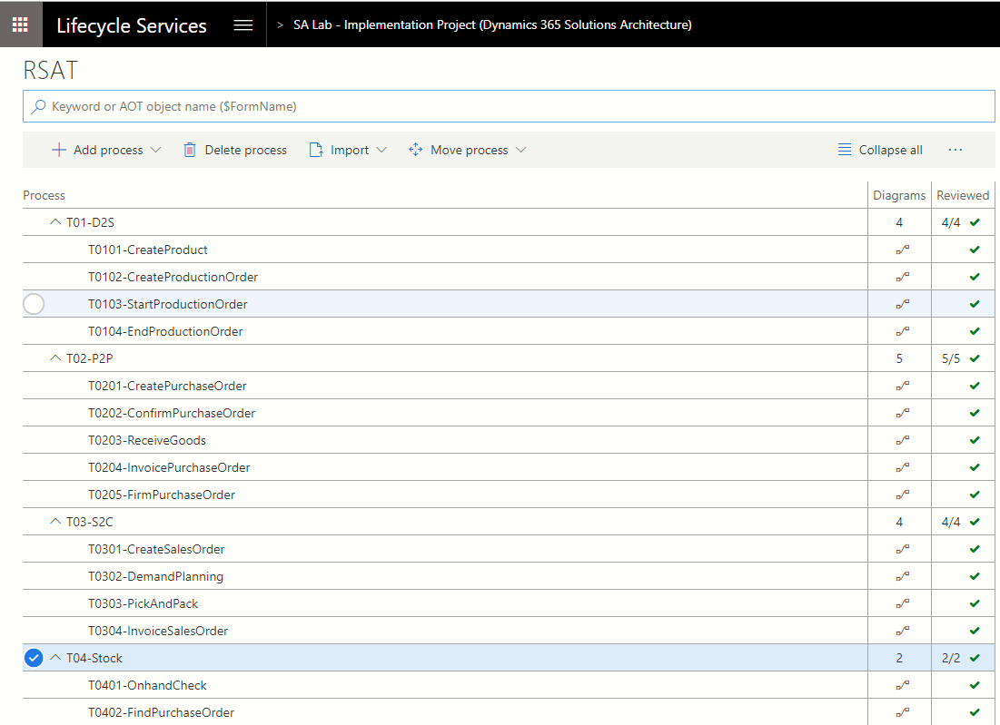

# Regression suite automation tool tutorial

[!include [banner](../../includes/banner.md)]

> [!NOTE]
> Use your internet browser tools to download and save this page in pdf format.

This tutorial walks through some of the advanced features of the Regression suite automation tool (RSAT), includes a demo assignment, and describes strategy and key learning points.

## Notable Features of RSAT and Task recorder

### Validate a field value

RSAT allows you to include validation steps within your test case to validate expected values. For information about this feature, see the article [Validate expected values](rsat-validate-expected.md).

The following example shows how you can use this feature to validate whether the on-hand inventory is more than 0 (zero).

1. In the demo data in the **USMF** company, create a task recording that has the following steps:

    1. Go to **Product information management \> Products \> Released products**.
    2. Use the Quick Filter to find records. For example, filter on a value of **1000** for the **Item number** field.
    3. Select **On-hand inventory**.
    4. Use the Quick Filter to find records. For example, filter on a value of **1** for the **Site** field.
    5. In the list, mark the selected row.
    6. Validate that the value of the **Total available** field is **411.0000000000000000**.

2. Save the task recording as a **developer recording** and attach it to your test case in Azure DevOps.
3. Add the test case to the test plan, and load the test case into RSAT.
4. Open the Excel parameter file and go to the **TestCaseSteps** tab.
5. To validate whether the inventory on-hand will always be more than **0**, go to the **Validate Total Available** step and change its value from **411** to **0**. Change the value of the **Operator** field from an equal sign (**=**) to a greater than sign (**\>**).
6. Save and close the Excel parameter file.
7. Select **Upload** to save the changes that you made to the Excel parameter file to Azure DevOps.

Now, if the value of the **Total Available** field for the specified item in inventory is more than 0 (zero), tests will pass, regardless of the actual on-hand inventory value.

### Saved variables and chaining of test cases

One of the key features of RSAT is the chaining of test cases, that is, the ability of a test to pass variables to other tests. For more information, see the article [Copy variables to chain test cases](rsat-chain-test-cases.md).

### Derived test case

RSAT lets you use the same task recording with multiple test cases, enabling a task to run with different data configurations. See the article [Derived test cases](rsat-derived-test-cases.md) for more information.

### Validate notifications and messages

This feature can be used to validate whether an action occurred. For example, when a production order is created, estimated, and then started, the app shows a "Production – Start" message to notify you that the production order has been started.



You can validate this message through RSAT by entering the message text on the **MessageValidation** tab of the Excel parameter file for the appropriate recording.



After the test case is run, the message in the Excel parameter file is compared to the message that is shown. If the messages don't match, the test case will fail.

> [!NOTE]
> You can enter more than one message on the **MessageValidation** tab in the Excel parameter file. The messages also can be error or warning messages instead of informational messages.

### Snapshot

This feature takes screenshots of the steps that were performed during task recording. It is useful for auditing or debugging purposes.

- To use this feature while running RSAT with the user interface, open the **Microsoft.Dynamics.RegressionSuite.WindowsApp.exe.config** file under the RSAT installation folder (for example, **C:\\Program Files (x86)\\Regression Suite Automation Tool**), and change the value of the following element from **false** to **true**.

    ```xml
    <add key="VerboseSnapshotsEnabled" value="false" />
    ```

- To use this feature while running RSAT by the CLI (for example, Azure DevOps), open the **Microsoft.Dynamics.RegressionSuite.ConsoleApp.exe.config** file under the RSAT installation folder (for example, **C:\\Program Files (x86)\\Regression Suite Automation Tool**), and change the value of the following element from **false** to **true**.

    ```xml
    <add key="VerboseSnapshotsEnabled" value="false" />
    ```

When you run test cases, RSAT generates snapshots (images) of the steps and saves them in the playback folder of the test cases in the working directory. In the playback folder, a separate subfolder is created named **StepSnapshots**. That folder contains snapshots for the test cases that are run.

## Assignment

### Scenario

1. The product designer creates a new released product.
2. The production manager initiates a production order to bring the stock level to two pieces.
3. Manufacturing starts and ends the production order, and verifies that the on-hand quantity is two pieces.
4. The sales team receives an order for four pieces of the new product. Therefore, the sales team updates the net requirements via the dynamic plan. Because no additional capacity is available, the default order policy is set to "buy instead of make." Therefore, a planned purchase order is created.
5. The buyer adds a vendor, firms the planned purchase order, and then confirms the purchase order.
6. When the goods that were purchased arrive at the store, the store operator searches the related purchase order and receives the goods. Because the order is now completed, goods can be picked and packed against the sales order.
7. Finance posts the purchase invoice and sales invoice.

The following illustration shows the flow for this scenario.



The following illustration shows the business processes hierarchy for this scenario in the LCS Business Process Modeler.



## Strategy – Key learning

### Data

- Make sure that you have representative data volumes (a copy of production/golden configuration data plus migrated data).
- When you generate new data via Task recorder, create test names that won't conflict with existing names (for example, use a prefix such as **RSATxxx**).
- Use Azure Point-In-Time restore to rerun tests in non-Tier 1 environments.
- Although you can use the **RANDOM** and **NOW** Excel functions to generate a unique combination, the effort is considerably high. Here is an example.

    ```Excel
    product = "AT" &TEXT(NOW(),"yyymmddhhmm")
    ```

### Task recorder

- Define scenarios before you start recording. A well-managed project has predefined test scenarios. To build a test case, consider how predictable the outcome of those test scenarios is.
- Split recordings if they are performed by different roles, or if there is waiting time or an external event before the next step.
- Avoid selecting values in lists. Instead, use text formats, such as **FIFO**, **AudioRM**, and **SiteWH**. When you select in a list, the position of the value in the list is recorded, not the value itself. If items are added to that list, the position of the value can change. Therefore, your recording will use a different parameter, and the rest of the scenario might be affected.
- Think about multi-user behavior. For example, don't assume that your newly created sales order will always be automatically selected. Instead, always use the filter to find the correct order.
- Use the Copy function in Task recorder to save the name of a newly created product so it can be used in chained test cases.
- Use the Validate function in Task recorder to set checkpoints that verify that steps have been run correctly.

### RSAT

- To run the test in another company, you can change the company on the **General** tab of the Excel parameter file. Make sure that settings and data are available in the newly selected company.
- You can change the test user on the **General** tab of the Excel parameter file. Specify the email ID of the user who will run the test case. In this way, the test case can be run by using the security permissions of the specified user.
- To wait before the test is started, you can define a pause on the **General** tab of the Excel parameter file. This pause can be used in a batch job (for example, if a workflow must be run before the next step can be performed.)

## Advanced scripting

### CLI

RSAT can be called from a **Command Prompt** or **PowerShell** window.

> [!NOTE]
> Verify that the **TestRoot** environment variable is set to the RSAT installation path. (In Microsoft Windows, open **Control Panel**, select **System and Security \> System \> Advanced system settings**, and then select **Environment Variables**.)

1. Open a **Command Prompt** or **PowerShell** window as an admin.
2. Navigate to the RSAT installation directory.

    ```Console
    cd "c:\Program Files (x86)\Regression Suite Automation Tool\"
    ```

3. List all commands.

    ```Console
    C:\Program Files (x86)\Regression Suite Automation Tool>Microsoft.Dynamics.RegressionSuite.ConsoleApp.exe help

    Usage:
        Microsoft.Dynamics.RegressionSuite.ConsoleApp.exe command
        or
        Microsoft.Dynamics.RegressionSuite.ConsoleApp.exe /settings "C:\Path to\file.settings" command

    Available commands:
        ?
        about
        cls
        download
        downloadsuite
        edit
        generate
        generatederived
        generatetestonly
        generatetestsuite
        help
        list
        listtestplans
        listtestsuite
        listtestsuitebyid
        listtestsuitenames
        playback
        playbackbyid
        playbackmany
        playbacksuite
        playbacksuitebyid
        quit
        upload
        uploadrecording
        usage
    ```

#### ?

Lists all commands or shows help for a specific command, together with the available parameters.

``Microsoft.Dynamics.RegressionSuite.ConsoleApp``**``?``**``[command]``

##### ?: Optional parameters

`command`: Where ``[command]`` is one of the commands in the preceding list.

#### about

Displays the version of the installed RSAT.

``Microsoft.Dynamics.RegressionSuite.ConsoleApp``**``about``**

#### cls

Clears the screen.

``Microsoft.Dynamics.RegressionSuite.ConsoleApp``**``cls``**

#### download

Downloads attachments (Recording, Execution, and Parameter files) for the specified test case from Azure DevOps to the output directory. You can use the ``list`` command to get all available test cases, and use any value from the first column as a **test_case_id** parameter.

``Microsoft.Dynamics.RegressionSuite.ConsoleApp``**``download``**``[/retry[=<seconds>]] [test_case_id] [output_dir]``

##### download: optional switches

+ `/retry[=seconds]`: If this switch is specified, and case test cases are blocked by other RSAT instances, the download process will wait the specified number of seconds and then try one more time. The default value for \[seconds\] is 120 seconds. Without this switch, the process will be canceled immediately if test cases are blocked.

##### download: required parameters

+ `test_case_id`: Represents the test case ID.

##### download: optional parameters

+ `output_dir`: Represents the output working directory. The directory must exist. The working directory from the settings will be used if this parameter isn't specified.

##### download: examples

`download 123 c:\temp\rsat`

`download /retry=240 765`

#### downloadsuite

Downloads attachments (Recording, Execution, and Parameter files) for all test cases in the specified test suite from Azure DevOps to the output directory. You can use the ``listtestsuitenames`` command to get all available test suites, and use any value as a **test_suite_name** parameter.

``Microsoft.Dynamics.RegressionSuite.ConsoleApp``**``downloadsuite``**``[/retry[=<seconds>]] ([test_suite_name] | [/byid] [test_suite_id]) [output_dir]``

##### downloadsuite: optional switches

+ `/retry[=seconds]`: If this switch is specified, and case test cases are blocked by other RSAT instances, the download process will wait the specified number of seconds and then try one more time. The default value for \[seconds\] is 120 seconds. Without this switch, the process will be canceled immediately if test cases are blocked.
+ `/byid`: This switch indicates that the desired test suite is identified by its Azure DevOps ID instead of the test suite name.

##### downloadsuite: required parameters

+ `test_suite_name`: Represents the test suite name. This parameter is required if the /byid switch is **not** specified. This name is the Azure DevOps test suite name.
+ `test_suite_id`: Represents the test suite ID. This parameter is required if the /byid switch **is** specified. This ID is test suite Azure DevOps ID.

##### downloadsuite: optional parameters

+ `output_dir`: Represents the output working directory. The directory must exist. The working directory from the settings will be used if this parameter isn't specified.

##### downloadsuite: examples

`downloadsuite NameOfTheSuite c:\temp\rsat`

`downloadsuite /byid 123 c:\temp\rsat`

`downloadsuite /retry=240 /byid 765`

`downloadsuite /retry=240 /byid 765 c:\temp\rsat`

#### edit

Allows you to open parameters file in Excel program and edit it.

``Microsoft.Dynamics.RegressionSuite.ConsoleApp``**``edit``**``[excel_file]``

##### edit: required parameters

+ `excel_file`: Must contain a full path to an existing Excel file.

##### edit: examples

`edit c:\RSAT\123\TestCase_123_Base.xlsx`

`edit e:\temp\TestCase_456_Base.xlsx`

#### generate

Generates test execution and parameter files for the specified test case in the output directory. You can use the ``list`` command to get all available test cases. Use any value from the first column as a **test_case_id** parameter.

``Microsoft.Dynamics.RegressionSuite.ConsoleApp``**``generate``**``[/retry[=<seconds>]] [/dllonly] [/keepcustomexcel] [test_case_id] [output_dir]``

##### generate: optional switches

+ `/retry[=seconds]`: If this switch is specified, and case test cases are blocked by other RSAT instances, the generate process will wait the specified number of seconds and then try one more time. The default value for \[seconds\] is 120 seconds. Without this switch, the process will be canceled immediately if test cases are blocked.
+ `/dllonly`: Generate Test Execution files only. Don't regenerate the Excel parameter file.
+ `/keepcustomexcel`: Upgrade the existing parameters file. Also regenerate Execution files.

##### generate: required parameters

+ `test_case_id`: Represents the test case ID.

##### generate: optional parameters

+ `output_dir`: Represents the output working directory. The directory must exist. The working directory from the settings will be used if this parameter isn't specified.

##### generate: examples

`generate 123 c:\temp\rsat`

`generate /retry=240 765 c:\rsat\last`

`generate /retry=240 /dllonly 765`

`generate /retry=240 /keepcustomexcel 765`

#### generatederived

Generates a new derived test case (child test case) of the provided test case. The new test case is also added to the specified test suite. You can use the ``list`` command to get all available test cases, and use any value from the first column as a **test_case_id** parameter.

``Microsoft.Dynamics.RegressionSuite.ConsoleApp``**``generatederived``**``[/retry[=<seconds>]] [parent_test_case_id] [test_plan_id] [test_suite_id]``

##### generatederived: optional switches

+ `/retry[=seconds]`: If this switch is specified, and case test cases are blocked by other RSAT instances, the generate process will wait the specified number of seconds and then try one more time. The default value for \[seconds\] is 120 seconds. Without this switch, the process will be canceled immediately if test cases are blocked.

##### generatederived: required parameters

+ `parent_test_case_id`: Represents the parent test case ID.
+ `test_plan_id`: Represents the test plan ID.
+ `test_suite_id`: Represents the test suite ID.

##### generatederived: examples

`generatederived 123 8901 678`

`generatederived /retry 123 8901 678`

#### generatetestonly

Generates only Test Execution files for the specified test case. It doesn't generate the Excel parameter file. The files are generated in the specified output directory. You can use the ``list`` command to get all available test cases, and use any value from the first column as a **test_case_id** parameter.

``Microsoft.Dynamics.RegressionSuite.ConsoleApp``**``generatetestonly``**``[/retry[=<seconds>]] [test_case_id] [output_dir]``

##### generatetestonly: optional switches

+ `/retry[=seconds]`: If this switch is specified, and case test cases are blocked by other RSAT instances, the generate process will wait the specified number of seconds and then try one more time. The default value for \[seconds\] is 120 seconds. Without this switch, the process will be canceled immediately if test cases are blocked.

##### generatetestonly: required parameters

+ `test_case_id`: Represents the test case ID.

##### generatetestonly: optional parameters

+ `output_dir`: Represents the output working directory. The directory must exist. The working directory from the settings will be used if this parameter isn't specified.

##### generatetestonly: examples

`generatetestonly 123 c:\temp\rsat`

`generatetestonly /retry=240 765`

#### generatetestsuite

Generates test automation files for all test cases in the specified test suite. You can use the ``listtestsuitenames`` command to get all available test suites, and use any value as a **test_suite_name** parameter.

``Microsoft.Dynamics.RegressionSuite.ConsoleApp``**``generatetestsuite``**``[/retry[=<seconds>]] [/dllonly] [/keepcustomexcel] ([test_suite_name] | [/byid] [test_suite_id]) [output_dir]``

##### generatetestsuite: optional switches

+ `/retry[=seconds]`: If this switch is specified, and case test cases are blocked by other RSAT instances, the generate process will wait the specified number of seconds and then try one more time. The default value for \[seconds\] is 120 seconds. Without this switch, the process will be canceled immediately if test cases are blocked.
+ `/dllonly`: Generate Test Execution files only. Don't regenerate the Excel parameter file.
+ `/keepcustomexcel`: Upgrade existing parameters file. Also regenerate Execution files.
+ `/byid`: This switch indicates that the desired test suite is identified by its Azure DevOps ID instead of the test suite name.

##### generatetestsuite: required parameters

+ `test_suite_name`: Represents the test suite name. This parameter is required if the /byid switch is **not** specified. This name is the Azure DevOps test suite name.
+ `test_suite_id`: Represents the test suite ID. This parameter is required if the /byid switch **is** specified. This ID is test suite Azure DevOps ID.

##### generatetestsuite: optional parameters

+ `output_dir`: Represents the output working directory. The directory must exist. The working directory from the settings will be used if this parameter isn't specified.

##### generatetestsuite: examples

`generatetestsuite Tests c:\temp\rsat`

`generatetestsuite /retry Purchase c:\rsat\last`

`generatetestsuite /dllonly /byid 121`

`generatetestsuite /keepcustomexcel /byid 121`

#### help

Identical to the [?](#section) command.

#### list

Lists all available test cases in the current test plan.

``Microsoft.Dynamics.RegressionSuite.ConsoleApp``**``list``**

#### listtestplans

Lists all available test plans.

``Microsoft.Dynamics.RegressionSuite.ConsoleApp``**``listtestplans``**

#### listtestsuite

Lists test cases for the specified test suite. You can use the ``listtestsuitenames`` command to get all available test suites, and use any value from the list as a **suite_name** parameter.

``Microsoft.Dynamics.RegressionSuite.ConsoleApp``**``listtestsuite``**``[test_suite_name]``

##### listtestsuite: required parameters

+ `test_suite_name`: The name of the desired suite.

##### listtestsuite: examples

`listtestsuite "sample suite name"`

`listtestsuite NameOfTheSuite`

#### listtestsuitebyid

Lists test cases for the specified test suite.

``Microsoft.Dynamics.RegressionSuite.ConsoleApp``**``listtestsuitebyid``**``[test_suite_id]``

##### listtestsuitebyid: required parameters

+ `test_suite_id`: The ID of the desired suite.

##### listtestsuitebyid: examples

`listtestsuitebyid 12345`

#### listtestsuitenames

Lists all available test suites in the current test plan.

``Microsoft.Dynamics.RegressionSuite.ConsoleApp``**``listtestsuitenames``**

#### playback

Plays back the test case that is associated with the specified Excel parameter file. This command uses existing local automation files and doesn't download files from Azure DevOps. This command isn't supported for POS commerce test cases.

``Microsoft.Dynamics.RegressionSuite.ConsoleApp``**``playback``**``[/retry[=<seconds>]] [/comments[="comment"]] [excel_parameter_file]``

##### playback: optional switches

+ `/retry[=seconds]`: If this switch is specified, and case test cases are blocked by other RSAT instances, the playback process will wait the specified number of seconds and then try one more time. The default value for \[seconds\] is 120 seconds. Without this switch, the process will be canceled immediately if test cases are blocked.
+ `/comments[="comment"]`: Provide a custom information string that will be included in the **Comments** field on the summary and test result pages for Azure DevOps test case runs.

##### playback: required parameters

+ `excel_parameter_file`: The full path of an Excel parameter file. The file must exist.

##### playback: examples

`playback c:\RSAT\2745\attachments\Create_Purchase_Order_2745_Base.xlsx`

`playback /retry e:\temp\test.xlsx`

`playback /retry=300 e:\temp\test.xlsx`

`playback /comments="Payroll solution 10.0.0" e:\temp\test.xlsx`

#### playbackbyid

Plays back multiple test cases at the same time. The test cases are identified by their ID. This command will download files from Azure DevOps. You can use the ``list`` command to get all available test cases, and use any of the values from the first column as a **test_case_id** parameter.

``Microsoft.Dynamics.RegressionSuite.ConsoleApp``**``playbackbyid``**``[/retry[=<seconds>]] [/comments[="comment"]] [test_case_id1] [test_case_id2] ... [test_case_idN]``

##### playbackbyid: optional switches

+ `/retry[=seconds]`: If this switch is specified, and case test cases are blocked by other RSAT instances, the playback process will wait the specified number of seconds and then try one more time. The default value for \[seconds\] is 120 seconds. Without this switch, the process will be canceled immediately if test cases are blocked.
+ `/comments[="comment"]`: Provide a custom information string that will be included in the **Comments** field on the summary and test result pages for Azure DevOps test case runs.

##### playbackbyid: required parameters

+ `test_case_id1`: The ID of an existing test case.
+ `test_case_id2`: The ID of an existing test case.
+ `test_case_idN`: The ID of an existing test case.

##### playbackbyid: examples

`playbackbyid 878`

`playbackbyid 2345 667 135`

`playbackbyid /comments="Payroll solution 10.0.0" 2345 667 135`

`playbackbyid /retry /comments="Payroll solution 10.0.0" 2345 667 135`

#### playbackmany

Plays back many test cases at the same time. The test cases are identified by Excel parameter files. This command uses existing local automation files and doesn't download files from Azure DevOps.

``Microsoft.Dynamics.RegressionSuite.ConsoleApp``**``playbackmany``**``[/retry[=<seconds>]] [/comments[="comment"]] [excel_parameter_file1] [excel_parameter_file2] ... [excel_parameter_fileN]``

##### playbackmany: optional switches

+ `/retry[=seconds]`: If this switch is specified, and case test cases are blocked by other RSAT instances, the playback process will wait the specified number of seconds and then try one more time. The default value for \[seconds\] is 120 seconds. Without this switch, the process will be canceled immediately if test cases are blocked.
+ `/comments[="comment"]`: Provide a custom information string that will be included in the **Comments** field on the summary and test result pages for Azure DevOps test case runs.

##### playbackmany: required parameters

+ `excel_parameter_file1`: The full path of the Excel parameter file. The file must exist.
+ `excel_parameter_file2`: The full path of the Excel parameter file. The file must exist.
+ `excel_parameter_fileN`: The full path of the Excel parameter file. The file must exist.

##### playbackmany: examples

`playbackmany c:\RSAT\2745\attachments\Create_Purchase_Order_2745_Base.xlsx`

`playbackmany e:\temp\test.xlsx f:\RSAT\sample1.xlsx c:\RSAT\sample2.xlsx`

`playbackmany /retry=180 /comments="Payroll solution 10.0.0" e:\temp\test.xlsx f:\rsat\sample1.xlsx c:\RSAT\sample2.xlsx`

#### playbacksuite

Plays back all test cases from one or more specified test suites. If the /local switch is specified, local attachments will be used for playback. Otherwise, attachments will be downloaded from Azure DevOps. You can use the ``listtestsuitenames`` command to get all available test suites, and use any value from the first column as a **suite_name** parameter.

``Microsoft.Dynamics.RegressionSuite.ConsoleApp``**``playbacksuite``**``[/updatedriver] [/local] [/retry[=<seconds>]] [/comments[="comment"]] ([test_suite_name1] .. [test_suite_nameN] | [/byid] [test_suite_id1] .. [test_suite_idN])``

##### playbacksuite: optional switches

+ `/updatedriver`: If this switch is specified, the internet browser's webdriver will be updated as required before the playback process is run.
+ `/local`: This switch indicates that local attachments should be used for playback instead of downloading files from Azure DevOps.
+ `/retry[=seconds]`: If this switch is specified, and case test cases are blocked by other RSAT instances, the playback process will wait the specified number of seconds and then try one more time. The default value for \[seconds\] is 120 seconds. Without this switch, the process will be canceled immediately if test cases are blocked.
+ `/comments[="comment"]`: Provide a custom information string that will be included in the **Comments** field on the summary and test result pages for Azure DevOps test case runs.
+ `/byid`: This switch indicates that the desired test suite is identified by its Azure DevOps ID instead of the test suite name.

##### playbacksuite: required parameters

+ `test_suite_name1`: Represents the test suite name. This parameter is required if the /byid switch is **not** specified. This name is the Azure DevOps test suite name.
+ `test_suite_nameN`: Represents the test suite name. This parameter is required if the /byid switch is **not** specified. This name is the Azure DevOps test suite name.
+ `test_suite_id1`: Represents the test suite ID. This parameter is required if the /byid switch **is** specified. This ID is the test suite Azure DevOps ID.
+ `test_suite_idN`: Represents the test suite ID. This parameter is required if the /byid switch **is** specified. This ID is the test suite Azure DevOps ID.

##### playbacksuite: examples

`playbacksuite suiteName`

`playbacksuite suiteName suiteNameToo`

`playbacksuite /updatedriver /local /retry=180 /byid 151 156`

`playbacksuite /updatedriver /local /comments="Payroll solution 10.0.0" /byid 150`

#### playbacksuitebyid

Runs all test cases in the specified Azure DevOps test suite.

``Microsoft.Dynamics.RegressionSuite.ConsoleApp``**``playbacksuitebyid``**``[/updatedriver] [/local] [/retry[=<seconds>]] [/comments[="comment"]] [test_suite_id]``

##### playbacksuitebyid: optional switches

+ `/retry[=seconds]`: If this switch is specified, and case test cases are blocked by other RSAT instances, the playback process will wait the specified number of seconds and then try one more time. The default value for \[seconds\] is 120 seconds. Without this switch, the process will be canceled immediately if test cases are blocked.
+ `/comments[="comment"]`: Provide a custom information string that will be included in the **Comments** field on the summary and test result pages for Azure DevOps test case runs.
+ `/byid`: This switch indicates that the desired test suite is identified by its Azure DevOps ID instead of the test suite name.

##### playbacksuitebyid: required parameters

+ `test_suite_id`: Represents the test suite ID as it exists in Azure DevOps.

##### playbacksuitebyid: examples

`playbacksuitebyid 2900`

`playbacksuitebyid /retry 2099`

`playbacksuitebyid /retry=200 2099`

`playbacksuitebyid /retry=200 /comments="some comment" 2099`

#### quit

Closes the application. This command is useful only when the applications is running in interactive mode.

``Microsoft.Dynamics.RegressionSuite.ConsoleApp``**``quit``**

##### quit: examples

`quit`

#### upload

Uploads attachment files (Recording, Execution, and Parameter files) that belong to a specified test suite or test cases to Azure DevOps.

``Microsoft.Dynamics.RegressionSuite.ConsoleApp``**``upload``**``([test_suite_name] | [test_case_id1] .. [test_case_idN])``

##### upload: required parameters

+ `test_suite_name`: All files that belong to the specified test suite will be uploaded.
+ `test_case_id1`: Represents the first test case ID that should be uploaded. Use this parameter only when no test suite name has been provided.
+ `test_case_idN`: Represents the last test case ID that should be uploaded. Use this parameter only when no test suite name has been provided.

##### upload: examples

`upload sample_suite`

`upload 2900`

`upload 123 456`

#### uploadrecording

Uploads only the Recording file that belongs to one or more specified test cases to Azure DevOps.

``Microsoft.Dynamics.RegressionSuite.ConsoleApp``**``uploadrecording``**``[test_case_id1] .. [test_case_idN]``

##### uploadrecording: required parameters

+ `test_case_id1`: Represents the first test case ID for the recording that should be uploaded to Azure DevOps.
+ `test_case_idN`: Represents the last test case ID for the recording that should be uploaded to Azure DevOps.

##### uploadrecording: examples

`uploadrecording 123`

`uploadrecording 123 456`

#### usage

Displays the three modes of usage of this application.

``Microsoft.Dynamics.RegressionSuite.ConsoleApp``**``usage``**

Running the application interactively:

+ ``Microsoft.Dynamics.RegressionSuite.ConsoleApp``

Running the application by specifying a command:

+ ``Microsoft.Dynamics.RegressionSuite.ConsoleApp ``**``[command]``**

Running the application by providing a settings file:

+ ``Microsoft.Dynamics.RegressionSuite.ConsoleApp``**``/settings [drive:\Path to\file.settings] [command]``**

### Windows PowerShell examples

#### Run a test case in a loop

You have a test script that creates a new customer. Via scripting, this test case can be run in a loop by randomizing the following data before each iteration is run:

- Customer ID
- Customer name
- Customer address

The customer ID will be in the format *ATCUS\<number\>*, where \<number\> is a value between **000000001** and **999999999**.

The following example uses one parameter, **start**, to define the first number that is used. Is uses a second parameter, **nr**, to define the number of customers that must be created. For each iteration, the parameters in the Excel parameter file are changed by using an UpdateCustomer function. Then the RSAT command line is called in a RunTestCase function.

Open Microsoft Windows PowerShell Integrated Scripting Environment (ISE) in admin mode, and paste the following code into the window that is named **Untitled1.ps1**.

```powershell
param ( [int]$start = 1, [int]$nr = 1 )
function UpdateCustomer
{
    param ([string]$paramFilename, [string]$sheetName, [string]$CustId)
    $xl = New-Object -COM "Excel.Application"
    $xl.Visible = $false
    $wb = $xl.Workbooks.Open($paramFilename)
    $ws = $wb.Sheets.Item($sheetName)
    $ws.Cells.Item(3, 2).Value = "ATCUS" + $CustId
    $ws.Cells.Item(4, 2).Value = "Automated Test Customer " + $CustId
    $ws.Cells.Item(8, 2).Value = "Automated Test Street " + $CustId
    $wb.Save()
    $wb.Close()
    $xl.Quit()
    [System.Runtime.Interopservices.Marshal]::ReleaseComObject($xl)
}
function RunTestCase
{
    param ( [string]$filename )
    $cmd = "cd c:\Program Files (x86)\Regression Suite Automation Tool\ &&  "
    $cmd = $cmd + "Microsoft.Dynamics.RegressionSuite.ConsoleApp.exe playback "
    $cmd = $cmd + $filename
    cmd /c $cmd
}
$excelFilename = "full path to Excel parameter file"
l$sheetName = "DirPartyQuickCreateForm"
for ($i = $start; $i -lt $start + $nr; $i++ )
{
    $CustomerId = $i.ToString("000000000")
    Write-Host "customer : " $CustomerId
    UpdateCustomer $excelFilename $sheetName $CustomerId
    RunTestCase $excelFilename
```

#### Run a script that depends on data in Microsoft Dynamics 365

The following example uses an Open Data Protocol (OData) call to find the order status of a purchase order. If the status isn't **invoiced**, you can, for example, call an RSAT test case that posts the invoice.

```powershell
function Odata_Get
{
    Param ( [string] $environment, [string] $cmd )
    [Net.ServicePointManager]::SecurityProtocol = [Net.SecurityProtocolType]::Tls12
    $tenant = "your tenant"
    $creds = @{
        grant_type = "client_credentials"
        client_id = "your client application Id"
        client_secret = "your client secret"
        resource = $environment
    }
    $headers = $null
    $bearer = Invoke-RestMethod https://login.microsoftonline.com/$tenant/oauth2/token -Method Post -Body $creds -Headers $headers;
    $headers = @{
        Authorization = "Bearer " + $bearer.access_token
    }
    $Odata_cmd = $environment + '/data/' + $cmd
    return (Invoke-RestMethod -Uri $Odata_cmd -Method Get -Headers $headers -ContentType application/json )
}
function PurchaseOrderStatus
{
    Param ( [string] $environment, [string] $purchaseOrderNumber )
    $cmd = 'PurchaseOrderHeaders?$filter=PurchaseOrderNumber eq '
    $cmd = $cmd + "'" + $purchaseOrderNumber + "'"
    $response = Odata_Get -environment $environment -cmd $cmd
    return $response.value.PurchaseOrderStatus
}
$environment = "https://your environment"
$orderStatus = PurchaseOrderStatus -environment $environment -purchaseOrderNumber '000003'
if ($orderStatus -eq $null) {   write-host 'doesn''t exist'}
elseif ($orderStatus -ne 'invoiced') { RunTestCase "PostInvoice" }
```


[!INCLUDE[footer-include](../../../../includes/footer-banner.md)]
