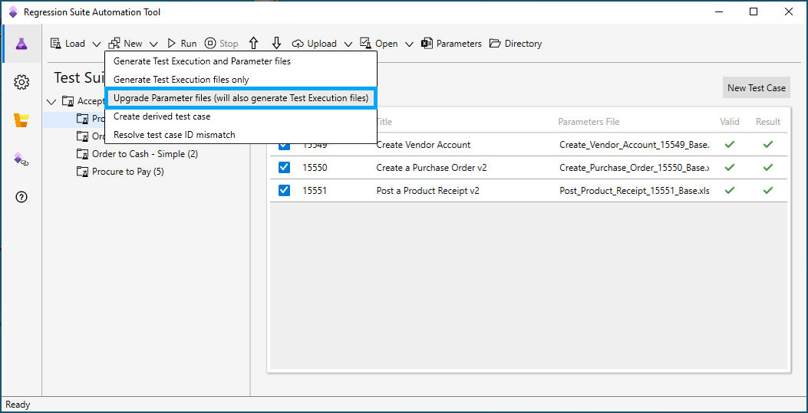

# Upgrade parameter files

[!include [banner](../../includes/banner.md)]

The format of parameter Microsoft Excel files that are used with Regression suite automation tool (RSAT) changed in the 2.0 release. The format is now more intuitive and shows test steps. New test cases that are created in RSAT version 2.0 and later automatically generate parameter files in the new format. However, you might have tests that were created before version 2.0 and that still use the old format. RSAT will continue to support running test cases that use parameter files in the old format at least until the next major release. RSAT can also upgrade old parameter files to the new format.

Parameter files can be freely edited in Excel. In some situations, a parameter file can't be fully upgraded, and some manual work is required to complete the process. The next section explains the mechanics of the upgrade process.

## Upgrade process

The upgrade process tries to do a full upgrade. However, in some situations, this process can't be safely completed.

When the full upgrade process can be completed, the old parameter file is replaced with a new one. A copy of the original file is created, and **\_BAK** is appended to the file name.

If only part of the parameter file can be safely upgraded, the original file isn't changed. Instead, a new file is created, and **\_PARTIAL** is appended to the file name. The partial file contains the information that could be upgraded. You can use the partial file to manually transfer missing parts from the original file and complete the new file. When you've finished, rename the original file to a backup name (for example, append **\_BAK** to the file name). Then rename the new file by removing **\_PARTIAL** from the file name. The new file then becomes the new parameter file.

> [!NOTE]
> You can continue to use the old parameter file until the new file is ready. RSAT will continue to support the old format for parameter files at least until the next major release.

The upgrade process can usually upgrade unedited parameter files. It can also upgrade files where only cell values have been changed in the file. However, if additional cells have been added and referenced, the upgrade process can't be completed automatically. In this case, the partial file will include cells that have the value **\#MISSING**. This value indicates that cell references are missing. You must manually add the information from the original parameter file to the new partial file.

> [!IMPORTANT]
> From now on, add new cells to the new **CustomParameters** sheet in the parameter file, just as they are added in the partial file.

In RSAT release 2.2 and later, the parameter file has a sheet that is named **CustomParameters**. This sheet is included to help future-proof the upgrade of parameter files. If you add cells, add them to this sheet.

If you added a cell to the old parameter file and assigned a name to that cell, the named cell is automatically moved to the **CustomParameters** sheet during the upgrade, provided that its value doesn't reference other cells.

After you've finished moving your added cells to the partial file, if any references on the **TestCaseSteps** sheet have **\#MISSING** as the value, change the references so that they match the relevant cells on the **CustomParameters** sheet. Ideally, you should always reference cells by their assigned name (for example, **MyQuantity**), not by the cell identifier (for example, **E4**).

> [!NOTE]
> As a best practice, you should assign names to any cells that are added to the **CustomerParameters** sheet. Then reference the cells by name from test case steps.

After the upgrade, you should run your test cases to make sure that the new parameter file produces the expected results. Complete this step both when the upgrade was fully completed and when the upgrade required manual work.

When you've finished creating and testing the new files, you can delete the backup and partial files.

## Run the parameter file upgrade process

To upgrade the parameter files, follow these steps.

1. Open RSAT.
2. Select that test cases that have the parameter files that you want to upgrade.
3. On the **New** menu, select **Upgrade Parameter files (will auto generate Test Execution files)**.

    

The parameter files for all the selected cases are upgraded.

The upgrade process skips test cases where the parameter file is already in the new format. A parameter file is considered upgraded if it contains the **CustomParameters** sheet.

When the upgrade process is completed, a message box appears that shows a summary. The summary includes the following information:

+ The total number of selected test cases that were marked for upgrade.
+ The number of successful upgrades. For these upgrades, there are new parameter files and **\_BAK** files.
+ The number of failed upgrades. For these upgrades, there are new **\_PARTIAL** files.
+ The number of skipped upgrades.
+ An explanation of the results.

The following illustration shows an example of the summary message box.

For a failed upgrade, you can find more information by selecting the yellow triangular warning symbol next to the test case title. The following illustration shows an example of the message box that appears.

> [!IMPORTANT]
> You can run the upgrade repeatedly. In this case, newly upgraded parameter files will be skipped. However, new partial files will overwrite existing partial files. We recommend that you complete all partial files and rename them before you rerun the upgrade.

[!INCLUDE[footer-include](../../../../includes/footer-banner.md)]
