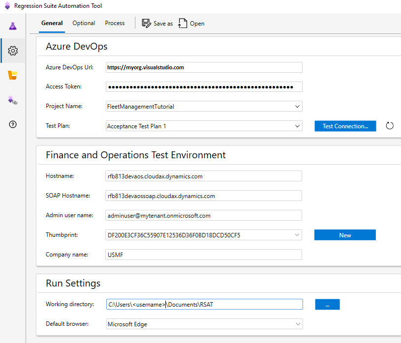

# User-based authentication

Certificate-based authentication to Dynamics 365 Finance and Operations apps is planned to be removed. The Admin Center that replaces LCS will no longer include the option to download certificates. RSAT usage needs to transition to replace certificates with user-based authentication. Dynamics 365 Finance and Operations apps does not support authentication by a service principal like App Registration or by Managed Identity which means, only user-based authentication exists as option.

The recommendation is to use user-based authentication whenever this is possible. There are some conditions where this is not possible. The user-based authentication requires standard Microsoft online identity provider (https://login.microsoftonline.com/) is used to validate user accounts. It is also a requirement that user authentication is configured without multi-factor authentication (MFA) for accounts that are used to connect to your Dynamics 365 Finance and Operations app test environments. User account authentication will time out and fail if login is attempted with a user account with MFA enabled.

Microsoft recommend access to Dynamics 365 Finance and Operations apps environment require MFA. Disabling MFA should only be done with test accounts used by RSAT toward the Finance and Operations apps test environments. This is possible to configure on Microsoft Entra ID by Conditional Access Policies. For details on how this is configured please consult online documentation. Note using Conditional Access Policies is a premium feature that needs to be subscribed to. Please consult online documentation for how this is used.

Dynamics 365 Finance and Operations apps on-premises hosted environment is not supported with ADFS user account identities. This means these environments deployed as Local Business Data cannot use user-based authentication.

# How to set up user-based authentication

User-based authentication requires some extra steps to set up, but once it has been configured once centrally then set up of individual RSAT client environment become more seamless without concerns for installing certificates that is granted access to the test environment.

With this set up access to Dynamics 365 Finance and Operations apps test environments happen by user identifies with user account name and password to log in just like how normal users log in.

RSAT will require passwords for test user accounts from parameter files when running tests. Test cases without a test user account in parameter files run using the admin user from RSAT settings, and RSAT will then also need password for this user too.

Passwords need to be maintained safely using an Azure Key vault. This Key vault is one each company must create and grant access for to use with RSAT.

The Key vault is created as a resource under a subscription using the Azure Portal. Creating this is done by one with technical experience in our organization which has access to this. Creating this Key vault is done centrally once and shared by RSAT client installations.

Use the Key vault to add secrets using the name of test accounts but remove any characters that are not allowed. For instance, an account named frontname_surname@mydomain.com need to remove illegal characters and change the name into frontnamesurnamemydomaincom as secret name.

The secret value is where the password is provided. Make sure this is entered exactly like it needs to be entered when logging in. No changes should be made to the password when saved as the secret value.

Consider the best practice and renew password for test accounts with some cadence. Obviously when new passwords are set, then also remember to update the matching secret value in the Key vault.

Important, do only include test accounts used for testing on Sandbox, UAT, or DevBox environments. It is strongly discouraged to use any real user accounts as test accounts as unintended access using these risks exposing access to business data. Also, only grant test accounts access to login to Dynamics 365 Finance and Operations apps that are hosted as Sandbox, UAT, or DevBox environments. Avoid granting test accounts access to production environments due to the potential risk this imposes.

RSAT automatically transforms test user accounts and removes illegal characters when looking up password. Continue to specify the test user accounts in parameter files and RSAT settings with full account names.

Access needs to be granted to RSAT to access the Key vault. This is done by creating an App registration under Microsoft Entra ID under the same Tenant where the Key vault was created. This is a shared identity used by the Key vault and RSAT.

This App registration is created with an Application (client) ID and has a Secret identified by a Secret ID with a Secret Value that is kind of a password for the connection.

Access needs to be granted to the Key vault to the Application Registration. Within the Azure Portal look up the Key vault resource and use Access Policies and Create a new policy that grant Get, and List secret permissions to the Application registration as selected Principal.

Information collected from setting Key vault and App registration is needed for completing setup in RSAT. First select Authentication method “User-Based”, which will expose the new fields for the setup as seen below. It is here you provide the Tenant ID, Key vault URL, Client ID, Secret ID, and Secret Value collected from prior steps.

Notice a thumbprint still needs to be selected for a certificate, however this certificate is not used to gain access but used locally only. You can simply click the New next to the field to create a new certificate that install locally to complete this. It is not needed to install the certificate to the hostname environment.

Note that the secrets with the App registration or Client ID have an expiry and must be renewed periodically on Microsoft Entra ID. This means Secret ID and Secret Value will need to be updated periodically. Obtain new updated values from the individual in your company that maintain this.

Settings files saved and loaded from RSAT settings do not include the Client Secret. This is excluded as an extra security precaution. The Client Secret will always have to be entered manually and is saved only in the save storage we use as the Windows vault with Credentials Manager. Keep this in mind when configuring an environment to run RSAT by CLI like by pipelines, that you need to log into the environment with the user account RSAT is started under and manually provide this value in RSAT settings to save the value in the vault, such that this will be used during playback.

# How to disable MFA for test accounts

As mentioned before user-based authentication will not work for accounts that had multi-factor authentication (MFA) enabled.

It is possible to configure tenant on Microsoft Entra ID and disable security defaults to disable MFA, but this disable MFA for all accounts and is not recommended by Microsoft.

The secure approach is to disable MFA only for the test accounts used with running test cases by RSAT and only for environments used in testing.

This is possible by using Conditional Access Policies: [Building a Conditional Access policy](https://learn.microsoft.com/en-us/entra/identity/conditional-access/concept-conditional-access-policies)

