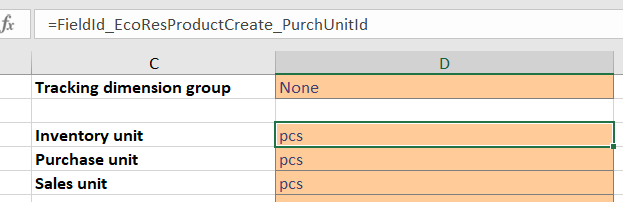
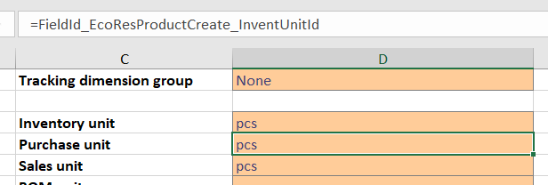
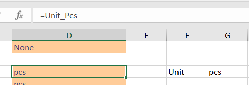
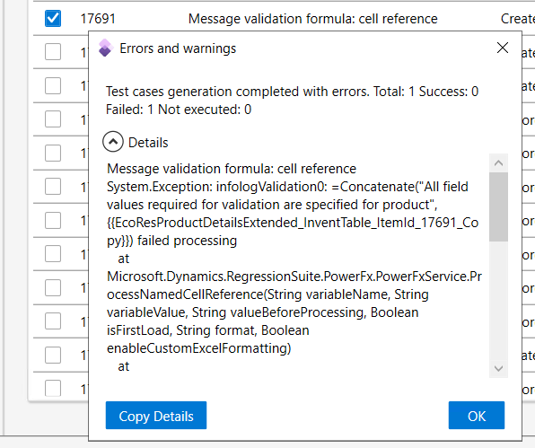
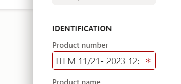

# Using formulas as parameters

[!include [banner](../../includes/banner.md)]

RSAT uses parameter files where values can be changed for tests. Here you can specify fixed values, or even use Excel formulas to make more dynamic values. The client used to maintain parameters is Excel while most recent RSAT versions use PowerFX to evaluate formulas during playback.

When editing parameter files in Excel remember always to use the Generate action to apply changes for playback. Generate will show if there are any compatibility issues with formulas that PowerFX will have issues processing.

PowerFX is almost 100 % compatible, and you can in most cases use Excel parameter files directly with PowerFX without making any changes.

For reference to what formulas are available with PowerFX consult this page:
[Power Fx formula reference overview](https://learn.microsoft.com/en-us/power-platform/power-fx/formula-reference-overview)

There are a few cases you need to be aware of to ensure formulas are compatible. The following paragraphs show do’s and don'ts on how to use formulas.

## Steps can only reference values from completed steps

Test steps cannot reference later steps in a case. 

For example, step number 2 cannot reference a value from the step number 3 cell within a test case. This is because step 3 logically does not happen when step 2 is running, and the value for step 3 can change before it executes. 

The example here, where inventory unit attempt to use the value from purchase unit will not work.

The reverse case is perfectly fine where Purchase order reference back and use the Inventory unit cell value.

One way this may be fixed is by creating a new named cell that holds a value, which then can be referenced from both cells like Inventory and Purchase unit steps in the example.

## Using saved variables in formulas

Variables can be saved with recordings, and they are assigned names with curly brackets like {{PurchCreateOrder_PurchTable_PurchId_16601_Copy}}.

Variables provides a convenient way to save a value to reuse later during test execution, both within a test case and to pass as context when connecting test cases. Variable can only be used in primary test step cells and message validation cells.

Cells that include strings just include variable by their names directly within the string, like: “The variable has the value {{PurchCreateOrder_PurchTable_PurchId_16601_Copy}} as purchase order id”

Cells with formulas must include variables using their name surrounded by double quotes like:
=CONCAT("All field values required for validation are specified for product ", "{{EcoResProductDetailsExtended_InventTable_ItemId_17691_Copy}}")

Variables that have numeric values must also be referenced double quotes in formulas, here use the VALUE function to get the numeric value, like: =VALUE(“{{PurchCreateOrder_PurchLine_Quantity_16601_Copy}}”) * 2

Never use ‘ (single quotes) in front of formulas as workaround , like:  
‘={{PurchCreateOrder_PurchLine_Quantity_16601_Copy}}”) * 2

This represents a symptom where variables have been referenced in a non-supported way, and the cell should be edited to validate and save without the single quote character up front.

Below is an example how RSAT will present an exception when using the Generate action, if a formula has compatibility issues.

## Excel turn TODAY and NOW into decimal numbers

Some common test cases create new records that have unique identifiers. For instance, a new product requires a product ID which needs to be unique.  Formulas are typically used to generate such unique identifiers. One option is to use RAND or RANDBETWEEN functions for this, but this is subject to random assignment with risk that an existing ID is returned. Another maybe better option is to use the current time to define the unique identifier from.

Excel is internally maintaining date and time as decimal numbers, and this can be used when generating unique identifiers.

Excel sometimes dynamically converts date and time like from functions TODAY and NOW into decimal numbers. However, this does not work with PowerFX without we explicitly mention indicate this in the formulas.

Excel process functions like TODAY and NOW dynamically as decimal numbers.

Using the function: =LEFT(TODAY(),5) has Excel returning a 5 digits number that represents the current date.

Using the function: =MID(NOW(),7,8) has Excel returning a 8 digit number that represents the time of day.

You can piece this together into a unique identifier like “ITEM 45254 – 0200787”, where the part before the hyphen is the date represented as number, and the part after if the time of day.

PowerFX will not process these functions as decimals, but instead process the text value returned from the TODAY and NOW functions, and the similar case result in something like this with PowerFX:

To ensure this works fully compatible with PowerFX you need to compensate by wrapping TODAY and NOW functions in a VALUE function to explicitly request the decimal representation, like:

=LEFT(VALUE(TODAY()),5) and =MID(VALUE(NOW()),7,8)

This ensures consistent decimal values, and you can compose a unique identifier compatible with PowerFX. Hint: Create separate new cells with the formulas mentioned above and concatenate values in a separate cell from these cells into an identifier string. Different Excel versions have been seen to treat this differently and using separate cells seem to provide a way consistent with different version.

## Bad practice with formulas

This paragraph includes formula examples we have seen, that also will cause issues.

Date(Year(Today()),Month(Today()),Day(1))

The issue here is the Day function takes a date as input parameter. Day “1” in PowerFX is 12/31/1899, the formula above won’t return the first day of a month, for this instead use a formula like: 
Date(Year(Today()),Month(Today()),1))

Another general hint is do not start a formula with a plus sign. Do not use either =+ or just + as starting a cell value.
