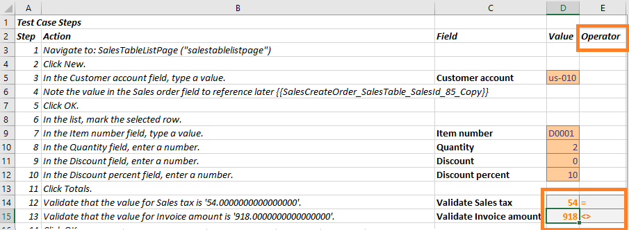

# Validate expected values

[!include [banner](../../includes/banner.md)]

An important component of a test case is validation of expected values. You can define validation parameters during the authoring of your test cases using Task Recorder. While recording, right-click on a control and select **CurrentValue** under the **Task Recorder > Validate** menu. This action becomes a validation step that you can use with the Regression suite automation tool. The control value will become a validation variable in the automatically generated Excel parameters file. The menu item is shown in the following image.

For more information about how to create task recordings, see [Task recorder resources](../../user-interface/task-recorder.md).

When RSAT generates the Excel parameter file for a test case, validation steps are added as shown in the image below. You can enter the expected value to use during execution of the test case.

## Validate expected values using operators

You can also use operators in validation steps to validate that a variable is not equal, less than, or greater than a specified value. To use this feature, open the **Settings** tab and select the **Optional** tab. Turn on the setting named **Use operators for validation**. This option is available as of RSAT version 1.210. If you have been using an older version of the tool, you must regenerate new Excel parameter files to take advantage of this functionality. In the Excel file, a new **Operator** field will appear, as shown in the following image.

## Validate the state of a control

When recording test cases, Task Recorder supports additional validation action:

+ Validate whether a control is enabled or disabled.
+ Validate whether a control is editable or read-only.

To take advantage of this validation, you need to be use a finance and operations app running on 10.0.13 (or newer) and RSAT 2.0 (or newer). For more information, see [Validate](../../user-interface/task-recorder.md#validate).

[!INCLUDE[footer-include](../../../../includes/footer-banner.md)]
