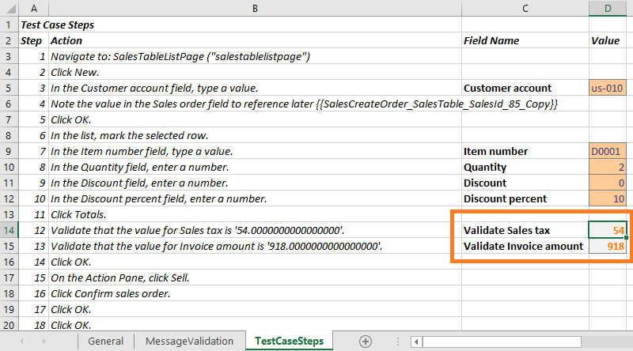

---
# required metadata

title: Validate expected values
description: This topic shows how to use the Regression suite automation for validation of expected values. 
author: robadawy
manager: AnnBe
ms.date: 08/01/2019
ms.topic: article
ms.prod: 
ms.service: dynamics-ax-platform
ms.technology: 

# optional metadata

# ms.search.form: 
# ROBOTS: 
audience: Developer
# ms.devlang: 
ms.reviewer: rhaertle
ms.search.scope: Operations
# ms.tgt_pltfrm: 
ms.custom: 21631
ms.search.region: Global
# ms.search.industry: 
ms.author: robadawy
ms.search.validFrom: 2019-08-01
ms.dyn365.ops.version: AX 7.0.0

---

# Validate expected values

[!include [banner](../../includes/banner.md)]

An important component of a test case is validation of expected values. You can define validation parameters during the authoring of your test cases using Task Recorder. While recording, right-click on a control and select **CurrentValue** under the **Task Recorder > Validate** menu. This action becomes a validation step that you can use with the Regression suite automation tool. The control value will become a validation variable in the automatically generated Excel parameters file. The menu item is shown in the following image.


 
For more information about how to create task recordings, see [Task recorder resources](../../user-interface/task-recorder.md).

When RSAT generates the Excel parameter file for a test case, validation steps are added as shown in the image below. You can enter the expected value to use during execution of the test case. 



## Validate expected values using operators

You can also use operators in your validation steps. To utilize this feature, you need to edit the config file named **Microsoft.Dynamics.RegressionSuite.WindowsApp.exe.config** in the Regression suite automation tool installation folder. Edit the file and modify the value of the **AddOperatorFieldsToExcelValidation** to **true**.

```Xml
<add key=" AddOperatorFieldsToExcelValidation" value="true" />
```

In previous versions of the Regression suite automation tool, you could only validate if a control value is equal to an expected value. This new feature allows you to validate that a variable is not equal, less than, or greater than a specified value.

If you have been using an older version of the tool, you will need to regenerate new Excel parameter files to take advantage of this functionality. In the Excel file, a new **Operator** field will appear, as shown in the following image.


