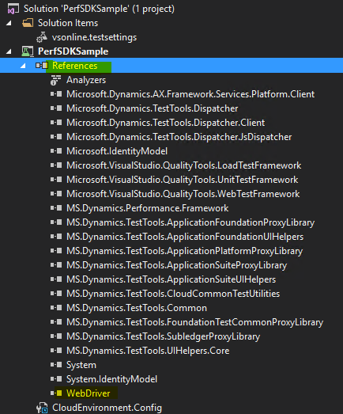

# Single-user testing using Performance SDK and Task recorder

[!include [banner](../includes/banner.md)]

Use the information in this topic to do single-user testing by using Visual Studio and the Performance software development kit (SDK) together with a performance test script that is generated by using Task recorder.

> [!IMPORTANT]
> Visual Studio 2019 will be the last version of Visual Studio with web performance and load test features.
> + If you are using the Visual Studio and Test Controller/Test Agent for on-premises load testing, Visual Studio 2019 will be the last version. You can continue using it until the end of the support cycle. 
> + For more information, see [Cloud-based load testing service end of life](https://devblogs.microsoft.com/devops/cloud-based-load-testing-service-eol/).

## Use Task recorder to define and record an end-to-end business scenario

Before you run a single-user test, you must work with your business team to define your end-to-end scenarios and then use Task recorder to create a recording of the steps in each scenario. For more information about how to create a task recording, see [Task recorder resources](../user-interface/task-recorder.md). The scenarios that you should test depend on your customer's business requirements. In this topic, you will use the "Create and confirm a sales order" sample scenario.

1. Sign in as a Sales persona.
2. Turn on Task recorder, and create and confirm a sales order that includes the following information:

    - Customer account
    - Item number
    - Sales quantity
    - Site
    - Warehouse
    - Sales price

3. When you've finished, select **Save as developer recording** to download the XML file.

## Configure a development environment

1. Download the [selenium-dotnet-strongnamed-3.13.1.zip](https://selenium-release.storage.googleapis.com/index.html?path=3.13/) and [IEDriverServer\_Win32\_3.13.0.zip](https://selenium-release.storage.googleapis.com/index.html?path=3.13/) files.
2. Unblock and unzip the files.
3. In the **dist** folder, rename the .nupkg files as .zip files, and then unzip them.

    | Original file name                          | New file name                             |
    |---------------------------------------------|-------------------------------------------|
    | Selenium.Support.StrongNamed.3.13.1.nupkg   | Selenium.Support.StrongNamed.3.13.1.zip   |
    | Selenium.WebDriver.StrongNamed.3.13.1.nupkg | Selenium.WebDriver.StrongNamed.3.13.1.zip |

4. Under your **PerfSDK** folder, create a folder that is named **Common\\External\\Selenium**.

    

5. Copy the following files, and save them to the folder **Common\\External\\Selenium** that you created in the previous step:

    - IEDriverServer.exe from the unzipped IEDriverServer\_Win32\_3.13.0.zip file
    - WebDriver.dll and WebDriver.xml from the lib\\net45 folder in the unzipped Selenium.WebDriver.StrongNamed.3.13.1.zip file
    - WebDriver.Support.dll and WebDriver.Support.xml from the lib\\net45 folder in the unzipped Selenium.Support.StrongNamed.3.13.1.zip file

## Generate a C\# performance test from Task recorder

When you've finished recording the end-to-end scenario, you must generate a C\# performance test script that is based the task recording. 

1. In a development environment, open Microsoft Visual Studio as an admin.
2. From your **PerfSDK** folder, open the **PerfSDKSample** solution. In a tier-1 sandbox or a cloud-hosted-environment, the PerfSDK folder is typically in \<Service volume\>:\\PerfSDK\\PerfSDKLocalDirectory.

    

3. Add a reference to the WebDriver.dll file in the Common\\External\\Selenium folder.

    

4. On the **Dynamics 365** menu, point to **Addins**, and then select **Create C\# perf test from recording**.
5. In the **Import Task Recording** dialog box, enter the following required details:

    - **Recording path** – The file location of the developer recording of your end-to-end scenario.
    - **Project path** – The location of the PerfSDKSample project. Typically, the path is \<Your\_PerfSDK\_Folder\>\\SampleProject\\PerfSDKSample\\PerfSDKSample.csproj.
    - **PerfSDK path** – The location of PerfSDK. Typically, the path is \<ServiceVolumeDrive\>\\PerfSDK\\PerfSDKLocalDirectory.
    
6. When you've finished, select **Import**. A new C\# class is created under the **Generated** folder of your PerfSDKSample project.

    

7. Build the solution.

## Run single-user testing by using Test Explorer in Visual Studio

1. Update the **CloudEnvironment.config** file of the PerfSDKSample project in the following ways, so that it reflects the configuration of your environment:

    - Verify that the **HostName** and **SOAPHostName** match your development environment.
    - Verify that the **UserName** for **SelfMintingAdminUser** matches the admin account of your development environment.
    - In each **AuthenticatorConfiguration** element under the **AuthenticatorConfigurationCollection** element, replace **AadAuthenticator** with **SelfMintedTokenAuthenticator**.
    - Comment out the **AzureActiveDirectoryConfiguration** and **KeyVaultConfigurations** elements.

    

2. In Visual Studio, on the **Test** menu, point to **Windows**, and then select **Test Explorer**.
3. Right-click your test case, and then select **Run selected tests**.

## Tips and tricks

Use the following tips and tricks for single-user testing that uses Task recorder and the Performance SDK:

- Run your business end-to-end scenario first before you capture it by using Task recorder.
- When you record your scenario by using Task recorder, enter values manually instead of selecting them in drop-down lists.
- Replay your task recording to make sure that everything works as you expect.
- Restart Visual Studio if you don't see your test case after the solution is built.

## Troubleshooting

For information about single-user or multi-user testing that uses the Performance SDK, see [Troubleshooting guide for single-user or multi-user testing with the Performance SDK](troubleshoot-perf-sdk-user-testing.md).

[!INCLUDE[footer-include](../../../includes/footer-banner.md)]
