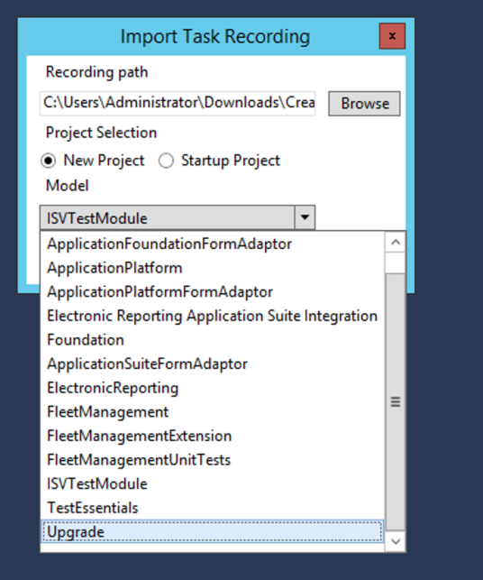

# Test projects in Visual Studio

[!include [banner](../includes/banner.md)]

This article describes the options for testing in Visual Studio.

A custom unit test adapter is available in Visual Studio. This adapter lets test authors use the standard **Test Explorer** window in Visual Studio to schedule X++ tests and analyze test results. Developers can author tests by using **SysTestAdaptor**. They can also generate test code from Task Recorder recordings. These test cases can then be added to build systems for validations. 

[](./media/1_support.png)

## Author unit/component test code by using the SysTest Framework
When you create a project in Visual Studio, you can add an X++ unit test. You extend the class with **SysTestCase**, and then either add the **SysTestMethodAttribute** attribute or prefix the case with "test" in the method name.

```xpp
class FMUnitTestSample extends SysTestCase
{
    [SysTestMethod]
    public void testTotalsEngineConfig()
    {
    }
}
```

After you save the class, each test appears in Test Explorer, just as a C\# test would appear. 

[](./media/2_support.png) 

In Test Explorer, you can run the tests, or you can debug the test case by right-clicking and running or debugging the selected tests. 

> [!NOTE]
> Before you can run tests, you must build the project so that it includes tests. 

[](./media/3_support.png) 

You can also discover existing tests for an object in your project. Discovery uses cross-reference data. Right-click an object in the project, and then select **Discover Related Tests**. This command queries the cross-reference data and returns any tests that reference the object. The list of test cases is displayed in Test Explorer. 

[](./media/4_support.png) 

By using this functionality, you can run all the relevant tests. Test Explorer contains all tests for the current project and all tests for the referenced objects.

## Generate test code by importing Task Recorder recordings into Visual Studio
You can import the XML for Task Recorder recordings to generate test code that can be used to validate various business process scenarios. 

[](./media/5_support.png) 

Generated code is based on the SysTest Framework and FormAdaptors. FormAdaptors are wrapper classes over pages. They provide strongly typed application programming interfaces (APIs) that can be used to test page functionality. Pre-generated FormAdaptors are included for each package for built-in pages. In a test module, add a reference to a corresponding FormAdaptor for packages and "Test Essentials," which contain helper methods to run test code.

## Advanced Options

For advanced options to categorize and filter tests for execution, see [SysTest Filtering using class and method attributes](systest-filtering.md).


[!INCLUDE[footer-include](../../../includes/footer-banner.md)]
