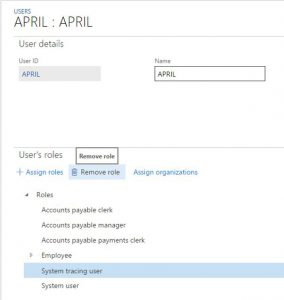

# Take traces by using Trace parser

[!include [banner](../includes/banner.md)]

This tutorial provides guidelines on how to take traces.

In this tutorial, you'll take a tour of how to collect and download traces. The trace analysis tool works largely similar to the Microsoft Dynamics AX 2012 version, but it is not backward compatible and can't be used to analyze AX 2012 traces. The trace parser tool can be found in the PerfSDK folder on your development deployments.

## Prerequisites

This tutorial requires that you access the environment as an administrator on the instance. The administrator can also grant rights to other users to take a trace. In this way, you can trace scenarios that can't be reproduced with administrative rights.

## Capture the trace

1. Before you trace make sure your scenario is in a warm state, meaning that you have run the scenario you want to trace once before you take the trace. Being in a warm state prevents things like metadata loading and other possible warm-up tasks from being in the trace.
2. In the navigation bar, select **Help**, and then select **Trace**. 
3. Name the trace that you are about to capture, and then select **Start trace**.
4. Perform actions that need to be analyzed, for example, opening **Accounts payable &gt; Vendors &gt; All vendors**.
5. When you are finished, select **Stop trace**. Then, you can select one of the following options (for this tutorial, select the second option):
    - **Download trace** – Store the captured trace on a local machine. You can analyze a downloaded trace with the desktop version of Trace Parser.

    > [!NOTE]
    > If you download a trace it will not be available for later uploading.

    - **Upload trace** – Store the trace in the cloud for later downloading by, for example, the admin, it will be automatically deleted after 7 days and can also be deleted manually from the captured traces form.

> [!NOTE]
> If your scenario takes more than 1-2 minutes it is better to try to take multiple smaller traces of 30 seconds each as the trace will likely get too big to be easily analyzed and there is a risk for losing data if the trace gets too big.

## Assign trace rights to user

1. To give a user rights to capture a trace, go to **System administration &gt; Users &gt; Users**.
2. Select the user and assign the **System tracing user** role. 

    

    Remove the user role again once the user is done with tracing to avoid unwanted tracing.

## Open captured trace

1. In the navigation bar, select **Help**, and then select **Trace**.
2. Select Captured traces.

    > [!NOTE]
    > The captured traces button can only be seen by users with administrative rights.

3. Select the trace name to download to open and analyze it with the desktop version of trace parser or
4. Select the user name to get to the user options.
5. Delete the trace if you want. You might do delete the trace if you have downloaded it.

> [!NOTE]
> The trace will be deleted after 7 days. For more information about the desktop version of trace parser, see [Diagnose issues and analyze performance by using Trace parser](trace-parser.md).

[!INCLUDE[footer-include](../../../includes/footer-banner.md)]
