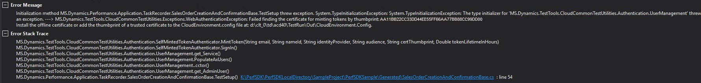
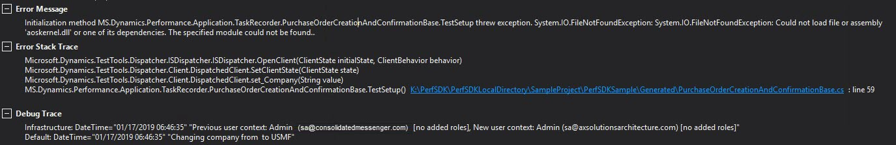
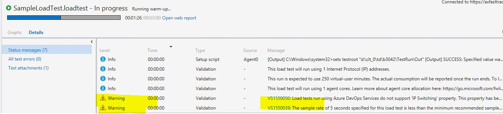

# Troubleshooting guide for testing with the Performance SDK

[!include [banner](../includes/banner.md)]

## No client was opened in the time-out period

This issue affects only single-user tests. When the test is running, a web client is opened, but a website is never loaded. Instead, there is an empty web client that has a white background. The following message appears at the top of the page, "This is the initial start page for the WebDriver server." The test eventually times out and fails, and an error message is shown.

### Error - No client was opened in the time-out period

> Initialization method \<Test class name\>.TestSetup threw an exception. System.TimeoutException: System.TimeoutException: No client was opened in the timeout period.

### Solution

See [Multi-user testing using the Performance SDK](perfsdk-multi-user-testing.md). That article explains how to create a correct certificate for this type of test. It also explains how to add the thumbprint of the certificate to the wif.config file.

## Zoom factor

This issue affects only single-user tests.

### Error - Zoom factor

> Initialization method \<Test class name\>.TestSetup threw exception. System.InvalidOperationException: System.InvalidOperationException: Unexpected error launching Internet Explorer. Browser zoom level was set to 200%. It should be set to 100% (NoSuchDriver).

### Solution - Zoom factor

In Internet Explorer, you can change the zoom factor to 100 percent by changing the following registry keys:

- Computer\\HKEY\_CURRENT\_USER\\SOFTWARE\\Microsoft\\Internet Explorer\\Zoom\\ResetZoomOnStartup = 0
- Computer\\HKEY\_CURRENT\_USER\\SOFTWARE\\Microsoft\\Internet Explorer\\Zoom\\ResetZoomOnStartup2 = 0
- Computer\\HKEY\_CURRENT\_USER\\SOFTWARE\\Microsoft\\Internet Explorer\\Zoom\\Zoomfactor = 80000

Depending on the version of the local machine that is used, before you start the Remote Desktop Protocol (RDP) session, you might have to select **Change the size of text, apps and other items**. This field is available in **Display settings** in Microsoft Windows.

If those steps don't work, change the size of your remote desktop before you start the RDP session, so that the default zoom level in Internet Explorer is 100 percent.

## Certificate thumbprint errors

### Error example - Certificate thumbprint errors

> Initialization method MS.Dynamics.Performance.Application.TaskRecorder.TestRecord1Base.TestSetup** threw an exception. System.TypeInitializationException: System.TypeInitializationException: The type initializer for 'MS.Dynamics.TestTools.CloudCommonTestUtilities.Authentication.UserManagement' threw an exception. --\> MS.Dynamics.TestTools.CloudCommonTestUtilities.Exceptions.WebAuthenticationException: Failed finding the certificate for minting tokens by thumbprint: b4f01d2fc42718198852cd23957fc60a3e4bca2e.

### Solution - Certificate thumbprint errors

You might receive the error message for one of the following reasons:

- The certificate thumbprint that you copied into the CloudEnvironment.Config and wif.config files includes invisible Unicode characters. To determine whether the thumbprint contains invisible Unicode characters, paste it into a Unicode code converter, and see whether extra characters appear in the **HTML/XML** field. For example, you can use the Unicode converter that is available at <https://r12a.github.io/apps/conversion/>.


- The certificate wasn't installed on the Application Object Server (AOS) machine. To verify that the certificate can be found on the AOS machine, run the following Microsoft Windows PowerShell script.

    ```Console
    cd Cert:\LocalMachine\My
    Get-ChildItem | Where-Object { $_.Subject -like "CN=<name of your certificate>" }
    ```

    If the thumbprint doesn't appear in the Windows PowerShell console after you run the script, the certificate isn't installed. To fix the issue, copy and install a .cer file on all AOS machines.

- If this issue occurs when you run load tests, the setup scripts might not have installed the corresponding .pfx file correctly. Verify that the password that is specified in the CloudCtuFakeACSInstall.cmd file matches the password that was set when the certificate was created.


## No endpoint is listening

This issue can occur when you run single-user or multi-user tests, or when you create users by using MS.Dynamics.Performance.CreateUsers.exe.

### Error example - No endpoint is listening

The tests fail, or the user creation process fails, and the following error message is shown:

> System.TypeInitializationException: The type initializer for 'MS.Dynamics.TestTools.CloudCommonTestUtilities.Authentication.UserManagement' threw an exception. ---\> System.ServiceModel.EndpointNotFoundException: There was no endpoint listening at \\\<web address\> that could accept the message. This is often caused by an incorrect address or SOAP action.

### Solution - No endpoint is listening

This issue occurs when the host that is specified in the CloudEnvironment.Config file can't be accessed from the machine that is trying to run the tests or create users.

In the CloudEnvironment.Config file, review the values that are specified by the following keys:

- \\\<ExecutionConfigurations Key="HostName" Value="\<web address of host\>" /\>
- \\\<ExecutionConfigurations Key="SoapHostName" Value="\<web address of SOAP\>" /\>

The web addresses that are specified by these keys must be in the environment that you're testing. In a web browser on your developer machine, make sure that you can open the web address that is specified by the **HostName** key.

For online load tests, the environment that is specified by the **HostName** key in the CloudEnvironment.Config file must be publicly accessible from any machine. Therefore, if you must test a one-box environment, you won't be able to run the load test by using Microsoft Visual Studio Online, because the endpoint won't be accessible outside the one-box environment.

## Users can't be enumerated

This issue can occur when you run multi-user tests, or when you create users by using MS.Dynamics.Performance.CreateUsers.exe.

### Error example - Users can't be enumerated

> System.TypeInitializationException: The type initializer for 'MS.Dynamics.TestTools.CloudCommonTestUtilities.Authentication.UserManagement' threw an exception. ---\> System.InvalidOperationException: Could not enumerate AX users ---\> System.ServiceModel.FaultException'1\[System.ComponentModel.Win32Exception\]: Forbidden

### Solution - Users can't be enumerated

Three scenarios can cause this error:

- The System Administrator role isn't assigned to the user who is specified as **SelfMintingAdminUser** in the CloudEnvironment.config file. To verify that you've specified the correct user, sign in to the endpoint, and view the user's roles.

  
- The user who is specified as **SelfMintingAdminUser** in the CloudEnvironment.config file has a provider other than `https://sts.windows-ppe.net/` or `https://sts.windows.net/`. Sometimes, a company-specific domain is included in the **Provider** field for the admin user.

- If your finance and operations apps were deployed in 21Vianet, make sure that you have specified **NetworkDomain="https://sts.chinacloudapi.cn/"** in **SelfMintingSysUser** and **SelfMintingAdminUser**.

To work around this issue, create a user who has any name and email address. Assign the **System Administrator** role to the new user. You don't have to link the user to a real Microsoft Microsoft Entra user. Specify this new admin user as **SelfMintingAdminUser** in the CloudEnvironment.config file.

## The HTTP request was forbidden with client authentication scheme 'Anonymous'

### Error example - The HTTP request was forbidden

> Initialization method \<Test class name\>.TestSetup threw exception. System.ServiceModel.Security.MessageSecurityException: System.ServiceModel.Security.MessageSecurityException: The HTTP request was forbidden with client authentication scheme 'Anonymous'. ---\> System.Net.WebException: The remote server returned an error: (403) Forbidden.

### Solution - The HTTP request was forbidden

Three known scenarios can cause this error:

- The test users are created by running MS.Dynamics.Performance.CreateUsers.exe without any arguments. For example, if the CreateUsers script is run without any arguments, the email addresses of test users that are created won't be correctly formatted. If these users are used to run the tests, the tests will generate the forbidden request error. You can verify that this scenario is causing the error by viewing the users. The incorrect email addresses of the test users will resemble the email addresses in the following illustration.


    To resolve the issue, delete the test users who have incorrectly formatted email addresses. Rerun the CreateUsers script, and specify the user count and company.

- The number of users that you specify in the **UserCount** field in the CloudEnvironment.Config file exceeds the number of test users that you created by using MS.Dynamics.Performance.CreateUsers.exe. Make sure that you created at least as many test users as you request in the CloudEnvironment.Config file.


- If your finance and operations apps were deployed in 21Vianet, make sure that your development and performance testing environments are in Platform Update for 10.0.11 or above.

## At least one security token in the message could not be validated

This issue can occur when you run multi-user tests, when you create users by using MS.Dynamics.Performance.CreateUsers.exe, when the AOS machine differs from the developer machine.

### Error example - At least one security token in the message could not be validated

> System.TypeInitializationException: The type initializer for 'MS.Dynamics.TestTools.CloudCommonTestUtilities.Authentication.UserManagement' threw an exception. ---\> System.ServiceModel.Security.MessageSecurityException: An unsecured or incorrectly secured fault was received from the other party. See the inner FaultException for the fault code and detail. ---\> System.ServiceModel.FaultException: At least one security token in the message could not be validated.

### Solution - At least one security token in the message could not be validated

This issue occurs when the AOS endpoint can't validate the thumbprint of the certificate that you created. There are two possible causes:

- The certificate wasn't installed on the AOS machine. To fix the issue, copy a .cer file to the AOS machine, and install it.
- The thumbprint of the certificate wasn't added to the wif.config file on the AOS machine. To fix the issue, add the certificate to the wif.config file. Be sure to restart Microsoft Internet Information Services (IIS) after you change the wif.config file.

## MS.Dynamics.Test.Team.Foundation.WebClient.InteractionService.dll.config is missing from the deployment items

This issue usually occurs when you run load tests.

### Error example - MS.Dynamics.Test.Team.Foundation.WebClient.InteractionService.dll.config is missing

> \<Test class name\>.TestSetup threw exception. System.InvalidOperationException: System.InvalidOperationException: Could not find endpoint element with name 'ClientCommunicationManager' and contract 'Microsoft.Dynamics.Client.InteractionService.Communication.Reliable.IReliableCommunicationManager' in the ServiceModel client configuration section. This might be because no configuration file was found for your application, or because no endpoint element matching this name could be found in the client element.. at System.ServiceModel.Description.ConfigLoader.LoadChannelBehaviors(ServiceEndpoint serviceEndpoint, String configurationName)

### Solution - MS.Dynamics.Test.Team.Foundation.WebClient.InteractionService.dll.config is missing

This issue occurs when the system can't find the MS.Dynamics.Test.Team.Foundation.WebClient.InteractionService.dll.config file when the load tests are run, because the file wasn't added as a deployment item. Verify that the MS.Dynamics.Test.Team.Foundation.WebClient.InteractionService.dll.config file is in the Out folder for the test run:

\<solution path\>\\TestResults\\\<your test run\>\\Out

If the file is missing, add it to the deployment items in the test settings.

There are two files that have very similar names. The name of one file ends in \*.dll, and the name of the other file ends in \*.dll.config. The \*.dll.config file must be in the deployment items in the test settings.

## CloudEnvironment.Config is missing from the deployment items

This issue usually occurs only when you run load tests.

### Error example - CloudEnvironment.Config is missing

> Initialization method \\\<Test class name\>.TestSetup threw exception.
System.TypeInitializationException: System.TypeInitializationException: The type initializer for 'MS.Dynamics.TestTools.CloudCommonTestUtilities.Authentication.UserManagement' threw an exception. ---\> MS.Dynamics.TestTools.TestLogging.EvaluateException: Assert.Fail failed. DateTime="10/13/2017 14:42:55" "The type initializer for 'MS.Dynamics.TestTools.CloudCommonTestUtilities.Authentication.SecretSettingsHelper' threw an exception.".

### Solution - CloudEnvironment.Config is missing

This issue occurs when the CloudEnvironment.Config file isn't present when the tests are run. It typically occurs when you run load tests and the CloudEnvironment.Config file wasn't added as a deployment item. Verify that the CloudEnvironment.Config file is in the Out folder for the test run:

\<solution path\>\\TestResults\\\<your test run\>\\Out

If the file is missing, add it to the deployment items in the test settings.

## InteractiveClientId was not specified in the settings

### Error example - InteractiveClientId was not specified in the settings

> The type initializer for 'MS.Dynamics.TestTools.CloudCommonTestUtilities.Authentication.SecretSettingsHelper' threw an exception. ---\>
Microsoft.CE.VaultSDK.SecretProviderException: InteractiveClientId was not specified in settings.

### Solution - InteractiveClientId was not specified in the settings

This issue occurs when the **SelfSigningCertificateThumbprint** field is left blank in the CloudEnvironment.Config file. In the CloudEnvironment.Config file, find the following line, and paste in the thumbprint of the certificate that you created and installed.

```xml
\<ExecutionConfigurations Key="SelfSigningCertificateThumbprint" Value="" />
```

## The remote host forcibly closed an existing connection

### Error example - The remote host forcibly closed an existing connection

> System.TypeInitializationException: System.TypeInitializationException: The type initializer for 'MS.Dynamics.TestTools.CloudCommonTestUtilities.Authentication.UserManagement' threw an exception. ---\> System.ServiceModel.CommunicationException: An error occurred while making the HTTP request to \\\<Host name\>/Services/AxUserManagement/Service.svc/ws2007FedHttp. This could be due to the fact that the server certificate is not configured properly with HTTP.SYS in the HTTPS case. This could also be caused by a mismatch of the security binding between the client and the server. ---\> System.Net.WebException: The underlying connection was closed: An unexpected error occurred on a send. ---\> System.IO.IOException: Unable to read data from the transport connection: An existing connection was forcibly closed by the remote host. ---\> System.Net.Sockets.SocketException: An existing connection was forcibly closed by the remote host.

### Solution - The remote host forcibly closed an existing connection

Run the following Windows PowerShell script on the development machine.

```powershell
Set-ItemProperty HKLM:\SOFTWARE\Microsoft\.NETFramework\v4.0.30319 -Name SchUseStrongCrypto -Value 1 -Type dword -Force -Confirm:$false
if ((Test-Path HKLM:\SOFTWARE\Wow6432Node\Microsoft\.NETFramework\v4.0.30319))
{
    Set-ItemProperty HKLM:\SOFTWARE\Wow6432Node\Microsoft\.NETFramework\v4.0.30319 -Name SchUseStrongCrypto -Value 1 -Type dword -Force -Confirm:$false
}
```

## Service w3svc was not found on computer

This error occurs only when you run load tests by using Visual Studio Online.

### Error example - Service w3svc was not found on computer

> Test method MS.Dynamics.Performance.Application.GFM.PDLTrend.ProcureToPayTrend.ProcureToPaymentTrend threw exception: System.TypeInitializationException: The type initializer for 'MS.Dynamics.TestTools.CloudCommonTestUtilities.Authentication.UserManagement' threw an exception. ---\> System.InvalidOperationException: Service w3svc was not found on computer '.'. ---\> System.ComponentModel.Win32Exception: The specified service does not exist as an installed service.

### Solution - Service w3svc was not found on computer

A hotfix is available that resolves this issue. The Microsoft Knowledge Base (KB) number is 4095640.

## The file IEDriverServer.exe does not exist

This issue affects only single-user tests.

### Error example - The file IEDriverServer.exe does not exist

> The file K:\\perfSDK\\PerfSDKLocalDirectory\\SampleProject\\TestResults\\Admin501201994c\_devae648d1909-1 2018-06-25 03\_40\_51\\Out\\Common\\External\\Selenium\\IEDriverServer.exe does not exist. The driver can be downloaded at `https://selenium-release.storage.googleapis.com/index.html`.

### Solution - The file IEDriverServer.exe does not exist

Copy the **Common\\External\\Selenium** folder under **\<Your\_PerfSDK\_Folder\>** to the **\<Your\_PerfSDK\_Folder>\\SampleProject\\ PerfSDKSample\\bin\\Debug** folder.

## Failed finding the certificate for minting tokens by thumbprint: \<your certificate thumbprint\>

### Error example - Failed finding the certificate for minting tokens by thumbprint

[](./media/troubleshoot-perf-sdk-07.jpg)

### Solution - Failed finding the certificate for minting tokens by thumbprint

Make sure that you install the generated certificate on each AOS machine in your sandbox environment.

## The action you are trying to perform requires a connection to Visual Studio Team Services

This issue affects only multi-user tests.

### Error example - The action you are trying to perform requires a connection to Visual Studio Team Services

[](./media/troubleshoot-perf-sdk-08.jpg)

### Solution - The action you are trying to perform requires a connection to Visual Studio Team Services

When you connect to Azure DevOps, use the old URI format (**\<Azure\_DevOps\_Account\>.visualstudio.com**) instead of **dev.azure.com/\<Azure\_DevOps\_Account\>**. Additionally, open Azure DevOps by using the old URI, and then select **Open in Visual Studio**.

## Could not load file or assembly 'aoskernel.dll' or one of its dependencies

This error affects only multi-user tests.

### Error example - Could not load file or assembly 'aoskernel.dll'

[](./media/troubleshoot-perf-sdk-09.jpg)

### Solution - Could not load file or assembly 'aoskernel.dll'

Make sure that you're using Open Database Connectivity (ODBC) Driver 17 in an environment that has Platform update 20 or later.

## AzureActiveDirectoryConfiguration node is missing in CloudEnvironment.config

### Error example - AzureActiveDirectoryConfiguration node is missing

> Initialization method MS.Dynamics.Performance.Application.TaskRecorder.SalesOrderCreationAndConfirmationBase.TestSetup threw exception. System.TypeInitializationException: System.TypeInitializationException: The type initializer for 'MS.Dynamics.TestTools.CloudCommonTestUtilities.Authentication.UserManagement' threw an exception. ---\> System.Reflection.TargetInvocationException: Exception has been thrown by the target of an invocation. ---\> System.MissingFieldException: AzureActiveDirectoryConfiguration node is missing in CloudEnvironment.config.

### Solution - AzureActiveDirectoryConfiguration node is missing

Replace all instances of **"MS.Dynamics.TestTools.CloudCommonTestUtilities.Authentication.AadAuthenticator"** with **"MS.Dynamics.TestTools.CloudCommonTestUtilities.Authentication.SelfMintedTokenAuthenticator"** in the **AuthenticatorConfigurationCollection** section of the CloudEnvironment.config file.

## Multiple warning messages before and after multi-user testing that uses Azure DevOps

### Error example - Multiple warning messages before and after multi-user testing




### Solution - Multiple warning messages before and after multi-user testing

There is no impact, and the messages can be ignored.

## The type or namespace name 'xxxx' could not be found (are you missing a using directive or an assembly reference?)

### Error example - The type or namespace name 'xxxx' could not be found

The type or namespace name 'InventTransferOrders' could not be found (are you missing a using directive or an assembly reference?)

### Solution - The type or namespace name 'xxxx' could not be found

The sample solution shipped with the perfSDK was previously prepared and wasn't updated after the packages split. To resolve the issue, add the assembly **MS.Dynamics.TestTools.DirectoryProxyLibrary.dll** under \<Service volume\>:\\PerfSDK\\PerfSDKLocalDirectory as a reference.

## Assembly was built against the ".NETFramework,Version=v4.6" framework

### Error example - Assembly was built against the ".NETFramework,Version=v4.6" framework

The primary reference "MS.Dynamics.TestTools.ApplicationSuiteProxyLibrary" could not be resolved because it has an indirect dependency on the assembly "MS.Dynamics.TestTools.DirectoryProxyLibrary, Version=7.0.0.0, Culture=neutral, PublicKeyToken=a7cf325ee2c8a9ff" which was built against the ".NETFramework,Version=v4.6" framework. This is a higher version than the currently targeted framework ".NETFramework,Version=v4.5".

### Solution- Assembly was built against the ".NETFramework,Version=v4.6" framework

Change the **Target framework** property in the properties window of PerfSDKSample to .Net Framework 4.6.


[!INCLUDE[footer-include](../../../includes/footer-banner.md)]
