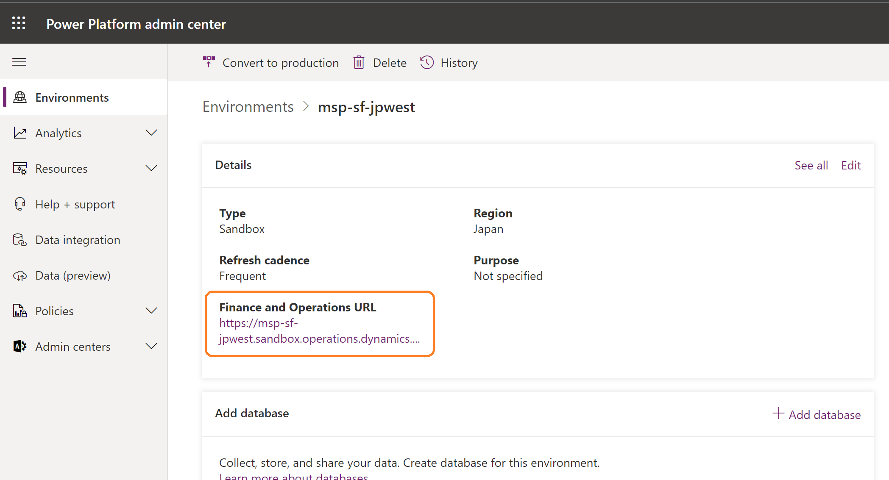
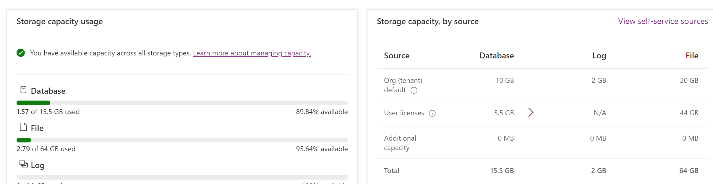
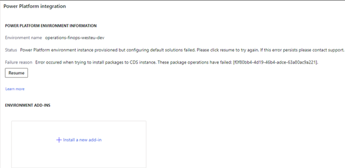

---
# required metadata

title: Enable Power Platform Integration
description: This article explains how to enable the Microsoft Power Platform integration by using Microsoft Dynamics Lifecycle Services for finance and operations apps and Dataverse.
ms.author: laswenka
author: laneswenka
ms.date: 05/02/2023
ms.topic: article
ms.prod:
ms.technology: 

# optional metadata

# ms.search.form:
audience: Developer, IT Pro
# ms.devlang: 
ms.reviewer: sericks
# ms.tgt_pltfrm: 
ms.collection: get-started
ms.search.region: Global
# ms.search.industry:
ms.search.validFrom: 2021-10-13
ms.dyn365.ops.version: 10.0.0
---
# Enable Power Platform Integration

[!include[banner](../includes/banner.md)]

As part of the One Dynamics, One Platform effort, a growing number of customers get value out of integrating their finance and operations apps with Microsoft Dataverse and the Microsoft Power Platform ecosystem. Whether it will be used to build low-code applications, or to fully integrate front-office and back-office processes and applications, the integration of these two systems has become a common requirement for many customers.

Power Platform Integration is a feature that's enabled in Microsoft Dynamics Lifecycle Services. It lets administrators link their finance and operations environments with new or existing Microsoft Power Platform–based environments. 

After Power Platform Integration is established, your organization can perform these actions:

* Create low-code apps and flows by using the Power Platform environment that's linked to finance and operations apps.
* Integrate finance and operations apps data with the Dataverse platform by using virtual tables, business events, and dual-write features.
* Install and connect other Dynamics 365 applications with your finance and operations apps.
* Install add-ins and connect them with your finance and operations apps.

To learn more about Power Platform Integration, watch our TechTalk on the [Microsoft Dynamics 365 Community](https://www.youtube.com/@MSD365Community) YouTube channel.

> [!VIDEO https://www.youtube.com/embed/HmJIuHhx3Hg]

## Initial Power Platform environment

By default, all finance and operations apps environments (sandbox and production) that are managed by Lifecycle Services will receive an initial Power Platform environment **without** Dataverse. This environment is linked to your finance and operations environment, as shown in the following illustration. The relationship is one to one. Over time, your finance and operations apps will be migrated to this location in Power Platform admin center. You can determine whether an environment in Power Platform admin center is linked to an environment from Lifecycle Services by looking at the finance and operations apps URL on the environment details page in Power Platform admin center.



The Power Platform environment that is connected to your environment in Lifecycle Services enables finance and operations apps customers to take advantage of Microsoft Power Platform. This Power Platform environment can't be deleted or reset, and a Dataverse database can't be manually added to it in Power Platform admin center. To add Dataverse and fully enable Microsoft Power Platform integration capabilities, follow the instructions in [Connect finance and operations apps with a new Microsoft Dataverse instance](./environment-lifecycle-connect-finops-new-dv.md).

Alternatively, your organization might already have a Power Platform environment with Dataverse that you want to connect to your finance and operations environment. To reuse an existing Dataverse instance, follow the instructions in [Connect finance and operations apps with an existing Microsoft Dataverse instance](./environment-lifecycle-connect-finops-existing-dv.md). In this case, the initial Power Platform environment that was created when your finance and operations environment was created is disconnected and will no longer show the finance and operations apps URL. At that point, the initial environment can be deleted or used for another purpose.

## Licensing and capacity considerations

When you purchase a license for any finance and operations app, such as Dynamics 365 Finance or Dynamics 365 Supply Chain Management, your tenant is entitled to an additional 10 gigabytes (GB) of Dataverse database capacity. In addition, for each user license that you purchased, you receive an incremental amount of database capacity, as shown in the following illustration from Power Portal admin center.



The same purchase of licenses entitles you to one self-service sandbox environment and production environment in Lifecycle Services. Because of this, an initial Power Platform environment can automatically be created for every finance and operations apps environment. Every initial environment in Power Platform admin center is without Dataverse. Therefore, it uses only 1 GB of database capacity to provision apps that are created by using Power Apps and flows that are created by using Power Automate. When you set up Power Platform integration, a Dataverse database is added to the same environment. This database often consumes 3 GB or more.

Additional add-on sandbox environments that customers purchase to use in Lifecycle Services do **not** entitle them to additional Dataverse database capacity. Customers who will require Power Platform integration capabilities should purchase add-on Dataverse database storage. For more information about how to manage capacity in Power Platform admin center, see [Free up storage space](/power-platform/admin/free-storage-space).

## Scenarios and core concepts

To learn the core concepts of Power Platform Integration and view a detailed list of supported scenarios, see [Environment lifecycle operations - Core concepts](./environment-lifecycle-core-concepts.md).

## Troubleshooting the setup

Setup can fail at various stages of the deployment of the Dataverse-based environment.

Anytime that the setup fails, an error message is shown. The following illustration shows an example of the error message for a dual-write setup failure.



Based on the error message, you might have to address licensing or capacity issues. After these issues have been fixed, you can select **Resume** in the **Power Platform integration** section of the **Environment details** page in Lifecycle Services to finish the setup.

## Enable the integration for cloud-hosted development environments

Because of the architecture differences between cloud-hosted development environments and the sandbox or production environments, Power Platform Integration can't be set up after the developer environment is created. Therefore, you can set up Power Platform Integration only during the deployment of your cloud-hosted environment. In addition, you can connect a new cloud-hosted environment only with a new Power Platform environment. You can't connect an existing environment of any type via Lifecycle Services.

## Verify Power Platform integration status at runtime

The `RetrieveFinanceAndOperationsIntegrationDetails` API is available in Dataverse to validate the status of the Power Platform integration for the Power Platform environment. If the Power Platform environment is linked to a finance and operations apps environment through the Power Platform integration, the API will return the Azure AD tenant and environment details of the finance and operations apps environment.

The API can be used during troubleshooting to verify that the Power Platform integration is enabled for an environment. We recommend that you also use the API when you code plug-ins, client forms, or other applications that must be aware of the finance and operations apps environment that's linked to the Power Platform environment.

**Request**
```http
GET [Organization URI]/api/data/v9.1/RetrieveFinanceAndOperationsIntegrationDetails
```

**Response**
```json
{
    "Url": "https://contoso.operations.dynamics.com",
    "TenantId": "72ad15fq-3m88-4e15-be25-8751c9bd0764",
    "Id": "b2106f5c-e218-4aac-841a-a59da4738eb4"
}
```

**Properties**

| Property<br>**Physical name**<br>***Type*** | Use | Description |
| --- | --- | --- |
| Environment URL<br>**Url**<br>***String*** | Read-only<br>Required | The URL of the finance and operations apps environment linked to the Power Platform environment through the Power Platform integration. |
| Tenant ID<br>**TenantId**<br>***GUID*** | Read-only<br>Required | The ID of the Azure AD tenant on which both the finance and operations apps environment and Power Platform environment are located. |
| Environment ID<br>**Id**<br>***GUID*** | Read-only<br>Required | The ID of the finance and operations apps environment linked to the Power Platform environment through the Power Platform integration. |

If the environment isn't linked to a finance and operations apps environment through the Power Platform integration, the following error is returned in the API response:

| Error code | Message |
| --- | --- |
| 0x80048d0b | Dataverse instance isn't integrated with finance and operations. |

[!INCLUDE[footer-include](../../../includes/footer-banner.md)]

