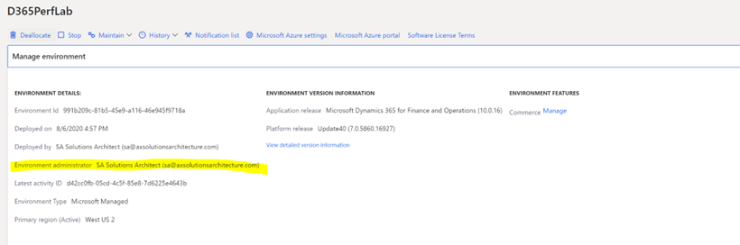
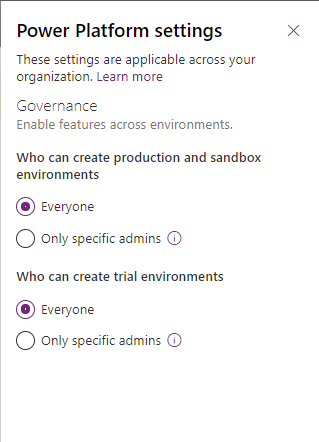
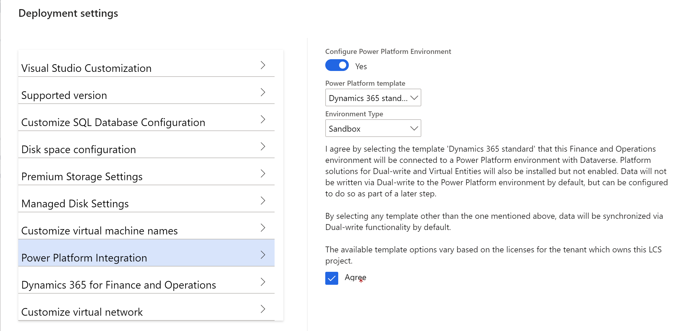

---
# required metadata

title: Enable the Microsoft Power Platform integration
description: This topic explains how to enable the Microsoft Power Platform integration by using Microsoft Dynamics Lifecycle Services (LCS) for Finance and Operations apps and Dataverse.
author: jaredha
ms.date: 04/11/2022
ms.topic: article
ms.prod:
ms.technology: 

# optional metadata

# ms.search.form:
audience: Developer, IT Pro
# ms.devlang: 
ms.reviewer: sericks
# ms.tgt_pltfrm: 
ms.custom: "intro-internal"
ms.search.region: Global
# ms.search.industry:
ms.author: jaredha
ms.search.validFrom: 2021-10-13
ms.dyn365.ops.version: 10.0.0
---
# Enable the Microsoft Power Platform integration

[!include[banner](../includes/banner.md)]


The integration of Finance and Operations apps with Microsoft Power Platform can be enabled when you create a new Finance and Operations apps environment in Microsoft Dynamics Lifecycle Services (LCS). Alternatively, Microsoft Power Platform can be enabled in an existing Finance and Operations apps environment. For both options, you must complete the setup prerequisites.

## Environment lifecycle considerations

By default, all Finance and Operations apps environments that are managed by LCS will receive a linked Power Platform environment without Dataverse. The relationship is one to one. Over time, your Finance and Operations apps will be migrated to this location. You can determine whether an environment is linked to an environment from LCS by looking at the Finance and Operations apps URL on the environment details page in the Power Platform admin center.

:::image type="content" source="media/LinkedPowerPlatformEnvironment.png" alt-text="Linked Power Platform environment":::

This environment can't be deleted or reset, and a Dataverse database can't be manually added to it. To add Dataverse and fully set up the Microsoft Power Platform integration, follow the steps later in this topic.

Alternatively, if you want to reuse an existing Dataverse environment for your Microsoft Power Platform integration scenarios (virtual entities, add-ins, dual-write functionality, and more), follow the instructions in [Set up dual-write for an existing Dataverse environment](../data-entities/dual-write/lcs-setup.md#set-up-dual-write-for-an-existing-dataverse-environment).

## Prerequisites for setting up the Microsoft Power Platform integration

The following list describes the prerequisites for setting up the Microsoft Power Platform integration.

- Make sure that at least one gigabyte (GB) of Microsoft Power Platform database storage capacity space is available for your tenant. If this space isn't available, the setup will fail. View your capacity in the [Power Platform admin center](https://admin.powerplatform.microsoft.com/resources/capacity). 

- Identify your Finance and Operations apps environment administrator. You can find that information in the **Environment details** section.

    

- Validate the governance policy of your Microsoft Power Platform environment. To do this validation, you must have either the **Global administrator** role or the **Power Platform administrator** role.

    1. Sign in to the [Power Platform admin center](https://admin.powerplatform.microsoft.com).
    2. Select **Settings** in the upper-right corner of the page to open the **Power Platform settings** pane.

        

- For organizations that **don't allow everyone** to create Microsoft Power Platform production environments, the Finance and Operations apps environment administrator account for your environment must be added to one of the following Microsoft Power Platform admin roles. To make this change, you must have the **Global administrator** role.

    - Global admins
    - Dynamics 365 admins
    - Microsoft Power Platform admins

    > [!NOTE]
    > The preceding roles might provide more permissions than the Finance and Operations apps environment administrator account requires. Therefore, a more limited role for this integration will eventually be added to Azure Active Directory (Azure AD). The new role won't require any of the preceding roles. If you want to keep the administrator that has the least privileges, you can temporarily grant one of the preceding roles. Then, after the Microsoft Power Platform integration is set up, remove that role.

- All users who create Microsoft Power Platform environments must be licensed. The Microsoft 365 admin center should be used to apply the **Dynamics 365 Unified Operations Plan** license, the **AX Enterprise** license, or an application-specific license such as **Dynamics 365 Finance** to the Finance and Operations apps environment administrator account.

## <a name="enable-during-deploy"></a>Enable integration during environment deployment

When you set up a new Finance and Operations apps environment in LCS, the deployment wizard includes several sections where you can set values. One of those sections is named **Power Platform Integration**.



Follow these steps to configure the **Power Platform Integration** section.

1. Set the **Configure Power Platform Environment** option to **Yes**. Several additional settings become available.
2. In the **Power Platform template** field, select one of the following values:

    - **Dynamics 365 Standard** – This basic template is applicable to all Finance and Operations apps environments. Select this value if you don't require a more specific template.
    - **Project Operations** – This template is specific to the Dynamics 365 Project Operations scenario. This value is available only if your tenant has licenses and entitlement for Project Operations.

3. If you're deploying a DevTest or cloud-hosted environment, the **Environment Type** field is available. There, you can select the type of Dataverse environment that is created and linked. Otherwise, by default, the environment type is set to **Sandbox** for Tier 2 through Tier 5 acceptance test environments and **Production** for production environments.
4. Select **Agree** to agree to the terms and conditions of the integration.

> [!IMPORTANT]
> The **language** and **currency** values of the Dataverse environment that is created and linked to your Finance and Operations apps environment are automatically determined, based on the physical address of your Azure AD tenant. For example, if the address is in Redmond, Washington, USA, the language will be English by default, and the currency will be US dollars (USD).
>
> If you require values that differ from the default values, contact Microsoft support. We can help link an existing Dataverse environment that you manually provision to the Finance and Operations apps environment. Eventually, fields for the language and currency will be added as setup options, so that you can manually set them or accept the default values.

## <a name="enable-after-deploy"></a>Enable integration after environment deployment

If the Microsoft Power Platform integration isn't enabled during deployment of the Finance and Operations apps environment, you can enable it in LCS after deployment. To do the setup after the Finance and Operations apps environment has been deployed, follow these steps.

1. After the Finance and Operations apps environment has been deployed through LCS, open the **Environment details** page in LCS.
2. In the **Power Platform integration** section, select **Setup**.

     

3. In the **Power Platform environment setup** dialog box, agree to the terms and conditions, and then select **Setup**.

    > [!NOTE]
    > A Dataverse-based environment will now be provisioned in the Power Platform admin center. The environment typically requires 1 GB of database storage capacity and will have the same name as your Finance and Operations apps environment. Dual-write platform-level components will be installed, but dual-write application components won't be set up or enabled. Those actions are separate.

4. When you receive a message that states that the Microsoft Power Platform environment is being provisioned, select **OK**.

    The **Power Platform integration** section of the **Environment details** page now shows a message that states that the Microsoft Power Platform environment is being provisioned.

5. After a few minutes, refresh the **Environment details** page.
6. In the **Power Platform integration** section, notice that the value of the **Status** field is **Environment setup is in progress**.

    Typically, the setup takes between 60 and 90 minutes.

    After the Dataverse environment is provisioned, the **Install a new add-in** and **Dual-write application** buttons become available in the **Power Platform integration** section.

    

    

> [!IMPORTANT]
> The **language** and **currency** values of the Dataverse environment that is created and linked to your Finance and Operations apps environment are automatically determined, based on the physical address of your Azure AD tenant. For example, if that address is in Redmond, Washington, USA, the language will be English by default, and the currency will be US dollars (USD).
>
> If you require values that differ from the default values, contact Microsoft support. We can help link an existing Dataverse environment that you manually provision to the Finance and Operations apps environment. Eventually, fields for the language and currency will be added as setup options, so that you can manually set them or accept the default values.

## Enable integration with an existing Power Platform environment

When you enable the Microsoft Power Platform integration for a Finance and Operations apps environment in LCS, either during or after deployment, the process creates a new Dataverse-enabled Power Platform environment and links the Finance and Operations apps environment to it. However, you might want to enable the integration by linking your Finance and Operations apps environment to an existing Power Platform environment instead of the environment that was automatically created during deployment. Currently, LCS doesn't let you select an existing Power Platform environment that you can use to enable the Microsoft Power Platform integration. However, this option will be available soon.

You can also connect Dataverse and a Finance and Operations apps environment in the following ways. These options aren't considered Microsoft Power Platform integration.

- **Dual-write** – The dual-write configuration lets you create a link to a Dataverse environment in any Power Platform environment on the tenant. We don't recommend that you connect dual-write to an environment other than your Microsoft Power Platform integration environment.
- **Virtual entities** – The virtual entity configuration in the Power Platform environment lets you select the Finance and Operations apps environment. We don't recommend that you connect virtual entities to an environment other than your Microsoft Power Platform integration environment.

If a Microsoft Power Platform integration environment is set up in LCS, but one of the other technologies (for example, dual-write) is connected to another instance, LCS detects the mismatch. It then shows a warning message that states this approach isn't recommended. If you haven't yet set up the Microsoft Power Platform integration from LCS, and you want to connect to an existing Dataverse-based Power Platform environment, follow the instructions in [Set up dual-write for an existing Dataverse environment](../data-entities/dual-write/lcs-setup.md#set-up-dual-write-for-an-existing-dataverse-environment).

### Finance and Operations apps connected to a single Microsoft Power Platform environment

If the Finance and Operations apps environment is configured with links to a single Microsoft Power Platform environment, these environments are identified as a one-to-one linking. For these environments, in Finance and Operations apps version 10.0.22 (Platform update 46) a one-to-one linked environment will automatically be updated to enable the full Microsoft Power Platform integration for the Finance and Operations apps environment. 

In version 10.0.22, you can verify that the Microsoft Power Platform integration was automatically enabled by viewing the **Power Platform Integration** section of the **Environment details** page for the Finance and Operations apps environment in LCS. If the integration was successfully enabled, the **Environment name** field will show the name of the integrated Microsoft Power Platform environment, and the **Status** field is set to **Setup completed successfully**.

> [!NOTE]
> The Microsoft Power Platform integration will automatically be enabled for Finance and Operations apps environments that are already connected to a single Microsoft Power Platform environment and that already use business events functionality. However, these environments won't be able to use the new business events and data events functionality starting in release 10.0.22. The business events endpoints that are already used in these environments will be migrated to the Dataverse platform in version 10.0.23. At that point, the new business events and data events functionality will become available in the environments. Until then, business events will continue to work as they are currently configured in the environment.
> 
> For more information about the new business events and data events functionality that will be delayed for these environments until the migration is completed, see [Finance and Operations business events in Dataverse](/dynamics365-release-plan/2021wave2/finance-operations/finance-operations-crossapp-capabilities/new-scenarios-enabled-power-platform-convergence#finance-and-operations-business-events-in-dataverse) and [Finance and Operations CUD events in Dataverse](/dynamics365-release-plan/2021wave2/finance-operations/finance-operations-crossapp-capabilities/new-scenarios-enabled-power-platform-convergence#finance-and-operations-cud-events-in-dataverse) in the 2021 release wave 2 plan. 

### Finance and Operations apps connected to multiple Microsoft Power Platform environments

If a Finance and Operations apps environment has been manually linked to multiple Microsoft Power Platform environments, the process of enabling the Microsoft Power Platform integration for the environment can't be automated. The system can't automatically determine to which Power Platform environment the Finance and Operations apps environment should be linked for the Power Platform integration.

There are two options to enable the Power Platform integration for a Finance and Operations environment that has links to multiple Power Platform environments:
- Reconfigure your dual-write and/or virtual entity solutions to link the Finance and Operations apps environment to the Power Platform environment created at deployment. When all links are configured for the single Power Platform environment, you can enable the Power Platform integration in LCS following the steps outlined in the [Enable integration after environment deployment](enable-power-platform-integration.md#enable-after-deploy) section above. This is the preferred solution because it can be managed without Microsoft support.
- To enable the Power Platform integration with a linked Power Platform environment other than the Power Platform environment created during deployment of the Finance and Operations environment, either work with your FastTrack solution architect or contact Microsoft Support to enable the Power Platform integration with a selected environment.

For more information about dual-write configuration options, see [Linking mismatch](../data-entities/dual-write/lcs-setup.md#linking-mismatch).

## Troubleshooting the setup

Setup can fail at various stages of the deployment of the Dataverse-based environment.

Any time that the setup fails, an error message is shown. The following illustration shows an example of the error message for a dual-write setup failure.


Based on the error message, you might have to address licensing or capacity issues. After these issues have been fixed, you can select **Resume** in the **Power Platform integration** section of the **Environment details** page in LCS to finish the setup.

## Enable the integration for cloud-hosted development environments

You can manually enable the Microsoft Power Platform integration for cloud-hosted development environments by completing the procedures in this section. For information about how to deploy cloud development environments, see [Deploy and access development environments](../dev-tools/access-instances.md).

### Register an application in the Azure portal

> [!IMPORTANT]
> The Azure AD application must be created on the same tenant as the Finance and Operations app.

1. Open the [Azure portal](https://portal.azure.com).
2. Go to **Azure Active Directory \> App registrations**.
3. Select **New registration**, and enter the following information:

    - **Name** – Enter a unique name.
    - **Account type** – Select **Accounts in any organizational directory (Any Azure AD directory - Multitenant)**.
    - **Redirect URI** – Leave this field blank.

4. Select **Register**.
5. Make a note of the **Application (client) ID** value. You will need this value later.
6. Create a symmetric key for the application.

    1. Select **Certificates & secrets** in the left navigation pane for the new app registration.
    2. Select **New client secret**.
    3. Enter a description and an expiration date.
    4. Select **Save**.
    5. Copy the key in the **Value** field that is created. You will need this key value later.
 
### Add the Azure AD application as a Microsoft Power Platform user

After the Azure AD application has been created in the Azure portal, it must be added as a Microsoft Power Platform application user. 

1. In the Power Platform admin center, create the application user by following the steps in [Create an application user](/power-platform/admin/manage-application-users#create-an-application-user).
2. In the step where you select security roles to add for the application user, select **Finance and Operations Integration User**.

### Grant app permissions in Finance and Operations apps

Dataverse will use the Azure AD application that you created to call Finance and Operations apps. Therefore, the application must be trusted by Finance and Operations apps and associated with a user account that has the appropriate rights.

1. In Finance and Operations apps, go to **System administration \> Setup \> Azure Active Directory applications**.
2. Select **New** to add a row to the grid, and enter the following information:

    - **Client ID** – Enter the **Application (client) ID** value of the Azure AD application that you created earlier.
    - **Name** – Enter **Dataverse Integration** (or another name that you will recognize for the integration).
    - **User ID** – Select **PowerPlatformApp**.

> [!NOTE]
> The **PowerPlatformApp** user that is available has the appropriate permissions for Dataverse integrations with Finance and Operations apps. However, if this user doesn't exist, or if you want to use a different application user account, you can create or use any other user that has the following roles: **Business events security role**, **Dataverse Virtual entity application**, **Dataverse Virtual entity anonymous user**, and **Dataverse Virtual entity authenticated user**.

### Configure Finance and Operations apps to use the Azure AD application to connect to Dataverse 

1. Sign in to the Finance and Operations environment through Remote Desktop Protocol (RDP).
2. Copy the following Windows PowerShell script, and save it to the virtual machine (VM) for the Finance and Operations environment as a .ps1 file.

    ```powershell
    param(
        [Parameter(Mandatory = $false)]
        [switch]$Relaunched
    )

    $isRelaunched = $false
    if ($PSBoundParameters.ContainsKey("Relaunched"))
    {
        $isRelaunched = $Relaunched.IsPresent
    }

    if (-not ([Security.Principal.WindowsPrincipal] [Security.Principal.WindowsIdentity]::GetCurrent()).IsInRole([Security.Principal.WindowsBuiltInRole]::Administrator))
    {
        # Relaunch as an elevated process:
        Start-Process powershell.exe "-File", ('"{0}"' -f $MyInvocation.MyCommand.Path), "-Relaunched" -Verb RunAs
        exit
    }

    $aosWebsiteName = "AOSService"

    function Get-AosWebSitePhysicalPath()
    {
        if (Get-Service W3SVC | Where-Object status -ne 'Running')
        {
            #IIS service is not running, starting IIS Service.
            Start-Service W3SVC
        }

        $webSitePhysicalPath = (Get-Website | Where-Object { $_.Name -eq $aosWebsiteName }).PhysicalPath

        return $webSitePhysicalPath
    }

    function Get-WebConfigValue($Key)
    {
        $webroot = Get-AosWebSitePhysicalPath
        $webConfigPath = Join-Path $webroot "web.config"
        if (-not (Test-Path $webConfigPath))
        {
            Throw "Unable to find web.config file at '$($webConfigPath)'..."
        }

        [xml]$webConfigDocument = Get-Content $webConfigPath -ErrorAction stop
        $appSettingNode = $webConfigDocument.SelectSingleNode("/configuration/appSettings/add[@key='$($Key)']")
        if ($appSettingNode)
        {
            return $appSettingNode.Value
        }

        return $null
    }

    function Set-WebConfigValue($Key, [string]$Value)
    {
        $webroot = Get-AosWebSitePhysicalPath
        $webConfigPath = Join-Path $webroot "web.config"
        if (-not (Test-Path $webConfigPath))
        {
            Throw "Unable to find web.config file at '$($webConfigPath)'..."
        }

        [xml]$webConfigDocument = Get-Content $webConfigPath -ErrorAction stop
        $appSettingNode = $webConfigDocument.SelectSingleNode("/configuration/appSettings/add[@key='$($Key)']")
        if ($null -ne $appSettingNode)
        {
            Write-Host "Updating key '$($Key)' to value '$($Value)'..."
            $appSettingNode.Value = [string]$Value
        }
        else
        {
            Write-Host "Inserting new key '$($Key)' with value '$($Value)'..."
            $ns = New-Object System.Xml.XmlNamespaceManager($webConfigDocument.NameTable)
            $ns.AddNamespace("ns", $webConfigDocument.DocumentElement.NamespaceURI)
            $addElement = $webConfigDocument.CreateElement("add")
            $addElement.SetAttribute("key", $Key)
            $addElement.SetAttribute("value", $Value)
            $appSettings = $webConfigDocument.SelectSingleNode("//ns:appSettings", $ns)
            $appSettings.AppendChild($addElement) | Out-Null
        }

        $webConfigDocument.Save($webConfigPath)
        Write-Host
    }

    function Confirm-ValueOfType($Value, $Type)
    {
        if ($Type -eq "Uri")
        {
            try
            {
                New-Object System.Uri $Value | Out-Null
            }
            catch
            {
                Throw "Cannot parse '$($Value)' as a URL: $($_)"
            }
        }
        elseif ($Type -eq "Guid")
        {
            try
            {
                [Guid]::Parse($Value) | Out-Null
            }
            catch
            {
                Throw "Cannot parse '$($Value)' as a guid: $($_)"
            }
        }
        elseif ($Type -eq "String")
        {
            if ([string]::IsNullOrEmpty($Value))
            {
                Throw "String value cannot be empty."
            }
        }
    }

    function Update-WebConfigValueFromHost($Key, $Prompt, $Type)
    {
        $shouldUpdate = $true
        $currentValue = Get-WebConfigValue -Key $Key
        if ($currentValue)
        {
            if ($Type -eq "Secret")
            {
                $currentValue = "<redacted>"
            }

            while ($true)
            {
                $yesNoResponse = Read-Host -Prompt "Value for '$($Prompt)' is already set to '$($currentValue)'. Do you want to overwrite it? (y/n)"
                if ($yesNoResponse -eq "y" -or $yesNoResponse -eq "yes")
                {
                    $shouldUpdate = $true
                    break
                }
                elseif ($yesNoResponse -eq "n" -or $yesNoResponse -eq "no")
                {
                    $shouldUpdate = $false
                    break
                }
                else
                {
                    Write-Host "Did not recognize input value '$($yesNoResponse)' - please try again."
                }
            }
        }

        if ($shouldUpdate)
        {
            $value = Read-Host -Prompt "Enter $($Prompt)"
            Confirm-ValueOfType -Value $value -Type $Type
            if ($Type -eq "Secret")
            {
                # If value is blank, assume we are trying to clear it
                $secretValue = ""
                if (-not [string]::IsNullOrEmpty($value))
                {
                    $webroot = Get-AosWebSitePhysicalPath -ErrorAction stop
                    $webrootBinPath = Join-Path $webroot "bin"
                    $b2bInvitationHelperDllPath = Join-Path $webrootBinPath "Microsoft.Dynamics.AX.Security.B2BInvitationHelper.dll"
                    Add-Type -Path $b2bInvitationHelperDllPath

                    $encryptionEngine = [Microsoft.Dynamics.AX.Security.B2BInvitationHelper.Cryptor]::GetEncryptionEngine()
                    $secretValue = [System.Convert]::ToBase64String($encryptionEngine.Encrypt($value))
                }

                $value = $secretValue
            }

            Set-WebConfigValue -Key $Key -Value $value
        }
    }

    function Enable-Flight($FlightName)
    {
        Write-Verbose "Enabling flight '$($FlightName)'..."
        $webroot = Get-AosWebSitePhysicalPath -ErrorAction stop
        $webrootBinPath = Join-Path $webroot "bin"
        $environmentDllPath = Join-Path $webrootBinPath 'Microsoft.Dynamics.ApplicationPlatform.Environment.dll'
        Add-Type -Path $environmentDllPath

        $config = [Microsoft.Dynamics.ApplicationPlatform.Environment.EnvironmentFactory]::GetApplicationEnvironment()

        $ServerName = $config.DataAccess.DbServer
        $DatabaseName = $config.DataAccess.Database
        $UserId = $config.DataAccess.SqlUser
        $Password = $config.DataAccess.SqlPwd
        $EnableFlightQuery = "DECLARE @flightName NVARCHAR(100) = '$($FlightName)';
        IF NOT EXISTS (SELECT TOP 1 1 FROM SysFlighting WHERE flightName = @flightName)
            INSERT INTO SYSFLIGHTING(FLIGHTNAME,ENABLED, FLIGHTSERVICEID, PARTITION)
            SELECT @flightName, 1, 12719367, RECID FROM DBO.[PARTITIONS];
        ELSE
            UPDATE SysFlighting SET enabled = 1, flightServiceId = 12719367 WHERE flightName = @flightName;"

        Invoke-Sqlcmd -ServerInstance $ServerName -Database $DatabaseName -Username $UserId -Password $Password -Query $EnableFlightQuery
        Write-Verbose "Flight '$($FlightName)' has been enabled."
    }

    function Test-Settings()
    {
        $cdsApiPath = "sdkmessages";
        Write-Host "Testing setup by calling API '$($cdsApiPath)'..."
        $webroot = Get-AosWebSitePhysicalPath -ErrorAction stop
        $webrootBinPath = Join-Path $webroot "bin"
        $httpCommunicationDllPath = Join-Path $webrootBinPath "Microsoft.Dynamics.HttpCommunication.dll"
        Add-Type -Path $httpCommunicationDllPath

        try
        {
            $assembly = [System.Reflection.Assembly]::LoadFile($httpCommunicationDllPath)
            $loggerType = $assembly.GetType("Microsoft.Dynamics.HttpCommunication.Logging.InMemoryLogger")
            $bindingFlags = [System.Reflection.BindingFlags]::Instance -bor [System.Reflection.BindingFlags]::Public
            $loggerConstructor = $loggerType.GetConstructor($bindingFlags, $null, [System.Type]::EmptyTypes, $null)
            $logger = $loggerConstructor.Invoke($null)

            $cdsWebApiClient = New-Object Microsoft.Dynamics.HttpCommunication.Cds.CdsWebApiClient $logger;
            $bindingFlags = [System.Reflection.BindingFlags]::Instance -bor [System.Reflection.BindingFlags]::NonPublic
            $method = [Microsoft.Dynamics.HttpCommunication.Cds.CdsWebApiClient].GetMethod("GetWithStringResponse", $bindingFlags, $null, @([string]), $null)
            $task = $method.Invoke($cdsWebApiClient, @($cdsApiPath))
            $response = $task.GetAwaiter().GetResult()

            Write-Host $logger.LogContent.ToString()
            Write-Host "Received response with length: $($response.Length)" 
            Write-Host "Test complete."
        }
        catch
        {
            Write-Verbose $logger.LogContent.ToString()
            Throw "Failed while testing the new settings: $($_)"
        }
    }

    try
    {
        Update-WebConfigValueFromHost -Key "Infrastructure.CdsOrganizationUrl" -Prompt "Dataverse Organization URL" -Type "Uri"
        Update-WebConfigValueFromHost -Key "Infrastructure.CdsOrganizationId" -Prompt "Dataverse Organization id" -Type "Guid"
        Update-WebConfigValueFromHost -Key "Infrastructure.DataverseCommunicationAadTenantId" -Prompt "Dataverse AAD Tenant domain (e.g. Contoso.OnMicrosoft.com)" -Type "String"
        Update-WebConfigValueFromHost -Key "Infrastructure.DataverseCommunicationAppId" -Prompt "Dataverse AAD App id" -Type "Guid"
        Update-WebConfigValueFromHost -Key "Infrastructure.DataverseCommunicationAppSecretEncrypted" -Prompt "Dataverse AAD App secret" -Type "Secret"

        Enable-Flight -FlightName "BusinessEventsCDSIntegration"

        Write-Host "Restarting AOS..."
        Stop-Website -Name $aosWebSiteName
        Start-Website -Name $aosWebSiteName
        Write-Host "AOS has been restarted."

        Test-Settings
    }
    catch
    {
        Write-Error $_
    }

    if ($isRelaunched)
    {
        Write-Host "Press any key to continue..."
        [System.Console]::ReadKey() | Out-Null
    }

    ```

3. Run the script in Windows PowerShell, and follow the instructions. You will enter the following information:

    - **Dataverse Organization URL** – Enter the URL that is used to access Dataverse. For example, enter `https://contoso.crm.dynamics.com`. You can find this URL in the **Environment URL** field in the **Details** section of the environment details in the Power Platform admin center.
    - **Dataverse Organization ID** – You can find this ID in the **Organization ID** field in the **Details** section of the environment details in the Power Platform admin center.
    - **Dataverse AAD Tenant domain** – Enter the primary domain of the Azure AD tenant that is used by Dataverse. You can find this domain in the **Domain** field for the directory on the **Portal settings** page in the [Azure portal](https://portal.azure.com). Typically, it's also the domain segment of the administrator's email address. For example, if the email address is `admin@contoso.onmicrosoft.com`, the domain is `contoso.onmicrosoft.com`.
    - **Dataverse AAD app ID** – Enter the **Application (client) ID** value of the Azure AD application that you created earlier.
    - **Dataverse AAD app secret** – Enter the secret key value that was created earlier for the Azure AD apps.

## Verifying Power Platform integration status

The ```RetrieveFinanceAndOperationsIntegrationDetails``` API is available to validate the status of the Power Platform integration for the Power Platform environment. If the Power Platform environment is linked to a Finance and Operations apps environment through the Power Platform integration, the API will return the AAD tenant and environment details of the Finance and Operations apps environment.

The API can be used in troubleshooting to verify that the Power Platform integration is enabled for an environment. It is also recommended that the API be used in coding plug-ins, client forms, or other applications that must be aware of the Finance and Operations apps environment linked to the Power Platform environment.

**Request**
```http
GET [Organization URI]/api/data/v9.1/RetrieveFinanceAndOperationsIntegrationDetails
```

**Response**
```json
{
    "Url": "https://contoso.operations.dynamics.com",
    "TenantId": "72ad15fq-3m88-4e15-be25-8751c9bd0764",
    "Id": "b2106f5c-e218-4aac-841a-a59da4738eb4"
}
```

**Properties**

| Property<br>**Physical name**<br>***Type*** | Use | Description |
| --- | --- | --- |
| Environment URL<br>**Url**<br>***String*** | Read-only<br>Required | The URL of the Finance and Operations apps environment linked to the Power Platform environment through the Power Platform integration. |
| Tenant ID<br>**TenantId**<br>***GUID*** | Read-only<br>Required | The ID of the Azure Active Directory (AAD) tenant on which both the Finance and Operations apps environment and Power Platform environment are located. |
| Environment ID<br>**Id**<br>***GUID*** | Read-only<br>Required | The ID of the Finance and Operations apps environment linked to the Power Platform environment through the Power Platform integration. |

If the environment is not linked to a Finance and Operations apps environment through the Power Platform integration, the following error is returned in the API response:

| Error code | Message |
| --- | --- |
| 0x80048d0b | Dataverse environment is not integrated with Finance and Operations. |

[!INCLUDE[footer-include](../../../includes/footer-banner.md)]
