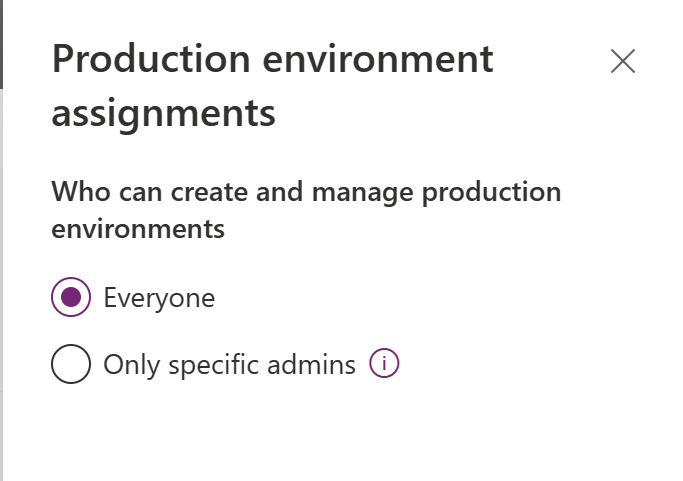
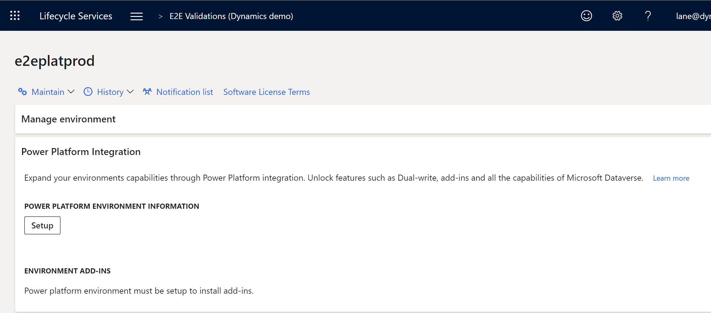
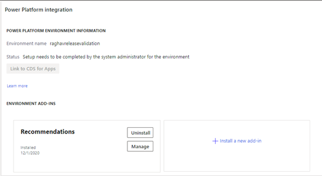
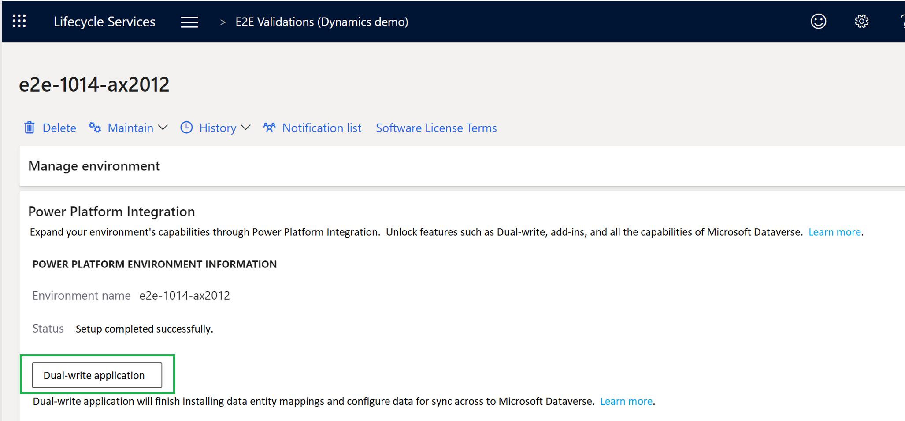
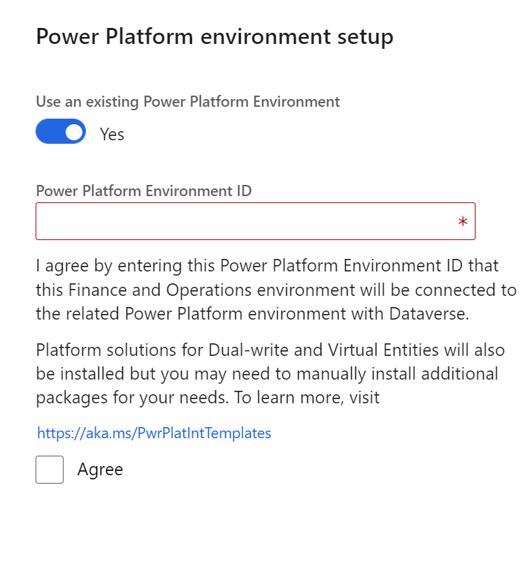
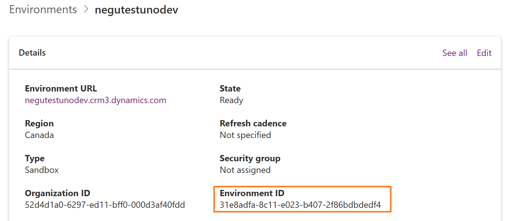

---
# required metadata

title: Enable Power Platform Integration
description: This article explains how to enable the Microsoft Power Platform integration by using Microsoft Dynamics Lifecycle Services for finance and operations apps and Dataverse.
ms.author: laswenka
author: laneswenka
ms.date: 02/07/2023
ms.topic: article
ms.prod:
ms.technology: 

# optional metadata

# ms.search.form:
audience: Developer, IT Pro
# ms.devlang: 
ms.reviewer: sericks
# ms.tgt_pltfrm: 
ms.custom: "intro-internal"
ms.search.region: Global
# ms.search.industry:
ms.search.validFrom: 2021-10-13
ms.dyn365.ops.version: 10.0.0
---
# Enable Power Platform Integration

[!include[banner](../includes/banner.md)]

As part of the One Dynamics, One Platform effort, a growing number of customers get value out of integrating their finance and operations apps with Microsoft Dataverse and the Microsoft Power Platform ecosystem. Whether it will be used to build low-code applications, or to fully integrate front-office and back-office processes and applications, the integration of these two systems has become a common requirement for many customers.

Power Platform Integration is a feature that's enabled in Microsoft Dynamics Lifecycle Services. It lets administrators link their finance and operations environments with new or existing Microsoft Power Platform–based environments. 

After Power Platform Integration is established, your organization can perform these actions:

* Create low-code apps and flows by using the Power Platform environment that's linked to finance and operations apps.
* Integrate finance and operations apps data with the Dataverse platform by using virtual tables, business events, and dual-write features.
* Install and connect other Dynamics 365 applications with your finance and operations apps.
* Install add-ins and connect them with your finance and operations apps.

To learn more about Power Platform Integration, watch our TechTalk on the [Microsoft Dynamics 365 Community](https://www.youtube.com/watch?v=HmJIuHhx3Hg) YouTube channel.

> [!VIDEO https://www.youtube.com/embed/HmJIuHhx3Hg]

## Initial Power Platform environment

By default, all finance and operations apps environments (sandbox and production) that are managed by Lifecycle Services will receive an initial Power Platform environment **without** Dataverse. This environment is linked to your finance and operations environment, as shown in the following illustration. The relationship is one to one. Over time, your finance and operations apps will be migrated to this location in Power Platform admin center. You can determine whether an environment in Power Platform admin center is linked to an environment from Lifecycle Services by looking at the finance and operations apps URL on the environment details page in Power Platform admin center.


The Power Platform environment that is connected to your environment in Lifecycle Services enables finance and operations apps customers to take advantage of Microsoft Power Platform. This Power Platform environment can't be deleted or reset, and a Dataverse database can't be manually added to it in Power Platform admin center. To add Dataverse and fully enable Microsoft Power Platform integration capabilities, follow the instructions in the [Enable integration with an existing Power Platform environment](#connect-to-existing-dataverse) section of this article.

Alternatively, your organization might already have a Power Platform environment with Dataverse that you want to connect to your finance and operations environment. To reuse an existing Dataverse instance, follow the instructions in [Enable integration with an existing Power Platform environment](#connect-to-existing-dataverse). In this case, the initial Power Platform environment that was created when your finance and operations environment was created is disconnected and will no longer show the finance and operations apps URL. At that point, the initial environment can be deleted or used for another purpose.

## Licensing and capacity considerations

When you purchase a license for any finance and operations app, such as Dynamics 365 Finance or Dynamics 365 Supply Chain Management, your tenant is entitled to an additional 10 gigabytes (GB) of Dataverse database capacity. In addition, for each user license that you purchased, you receive an incremental amount of database capacity, as shown in the following illustration from Power Portal admin center.


The same purchase of licenses entitles you to one self-service sandbox environment and production environment in Lifecycle Services. Because of this, an initial Power Platform environment can automatically be created for every finance and operations apps environment. Every initial environment in Power Platform admin center is without Dataverse. Therefore, it uses only 1 GB of database capacity to provision apps that are created by using Power Apps and flows that are created by using Power Automate. When you set up Power Platform integration, a Dataverse database is added to the same environment. This database often consumes 3 GB or more.

Additional add-on sandbox environments that customers purchase to use in Lifecycle Services do **not** entitle them to additional Dataverse database capacity. Customers who will require Power Platform integration capabilities should purchase add-on Dataverse database storage. For more information about how to manage capacity in Power Platform admin center, see [Free up storage space](/power-platform/admin/free-storage-space).

## Provisioning templates

In several of the scenarios that are described in this article, you can create a brand-new Power Platform environment with Dataverse. To help you quickly add all the applications that are required for your new instance, we have prepared several provisioning templates that bundle them together. The following table provides details about these templates.

| Template name | Description | Apps included |
|---------------|-------------|---------------|
| Dynamics 365 Standard | This basic template prepares all the platform components for business events, virtual tables, dual-write functionality, and add-in support. Dual-write isn't enabled and won't automatically sync data when this template is selected. Select this template if you don't require a more specific template. | MicrosoftOperationsVEAnchor, DualWriteCoreAnchor, MsDynCE_CRMHub, MsDyn_FnOIntegrationMDLApp_Anchor |
| Dynamics 365 Standard with dual-write | This template is the same as **Dynamics 365 Standard**, but it includes all the applications that are required for dual-write, so that you can quickly enable that feature after environment deployment. | MicrosoftOperationsVEAnchor, DualWriteCoreAnchor, MsDynCE_CRMHub, MsDyn_FnOIntegrationMDLApp_Anchor, MsDyn_DualWriteAppCoreAnchor |
| Project Operations | This template is specific to the Dynamics 365 Project Operations scenario. It's available only if your tenant has licenses and entitlement for Project Operations. | MicrosoftOperationsVEAnchor, Dynamics365FinanceAndOperationsAnchor, ProjectOperations_Anchor |

## Prerequisites for setting up the Microsoft Power Platform integration

The following list describes the prerequisites for setting up the Microsoft Power Platform integration.

- Make sure that at least 1 GB of Microsoft Power Platform database storage capacity space is available for your tenant. If this space isn't available, the setup will fail. View your capacity in the [Power Platform admin center](https://admin.powerplatform.microsoft.com/resources/capacity). 

- Validate the governance policy of your tenant in Power Platform admin center. To do this validation, you must have either the **Global administrator** role or the **Power Platform administrator** role.

    1. Sign in to the [Power Platform admin center](https://admin.powerplatform.microsoft.com).
    2. Select **Settings** in the left navigation to open the **Power Platform settings** page.

        

- For organizations that **don't allow everyone** to create Microsoft Power Platform environments, the user who does the setup in Lifecycle Services must be added to one of the following roles in Azure Active Directory (Azure AD). To make this change, you must be assigned to the **Global administrator** role.

    - Dynamics 365 Service Admin
    - Power Platform Admin

-The user who does the setup in Lifecycle Services must be licensed. The Microsoft 365 admin center should be used to apply the **Dynamics 365 Unified Operations Plan** license, the **AX Enterprise** license, or an application-specific license, such as **Dynamics 365 Finance**.

## <a name="enable-during-deploy"></a>Enable integration during environment deployment

> [!IMPORTANT]
> This experience is now deprecated and will soon be disabled during the creation of new sandbox or production environments in Lifecycle Services. The recommended approach is to do the Power Platform Integration setup after the finance and operations apps environment is deployed.
>
> Power Platform integration is **irreversible**, and the link can't be changed or removed. As part of the setup, you connect your finance and operations environment to a Power Platform environment. Runtime features such as virtual entities, business events, and dual-write all depend on this connection. Therefore, it can't be removed until you delete the finance and operations environment. This behavior resembles the behavior when you apply a service update from Microsoft. The only way to redo this action is to redeploy the environment.

## <a name="enable-after-deploy"></a>Enable integration after environment deployment

The setup for Power Platform Integration should be done after the finance and operations apps environment has been created and deployed. From the environment details page, you can choose to connect your environment in Lifecycle Services to either a new Power Platform environment or an existing one.

> [!IMPORTANT]
> Power Platform integration is **irreversible**, and the link can't be changed or removed. As part of the setup, you connect your finance and operations environment to a Power Platform environment. Runtime features such as virtual entities, business events, and dual-write all depend on this connection. Therefore, it can't be removed until you delete the finance and operations environment. This behavior resembles the behavior when you apply a service update from Microsoft. The only way to redo this action is to redeploy the environment.

1. After the finance and operations apps environment has been deployed through Lifecycle Services, open the **Environment details** page in Lifecycle Services.
2. In the **Power Platform integration** section, select **Setup**. *If you want to connect to an existing Dataverse organization, see the next section of this article.*

     

3. In the **Power Platform environment setup** dialog box, agree to the terms and conditions, and then select **Setup**.

    > [!NOTE]
    > Based on the template that's selected, a related Dataverse database will be added to your initial Power Platform environment.  The language and currency values in Dataverse will be entered by default, based on your Azure AD tenant's physical address. For example, if your physical address is in Seattle, Washington, your language will be **en-us** by default, and your currency will be **USD**.  If you want to use different values, you can manually create your Power Platform environment in Power Platform admin center and then follow the instructions to link to an existing Power Platform environment.

4. When you receive a message that states that the Microsoft Power Platform environment is being provisioned, select **OK**.

    The **Power Platform integration** section of the **Environment details** page now shows a message that states that the Microsoft Power Platform environment is being provisioned.

5. After a few minutes, refresh the **Environment details** page.
6. In the **Power Platform integration** section, notice that the value of the **Status** field is **Environment setup is in progress**.

    Typically, the setup takes between 60 and 90 minutes.

    After the Dataverse instance is provisioned, the **Install a new add-in** and **Dual-write application** buttons become available in the **Power Platform integration** section.

    

    

After you complete the setup, the only way to reverse the action is to delete the environment in Lifecycle Services. Relinking or linking to another environment isn't supported.

### <a name="connect-to-existing-dataverse"></a>Enable integration with an existing Power Platform environment

If you already have a Dataverse instance that you want to connect to a finance and operations environment, you can choose this option during the Power Platform Integration setup. 



To retrieve the Power Platform environment ID, you can visit the environment details page for the environment in Power Platform admin center.



During the integration process, Microsoft will apply the packages for the **Dynamics 365 standard** provisioning template. If you require packages from the other templates, you must manually install. For more information, see the [Provisioning templates](#provisioning-templates) section of this article.

Customers who are already live with Power Platform environments or other Dynamics 365 apps, and who want to add finance and operations apps to that ecosystem, will find it most useful to bring their existing Dataverse instance. For the integration, you use the same setup process that is described earlier for a new Dataverse database in the initial environment. After you complete the integration setup, the only way to reverse the action is to delete the environment in Lifecycle Services. Relinking or linking to another environment isn't supported.

#### Validations for bringing your existing Power Platform environment

If you connect an existing Power Platform environment, the following validations must pass. Otherwise, the request won't proceed.

1. The **Enable D365 apps** option must be enabled when Dataverse is deployed in the Power Platform environment. This type of Dataverse deployment is the only type that supports Dynamics 365 apps, including connections to finance and operations apps.
2. The Power Platform environment must be in the same geography as finance and operations apps. For example, in Lifecycle Services, you might see an Azure Region such as **West US 2**. In Microsoft Power Platform, the environment should be deployed in **United States**. This requirement is in place for performance and data residency reasons.
3. The user in Lifecycle Services who is doing the Power Platform integration setup must be an administrator of the environment in Dataverse, and must have an applicable Finance, Supply Chain Management, or Commerce license assigned. Note that if the **System Administrator** role was just assigned, the cache can take up to an hour to be refreshed. You can't do the setup via Lifecycle Services until the refresh is completed.

### Environments that already use dual-write, virtual tables, business events, or add-ins before Power Platform integration is enabled

For customers who enabled dual-write, virtual tables, or business events before the Power Platform Integration feature existed, we are in the process of automatically creating Dataverse where it's missing in Lifecycle Services.

You can verify that the Microsoft Power Platform integration was automatically enabled by reviewing the **Power Platform Integration** section of the **Environment details** page for the finance and operations apps environment in Lifecycle Services. If the integration was successfully enabled, the **Environment name** field will show the name of the integrated Microsoft Power Platform environment, and the **Status** field will be set to **Setup completed successfully**.

## Troubleshooting the setup

Setup can fail at various stages of the deployment of the Dataverse-based environment.

Anytime that the setup fails, an error message is shown. The following illustration shows an example of the error message for a dual-write setup failure.


Based on the error message, you might have to address licensing or capacity issues. After these issues have been fixed, you can select **Resume** in the **Power Platform integration** section of the **Environment details** page in Lifecycle Services to finish the setup.

## Enable the integration for cloud-hosted development environments

Because of the architecture differences between cloud-hosted development environments and the sandbox or production environments, Power Platform Integration can't be set up after the developer environment is created. Therefore, you can set up Power Platform Integration only during the deployment of your cloud-hosted environment. In addition, you can connect a new cloud-hosted environment only with a new Power Platform environment. You can't connect an existing environment of any type via Lifecycle Services.

## Verify Power Platform integration status at runtime

The `RetrieveFinanceAndOperationsIntegrationDetails` API is available in Dataverse to validate the status of the Power Platform integration for the Power Platform environment. If the Power Platform environment is linked to a finance and operations apps environment through the Power Platform integration, the API will return the Azure AD tenant and environment details of the finance and operations apps environment.

The API can be used during troubleshooting to verify that the Power Platform integration is enabled for an environment. We recommend that you also use the API when you code plug-ins, client forms, or other applications that must be aware of the finance and operations apps environment that's linked to the Power Platform environment.

**Request**
```http
GET [Organization URI]/api/data/v9.1/RetrieveFinanceAndOperationsIntegrationDetails
```

**Response**
```json
{
    "Url": "https://contoso.operations.dynamics.com",
    "TenantId": "72ad15fq-3m88-4e15-be25-8751c9bd0764",
    "Id": "b2106f5c-e218-4aac-841a-a59da4738eb4"
}
```

**Properties**

| Property<br>**Physical name**<br>***Type*** | Use | Description |
| --- | --- | --- |
| Environment URL<br>**Url**<br>***String*** | Read-only<br>Required | The URL of the finance and operations apps environment linked to the Power Platform environment through the Power Platform integration. |
| Tenant ID<br>**TenantId**<br>***GUID*** | Read-only<br>Required | The ID of the Azure AD tenant on which both the finance and operations apps environment and Power Platform environment are located. |
| Environment ID<br>**Id**<br>***GUID*** | Read-only<br>Required | The ID of the finance and operations apps environment linked to the Power Platform environment through the Power Platform integration. |

If the environment isn't linked to a finance and operations apps environment through the Power Platform integration, the following error is returned in the API response:

| Error code | Message |
| --- | --- |
| 0x80048d0b | Dataverse instance isn't integrated with finance and operations. |

[!INCLUDE[footer-include](../../../includes/footer-banner.md)]

