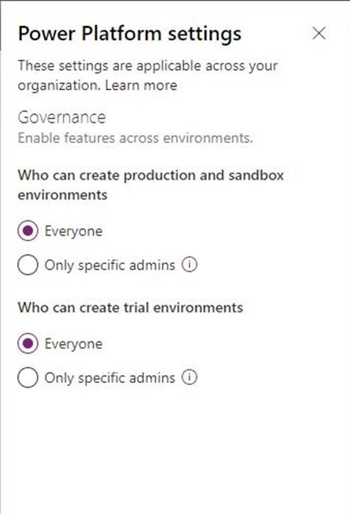

---
# required metadata

title: Enabling the Microsoft Power Platform Integration
description: This topic provides information and guidance for enabling the Microsoft Power Platform integration via Microsoft Dynamics Lifecycle Services for Finance and Operations apps and Microsoft Dataverse.
author: jaredha
ms.date: 05/20/2021
ms.topic: article
ms.prod:
ms.technology: 

# optional metadata

# ms.search.form:
audience: Developer, IT Pro
# ms.devlang: 
ms.reviewer: sericks
# ms.tgt_pltfrm: 
ms.custom: "intro-internal"
ms.search.region: Global
# ms.search.industry:
ms.author: jaredha
ms.search.validFrom: 2021-10-13
ms.dyn365.ops.version: 10.0.0
---
# Enabling the Microsoft Power Platform integration

[!include[banner](../includes/banner.md)]

[!include [rename-banner](~/includes/cc-data-platform-banner.md)]

The Finance and Operations integration with Microsoft Power Platform can be enabled when you create a new Finance and Operations environment in Lifecycle Services. Alternatively, it can be enabled in an existing Finance and Operations environment. For either option, you must complete prerequisite setup.

## Prerequisites for setting up the Microsoft Power Platform integration

The following list provides details about the prerequisites for setting up the Microsoft Power Platform integration:

- Make sure that at least one gigabyte (GB) of Microsoft Power Platform database storage capacity space is available for your tenant. Otherwise, setup will fail. You can view your capacity in the [Power Platform admin center](https://admin.powerplatform.microsoft.com/resources/capacity). 

- Identify your Finance and Operations environment administrator. You can find that information in the **Environment details** section.

    

- Validate your Microsoft Power Platform environment governance policy. To validate, you must be a **Global administrator** or **Power Platform administrator**.

    1. Sign in to the [Power Platform admin center](https://admin.powerplatform.microsoft.com).
    2. Select the **Settings** button (gear symbol) in the upper-right corner of the page to open the **Power Platform settings** pane.

        

- For organizations that **do not allow everyone** to create Microsoft Power Platform production environments, the Finance and Operations environment administrator account for your environment must be added to one of the following Microsoft Power Platform admin roles. To make this change, you must be a **Global Administrator**.

    - Global admins
    - Dynamics 365 admins
    - Power Platform admins

    > [!NOTE]
    > The preceding roles might provide more permissions than the Finance and Operations administrator account requires. Therefore, a more limited role for this integration will eventually be added to Azure Active Directory (Azure AD). The new role won't require any of the preceding roles. If you want to keep the administrator that has the least privileges, you can temporarily grant one of the preceding roles. Then, after the Microsoft Power Platform integration is set up, remove that role.

- All users who create Microsoft Power Platform environments must be licensed. The Microsoft 365 admin center should be used to apply the **Dynamics 365 Unified Operations Plan** or **AX Enterprise** license, or an application-specific license such as **Dynamics 365 Finance**, to the Finance and Operations environment administrator account.

## Enable during environment deployment

When you set up a new Finance and Operations environment in LCS, the deployment wizard includes several sections where you can set values. One of those sections is named **Power Platform Integration**.

Follow these steps to configure the **Power Platform Integration** section.

1. Set the **Configure Power Platform Environment** option to **Yes**. Several additional settings become available.
2. In the **Power Platform template** field, select one of the following values:

    - **Dynamics 365 Standard** – This basic template is applicable to all Finance and Operations environments. Select this value if you don't require a more specific template.
    - **Project Operations** – This template is specific to the Project Operations scenario. This value is available only if your tenant has licenses and entitlement for Dynamics 365 Project Operations.

3. If you're deploying a DevTest or cloud-hosted environment, the **Environment Type** field is available. In it, you can select the type of Dataverse environment that is created and linked. Otherwise, by default, the environment type is set to **Sandbox** for Tier 2 through Tier 5 acceptance test environments and **Production** for production environments.
4. Select the **Agree** check box to agree to the terms and conditions of the integration.

> [!IMPORTANT]
> The **language** and **currency** values of the Dataverse environment that is created and linked to your Finance and Operations environment are automatically determined, based on the physical address of your Azure AD tenant. For example, if that address is in Redmond, Washington, USA, the language will be English by default, and the currency will be US dollars (USD).
>
> If you require values that differ from the default values, contact Microsoft support. We can help link an existing Dataverse environment that you manually provision to the Finance and Operations environment. Eventually, fields for the language and currency will be added as setup options, so that customers can manually set them or accept the default values.

## Enabling after environment deployment
If the Power Platform integration was not enabled during the deployment of the Finance and Operations environment, the option is available to enable the integration in LCS after deployment. To set up after the Finance and Operations environment has been deployed, follow these steps:

1. After the Finance and Operations environment has been deployed through LCS, open the **Environment details** page in LCS.
2. In the **Power Platform integration** section, select **Setup**.

     

3. In the **Power Platform environment setup** dialog box, agree to the terms and conditions, and then select **Setup** at the bottom of the dialog box.

    > [!NOTE]
    > This will provision a Microsoft Dataverse-based environment in the Power Platform admin center, and typically requires 1GB of database storage capacity. It will have the same name as your Finance and Operations environment. Dual-write platform-level components will be installed, but dual-write application components will not be set up or enabled. That is a separate action.

4. When you receive a message that states that the Microsoft Power Platform environment is being provisioned, select **OK**.

    The **Power Platform integration** section of the **Environment details** page now shows a message that states that the Microsoft Power Platform environment is being provisioned.

5. After a few minutes, refresh the **Environment details** page.
6. In the **Power Platform integration** section, notice that the value of the **Status** field is **Environment setup is in progress**.

    Typically, the setup takes between 60 and 90 minutes.

    After the Dataverse environment is provisioned, the **Install a new add-in** and the **Dual-write application** buttons become available in the **Power Platform integration** section.

    

    

> [!IMPORTANT]
> The **language** and **currency** values of the Dataverse environment that is created and linked to your Finance and Operations environment are automatically determined, based on the physical address of your Azure AD tenant. For example, if that address is in Redmond, Washington, USA, the language will be English by default, and the currency will be US dollars (USD).
>
> If you require values that differ from the default values, contact Microsoft support. We can help link an existing Dataverse environment that you manually provision to the Finance and Operations environment. Eventually, fields for the language and currency will be added as setup options, so that customers can manually set them or accept the default values.

## Enabling the integration with an existing Power Platform environment

When enabling the Power Platform integration for a Finance and Operations environment in LCS, either during or after deployment, the process creates a new Dataverse-enabled Power Platform environment, and links the Finance and Operations environment to the new Power Platform environment. However, you may want to enable the integration by linking your Finance and Operations environment to an existing Power Platform environment. The option to enable the integration with an existing Power Platform environment is not currently available in LCS. You can work with the Microsoft engineering team to enable the integration with a selected, existing Power Platform environment.

There are two scenarios for creating enabling the integration with an existing Power Platform environment:

1. A known, connected Power Platform environemnt is already defined by Dual-write configurations.
2. No existing connected Power Platform environment is identified.

### Enabling the integration for already-connected environments

If Finance and Operations environment has configured Dual-write connecting the environment to a single Power Platform environment, these environments are identified as a one-to-one linking. For these environments, when the 10.0.21 application version for Finance and Operations is made generally available, identified one-to-one linked environments will be automatically updated to enable the full Power Platform integration for the Finance and Operations environment. 

## Troubleshooting the setup

Setup can fail at various stages of the deployment of the Dataverse-based environment. 

- Anytime the setup fails, an error message will be displayed. Based on the error message, you may need to address licensing or capacity issues. After these have been resolved, you can then use the **Resume** button in the **Power Platform integration** section of the **Environment details** page in LCS to finish the setup.

[!INCLUDE[footer-include](../../../includes/footer-banner.md)]
