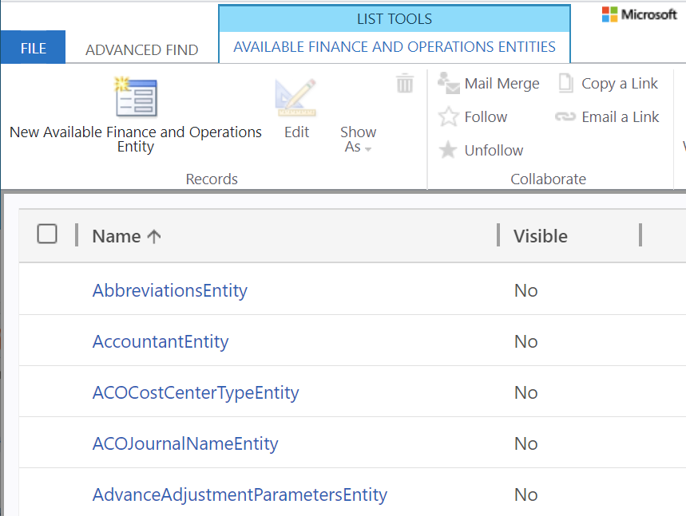
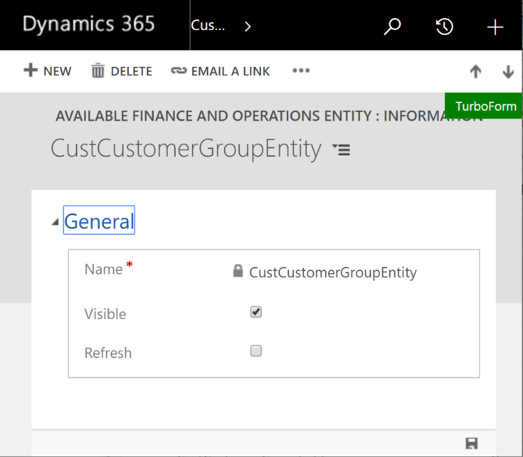
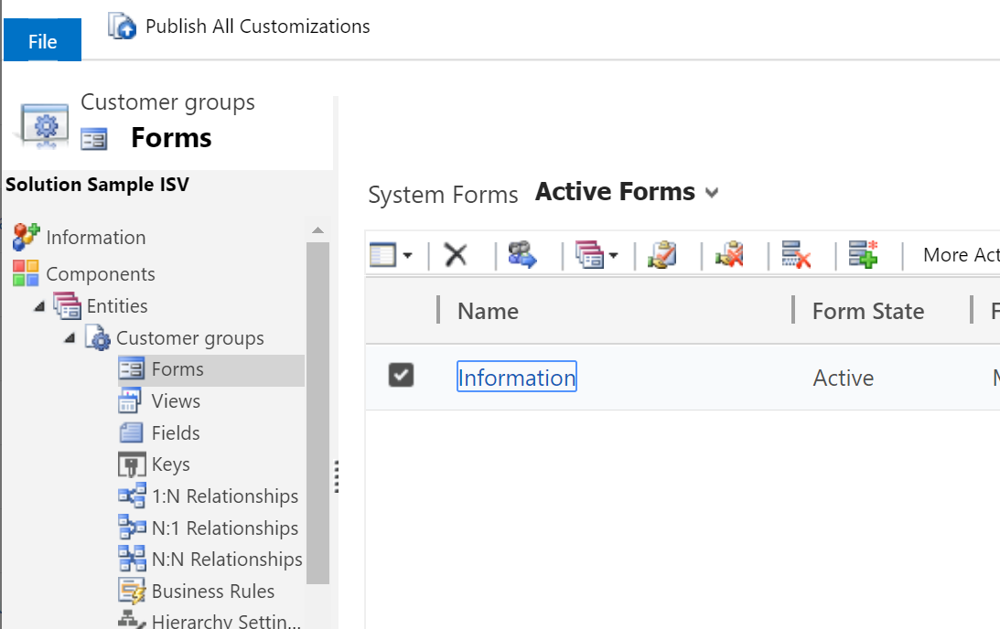

# Enable Microsoft Dataverse virtual entities

[!include[banner](../includes/banner.md)]

Because many entities that are available in finance and operations apps are enabled for Open Data Protocol (OData), the entities aren't available as virtual entities in Microsoft Dataverse by default. After configuration is completed for finance and operations apps virtual entities in Dataverse, the virtual entities can be enabled in the Dataverse environment. Administrators can then determine which entities will be exposed as virtual entities that can be used in Dataverse.

> [!NOTE]
> Configuration of finance and operations apps virtual entities in Dataverse is a prerequisite for enabling the virtual entities. The configuration is automatically done for finance and operations apps environments that are linked to a Microsoft Power Platform environment. For unlinked environments, manual configuration must be completed before the virtual entities can be enabled. For step-by-step information about how to configure finance and operations apps virtual entities in Dataverse, see [Configure Dataverse virtual entities](admin-reference.md).

## Generate virtual entities

1. Open the [Power Platform admin center](https://admin.powerplatform.microsoft.com), and select the **Environments** tab.
2. In the **Environments** list, select the Power Platform environment associated with your finance and operations apps environment.
3. In the **Details** section of the environment page, select the **Environment URL** link to open the Power Platform environment.
4. At the top-right of the page, select the **Settings** gear icon, and select **Advanced Settings**.
5. At the top-right of the **Settings** page, select the **Advanced find** filter icon.
6. In the **Advanced find** page, select **Available finance and operations entities** in the **Look for** drop-down list. 
7. Enter any additional filter criteria to restrict the results to specific entities, and select **Results**.

    

8. Find and open the entity that you want to enable.
9. Select the **Visible** check box, and then save your change.

    

The virtual entity is generated and will appear on all the appropriate menus. For example, it will appear in the **Advanced find** dialog box.

## Refresh virtual entity metadata

You can force a refresh of a virtual entity's metadata when you expect that the entity metadata in finance and operations apps has changed. To force a refresh, select the **Refresh** checkbox, and then save your change. The latest entity definition from finance and operations apps is synchronized to Dataverse, and the virtual entity is updated.

## Disable virtual entities

Virtual entities for finance and operations apps are in a managed solution and can't be deleted directly from the maker portal. To disable a virtual entity and remove the virtual entity metadata from the Dataverse environment, follow these steps.

1. Find and open the entity by following steps 1 through 8 in the [Generate virtual entities](enable-virtual-entities.md#generate-virtual-entities) section of this article.
1. Clear the **Visible** checkbox.
1. Save your change.

## Reference virtual entities

All virtual entities are generated in the **MicrosoftOperationsERPVE** solution, which is API managed. Items in the solution change as you make entities visible or hidden. Nevertheless, the solution is still a managed solution that you can take dependencies on. 

The standard Application Lifecycle Management (ALM) flow is to take a standard reference to a virtual entity from this solution. You can do this by using the **Add existing** action in the independent software vendor (ISV) solution. The virtual entity will be shown as a missing dependency of the solution, and it will be checked when the solution is imported. During import, if a specified virtual entity doesn't exist, it's automatically made visible. No additional work is required.

Follow these steps to consume virtual entities:

1. In Dataverse, follow the usual steps to create a separate solution that contains the consuming logic. See [Create a solution](/powerapps/maker/data-platform/create-solution) in the Power Platform documentation for additional information on creating a solution.
2. Select **Add existing** \> **Table**. 
3. In the **Add existing tables** list, select the virtual entity that you want to reference.
4. When you're prompted to select assets to add, select any forms, views, or other elements that you want to customize, and then select **Finish**.

You can use the development tools to modify existing elements for the virtual entity, such as forms. You can also add new forms, views, and other elements.

When the solution is exported, it will contain hard dependencies on the virtual entity that is generated in the **MicrosoftOperationsERPVE** solution.

[!INCLUDE[footer-include](../../../includes/footer-banner.md)]

