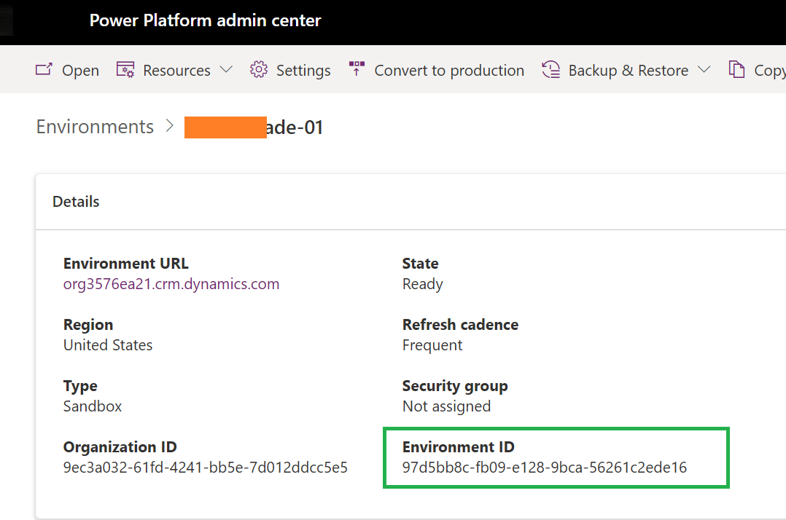

---
# required metadata

title: Connect Finance and Operations apps with an existing Microsoft Dataverse instance
description: Connect Finance and Operations apps with an existing Microsoft Dataverse instance 
ms.author: sakcuhha
author: saurabh-kuchhal
ms.date: 02/24/2023
ms.topic: article
ms.prod:
ms.technology: 

# optional metadata

# ms.search.form:
audience: Developer, IT Pro
# ms.devlang: 
ms.reviewer: sericks
# ms.tgt_pltfrm: 
ms.custom: "intro-internal"
ms.search.region: Global
# ms.search.industry:
ms.search.validFrom: 2021-10-13
ms.dyn365.ops.version: 10.0.0
---
# Connect Finance and Operations apps with an existing Microsoft Dataverse instance

[!include[banner](../includes/banner.md)]

Administrators in Lifecycle Services are finding more and more capabilities require connection to Microsoft Dataverse via Power Platform Integration.  In some cases however, you may already have a Microsoft Dataverse instance available with other Dynamics 365 apps that you wish to re-use for this integration.  This scenario will walk you through connecting your Finance and Operations apps environment with an existing Microsoft Dataverse instance to combine them as one logical enviornment.

In this scenario, you will learn how to:

> [!div class="checklist"]
> * Step 1
> * Step 2
> * Step 3
> * Step 4

As an example of this scenario, a customer who has already gone live with Dynamics 365 Field Service application on a Microsoft Dataverse based environment Power Platform admin center (PPAC) wishes to now connect their new Finance and Operations apps environment to it.  This will unlock popular features such as Dual-write, Virtual entities, and Business events out of the box between the back-office and front-office applications.

## Preqrequisites
* The Enable D365 apps option must be enabled when Dataverse is deployed in the Power Platform environment. This type of Dataverse deployment is the only type that supports Dynamics 365 apps, including connections to finance and operations apps.
The Power Platform environment must be in the same geography as finance and operations apps. For example, in Lifecycle Services, you might see an Azure Region such as West US.
* In Microsoft Power Platform, the environment should be deployed in United States. This requirement is in place for performance and data residency reasons.
* The user in Lifecycle Services who is doing the Power Platform integration setup must be an administrator of the environment in Dataverse, and must have an applicable Finance, Supply Chain Management, or Commerce license assigned. Note that if the System Administrator role was just assigned, the cache can take up to an hour to be refreshed. You can't do the setup via Lifecycle Services until the refresh is completed.

## Step 1
* In Lifecycle Services, go to your sandbox or production environment and click Full Details.
* On the Environment Details page, go to "Power Platform Integration" tab. You should see Status as "Initial Power Platform environment created. Use the Setup button to add Dataverse capabilities". Click on **Setup** button to configure your connection to an existing Microsoft Dataverse environment.

## Step 2
* You should see "Power Platform Integration Setup" slider window on the right. Under that, mark "Use a different Power Platform Environment" as Yes.

* In Power Platform Admin Center (PPAC), 

## Anti-patterns

