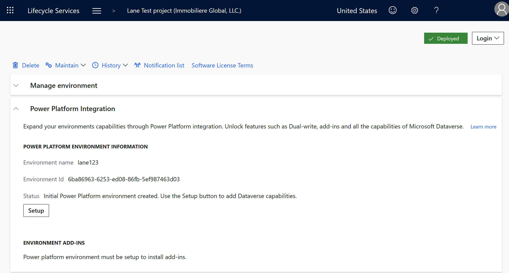

---
# required metadata

title: Connect Finance and Operations apps with an existing Microsoft Dataverse instance
description: Connect Finance and Operations apps with an existing Microsoft Dataverse instance 
ms.author: sakcuhha
author: saurabh-kuchhal
ms.date: 02/24/2023
ms.topic: article
ms.prod:
ms.technology: 

# optional metadata

# ms.search.form:
audience: Developer, IT Pro
# ms.devlang: 
ms.reviewer: sericks
# ms.tgt_pltfrm: 
ms.custom: "intro-internal"
ms.search.region: Global
# ms.search.industry:
ms.search.validFrom: 2021-10-13
ms.dyn365.ops.version: 10.0.0
---
# Connect Finance and Operations apps with an existing Microsoft Dataverse instance

[!include[banner](../includes/banner.md)]

Administrators in Lifecycle Services are finding more and more capabilities require connection to Microsoft Dataverse via Power Platform Integration.  In some cases however, you may already have a Microsoft Dataverse instance available with other Dynamics 365 apps that you wish to re-use for this integration.  This scenario will walk you through connecting your Finance and Operations apps environment with an existing Microsoft Dataverse instance to combine them as one logical enviornment.

In this scenario, you will learn how to:

> [!div class="checklist"]
> * Step 1: Click setup from the Power Platform Integration tab
> * Step 2: Use a different Power Platform environment
> * Step 3: Confirm you wish to proceed
> * Step 4: Provisioning in progress

As an example of this scenario, a customer who has already gone live with Dynamics 365 Field Service application on a Microsoft Dataverse based environment Power Platform admin center (PPAC) wishes to now connect their new Finance and Operations apps environment to it.  This will unlock popular features such as Dual-write, Virtual entities, and Business events out of the box between the back-office and front-office applications.

## Preqrequisites

## Step 1: Click setup from the Power Platform Integration tab
In Lifecycle Services, visit your sandbox or Production environment and locate the "Power Platform Integration" tab.  You should see that the **Setup** button is available which means that you can configure your connection to Microsoft Dataverse. 

Note that there is already a Power Platform Environment Id listed here.  This is referred to as the "Initial Power Platform Environment" and is the free placeholder environment created in Power Platform admin center for every sandbox and Production environment in Lifecycle Services.  This is a one to one relationship, and will be the eventual migration path to Power Platform admin center in the future.

In this scenario, we already have a Power Platform environment with Dynamics 365 Field Service installed.  The Initial Power Platform environment shown above will be disconnected from Finance and Operations apps and will be able to be deleted if you so choose.

## Step 2: Use a different Power Platform environment
In this step, we will connect Finance and Operations apps with your existing Dataverse instance.  To do this, in the slider window be sure to select to **use a different Power Platform Environment**.  

### Validations
To bring your own Dataverse instance you will need to adhere to several validations that are performed by Lifecycle Services:
* The Power Platform environment geo must be the same logical geo as where Finance and Operations apps are deployed.  Example is that your Finance and Operations apps are deployed to West US Azure Region.  This equates to a Power Platform geography of United States.  
* You must have System Administrator permissions in Dataverse
* You must be an Environment Manager or a Project Owner role in Lifecycle Services
* You must be logged in as an account from the customer tenant who owns the Lifecycle Services project
* You must have a valid Finance, Supply Chain Management, Commerce, Project Operations, Human Resources, Unified Operations Plan, or AX Enterprise license assigned to your account.  To see which licenses you have assigned visit https://myaccount.microsoft.com/ and look at the Subscriptions tab. 

## Step 3: Confirm you wish to proceed
You will now be presented with a dialog window indicating that this **action cannot be reversed**.  Connecting Finance and Operations apps with Power Platform and Microsoft Dataverse is similar in nature to applying a Microsoft Platform update on your enviornment.  Once it is applied, it cannot be unapplied.

Type your name in the dialog window to proceed with the setup activity:

## Step 4: Provisioning in progress
There will be a brief downtime on the Finance and Operations apps environment so that the X++ runtime is made aware of its connection to Dataverse for various different features.

During this time, some platform applications may be installed on your Dataverse instance that are required by Finance and Operations apps, if they were not previously installed manually.  

## Anti-patterns

