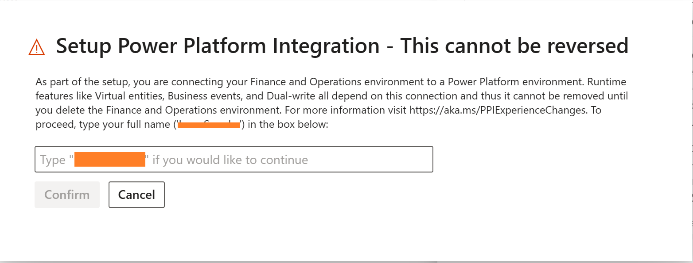

---
# required metadata

title: Connect Finance and Operations apps with a new Microsoft Dataverse instance
description: Connect Finance and Operations apps with a new Microsoft Dataverse instance 
ms.author: laswenka
author: laneswenka
ms.date: 03/16/2023
ms.topic: article
ms.prod:
ms.technology: 

# optional metadata

# ms.search.form:
audience: Developer, IT Pro
# ms.devlang: 
ms.reviewer: sericks
# ms.tgt_pltfrm: 
ms.custom: "intro-internal"
ms.search.region: Global
# ms.search.industry:
ms.search.validFrom: 2021-10-13
ms.dyn365.ops.version: 10.0.0
---
# Connect Finance and Operations apps with a new Microsoft Dataverse instance

[!include[banner](../includes/banner.md)]

Administrators in Lifecycle Services are finding more and more capabilities require connection to Microsoft Dataverse via Power Platform Integration.  Customers who don't already use Microsoft Dataverse for low code or with other Dynamics 365 apps can quickly get one setup and connected in a few button clicks.  This scenario will walk you through connecting your Finance and Operations apps environment with a new Microsoft Dataverse instance to combine them as one logical enviornment.

In this scenario, you will learn how to:

> [!div class="checklist"]
> * Step 1: Click setup from the Power Platform Integration tab
> * Step 2: Configure Microsoft Dataverse using a template
> * Step 3: Confirm you wish to proceed
> * Step 4: Provisioning in progress

As an example of this scenario, a customer who has Finance and Operations apps environment deployed wishes to connect it to a new Microsoft Dataverse environment.  This will unlock popular features such as Add-ins, Dual-write, Virtual entities, and Business events out of the box so that the rich Finance and Operations apps data can be made available for low code applications and services.

## Preqrequisites
<INFO HERE>

## Step 1: Click setup from the Power Platform Integration tab
In Lifecycle Services, visit your sandbox or Production environment and locate the "Power Platform Integration" tab.  You should see that the **Setup** button is available which means that you can configure your connection to Microsoft Dataverse. 

Note that there is already a Power Platform Environment Id listed here.  This is referred to as the "Initial Power Platform Environment" and is the free placeholder environment created in Power Platform admin center for every sandbox and Production environment in Lifecycle Services.  This is a one to one relationship, and will be the eventual migration path to Power Platform admin center in the future.

## Step 2: Configure Microsoft Dataverse using a template
In this step, we will add Microsoft Dataverse to your initial Power Platform environment.  To do this, in the slider window do **not** select to use an existing Power Platform Environment.  If you already have Microsoft Dataverse deployed with other Dynamics 365 applications and wish to connect to it, see [Connect Finance and Operations apps with an existing Microsoft Dataverse instance](blah).

Select an available template which will create Microsoft Dataverse with several applications pre-installed based on your requirements:

The available templates today include:
* Dynamics 365 standard - this enables Add-ins, Virtual entities, Business events, and Dual-write platform components but does not contain any Dual-write application maps.  This is the most common template.
* Dynamics 365 standard with Dual-write - this enables everything from the standard template as well as installs application maps for Dual-write.
* Project operations - this is a special template for customers with the Dynamics 365 Project Operations license. This pre-installs solutions required for it to run as well on top of the Dynamics 365 standard with Dual-write template.

Finally after picking your template, click the agree checkbox and click the **Setup** button.

## Step 3: Confirm you wish to proceed
You will now be presented with a dialog window indicating that this **action cannot be reversed**.  Connecting Finance and Operations apps with Power Platform and Microsoft Dataverse is similar in nature to applying a Microsoft Platform update on your enviornment.  Once it is applied, it cannot be unapplied.

Type your name in the dialog window to proceed with the setup activity:

## Step 4: Provisioning in progress
Provisioning a new Microsoft Dataverse instance only takes a few minutes.  There will be a brief downtime on the Finance and Operations apps environment so that the X++ runtime is made aware of its connection to Dataverse for various different features.

During this time, the environment in Power Platform admin center will also show as in a "Preparing" state while Dataverse is added.  

## Anti-patterns

* As this action is ir-reversible, if you already have a Dataverse instance whihc you would like to link with Finance and Operations environment, then mark yes to Use a different Power Platform Environment and see [Connect Finance and Operations apps with an existing Microsoft Dataverse instance]
* As you perform Environment lifecycle operations such as Restore data, consider Finance and Operations environment and Power Platform Environment as One, and maintain the 1:1 mapping.
