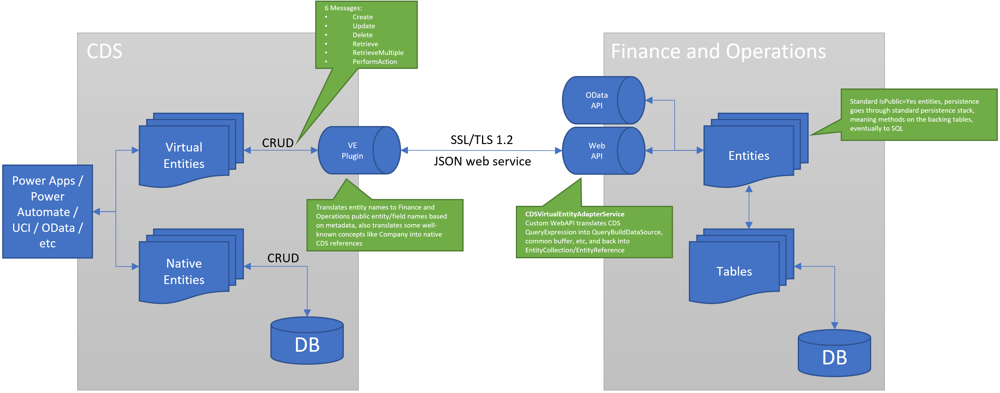

---
# required metadata

title: Microsoft Power Platform integration with Finance and Operations
description: This topic describes virtual entities for Finance and Operations in Common Data Service.
author: Sunil-Garg
manager: AnnBe
ms.date: 07/13/2020
ms.topic: article
ms.prod:
ms.service: dynamics-ax-applications
ms.technology: 

# optional metadata

# ms.search.form:
audience: Developer, IT Pro
# ms.devlang: 
ms.reviewer: sericks
ms.search.scope: Operations
# ms.tgt_pltfrm: 
# ms.custom: NotInToc
ms.search.region: Global
# ms.search.industry:
ms.author: sunilg
ms.search.validFrom: 2020-10-31
ms.dyn365.ops.version: 10.0.0
---

# Microsoft Power Platform integration with Finance and Operations

[!include[banner](../includes/banner.md)]

> [!IMPORTANT]
> This functionality requires version 10.0.12 for Finance and Operations apps, while service update 189 is required for Common Data Service. The release information for Common Data Service is published on the [latest version availability page](https://docs.microsoft.com/business-applications-release-notes/dynamics/released-versions/dynamics-365ce#all-version-availability).

Finance and Operations is a virtual data source in Common Data Service, and enables full create, read, update, delete (CRUD) operations from Common Data Service and Microsoft Power Platform. By definition, the data for virtual entities doesn't reside in Common Data Service. Instead, it continues to reside in the application where it belongs. To enable CRUD operations on Finance and Operations entities from Common Data Service, entities must be made available as virtual entities in Common Data Service. The allows CRUD operations to be performed, from Common Data Service and Microsoft Power Platform, on data that resides in Finance and Operations apps.

## Prerequisite reading

To understand the architecture of virtual entities for Finance and Operations apps, you must understand how Common Data Service and virtual entities work. Therefore, the following documentation is a prerequisite:

- [What is Common Data Service?](https://docs.microsoft.com/powerapps/maker/common-data-service/data-platform-intro)
- [Entity overview](https://docs.microsoft.com/powerapps/maker/common-data-service/entity-overview)
- [Entity relationships overview](https://docs.microsoft.com/powerapps/maker/common-data-service/relationships-overview)
- [Create and edit virtual entities that contain data from an external data source](https://docs.microsoft.com/powerapps/maker/common-data-service/create-edit-virtual-entities)
- [What is Power Apps portals?](https://docs.microsoft.com/powerapps/maker/portals/overview)
- [Overview of creating apps in Power Apps](https://docs.microsoft.com/powerapps/maker/)

## Virtual entities for Finance and Operations apps

All Open Data Protocol (OData) entities in Finance and Operations are available as virtual entities in Common Data Service, and therefore also in Power Platform. Makers can now build experiences in customer engagement apps with data directly from Finance and Operations with full CRUD capability and without copying to Common Data Service. Power Apps Portals can be used to build external-facing websites that enable collaboration scenarios for business processes in Finance and Operations.

## Architecture

Virtual entities are a Common Data Service concept that is useful beyond Finance and Operations. The following illustration shows how the Finance and Operations provider for virtual entities is implemented. Six primary methods are implemented by the provider. The first five methods are the standard CRUD operations: **Create**, **Update**, **Delete**, **Retrieve**, and **RetrieveMultiple**. The last method, **PerformAction**, is used to call OData actions, as described later in this topic. Calls to the Finance and Operations Virtual Entity Data Provider (shown as "VE Plugin" in the illustration) will cause a Secure Sockets Layer (SSL)/Transport Layer Security (TLS) 1.2 secure web call to the CDSVirtualEntityService web API endpoint of Finance and Operations. This web service then converts the queries into calls to the associated physical entities in Finance and Operations, and invokes CRUD or OData operations on those entities. Because a Finance and Operations entity is directly invoked in all operations, any business logic on the entity or its backing tables is also invoked.

During calls, there are two points of translation from Common Data Service to Finance and Operations apps. The first point of translation occurs in the VE Plugin, which translates concepts such as entity physical names into Finance and Operations entity names. It also converts some well-known concepts, such as Company references. The web service call still uses the EntityCollection, Entity, and QueryExpression objects to express the operations that are performed, by using the translated entity names and concepts from the VE Plugin. Finally, the CDSVirtualEntityAdapterService web API in Finance and Operations completes the translation from QueryExpression to QueryBuildDataSource and other internal Finance and Operations language constructs.

All calls between Common Data Service and Finance and Operations as part of virtual entities are done as service-to-service (S2S) calls by using the Azure Active Directory (Azure AD) application that is specified in the configuration. The user of this application should have access *only* to the CDSVirtualEntityAdapterService web API and the Catalog entity, CDSVirtualEntityListEntity. These privileges are included in the out-of-box security role that is named CDSVirtualEntityApplication. During the S2S calls, Common Data Service provides the identity of the user in Common Data Service who is invoking the action. The CDSVirtualEntityAdapterService web API looks up the associated user in Finance and Operations and runs the query in the context of that user. Therefore, the S2S call doesn't have to have explicit access to all the Finance and Operations entities. Instead, it can rely on the privileges of the user who is invoking the action to determine data access.

Power Apps Portal can also access virtual entities. Because Power Apps Portal authorization is based on contact records, a mapping between contact records and Finance and Operations users is maintained in the msdyn\_externalportalusermapping table in Common Data Service. This table should be editable only by highly privileged users in Common Data Service, who have the rights to control the security access of portal users to Finance and Operations virtual entities. Any Finance and Operations user who is set up for Power Apps Portal access must have the CDSVirtualEntityAuthorizedPortalUser security role assigned, and can't have the System administrator or Security administrator role assigned. Regardless of the Power Apps Portal security setting that is applied to virtual entities, the resulting query to Finance and Operations apps is always run as the associated Finance and Operations user, and is subject to that user's entity and row security settings. Anonymous portal access is also supported. For information about this type of access and how it can be done, see [Power Apps Portal reference](power-portal-reference.md).
