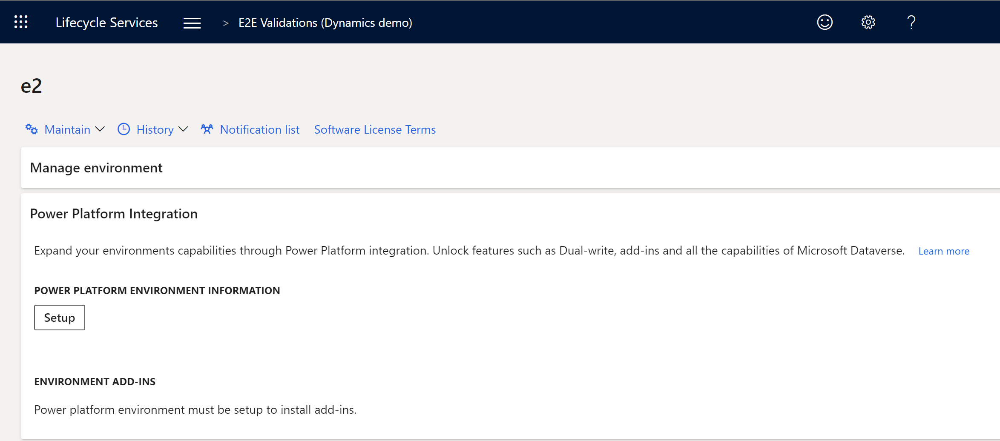

---
# required metadata

title: Microsoft Power Platform integration with Finance and Operations apps
description: This topic provides an overview for Microsoft Power Platform integration via Microsoft Dynamics Lifecycle Services for Finance and Operations apps and Microsoft Dataverse.
author: Sunil-Garg
ms.date: 05/17/2021
ms.topic: article
ms.prod:
ms.technology: 

# optional metadata

# ms.search.form:
audience: Developer, IT Pro
# ms.devlang: 
ms.reviewer: sericks
# ms.tgt_pltfrm: 
# ms.custom: NotInToc
ms.search.region: Global
# ms.search.industry:
ms.author: sunilg
ms.search.validFrom: 2020-10-31
ms.dyn365.ops.version: 10.0.0
---

# Microsoft Power Platform integration with Finance and Operations apps

[!include[banner](../includes/banner.md)]

[!include [rename-banner](~/includes/cc-data-platform-banner.md)]

Microsoft Power Platform provides a suite of capabilities for Dynamics 365 applications via the Power Platform admin center. Today, Finance and Operations apps are not managed by the Power Platform admin center. However, over time more and more management capabilities will be migrated from Microsoft Dynamics Lifecycle Services (LCS) over to the admin center. In the interim, customers will be able to unlock features, such as dual-write functionality, virtual entities, add-ins, and more via Microsoft Power Platform integration functionality in LCS.

## Prerequisite reading

To understand the architecture of Microsoft Power Platform, Dataverse, dual-write, and virtual entities for Finance and Operations apps, you must understand how they work. Therefore, the following documentation is a prerequisite:

- [Administer Power Platform](/power-platform/admin/admin-documentation)
- [What is Dataverse?](/powerapps/maker/common-data-service/data-platform-intro)
- [Entity overview](/powerapps/maker/common-data-service/entity-overview)
- [Entity relationships overview](/powerapps/maker/common-data-service/relationships-overview)
- [Create and edit virtual entities that contain data from an external data source](/powerapps/maker/common-data-service/create-edit-virtual-entities)
- [What is Power Apps portals?](/powerapps/maker/portals/overview)
- [Overview of creating apps in Power Apps](/powerapps/maker/)

## Tools and services unlocked with Microsoft Power Platform integration

Together, virtual entities, dual-write, and business events make up the shared data layer for the convergence of Finance and Operations apps and the Dataverse platform. They are complementary technologies that are intended to work together. 

**Virtual entities** enable scenarios where access to Finance and Operations data from Microsoft Power Platform or native Dataverse apps is required. You can query that data, bind forms to it, and generally use the full power of Microsoft Power Platform against the full breadth of Finance and Operations apps. Data isn't copied between systems. Instead, it's accessed directly through the standard virtual entity infrastructure that Microsoft Power Platform technologies can already bind to. For more information, see [Virtual entities overview](virtual-entities-overview.md). 

**Business events** let you use Microsoft Power Platform to respond to events that are occurring in Finance and Operations apps. Business events can be raised from any app, including Finance and Operations apps, and can be handled by Microsoft Power Platform business logic. This handling will often include querying or interacting with additional data through either native entities or virtual entities. 

For a subset of scenarios, data must be physically copied between Finance and Operations apps and native Dataverse entities. These scenarios are for overlapping entities that already have a large amount of bound logic in both native Dataverse apps and Finance and Operations apps, so that the data must reside in the local database of each type of app. Although the number of these entities is relatively small, it includes some of the most important entities, such as Account/Customer, Company, Product, and Sales order. For these scenarios, **dual-write** enables near-real-time synchronous copying of data. This capability enables existing apps to continue to operate against local data, as designed, and also ensures that the corresponding overlapping entity is kept in sync. For more information, see the [Dual-write home page](../data-entities/dual-write/dual-write-home-page.md). 

Together, virtual entities, dual-write, and business events let you build apps and business processes that span the boundaries between Finance and Operations apps and native Dataverse apps. Most apps and business processes will use either a combination of these three parts of the shared data layer or all of them. As always, extension and customization should reduce the amount of data that is copied between databases as much as possible, and should also optimize for the best possible user experience when these tools are used. 

### Add-ins functionality

Add-ins provide a way to extend the functionality of Finance and Operations apps. All add-ins are installed and managed via Lifecycle Services on the environment details page for sandbox and production-type environments. The metadata regarding which add-ins are installed and the configuration options for each add-in are stored in the Microsoft Dataverse database that is provisioned as part of the Microsoft Power Platform integration. Some add-ins also store business data in the Dataverse database. To learn more about available add-ins, see [Add-ins overview](add-ins-overview.md).

## Typical scenarios and patterns that use dual-write

Here are some typical scenarios that use dual-write.

### Customer service representatives can facilitate a change of address for Finance and Operations customers

A customer relocates and wants to change their billing and shipping address information. This customer contacts a customer service representative and requests a change of address. The customer service representative takes the call and changes the customer's billing and shipping address information.

| Decision | Information | 
|----------|-------------|
| Is real-time data required? | Yes |
| Peak data volume | Not applicable |
| Frequency | Ad hoc |

#### Recommended solution

This scenario that involves near-real-time data synchronization is best implemented by using dual-write.

1. The customer's information is sourced in a Finance and Operations app.
2. A customer calls customer service and asks to change their billing and shipping address information.
3. A customer service representative retrieves the customer's record in Dynamics 365 Customer Service.
4. The customer service representative updates the billing and shipping addresses, and saves the data.
5. The new billing and shipping addresses are synced back to the Finance and Operations app in real time.

### Sales representatives can change customer credit limits without signing in to a Finance and Operations app

A customer has a credit limit of $2,000 and wants to increase it to $5,000. This customer calls and requests the increase. The ticket is assigned to the sales department. The head of sales reviews the request, reviews the customer's payment history, and determines that the customer is eligible for an increased credit limit. The head of sales approves the request and responds to the ticket. The customer receives an email about the approval of the $5,000 credit limit.

| Decision | Information | 
|---------|--------------|
| Is real-time data required? | Yes |
| Peak data volume | Not applicable |
| Frequency | Ad hoc |

#### Recommended solution

This scenario is best implemented by using dual-write.

1. A customer calls and wants to increase their credit limit from $2,000 to $5,000.
2. A customer support representative creates a ticket in Dynamics 365 Customer Service.
3. The ticket is assigned to the sales unit.
4. A sales representative from the sales unit reviews and approves the request.
5. The customer's credit limit is increased to $5,000 in Dynamics 365 Sales.
6. The credit limit in the Finance and Operations app is updated to $5,000.
7. The sales representative responds to the ticket and resolves it.
8. The customer receives an email about the increased credit limit.

## Prerequisites for setting up the Microsoft Power Platform integration

The following list provides details about the prerequisites for setting up the Microsoft Power Platform integration:

- Make sure that at least one gigabyte (GB) of Microsoft Power Platform database storage capacity space is available for your tenant. Otherwise, setup will fail. You can view your capacity in the [Power Platform admin center](https://admin.powerplatform.microsoft.com/resources/capacity). 
- Identify your Finance and Operations environment administrator. You can find that information in the **Environment details** section.

    

- Validate your Microsoft Power Platform environment governance policy. To validate, you must be a **Global administrator** or **Power Platform administrator**.

    1. Sign in to the [Power Platform admin center](https://admin.powerplatform.microsoft.com).

    2. Select the gear icon in the upper-right corner of the Power Platform site.
    
        
    
- For organizations that **do not allow Everyone** to create Power Platform production environments, the Finance and Operations environment administrator account for your environment must be added to one of the following Power Platform admin roles. You will need a Global Administrator to perform this action.

    - Global admins
    - Dynamics 365 admins
    - Power Platform admins

    > [!Note]
    > In the future, a more limited role will be added to Azure Active Directory for this integration that does not require use of the roles above which may provide more permissions than is necessary for the Finance and Operations administrator account.  In the case where you wish to keep the administrator with least-privileges you may grant one of the above roles temporarily until the Power Platform integration setup is completed and then remove it.  

- All users who create Power Platform environments must be licensed. The Finance and Operations environment administrator account should have the **Dynamics 365 Unified Operations Plan**, **AX Enterprise**, or an application-specific license like **Dynamics 365 Finance** applied using the Microsoft 365 admin center.

## Enabling the Power Platform integration
Power Platform integration can be enabled either during creation of a new Finance and Operations environment, or afterwards on an existing environment in Lifecycle Services (LCS).  

### Enable during environment deployment
As you set up a new Finance and Operations environment in LCS, there are several sections to the deployment wizard that can be filled out.  One of those sections is called **Power Platform Integration**.

 

1. Select the **Configure Power Platform environment** option.  This will then enable several additional settings.
2. For the **Power Platform template** drop-down list, you may see several options:
    - **Dynamics 365 Standard** - This is the basic template applicable for all Finance and Operations environments.  Use this option if you don't need to use a more specific template.
    - **Project Operations** - This is a template specific to the Project Operations scenario.  You will only see this option if your tenant has licenses and entitlement for Dynamics 365 Project Operations.
3. You may optionally see **Environment Type** if you are deploying a DevTest or cloud-hosted environment.  You may choose the type of Dataverse environment that is created and linked.  Otherwise, this is defaulted as a sandbox type for Tier 2 - Tier 5 acceptance test environments and production type for production environments.
4. Select the **Agree** check box to agree to the terms and conditions of the integration.

[!Important]
> The **language** and **currency** values of the Dataverse environment that is created and linked to your Finance and Operations environment is determined automatically based on the physical address of your Azure Active Directory tenant.  If the address is in Redmond, Washington, USA, for example then the language will default to English and the currency will default to USD.  If you need a different value that doesn't match the default, please contact Microsoft support and we can help link an existing Dataverse environment that you provision manually to the Finance and Operations environment.  Eventually, these fields will be added as setup options so that customers can choose them on their own or accept the default values.

### Set up after environment deployment
To set up after the Finance and Operations environment has been deployed, follow these steps:

1. After the Finance and Operations environment has been deployed through LCS, open the **Environment details** page in LCS.
2. In the **Power Platform integration** section, select **Setup**.

     

3. In the **Power Platform environment setup** dialog box, agree to the terms and conditions, and then select **Setup** at the bottom of the dialog box.

    > [!NOTE]
    > This will provision a Microsoft Dataverse-based environment in the Power Platform admin center, and typically requires 1GB of database storage capacity. It will have the same name as your Finance and Operations environment. Dual-write platform-level components will be installed, but dual-write application components will not be set up or enabled. That is a separate action.

4. When you receive a message that states that the Microsoft Power Platform environment is being provisioned, select **OK**.

    The **Power Platform integration** section of the **Environment details** page now shows a message that states that the Microsoft Power Platform environment is being provisioned.

5. After a few minutes, refresh the **Environment details** page.
6. In the **Power Platform integration** section, notice that the value of the **Status** field is **Environment setup is in progress**.

    Typically, the setup takes between 60 and 90 minutes.

    After the Dataverse environment is provisioned, the **Install a new add-in** and the **Dual-write application** buttons become available in the **Power Platform integration** section.

    
     
    

[!Important]
> The **language** and **currency** values of the Dataverse environment that is created and linked to your Finance and Operations environment is determined automatically based on the physical address of your Azure Active Directory tenant.  If it the address is in Redmond, Washington, USA, for example then the language will default to English and the currency will default to USD.  If you need a different value that doesn't match the default, please contact Microsoft support and we can help link an existing Dataverse environment that you provision manually to the Finance and Operations environment.  Eventually, these fields will be added as setup options so that customers can choose them on their own or accept the default values.

### Troubleshooting the setup

Setup can fail at various stages of the deployment of the Dataverse-based environment. 

- Anytime the setup fails, an error message will be displayed. Based on the error message, you may need to address licensing or capacity issues. After these have been resolved, you can then use the **Resume** button in the **Power Platform integration** section of the **Environment details** page in LCS to finish the setup.

[!INCLUDE[footer-include](../../../includes/footer-banner.md)]
