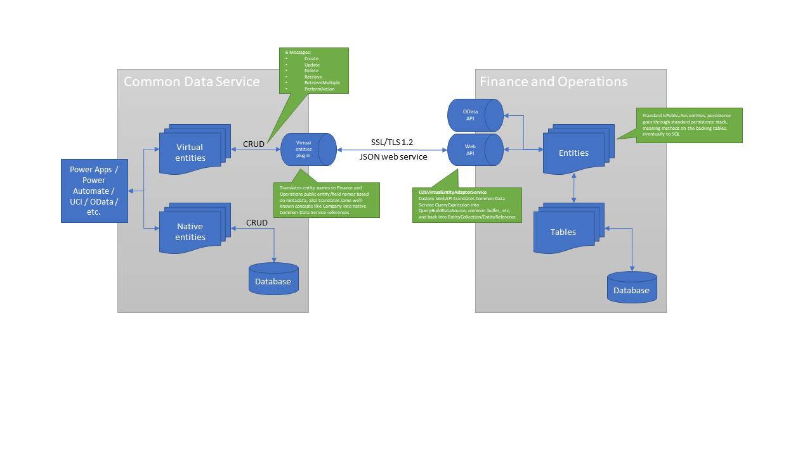

---
# required metadata

title: Microsoft Power Platform integration with Finance and Operations
description: This topic provides an overview for Power Platform Integration via Lifecycle Services for Finance and Operations and Microsoft Dataverse.
author: Sunil-Garg
ms.date: 05/17/2021
ms.topic: article
ms.prod:
ms.technology: 

# optional metadata

# ms.search.form:
audience: Developer, IT Pro
# ms.devlang: 
ms.reviewer: sericks
# ms.tgt_pltfrm: 
# ms.custom: NotInToc
ms.search.region: Global
# ms.search.industry:
ms.author: sunilg
ms.search.validFrom: 2020-10-31
ms.dyn365.ops.version: 10.0.0
---

# Microsoft Power Platform integration with Finance and Operations

[!include[banner](../includes/banner.md)]

[!include [rename-banner](~/includes/cc-data-platform-banner.md)]

> [!IMPORTANT]
> This functionality requires version 10.0.12 for Finance and Operations apps, while service update 189 is required for Dataverse. The release information for Dataverse is published on the [latest version availability page](https://docs.microsoft.com/business-applications-release-notes/dynamics/released-versions/dynamics-365ce#all-version-availability).

Microsoft Power Platform provides a suite of capabilities for Dynamics 365 applications via the Power Platform Admin Center. Today, Finance and Operations apps are not managed by the Power Platform Admin Center, however, over time more and more management capabilities will be migrated from Lifecycle Services (LCS) over to the admin center. In the interim, customers will be able to unlock features, such as dual-write functionality, virtual entities, add-ins, and more via Power Platform integration functionality in LCS.

This topic provides an overview of the various features unlocked by Power Platform integration as well as how to perform the setup steps.

## Prerequisite reading

To understand the architecture of Power Platform, Microsoft Dataverse, and virtual entities for Finance and Operations apps, you must understand how they work. Therefore, the following documentation is a prerequisite:

- [Administer Power Platform](https://docs.microsoft.com/power-platform/admin/admin-documentation)
- [What is Dataverse?](https://docs.microsoft.com/powerapps/maker/common-data-service/data-platform-intro)
- [Entity overview](https://docs.microsoft.com/powerapps/maker/common-data-service/entity-overview)
- [Entity relationships overview](https://docs.microsoft.com/powerapps/maker/common-data-service/relationships-overview)
- [Create and edit virtual entities that contain data from an external data source](https://docs.microsoft.com/powerapps/maker/common-data-service/create-edit-virtual-entities)
- [What is Power Apps portals?](https://docs.microsoft.com/powerapps/maker/portals/overview)
- [Overview of creating apps in Power Apps](https://docs.microsoft.com/powerapps/maker/)

## Tools and services unlocked with Power Platform integration
The following is a listing of various tools and services that are unlocked by setting up Power Platform integration for your environments.

### Virtual entities for Finance and Operations apps

Finance and Operations apps are a virtual data source in Dataverse, and enable full create, read, update, and delete (CRUD) operations from Dataverse and Microsoft Power Platform. By definition, the data for virtual entities doesn't reside in Dataverse. Instead, the data continues to reside in the application where it belongs. To enable CRUD operations on Finance and Operations entities from Dataverse, entities must be made available as virtual entities in Dataverse. The allows CRUD operations to be performed from Dataverse and Microsoft Power Platform, on data that resides in Finance and Operations apps.

All Open Data Protocol (OData) entities in Finance and Operations are available as virtual entities in Dataverse, and therefore also in Power Platform. Makers can now build experiences in customer engagement apps with data directly from Finance and Operations with full CRUD capability and without copying to Dataverse. Power Apps Portals can be used to build external-facing websites that enable collaboration scenarios for business processes in Finance and Operations.

#### Virtual entities for core Human Resources
Core Human Resources entities can also be virtualized like Finance and Operations entities. For more information, see [Core HR virtual entities](https://docs.microsoft.com/dynamics365/human-resources/hr-admin-integration-common-data-service-virtual-entities).

#### Virtual entities vs. dual-write
Virtual entities provide a mechanism to use Microsoft Power Platform with Finance and Operations without having to physically copy data to Dataverse. Use this guidance to determine if the requirements will need dual-write or data integrator or virtual entities. Virtual entities and dual-write/data integrator are complementary technologies, meaning that they can be used together if required. Each technology exists for specific scenarios, as explained in [Integration strategies](../data-entities/integration-overview.md).

### Dual-write functionality
Dual-write functionality is out-of-the-box infrastructure that provides near real-time interaction between Customer Engagement apps and Finance and Operations apps. When data about customers, products, people, and operations flows beyond application boundaries, all departments in an organization are empowered.

Dual-write functionality provides tightly coupled, bidirectional integration between Finance and Operations apps and Dataverse. Any data change in Finance and Operations apps causes writes to Dataverse, and any data change in Dataverse causes writes to Finance and Operations apps. This automated data flow provides an integrated user experience across the apps.  For more information about dual-write functionality, see [Dual-write overview](../data-entities/dual-write/dual-write-overview.md).

### Add-ins functionality
Add-ins provide a way to extend the functionality of Finance and Operations apps. All add-ins are installed and managed via Lifecycle Services on the environment details page for sandbox and production-type environments. The metadata regarding which add-ins are installed and the configuration options for each add-in are stored in the Microsoft Dataverse database that is provisioned as part of the Power Platform integration. Some add-ins also store business data in the Dataverse database. To learn more about available add-ins, see [Add-ins overview](add-ins-overview.md).

## Architecture

Virtual entities are a Dataverse concept that is useful beyond Finance and Operations. The following illustration shows how the Finance and Operations provider for virtual entities is implemented. Six primary methods are implemented by the provider. The first five methods are the standard CRUD operations: **Create**, **Update**, **Delete**, **Retrieve**, and **RetrieveMultiple**. The last method, **PerformAction**, is used to call OData actions, as described later in this topic. Calls to the Finance and Operations Virtual Entity Data Provider (shown as "VE Plugin" in the illustration) will cause a Secure Sockets Layer (SSL)/Transport Layer Security (TLS) 1.2 secure web call to the CDSVirtualEntityService web API endpoint of Finance and Operations. This web service then converts the queries into calls to the associated physical entities in Finance and Operations, and invokes CRUD or OData operations on those entities. Because a Finance and Operations entity is directly invoked in all operations, any business logic on the entity or its backing tables is also invoked.

During calls, there are two points of translation from Dataverse to Finance and Operations apps. The first point of translation occurs in the VE Plugin, which translates concepts such as entity physical names into Finance and Operations entity names. It also converts some well-known concepts, such as Company references. The web service call still uses the EntityCollection, Entity, and QueryExpression objects to express the operations that are performed, by using the translated entity names and concepts from the VE Plugin. Finally, the CDSVirtualEntityAdapterService web API in Finance and Operations completes the translation from QueryExpression to QueryBuildDataSource and other internal Finance and Operations language constructs.

All calls between Dataverse and Finance and Operations as part of virtual entities are done as service-to-service (S2S) calls by using the Azure Active Directory (Azure AD) application that is specified in the configuration. The user of this application should have access *only* to the CDSVirtualEntityAdapterService web API and the Catalog entity, CDSVirtualEntityListEntity. These privileges are included in the out-of-box security role that is named CDSVirtualEntityApplication. During the S2S calls, Dataverse provides the identity of the user in Dataverse who is invoking the action. The CDSVirtualEntityAdapterService web API looks up the associated user in Finance and Operations and runs the query in the context of that user. Therefore, the S2S call doesn't have to have explicit access to all the Finance and Operations entities. Instead, it can rely on the privileges of the user who is invoking the action to determine data access.

> [!NOTE]
> We always recommend that you have both Finance and Operations and Dataverse co-located in the same Azure region to ensure optimal latency in virtual entity calls. When co-located, the virtual entity overhead is expected to be less than 30ms per call.

Power Apps Portal can also access virtual entities. Because Power Apps Portal authorization is based on contact records, a mapping between contact records and Finance and Operations users is maintained in the msdyn\_externalportalusermapping table in Dataverse. This table should be editable only by highly privileged users in Dataverse, who have the rights to control the security access of portal users to Finance and Operations virtual entities. Any Finance and Operations user who is set up for Power Apps Portal access must have the CDSVirtualEntityAuthorizedPortalUser security role assigned, and can't have the System administrator or Security administrator role assigned. Regardless of the Power Apps Portal security setting that is applied to virtual entities, the resulting query to Finance and Operations apps is always run as the associated Finance and Operations user, and is subject to that user's entity and row security settings. Anonymous portal access is also supported. For information about this type of access and how it can be done, see [Power Apps Portal reference](power-portal-reference.md).

## Prerequisites for setting up the Power Platform integration
The following list provides details about the prerequisites for setting up the Power Platform integration:

- Make sure that at least one gigabyte (GB) of Power Platform database storage capacity space is available for your tenant. Otherwise, setup will fail. You can view your capacity in the [Power Platform admin center](https://admin.powerplatform.microsoft.com/resources/capacity). 
- Identify your Finance and Operations environment administrator. You can find that information in the **Environment details** section.

    
    
- Validate your Power Platform environment governance policy. To validate, you must be a **Global administrator** or **Power Platform administrator**.
    
    1. Sign in to the [Power Platform admin center](https://admin.powerplatform.microsoft.com).
    2. Select the gear icon in the upper-right corner of the Power Platform site.
    
        
    
- For organizations that **do not allow Everyone** to create Power Platform production environments, the Finance and Operations environment administrator account for your environment must be added to one of the following Power Platform admin roles. You will need a Global Administrator to perform this action.
- 
    - Global admins
    - Dynamics 365 admins
    - Power Platform admins
    
    For more information, see [Use service admin roles to manage your tenant](https://docs.microsoft.com/power-platform/admin/use-service-admin-role-manage-tenant).

    > [!Note]
    > In the future, a more limited role will be added to Azure Active Directory for this integration that does not require use of the roles above which may provide more permissions than is necessary for the Finance and Operations administrator account.  In the case where you wish to keep the administrator with least-privileges you may grant one of the above roles temporarily until the Power Platform integration setup is completed and then remove it.  

- All users who create Power Platform environments must be licensed. The Finance and Operations environment administrator account should have the **Dynamics 365 Unified Operations Plan**, **AX Enterprise**, or an application-specific license like **Dynamics 365 Finance** applied using the Microsoft 365 admin center.

## Enabling the Power Platform integration
Power Platform integration can be enabled either during creation of a new Finance and Operations environment, or afterwards on an existing environment in Lifecycle Services (LCS).  

### Enable during environment deployment
As you set up a new Finance and Operations environment in LCS, there are several sections to the deployment wizard that can be filled out.  One of those sections is called **Power Platform Integration**.

 

1. Select the **Configure Power Platform environment** option.  This will then enable several additional settings.
2. For the **Power Platform template** drop-down list, you may see several options:
    - **Dynamics 365 Standard** - This is the basic template applicable for all Finance and Operations environments.  Use this option if you don't need to use a more specific template.
    - **Project Operations** - This is a template specific to the Project Operations scenario.  You will only see this option if your tenant has licenses and entitlement for Dynamics 365 Project Operations.
3. You may optionally see **Environment Type** if you are deploying a DevTest or cloud-hosted environment.  You may choose the type of Dataverse environment that is created and linked.  Otherwise, this is defaulted as a sandbox type for Tier 2 - Tier 5 acceptance test environments and production type for production environments.
4. Select the **Agree** check box to agree to the terms and conditions of the integration.

[!Important]
> The **language** and **currency** values of the Dataverse environment that is created and linked to your Finance and Operations environment is determined automatically based on the physical address of your Azure Active Directory tenant.  If the address is in Redmond, Washington, USA, for example then the language will default to English and the currency will default to USD.  If you need a different value that doesn't match the default, please contact Microsoft support and we can help link an existing Dataverse environment that you provision manually to the Finance and Operations environment.  Eventually, these fields will be added as setup options so that customers can choose them on their own or accept the default values.

### Set up after environment deployment
To set up after the Finance and Operations environment has been deployed, follow these steps:

1. After the Finance and Operations environment has been deployed through LCS, open the **Environment details** page in LCS.
2. In the **Power Platform integration** section, select **Setup**.

     

3. In the **Power Platform environment setup** dialog box, agree to the terms and conditions, and then select **Setup** at the bottom of the dialog box.

    > [!NOTE]
    > This will provision a Microsoft Dataverse-based environment in the Power Platform admin center, and typically requires 1GB of database storage capacity.  It will have the same name as your Finance and Operations environment.  Dual-write platform-level components will be installed, but dual-write application components will not be set up or enabled.  That is a separate action.  

4. When you receive a message that states that the Microsoft Power Platform environment is being provisioned, select **OK**.

    The **Power Platform integration** section of the **Environment details** page now shows a message that states that the Microsoft Power Platform environment is being provisioned.

5. After a few minutes, refresh the **Environment details** page.
6. In the **Power Platform integration** section, notice that the value of the **Status** field is **Environment setup is in progress**.

    Typically, the setup takes between 60 and 90 minutes.

    After the Dataverse environment is provisioned, the **Install a new add-in** and the **Dual-write application** buttons become available in the **Power Platform integration** section.

    
     
    

[!Important]
> The **language** and **currency** values of the Dataverse environment that is created and linked to your Finance and Operations environment is determined automatically based on the physical address of your Azure Active Directory tenant.  If it the address is in Redmond, Washington, USA, for example then the language will default to English and the currency will default to USD.  If you need a different value that doesn't match the default, please contact Microsoft support and we can help link an existing Dataverse environment that you provision manually to the Finance and Operations environment.  Eventually, these fields will be added as setup options so that customers can choose them on their own or accept the default values.

### Troubleshooting the setup
Setup can fail at various stages of the deployment of the Dataverse-based environment.   

- Anytime the setup fails, an error message will be displayed.  Based on the error message, you may need to address licensing or capacity issues.  After these have been resolved, you can then use the **Resume** button in the **Power Platform integration** section of the **Environment details** page in LCS to finish the setup.

[!INCLUDE[footer-include](../../../includes/footer-banner.md)]
