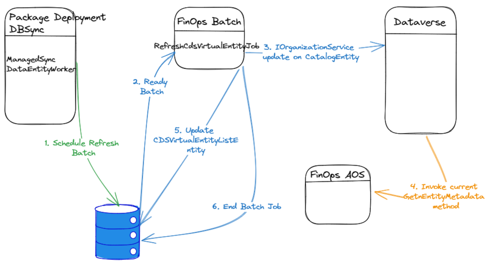

# Virtual entities auto create

[!include[banner](../includes/banner.md)]

> [!IMPORTANT]
> Supported Release Information
• ## Auto Refresh ## : Supported in PU62 or later by clicking the hotfix link here --> https://fix.lcs.dynamics.com/Issue/Details?kb=0&bugId=933259 
• ## Auto Create ##: Supported in PU63 or later by clicking the hotfix link here --> https://fix.lcs.dynamics.com/Issue/Details?kb=0&bugId=933259 . PU63 supports both Auto create and refresh. 

## Overview

Users kickstart virtualization by marking F&O entities to be relevant for virtualization, setting off automatic synchronization with Dataverse.DBSync is the batch job, which is an integral part of the release package is triggered as a background batch job. DBSync logs its activity in the CDSVirtualEntityList table. Once the DBSync process concludes, the scheduled CDSVirtualEntityRefreshBatch job ensures all changes are successfully propagated to Dataverse. Governed by the CDSVirtualEntityAutoRefresh feature, this job seamlessly synchronizes F&O metadata with Dataverse, eliminating the need for manual intervention for both create and updates to F&O entity. The batch jobs are set to run automatically. The batch job retries automatically up to 3 times in case of failures, with the retry limit fixed and retry attempts are not configurable. If the batch job fails after these attempts, users can check the job log for details on the failure and request for the batch job for auto-create or auto-refresh to be triggered by creating an incident ticket.

## Virtual entity Auto Create

Discover the "Auto create" feature in Finance and Operations, which facilitates effortless synchronization of F&O entities with Dataverse as virtual tables. By simply flagging Dataverse.AutoCreate property to "Yes". F&O entities with this property set to "Yes" are enabled for automatic synchronization. This process runs in the background as a batch operation as explained above, generating corresponding virtual tables in Dataverse. Remember, each F&O entity requiring virtualization must be enabled individually within F&O.

## Virtual entity Auto Refresh
The Auto Refresh feature ensures that any modifications made to F&O entities are automatically synced with Dataverse. These modifications encompass alterations to column properties, addition of new columns, or deletion of existing columns. Details of these changes are logged in the CDSVirtualEntityList table for updating by DBSync. A background batch job handles the auto refresh process, scheduled to start in the background and retry automatically up to 3 times in case of failures. This retry limit is fixed and cannot be configured.