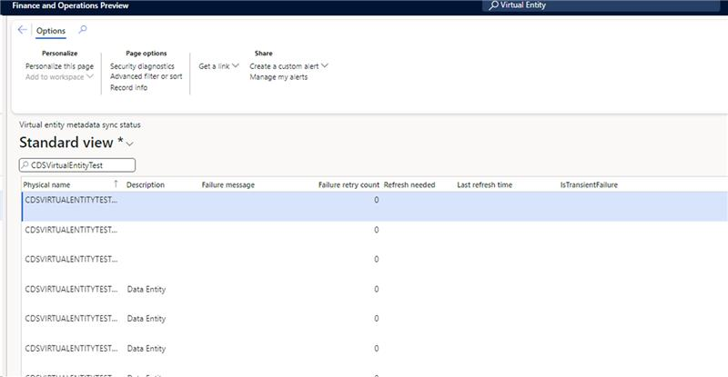

# Create and refresh virtual entities automatically

[!include[banner](../includes/banner.md)]

This article provides information about automatic creation and refresh of virtual entities for finance and operations apps in Dataverse.

> [!IMPORTANT]
> Supported release information:
>
> - **Auto Refresh:** Supported platform versions are PU62 (7.0.7120.170), PU63 (7.0.7198.123), PU64 (7.0.7279.31), or later.
> - **Auto Create:** Supported platform versions are PU63 (7.0.7198.123), PU64 (7.0.7279.31), or later.

Changes that are made on data entities in finance and operations apps are visible to Dataverse through a manual refresh in Dataverse. The Auto Create and Refresh capability in finance and operations apps enables automatic metadata creation or modification in Dataverse to occur immediately, reliably, and efficiently. Automatic refresh of metadata ensures timely updates in Dataverse from finance and operations apps. By enabling the Automatic Create and Refresh capability, you eliminate the need to manually refresh finance and operations entities in Dataverse. This capability paves way to automatic creation of virtual tables in Dataverse for finance and operations apps data entities.

**Auto Refresh**

* The Virtual Table Auto Refresh feature is activated when the supported version of the package is deployed. Supported platform versions are PU62 (7.0.7120.170), PU63 (7.0.7198.123), PU64 (7.0.7279.31), or later.
* When the package is deployed in finance and operation apps, it triggers an X++ batch job (CDSVirtualEntityRefreshBatch). This batch job is triggered 30 minutes after successful deployment of the feature package.

**Auto Create**

* The Auto Create capability is activated when the supported version of the feature is deployed. Supported platform versions are PU63 (7.0.7198.123), PU64 (7.0.7279.31), or later.
* In finance and operations apps, the user must set the value of the **Dataverse.AutoCreate** metadata property to *Yes* to enable automatic creation of virtual tables in the linked Dataverse environment.
* The automatic creation of virtual tables in Dataverse from finance and operations apps is managed through a batch job (CDSVirtualEntityAutoCreateBatch). This batch is triggered 90 minutes after successful deployment of the feature package.

After a **failure**, the Auto Create and Auto Refresh batch jobs are automatically retried three times. The retry setting is fixed and can't be modified or configured.

## Monitoring

* You can monitor the status of the Auto Create or Auto Refresh batch job by using the existing **Batch Jobs** page.
* You can monitor the status of automatic metadata synchronizations by using the new **Virtual entity metadata sync status** page in finance and operations apps. This page shows all automatically created and refreshed finance and operations entities.

    * If synchronization is successful, the **Last refresh time** field shows the time of the last successful synchronization.
    * If synchronization fails:

        * For enhanced visibility and troubleshooting, personalize the grid on this page by adding the **IsTransientFailure** field. This field indicates whether the failure is transient, and whether a retry is attempted.
        * The **Failure message** field provides details about the error. To learn about error codes that are included in the failure message, see [Web service error codes](/power-apps/developer/data-platform/reference/web-service-error-codes).
        * For entities that are marked as failed, if the **Refresh needed** checkbox is cleared, manual refresh from Dataverse is required after you fix the issue. Note that the user must take this action because the system doesn't automatically address these issues.

    

## Notes

* **Limitation of the Auto Refresh batch job history:** At each package deployment, the Auto Refresh batch job is re-created. Therefore, availability of the Auto Refresh job history is limited to the last package deployment. This behavior persists in the current version. Microsoft is aware of this limitation and plans to address it in future releases.
* **Auto Delete feature:** Currently, no Auto Delete feature is implemented. If a finance and operations apps data entity that is already enabled in the linked Dataverse environment is deleted, no action is taken automatically. Administrators must manually delete the virtual table in Dataverse.
