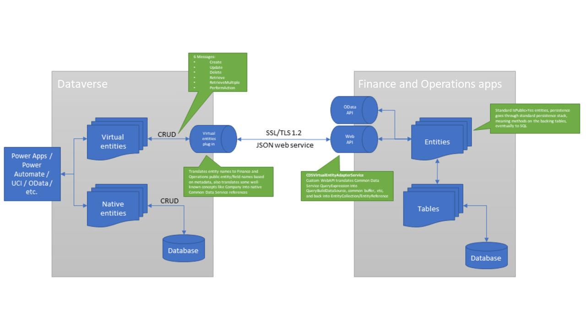

---
# required metadata

title: Virtual entities overview
description: This topic provides general information about virtual entities for Finance and Operations apps.
author: RamaKrishnamoorthy
ms.date: 05/14/2021
ms.topic: overview
audience: IT Pro
ms.reviewer: sericks

ms.search.region: Global
ms.author: ramasri
ms.search.validFrom: 2021-05-31
---

# Virtual entities overview

[!include[banner](../includes/banner.md)]

> [!IMPORTANT]
> This functionality requires version 10.0.12 of Finance and Operations apps, and service update 189 of Microsoft Dataverse. The release information for Dataverse is published on the [latest version availability page](/business-applications-release-notes/dynamics/released-versions/dynamics-365ce#all-version-availability).

## Virtual entities for Finance and Operations apps

Finance and Operations apps are a virtual data source in Dataverse, and enable full create, read, update, and delete (CRUD) operations from Dataverse and Microsoft Power Platform. By definition, the data for virtual entities doesn't reside in Dataverse. Instead, it continues to reside in the app where it belongs. Before CRUD operations can be performed on Finance and Operations entities from Dataverse, the entities must be made available as virtual entities in Dataverse. CRUD operations can then be performed from Dataverse and Microsoft Power Platform on data that resides in Finance and Operations apps.

All Open Data Protocol (OData) entities in Finance and Operations apps are available as virtual entities in Dataverse, and therefore also in Microsoft Power Platform. Makers can now use data directly from Finance and Operations apps to build experiences in customer engagement apps. These experiences offer full CRUD capability and don't require copying to Dataverse. Power Apps portals can be used to build external-facing websites that enable collaboration scenarios for business processes in Finance and Operations apps.

## Virtual entities for core Human Resources

Core Human Resources entities can also be virtualized, just as Finance and Operations entities can. For more information, see [Configure Dataverse virtual tables](../../../human-resources/hr-admin-integration-common-data-service-virtual-entities.md).

## Architecture

Virtual entities are a Dataverse concept that is useful beyond Finance and Operations apps. The following illustration shows how the Finance and Operations provider for virtual entities is implemented. The provider implements six primary methods. The first five methods are the standard CRUD operations: **Create**, **Update**, **Delete**, **Retrieve**, and **RetrieveMultiple**. The last method, **PerformAction**, is used to call OData actions, as described later in this topic. Calls to the Finance and Operations virtual entity data provider (shown as "virtual entities plug-in" in the illustration) will cause a Secure Sockets Layer (SSL)/Transport Layer Security (TLS) 1.2 secure web call to the CDSVirtualEntityService web API endpoint of Finance and Operations apps. This web service then converts the queries into calls to the associated physical entities in Finance and Operations apps, and invokes CRUD or OData operations on those entities. Because a Finance and Operations entity is directly invoked in all operations, any business logic on the entity or its backing tables is also invoked.

During calls, there are two points of translation from Dataverse to Finance and Operations apps. The first point of translation occurs in the VE Plugin, which translates concepts such as entity physical names into Finance and Operations entity names. It also converts some well-known concepts, such as Company references. The web service call still uses the EntityCollection, Entity, and QueryExpression objects to express the operations that are performed, by using the translated entity names and concepts from the VE Plugin. Finally, the CDSVirtualEntityAdapterService web API in Finance and Operations apps completes the translation from QueryExpression to QueryBuildDataSource and other internal Finance and Operations language constructs.

All calls between Dataverse and Finance and Operations apps as part of virtual entities are done as service-to-service (S2S) calls, by using the Azure Active Directory (Azure AD) application that is specified in the configuration. The user of this application should have access **only** to the CDSVirtualEntityAdapterService web API and the catalog entity, CDSVirtualEntityListEntity. These privileges are included in the out-of-box security role that is named CDSVirtualEntityApplication. During the S2S calls, Dataverse provides the identity of the user in Dataverse who is invoking the action. The CDSVirtualEntityAdapterService web API looks up the associated user in Finance and Operations apps and runs the query in the context of that user. Therefore, the S2S call doesn't have to have explicit access to all the Finance and Operations entities. Instead, it can rely on the privileges of the user who is invoking the action to determine data access.

> [!NOTE]
> We always recommend that you have both Finance and Operations apps and Dataverse co-located in the same Azure region, to ensure optimal latency in virtual entity calls. When Finance and Operations apps and Dataverse are co-located, the virtual entity overhead is expected to be less than 30 milliseconds (ms) per call.

Power Apps Portal can also access virtual entities. Because Power Apps Portal authorization is based on contact records, a mapping between contact records and Finance and Operations users is maintained in the dyn\_externalportalusermapping table in Dataverse. This table should be editable only by highly privileged users in Dataverse who have the rights to control the security access that portal users have to Finance and Operations virtual entities. Any Finance and Operations user who is set up for Power Apps portal access must have the CDSVirtualEntityAuthorizedPortalUser security role assigned, and can't have the system administrator or security administrator role assigned. Regardless of the Power Apps portal security setting that is applied to virtual entities, the resulting query to Finance and Operations apps is always run as the associated Finance and Operations user, and is subject to that user's entity and row security settings. Anonymous portal access is also supported. For information about this type of access and how it can be done, see [Power Apps Portal reference](power-portal-reference.md).
