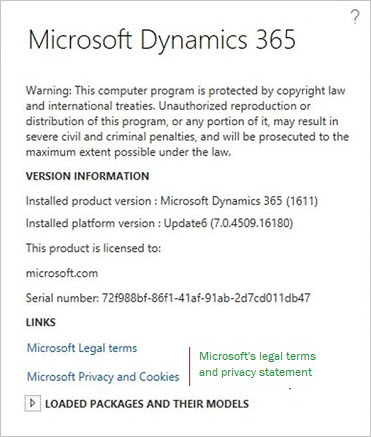
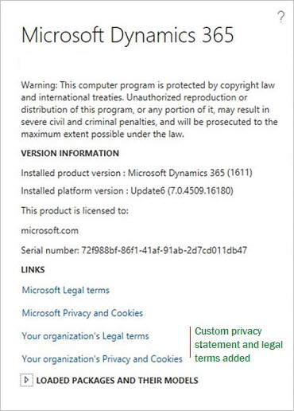

# General Data Protection Regulation overview

[!include [banner](../includes/banner.md)]

## Overview of the GDPR

The European Union's General Data Protection Regulation (GDPR) sets a new global standard for privacy rights, security, and compliance for the citizens and residents of the European Union (EU). The GDPR governs the handling and use of personal data of EU citizens and residents. Enforcement of the GDPR begins May 25, 2018, and there are significant consequences for non-compliance. For more information about the regulation, see the [European Union site](https://europa.eu/).

> [!NOTE]
> For information about the scope and coverage of this documentation, see [Clarification of the scope of this content](#clarification-of-the-scope-of-this-content) section at the end of this article.
>
> Before utilizing any product features in support of your GDPR compliance efforts, please ensure that you have applied all of the related hotfixes.

The GDPR gives EU citizens specific data subject rights (DSRs) that let them perform the following actions:

+ View their personal data.
+ Correct errors in their personal data.
+ Erase their personal data.
+ Object to processing of their personal data.
+ Export their personal data.

The GDPR defines personal data in the following way in article 4 of [the regulation](https://data.consilium.europa.eu/doc/document/ST-5419-2016-INIT/en/pdf) (organizations do not have personal data):

> (1) 'personal data' means any information relating to an identified or identifiable natural person ('data subject'); an identifiable natural person is one who can be identified, directly or indirectly, in particular by reference to an identifier such as a name, an identification number, location data, an online identifier or to one or more factors specific to the physical, physiological, genetic, mental, economic, cultural or social identity of that natural person;

To determine responsibilities for compliance, the GDPR identifies the following roles:

+ **Data controller** – The controller controls personal data and determines how it's used. The responsibilities of the controller include but are not limited to collecting, maintaining, directing actions, protecting, modifying and deleting personal data. The controller either adds users to the system, grants access to the system, and collects data from data subjects, or has employees who complete these tasks on the company's behalf. The burden of understanding the process for GDPR requests and carrying out a GDPR request rests with the controller.
+ **Data processor** – The processor provides services to, and processes data on behalf of, the data controller. The processor performs actions on behalf of the controller. The processor makes it possible for the controller to be GDPR compliant, but has no ownership of the data and does not respond directly to DSR requests.
+ **Data subject** – A data subject is a natural person whose personal information is being used.
+ **C1** – C1 is a Microsoft direct customer (IT Admin in the Enterprise Cloud).
+ **C2** – C2 is C1's customer.

For finance and operations apps, Microsoft acts as a processor. As a data processor, finance and operations provides processes and features that help you comply with your GDPR obligations as a data controller.

The following illustration shows the flow of data from your customer to the application database, and the roles that you and Microsoft play in that process. For each application, the controller is the tenant administrator, and Microsoft is the processor. In this scenario, the data is sent to the processor (Microsoft), who then processes the data by storing it, retrieving it, sorting it, and so on.

When a data subject chooses to submit a DSR, the data subject makes the request to the controller. Data subjects won't approach Microsoft to exercise their rights for data that your business has collected. As the processor, Microsoft assists the controller by providing features, or just by making sure that the actions are possible. In other words, the controller accepts and responds to a DSR request, and the processor assists with or enables the compliance request. The following table outlines some of the roles and responsibilities that are relevant.

<table>
<colgroup>
<col width="20%" />
<col width="45%" />
<col width="25%" />
<col width="10%" />
</colgroup>
<tbody>
<tr class="odd">
<td>
<strong>Role</strong>
</td>
<td>
<strong>Scenarios</strong>
</td>
<td>
<strong>Implementation</strong>
</td>
<td>
<strong>Level of data access</strong>
</td>
</tr>
<tr class="even">
<td>

<strong>Your customer (2)</strong>

</td>
<td>
<ul>
<li>View personal data </li>
<li>Correct personal data</li>
<li>Erase personal data </li>
<li>Object to processing</li>
<li>Export personal data</li></ul>
</td>
<td>

You must provide a mechanism for your customer to exercise a DSR (process or service).

</td>
<td>

Your customer sees only their personal data.

</td>
</tr>
<tr class="odd">
<td>

<strong>Your employee – information worker</strong>

</td>
<td>
<ul>
<li>View personal data </li>
<li>Correct personal data</li>
<li>Erase personal data </li>
<li>Object to processing</li>
<li>Export personal data</li></ul>
</td>
<td>

You must provide a mechanism for your worker to exercise a DSR (process or service). Some activity information may be obtained from Microsoft

</td>
<td>

Your information worker sees only their personal data.

</td>
</tr>
<tr class="odd">
<td>

<strong>Your employee – GDPR administrator</strong>

</td>
<td>
<ul>
<li>Validates the user identity request  </li>
<li>Locates the personal data across systems </li>
<li>Curates the data based on your policy</li>
<li>Creates a data package or executes an action</li>
</ul>
</td>
<td>
<ul>
<li>Uses finance and operations to locate the data and fulfill the request. </li>
<li>Writes a customization.</li>
<li>Reaches out to third parties for shared-controller DSRs.</li>
<li>Reaches out to Microsoft for activity data.</li> 
</ul>
</td>
<td>

Your GDRP administrator sees the data that has been obtained to fulfill the DSR request.

</td>
</tr>
</tbody>
</table>

## Responding to requests to view, correct, erase, object, or export personal data

Suppose that a customer decides that they want to understand what personal data of theirs is maintained by an organization. That customer approaches that organization and asks to exercise their DSR. When data subjects exercise their DSRs, controllers must address each of the following items specifically:

+ Properly identify the person and role (is the person an employee, a customer, a vendor?) by using information that the data subject gave you as part of their request. This information might be a name, an employee ID or customer number, or another identifier.
+ Record the date and time of the request. (You have 30 days to complete the request.)
+ Affirm that the DSR request is proper and valid. You will need to work with your legal counsel to determine what is valid. For example, you must make sure that compliance with a DSR request doesn't conflict with any other legal obligations that you have.
+ Verify that you have the information that is related to the request.

### Reasons why certain personal data may not be modified or deleted

The following table lists several reasons why personal data modification or deletion is restricted in certain scenarios.

| Reason | Comment |
|--------|---------|
| Financial, tax, generally accepted accounting principles (GAAP) | A party can't be deleted, but the party's name can be updated. |
| Financial, tax, GAAP | A current worker's data can't be deleted, but the worker's name can be updated. | 
| GAAP | Posted or completed transactions can't be modified. |

### Right to view

An organization might decide to take any of the following actions in response to a DSR request to view data:

+ Use the Person search report to find and collect personal data. To access this report, from the navigation pane, select **Modules > System administration > Inquiries > Person search report**. 
+ Extend the Person search report by authoring a new entity or extending an existing entity.
+ Use search and filter features to find specific personal data and export that data by using the Microsoft Office Export functionality or print that information to a .pdf using browser extensions.
+ Use provided documentation to identify data tables that contain data that the controller has identified as personal data.
+ Author a custom form that locates and exports personal data.
+ Author an external portal or website that allows an authenticated customer to see their personal data.

The Person search report might help you discover personal data that is subject to a DSR request. If the report doesn't include the information that you're looking for, check the Microsoft Dynamics Lifecycle Services (LCS) site for possible hotfixes that include the information. You can also extend the report yourself by creating additional entities, or extending the provided entities.

If the Person search report doesn't contain all the information that the data subject is requesting, you can extend it by using tools that Microsoft has provided. For information about how to extend the Person search report, see [Extend the Person search report](./gdpr-extend-person-search-report.md).

### Right to correct\* \**

An organization might decide to take any of the following actions in response to a DSR request to correct data:

+ Use the Person search report to find and collect personal data. 
+ Extend the Person search report by authoring a new entity or extending an existing entity.
+ Use search and filter features to find specific personal data.
+ Author a custom form that locates personal data.
+ Author an external portal or website that allows an authenticated customer to correct their personal data.

When data is located, use in-product features to correct the data where the product offers the ability to do so.

\*You might find that some data that qualifies as personal data can't be modified directly. Typically, this data is part of a financial transaction or other business data that is kept "as is" for compliance with financial laws (for example, tax laws), prevention of fraud (such as security audit trail), or compliance with industry certifications.

\** GDPR is not a law exclusive of all other laws. As an enterprise resource planning system, finance and operations doesn't allow for modification of certain business or transactional data, and will not endorse nor provide functionality for the modification of business data that is necessary for compliance with other laws or certifications. Finance and operations will not provide support for modifications/customizations or other actions that result in the corruption of referential or business data integrity.

### Right to be forgotten\*

An organization might decide to take any of the following actions in response to a DSR request to erase data:

+ Delete or otherwise erase personal data where the product enables that action directly.
+ Anonymize the personal data where the product enables that action directly.
+ Author a customization to erase/modify the personal data.

\* GDPR is not a law exclusive of all other laws. As an enterprise resource planning system, finance and operations does not allow for deletion of certain business or transactional data, and will not endorse nor provide functionality for the deletion of business data that is necessary for compliance with other laws or certifications. Finance and operations will not provide support for modifications/customizations or other actions that result in the corruption of referential or business data integrity.

### Right to port

An organization might decide to take any of the following actions in response to a DSR request to port data:

+ Use the Microsoft Office Add-in to export personal data.
+ Author a custom report that enables the export of personal data.
+ Author a customization that exports personal data.
+ Use or extend the Person search report to gather information in support of a request for a copy of the data subject's personal information.

The Person search report might help you discover personal data that is subject to a DSR request. If the report doesn't include the information that you're looking for, check the LCS site for possible hotfixes that include the information. You can also extend the report yourself by creating additional entities.

If the Person search report doesn't contain all the information that the data subject is requesting, you can extend it by using tools that Microsoft has provided. For information about how to extend the Person search report, see [Extend the Person search report](./gdpr-extend-person-search-report.md).

The controller may, at their sole discretion choose to redact certain types of information that may fall outside of the scope of data that must be returned to the data subject as defined within the GDPR.

## Right to restrict

An organization might decide to take the following action in response to a DSR request to restrict optional data processing:

+ Remove the customer from, for example, a marketing campaign.

\* GDPR is not a law exclusive of all other laws. As an enterprise resource planning system, finance and operations does not allow for restricted processing of certain business or transactional data, and will not endorse nor provide functionality for the restriction of processing of business data that is necessary for compliance with other laws or certifications. Finance and operations will not provide support for modifications/customizations or other actions that result in the corruption of referential or business data integrity.

## Controller considerations

Controllers can use the following information to complete DSR requests.

#### System inventory

+ **Data inventory and tagging** – Microsoft has enabled a tagging infrastructure that developers and customers can use. Each data field that is defined in metadata contains a classification property that has a suggested value that the controller can confirm or change to any value or term they choose in order to identify data that they deem fits within the definition of personal data.
+ **Data flow diagram** – Microsoft will publish a data flow diagram that identifies flows of data between systems in the customers production environments.
+ **Person search report** – Finance and operations includes the Person search report, which can be used to gather information in support of a request for a copy of the requestor's personal information. 

## Activity and diagnostic information

The controller can make DSR requests regarding telemetry data by using the [Microsoft Enterprise Privacy Portal](https://www.microsoft.com/trustcenter/privacy). Some telemetry data that we collect is in system generated logs. Without additional information or your assistance, the user's identity is anonymous.

## Representation of a person in finance and operations

Finance and operations has a common [Global address book](../../fin-ops/organization-administration/overview-global-address-book.md). Typically, every time that you add a contact, customer, user, worker, or other person in your system, you first create an address book entry for that person. Each person in the address book is referred to as a party and is assigned a PartyID. The person also takes on a role in the system, such as Customer, User, or Worker, and has a role ID: CustID, UserID, WorkerID, and so on.

### Each person is a type of party

Roles that are associated with party records are referred to as party roles. There are several party roles, and they can be assigned to both party types (person and organization):

+ **Customer** – An individual, company, or other entity that purchases goods and services that are produced by other individuals, companies, or entities.
+ **Prospect** – A party that might be interested in goods or services an organization provides.
+ **Worker** – A person who assumes the role of an employee or a contractor, or who is paid in exchange for services.
+ **User** – A person who is a user of the system. The user isn't identified in the Global address book.
+ **Vendor** – A party that supplies products to one or more legal entities in exchange for payment.
+ **Competitor** – A person or organization that provides goods or services that are like the goods or services that your business provides. Out of the box, there is no particular identification for competitors.
+ **Applicant** – A person who makes a formal written or electronic request to work for an organization or fill an open position in it.
+ **Contact** – A person, either inside or outside your organization, that you've created an entry for. In this entry, you can save information such as the person's street and email addresses, telephone and fax numbers, and webpage URLs.

### The right to view and port: It's all about the party

When a data subject approaches the controller to request a copy of their personal data, the controller might choose to use the Global address book information to locate the data that describes the person. As noted in the illustration earlier in this article, a **person** is a type of **party** that plays a **role**.

Some organizations conduct their activities only through business-to-business relationships and will have modest DSR obligations. By contrast, other organizations conduct their activities through business-to-customer relationships. These organization might choose to use the Global address book and its associative data relationship to write custom reports, custom forms, custom queries, and custom data export features by using the extensibility and customization capabilities and [Open in Excel](..//office-integration/office-integration-edit-excel.md) experiences to serve the specific needs of the kinds of data that their business collects from their customers.

## The Person search report

To support the controller, this report offers a refinement of the existing entity model reporting functionality that is available in the **Data management** workspace. The **Data management** workspace offers a collection of pre-packaged representations of most role types. These representations are known as entities.

> [!NOTE]
> The Person search report is available for Finance, Supply Chain Managament, Commerce, and Human Resources. Currently the report does not support Microsoft Dynamics AX 2012. 

An entity represents an instance of a specific role. The data management functionality lets the controller export entity data to several formats, such as colon-separated values, comma-separated values (CSV), semicolon-separated values, tab-separated values, Microsoft Excel, and XML.

The Person search report provides additional capabilities in the **Data management** workspace that export entity data by providing a party ID that is used to identify **all** roles (and corresponding entities) that are associated with the party. This capability lets you export all entity and transaction data in a single action, for either a single party or a collection of parties.

When a data subject approaches the controller to request a copy of their personal data, the controller might choose to use the Global address book information to locate the data that describes the person. As noted in the illustration earlier in this article, a **person** is a type of **party** that plays a **role**.

Some organizations conduct their activities only through business-to-business relationships and will have modest DSR obligations. By contrast, other organizations conduct their activities through business-to-customer relationships. These organization might choose to use the Global address book and its associative data relationship to write custom reports, custom forms, custom queries, and custom data export features by using the extensibility and customization capabilities and [Open in Excel](../office-integration/office-integration-edit-excel.md#how-do-i-add-an-explicit-button-for-a-template-open-in-excel-option) experiences to serve the specific needs of the kinds of data that their business collects from their customers.

## Additional notes that apply to requests for data

+ Data in Management Reporter and in Microsoft Power BI presentations is generated from the information that is entered in various financial documents and then transferred to those applications for reporting purposes. Any request for data should be fulfilled from the financial documents by using tools such as reports, Export to Excel, and the Person search report. You should not need to do additional reporting from Management Reporter or Power BI to fulfill a GDPR request unless you have made customizations that have altered the base functionality.
+ Personal data that is included in documents or attachments might also need to be returned to the data subject, independent of any reporting.
+ If a master record has transactional data associated with it, it can't be deleted.
+ Similarly, transactions that have been posted or completed can't be deleted.

### Reasons why finance and operations might not support modifying or deleting data out of the box

The following table lists several reasons why data modifications might be restricted.

|Reason | Comment |
|-------|---------|
| Audit | Data must be preserved for compliance and auditing. |
| Calculated | Data that has been calculated can be changed only by changing the data that is included in the calculation. |
| Financial, tax, generally accepted accounting principles (GAAP) | Posted transactions can't be modified or deleted. |
| Import log | Data must be preserved for compliance and auditing. |

### What types of personal data might exist in the product

You should expect data requests to come to your company. You can categorize the people who request data into one or, in some cases, more than one relationship with your company:

+ Customers 
+ Vendors
+ Workers
+ Users
+ Warehouse workers
+ Truck drivers
+ Prospects
+ Contacts
+ Applicants
+ Competitors

Personal data might also be contained in other roles that aren't listed here. Pages used to enter, view or edit personal data have been provided in worksheets for most roles in the preceding list. You can view or download the spreadsheets from the [Reference documents for finding and managing personal data](/dynamics/s-e/) page on CustomerSource. 

## Detailed inventory

As you use finance and operations apps, you might find that you generate or collect large amounts of data that resides in multiple data stores. To help you make sense of where your data resides, we've introduced a data marker for each piece of data in our data stores. This marker is called "Asset Classification," and it can be used to identify or track personal data. Any data that you collect has been described as "customer content." Some customer content might contain personal data, and some customer content might contain business data. You can choose to treat all customer content as personal data, or you can change the classification yourself, so that you can identify and track any data that you feel is considered "Personal Data." Although Microsoft has a supplied a set of default classifications, you're free to use any classification or identifiers that you choose.

<!--
<Link to documentation on how to modify asset classifications>
<Asset Classification table>
<Link to form that prints the full inventory>
-->

## Age Gating: Preventing minors from using the service

### Overview

Microsoft mandates that all users of Microsoft software where personal data is collected must use a Microsoft account (MSA) or Microsoft Azure Active Directory (Azure AD) account for authentication. Additionally, those accounts must be configured to enable minors who use the software or service to affirm parental consent for the service to use their personal data.

### What is this feature?

As the tenant admin of the service, you will be required to set up Azure AD Age Gating and/or MSA age gating.

Any user who isn't configured by using Azure Age Gating will be restricted from using the service, even if the user isn't a minor. Age Gating must be configured.

We will restrict access to our software and systems by using a sign-in age gate.

### How will age gating work?

The GDPR specifies that systems must stop processing a minor's personal data if that minor doesn't have parental consent. Note that consent can be given and then withdrawn. Therefore, a user might have access to the system one day but not the next.

## Privacy notices and user subject rights

### Displaying your organizations user rights and privacy notice

In the **About** box, you will find links to the Microsoft user rights documentation, and to the Microsoft privacy and cookies documentation. You can also add a link to your organization's privacy statement.

On the **System parameters** page, system administrator can add links to the organization's user rights and privacy notices. You can add a valid URL for one or both notice types.

When you've completed your entries in the system parameters, the link to your organization's privacy notice will appear in the **About** box, as show in the following illustration.

## Clarification of the scope of this content

+ This documentation is a commentary on the GDPR, as Microsoft interprets it, as of the publication date. We have spent a lot of time with the GDPR and believe that we have been thoughtful about its intent and meaning. But the application of the GDPR is highly fact-specific, and not all aspects and interpretations of the GDPR are well-settled.
+ This documentation is provided for informational purposes only, and should not be relied upon as legal advice or to determine how the GDPR might apply to you and your organization. We encourage you to work with a legally qualified professional to discuss the GDPR, how it applies specifically to your organization, and how to best ensure compliance.
+ MICROSOFT MAKES NO WARRANTIES, EXPRESS, IMPLIED, OR STATUTORY AS TO THE INFORMATION PROVIDED IN THIS PRESENTATION. This documentation is provided "as is." Information and views expressed in this documentation, including URL and other Internet website references, may change without notice.
+ This documentation does not provide you with any legal rights to any intellectual property in any Microsoft product. You may copy and use this presentation for your internal, reference purposes only.

[!INCLUDE[footer-include](../../../includes/footer-banner.md)]

