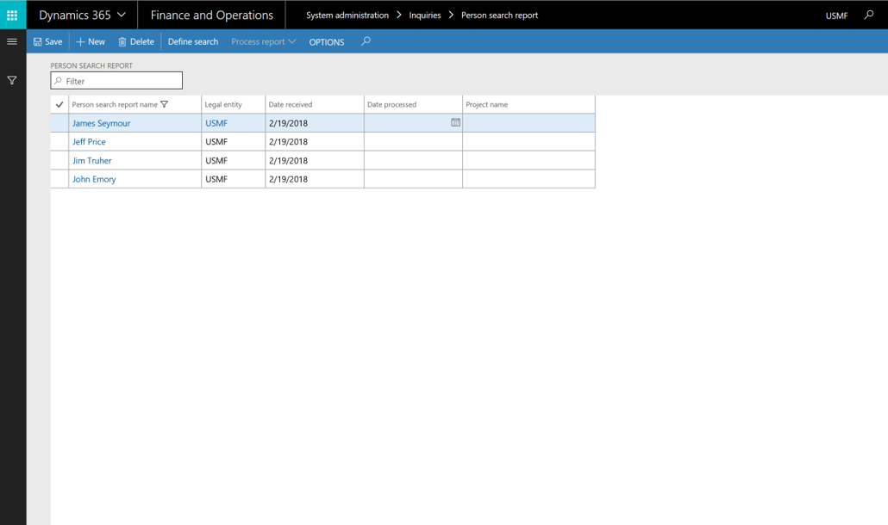
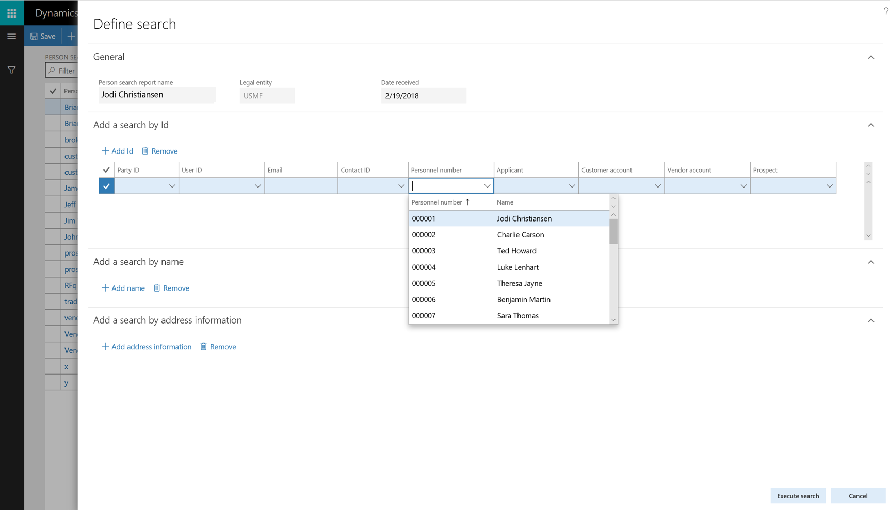
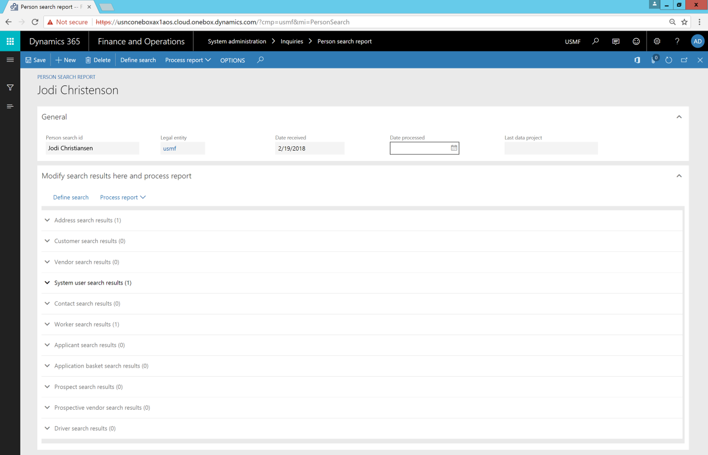
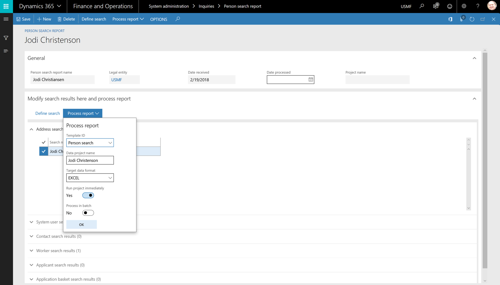

# Person search report

[!include [banner](../includes/banner.md)]

The Person search report is a refinement of the existing Data management framework of finance and operations apps. The Data management framework offers a pre-packaged set of entities that Microsoft authored to identify personal data that is used to define a person and the roles that a person might be assigned to in finance and operations applications. 

> [!NOTE]
> You can use the report with Dynamics 365 Finance, Supply Chain Management, Commerce, and Human Resources. The report is not currently available for Microsoft Dynamics AX 2012. The Person search report is available in version 8.0. The report is also available in version 7.3 (delivered via monthly update 7.3.2), in version 7.2 (via KB 4132615), and in version 7.1 (via KB 4132441). The Person search report may be updated periodically. Before using this report, you need to ensure that you have obtained and applied all relevant hotfixes. 

You can use the Global address book to create an instance of a person that is described in the data model as a party. 

When you add a contact, customer, user, worker, or other person in finance and operations data, you typically start by creating an address book entry for that person. Each person in the address book is referred to as a party and is assigned a PartyID. The person also takes on a role in the system, such as customer, user, or worker, and has a role ID: CustID, UserID, WorkerID, and possibly others.

At times, you might want to verify that the information that is entered and used to describe or otherwise identify a person is correct. Situations might also arise where it's useful to share that information with the data subject who requested the data. The Person search report can help with both these tasks.

The Person search report is extensible. If you find that the existing entities do not contain all of the personal data you are looking for, they can be extended, or new entities can be written. In addition, you can change the data mappings for each entity and remove fields that you don't want to export.

The Person search report lets you specify different identifiers for a person, such as a CustomerID or VendorID. It will then collect, filter, and populate the entity collection set with personal data that is related only to the person you specified.

On rare occasions, a single person might be entered in your system more than once. The Person search report lets you specify each person instance to be included on a single report. For example, someone named Fred Smith might be both "Fred Smith" and "F. D. Smith" in your address book.

An individual might exist as multiple parties in data. You can provide multiple identifiers for each party type, and each party type's personal data will be included on a single report.

## Download the default template

The Person template contains a list of the entities that will be used to download information. The template must be loaded before the Person search report can be used. The template can be loaded from within the Templates form in Data management for versions 7.2 and later. To download templates fronm **Data management**, complete the following steps. 

1. Open the **Data management** workspace.
2. If this is the first time that the workspace has been opened, it will load all of the data entities. You must load all the data entities before you load the template.
3. Click the **Templates** tile.
4. Select the **Load default templates** button.
5. Select **Person search**.
6. Click  **Load selected**.

You can also download a template from LCS and import it for versions 7.1 or later. To do so, complete the following steps.
1.    Log in to LCS.
2.    Click the **Shared asset library** tile.
3.    Select the **Data package asset** type.
4.    Click the template named **Template-x.x-Person search**, where x.x is the application version that you're using, and download it.
5.    Open the **Data Management** workspace.
6.    If this is the first time that the workspace has been opened, the workspace will load all of the data entities. All entities loaded before you download the template.
7.    Click on the **Templates** tile.
8.    Create a new template called **Person search**.
9.    Click **Import template**.
10.    Browse to the template and click **Upload**.
11.    Click **OK** to import the template.

## Generate a person search

To use the Person search report, you must complete these tasks.

1. From the System administration menu, open the Person search list page, and create a new search.

   

2. The search gives you three options: you can search by ID, by name, or by address. Add the type of search that you want.

   

3. Run the search to show the results.
4. Verify that the results are valid. Clear any selections that return information that you don't want to include on the report.

   

5. Select **Process report**, and then select the Person search template.

    

6. Select **OK**. A data package is generated.
7. When the package has been generated, export it to your selected data format. 

> [!NOTE]
> Documents that are attached to records are not included in the data export. Attachments must be manually downloaded and shared with the individual who requested personal data.

### Disclaimer
(c)2019 Microsoft Corporation. All rights reserved. This document is provided "as-is." Information and views expressed in this document, including URL and other Internet Web site references, may change without notice. You bear the risk of using it. This document does not provide you with any legal rights to any intellectual property in any Microsoft product. You may copy and use this document for your internal, reference purposes. 

[!INCLUDE[footer-include](../../../includes/footer-banner.md)]
