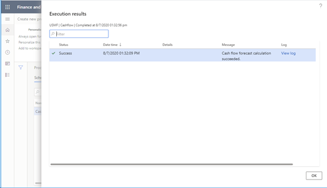

# Log results and messages

[!include [banner](../includes/banner.md)]

The process automation framework supports logging of results and messages. There are two reasons why a process should log results and messages:

- Results and the message log communicate the state of a process to the system admin or other roles that have access. It's important that process results be monitored and seen by someone. If failures occur, they can be fixed, or an issue can be raised with the process owner.
- Results should communicate what the process did. For example, if the process posts vendor invoices, the results can show all the vendor invoices. In this case, each result will show the status and a link to the vendor invoice.

Results and messages are a multilevel logging system. A process has one or more results. Each result has one or more messages that are specific to it. A message is a composition child of the result. A result is typically something that the process is processing. For example, if the process posts vendor invoices, you log each vendor invoice as a result. Then, for each posting of each vendor invoice, you can log multiple messages that are associated with that result. If a vendor invoice is successfully posted, it's OK to leave the message log blank, because the success of the operation should be obvious when users look at the result. If warnings occur, you should write them to the message log, even if posting was successful. These messages provide transparency, so that users can see what each process is doing and what the results are.

Both scheduled processes and polled processes support logging of results and messages. All processes should create a result. At a minimum, the result should communicate the fact that everything was successful. Processes that do work that affects user work and is visible to users should create more detailed results. For the vendor invoice posting example that was used earlier, users might want to see that their invoices have been posted. Results that don't show that information can cause confusion, even if the information is available in other ways.

The following illustration shows the result view.

The following illustration shows the message view. To open this view, select **View log** in the **Log** column in the result view.

## ProcessExecutionSourceLink table

The **ProcessExecutionSourceLink** table contains the results that are created while the processing is running. This table contains **RefTableId** and **RefRecId** fields. These fields are links to any source record in Microsoft SQL Server and are typically something that the process is processing. This table also contains **Header** and **Message** fields. The **Header** field will be shown as a column in the result grid. The message can be anything that you want it to be.

For example, if vendor payment proposal is creating a payment journal, the **RefTableId** value is the table ID of the **LedgerJournalTable** table. The **RefRecId** value is the **RecId** value of the **LedgerJournalTable** record that the payment journal created by the running process. In this case, you can set the **Header** field to the journal number. You can even make this value a jump reference, so that users can select the journal number to go directly to the payment journal. You can set the **Message** field to any message that you want to show, such as **Payment journal created successfully**.

If the process is processing many items (for example, if it's posting many invoices), you can create a **ProcessExecutionSourceLink** record for each invoice.

If the number of items that the process is processing is very large (in the millions), and users don't have to see the details of each item, consider summarizing the items into batches. For example, the process for subledger transfer to the general ledger creates a **ProcessExecutionSourceLink** record for each transfer ID that is transferred to the general ledger, not for each voucher that is transferred.

| Method | Description |
|---|---|
| `public static void insertSourceLinks(ProcessScheduleTypeName _typeName, ProcessExecutionSourceLinkTmp _tmp)` | This method is new in version 10.0.14. It inserts many results into the **ProcessExecutionSourceLink** table by using set-based insert. |
| `public static ProcessExecutionSourceLink insertSourceLink(ProcessExecutionSourceLinkItem _sourceLinkItem)` | This method inserts a record into the **ProcessExecutionSourceLink** table. |

## ProcessExecutionSourceLinkItem class

Instantiate the **ProcessExecutionSourceLinkItem** class, and fill it with values that are required to correctly show your source item.

| Method | Description |
|---|---|
| `public static ProcessExecutionSourceLinkItem newFromProcessScheduleWorkItemAndStatus(ProcessScheduleWorkItem _workItem, ProcessExecutionSourceStatus _status)` | Use this constructor to create an instance of **ProcessExecutionSourceLinkItem**. This method correctly initializes many of the required fields from **ProcessScheduleWorkItem**. |
| `public static ProcessExecutionSourceLinkItem newFromProcessExecutionSourceLink(RefRecId _processExecutionSourceLinkRecId)` | This method constructs an instance of **ProcessExecutionSourceLinkItem** and initializes the instance by using the specified record ID of a **ProcessExecutionSourceLink** record. |
| `public RefRecId parmSourceRecId(RefRecId _sourceRecId = sourceRecId)` | Set the record ID of the source record. For example, this value might be the record ID of the vendor invoice header table. |
| `public RefTableId parmSourceTableId(RefTableId _sourceTableId = sourceTableId)` | Set the table ID of the source table. For example, this value might be the table ID of the vendor invoice header table. |
| `public ProcessExecutionSourceLinkHeader parmHeader(ProcessExecutionSourceLinkHeader _header = header)` | Set the value for the header field. For the vendor invoice posting example that was used earlier, this value might be the invoice number. |
| `public ProcessExecutionSourceLinkMessage parmMessage(ProcessExecutionSourceLinkMessage _message = message)` | Set the message. For the vendor invoice posting example that was used earlier, this value might be **Posting successful**. |
| `public ProcessExecutionId parmExecutionId(ProcessExecutionId _executionId = executionId)` | This method sets the execution ID. This value was provided via **ProcessScheduleWorkItem** in the implementation of the **ProcessAutomationTask** interface. |

## ProcessExecutionMessageLog table

The **ProcessExecutionMessageLog** table contains messages that are related to a single **ProcessExecutionSourceLink** record. You can write any type of message to this table. The message will then be shown to users.

| Method | Description |
|---|---|
| `public static void insertMessages(ProcessScheduleTypeName _typeName, ProcessExecutionMessageLogTmp _tmp)` | This method inserts messages into the **ProcessExecutionMessageLog** table by using a set-based insert. |
| `public static ProcessExecutionMessageLog insertMessage(ProcessExecutionMessageLogItem _errorLogItem)` | This method inserts a message into the message log. |

## ProcessExecutionMessageLogItem class

The message log stores messages as both strings and label IDs. You don't have to set both values. Label IDs are preferred, because they support translation of messages in the user interface (UI) for the message log. However, the messages are provided for backward compatibility with processes that don't support logging of label IDs.

Use the appropriate constructor for your scenario.

| Method | Description |
|---|---|
| `public static ProcessExecutionMessageLogItem newFromProcessExecutionSourceLinkAndMessage(RefRecId _processExecutionSourceLinkRecId, Exception _exception, ProcessExecutionMessage _message)` | |
| `public static ProcessExecutionMessageLogItem newFromProcessExecutionSourceLinkAndLabel(RefRecId _processExecutionSourceLinkRecId, Exception _exception, LabelId _labelId, container _labelParameters)` | |

[!INCLUDE[footer-include](../../../includes/footer-banner.md)]
