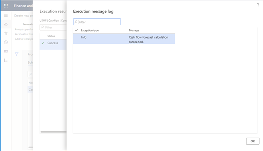

---
# required metadata

title: Log results and messages
description: This topic describes how to log results and messages from process automation.
author: RyanCCarlson2
manager: AnnBe
ms.date: 09/10/2020
ms.topic: article
ms.prod: 
ms.service: dynamics-ax-platform
ms.technology: 

# optional metadata

# ms.search.form: 
# ROBOTS: 
audience: Developer
# ms.devlang: 
ms.reviewer: rhaertle
ms.search.scope: Operations
# ms.tgt_pltfrm: 
ms.custom:
ms.search.region: Global
# ms.search.industry: 
ms.author: rcarlson
ms.search.validFrom: 2020-09-10
ms.dyn365.ops.version: AX 7.0.0
---

# Log results and messages

The process automation framework supports logging of results and messages. There are two reasons why a process should write results and messages:

1. Results and the message log communicate to the system administrator or whichever roles have access the state of a process. It's important that process results are monitored and seen by someone. If failures occur, they can either be fixed or an issue raised with the process owner.
2. Results should communicate what the process did. If the process posts Vendor Invoices then the results should show all the vendor invoices with the status of each that were posted with links to drill into each vendor invoice.

Results and messages are a multi-level logging system. A process has one or more results. Each result has one or more messages specific to that result. A message is a composition child of the result. A result is typically something the process is processing. For example, if the process is posting vendor invoices then you would log each vendor invoice as a result. You could then log multiple messages associated this result for each posting of each vendor invoice. If the posting of the vendor invoice is successful it's ok to leave the message log empty as the success of the operation should be obvious when looking at the result. If warnings occur, then you should write them to the message log even if the posting was successful. This gives transparency to the users as to what each process is doing and what the results are.

Both scheduled processes and polled processes support result and message logging. All processes should create a result. At the very least the result should communicate that everything was successful. For processes that are doing work that affects user work and is visible to users they should create results that are more detailed. Using the vendor invoice example from above, users want to see that their invoices are posted. If the results don’t show that then it will cause confusion, even if there are other ways to see this information.

This screen shot is the results view.

This screen shot is the message view and is accessed by clicking view log from the result view.

## ProcessExecutionSourceLink table

This table contains the results that are created while the processing is running. This table contains a **RefTableId** and a **RefRecId**. These are links to any source record in SQL and are typically something the process is processing. This table contains **Header** and **Message** fields. The **Header** field will be displayed as a column in the results grid. The message can be anything we want it to be. For example, if vendor payment proposal is creating a payment journal then the **RefTableId** would be the table ID of **LedgerJournalTable**. The **RefRecId** would be the **RecId** of the **LedgerJournalTable** record that the payment journal created by the executing process. We could set the **Header** field to be the **Journal Number**. You can even make this a jump reference so the user can click on the journal number which would take them directly into the payment journal. The **Message** field can contain any message we want to display. For example, **Payment journal created successfully**.

If the process is processing many items such as posting many invoices then you can create as many **ProcessExecutionSourceLink** records as you have invoices.

If the process is processing large numbers of items (millions) then consider summarizing them into batches if users don’t need to see the details of each. For example, the subledger transfer to GL process creates a record in this table for each Transfer ID transferred instead of a record for each voucher transferred to GL.

Method | Description
---|---
`public static void insertSourceLinks(ProcessScheduleTypeName _typeName, ProcessExecutionSourceLinkTmp _tmp)` | New in 10.0.14. Inserts a large amount of results into **ProcessExecutionSourceLink** using set based insert.
`public static ProcessExecutionSourceLink insertSourceLink(ProcessExecutionSourceLinkItem _sourceLinkItem)` | Inserts a record in the **ProcessExecutionSourceLink** table.

## ProcessExecutionSourceLinkItem class

Instantiate this class and populate it with values needed to display your source item properly.

Method | Description
---|---
`public static ProcessExecutionSourceLinkItem newFromProcessScheduleWorkItemAndStatus(ProcessScheduleWorkItem _workItem, ProcessExecutionSourceStatus _status)` | Use this constructor to create an instance of **ProcessExecutionSourceLinkItem**. This will initialize many of the required fields from the **ProcessScheduleWorkItem** correctly.
`public static ProcessExecutionSourceLinkItem newFromProcessExecutionSourceLink(RefRecId _processExecutionSourceLinkRecId)` | Constructs an instance of **ProcessExecutionSourceLinkItem** initializing the instance using the specified record ID of a **ProcessExecutionSourceLink** record.
`public RefRecId parmSourceRecId(RefRecId _sourceRecId = sourceRecId)` | Set the record ID of the source record. For example, this could be the record ID of the Vendor Invoice header table.
`public RefTableId parmSourceTableId(RefTableId _sourceTableId = sourceTableId)` | Set the table ID of the source table. For example, this could be the table ID of the Vendor Invoice header table.
`public ProcessExecutionSourceLinkHeader parmHeader(ProcessExecutionSourceLinkHeader _header = header)` | Set the value for the header field. For the Vendor Invoice posting example, this could be the invoice number.
`public ProcessExecutionSourceLinkMessage parmMessage(ProcessExecutionSourceLinkMessage _message = message)` | Set the message. This could be something like **Posting successful**.
`public ProcessExecutionId parmExecutionId(ProcessExecutionId _executionId = executionId)` | Sets the execution ID. This was provided via **ProcessScheduleWorkItem** in the **ProcessAutomationTask** interface implementation.

## ProcessExecutionMessageLog table

This table contains messages related to a single ProcessExecutionSourceLink record. You can write any kind of message to this table and it is displayed to the user.

Method | Description
---|---
`public static void insertMessages(ProcessScheduleTypeName _typeName, ProcessExecutionMessageLogTmp _tmp)` | Inserts messages into the **ProcessExecutionMessageLog** using a set-based insert.
`public static ProcessExecutionMessageLog insertMessage(ProcessExecutionMessageLogItem _errorLogItem)` | Inserts a message into the message log.

## ProcessExecutionMessageLogItem class

The message log stores messages as strings and messages as label IDs. You don't need to set both. Label ID is preferred, because it supports translation of messages in the Message Log UI. However, the message is provided for backward compatibility with those processes that don’t support logging label IDs.

Use the appropriate constructor for your scenario.

Method | Description
---|---
`public static ProcessExecutionMessageLogItem newFromProcessExecutionSourceLinkAndMessage(RefRecId _processExecutionSourceLinkRecId, Exception _exception, ProcessExecutionMessage _message)` |
`public static ProcessExecutionMessageLogItem newFromProcessExecutionSourceLinkAndLabel(RefRecId _processExecutionSourceLinkRecId, Exception _exception, LabelId _labelId, container _labelParameters)` |
