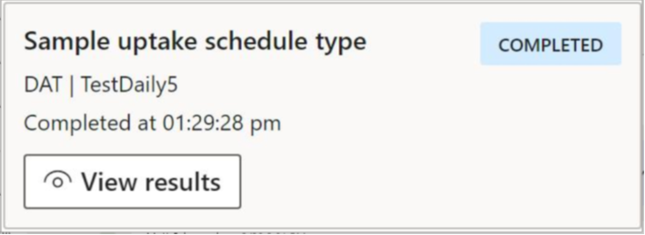

# Customize the user interface

[!include [banner](../includes/banner.md)]

The process automation framework supports some customizations of the user interface (UI). Most of this topic is optional, because the framework provides default values for everything. The only exception is the **ProcessScheduleSeries** form. If you intend to show the **ProcessScheduleSeries** form for a specific product area, customizations are required so that the framework can show data that is specific to that product area.

## Weekly calendar view

### ProcessScheduleIBuildOccurrenceCard interface

The **ProcessScheduleIBuildOccurrenceCard** interface lets you customize the appearance of occurrence cards in the weekly calendar view. There is a static method on the interface for each status of an occurrence: **Scheduled**, **Waiting**, **Running**, **Successful**, **Failed**, and **Disabled**. You can create a customized occurrence card for each status value. Each of these methods returns an instance of **ProcessScheduleOccurrenceCard**.

The process automation framework provides a default implementation in the **ProcessScheduleOccurrenceCardBuilder** class. You inherit from this class and override the functionality as you require. You then register your derived class via the **SysPlugin** for your specific type. The registration process resembles the process for many of the plug-ins in the framework documentation.

An instance of **ProcessScheduleOccurrenceCardBuilderContract** is passed into each of the methods and can be used to retrieve information about the occurrence. The derived class can invoke the default implementation for each static method that returns the **ProcessScheduleOccurrenceCard** instance, modify whatever is required, and return it.

### ProcessScheduleOccurrenceCard class

The **ProcessScheduleOccurrenceCard** class lets you customize the appearance of an occurrence card that is shown in the calendar view. The first two lines are controlled by the process automation framework and can't be modified. In the following illustration, the subheader is the **Completed at** phrase, and the status message is the word **Completed** that has a blue background.



| Method | Description |
|---|---|
| `public str parmSubHeader(str _subHeader = cardSubHeader)` | The subheader, which is the third line of the occurrence card that is shown in the previous illustration. |
| `public str parmStatusMessage(str _statusMessage = statusMessage)` | The status message, which represents the status of the process and has a colored background. |
| `public ProcessExecutionOccurrenceCardStatusColor parmStatusColor(ProcessExecutionOccurrenceCardStatusColor _statusColor = statusColor)` | The color of the background for the status message. |

### ProcessScheduleIShowOccurrenceCalendarView interface

The **ProcessScheduleIShowOccurrenceCalendarView** interface must be implemented by forms that will show the weekly calendar view. The **ProcessScheduleSeries** form is an example of a form that implements this interface.

| Method | Description |
|---|---|
| `ProcessScheduleOccurrenceCalendarViewContract getProcessScheduleOccurrenceCalendarViewContract()` | Return the contract that the weekly view will use to determine which types should be shown. |
| `void refreshAfterChangeToCalendarView()` | This value is a callback from the weekly view. It indicates that the parent form should be refreshed because of changes in the weekly calendar view. |

### ProcessScheduleOccurrenceCalendarViewContract class

Use the **ProcessScheduleOccurrenceCalendarViewContract** class to limit the series that the weekly calendar view should show. For an example, see **ProcessScheduleSeries.getProcessScheduleOccurrenceCalendarViewcontract** in the Application Object Tree (AOT).

| Method | Description |
|---|---|
| `public static ProcessScheduleOccurrenceCalendarViewContract construct()` | Use this constructor if the intention is to show occurrences for one to many types. |
| `internal static ProcessScheduleOccurrenceCalendarViewContract newFromScheduleSeries(ProcessScheduleSeries _scheduleSeries)` | Use this constructor if the intention is to show occurrences for a single series. |
| `public void AddScheduleType(ProcessScheduleTypeName _scheduleTypeName)` | If you aren't showing just one series, use this value to add the types that should be shown. |

### ProcessScheduleOccurrenceCalendarViewRenderer class

Use the **ProcessScheduleOccurrenceCalendarViewRenderer** class to render the weekly calendar view in an existing form. A form part will be created and correctly initialized. An example of this class is used in the **ProcessScheduleSeries** form.

| Method | Description |
|---|---|
| `public static ProcessScheduleICalendarView renderCalendarViewInFormControl(FormGroupControl _containingGroupControl)` | This method renders the weekly calendar view in the specified form group control. |

### Render interfaces

Several interfaces enable customization of the way that occurrence processes are rendered in the calendar view. There is one interface for each status that a process can have:

- ProcessScheduleIRenderDisabledOccurrenceCard
- ProcessScheduleIRenderFailedOccurrenceCard
- ProcessScheduleIRenderRunningOccurrenceCard
- ProcessScheduleIRenderScheduledOccurrenceCard
- ProcessScheduleIRenderSuccessfulOccurrenceCard
- ProcessScheduleIRenderWaitingOccurrenceCard

All these interfaces follow the same pattern. An instance of **ProcessScheduleOccurrenceCardRendering** is sent to them. That instance is used to control how the occurrence card is rendered.

For an example, see the **CustVendPaymProposalAutomationOccurrenceCardRenderer** class in the AOT.

### ProcessScheduleOccurrenceCardRendering class

| Method | Description |
|---|---|
| `public ProcessScheduleOccurrence getOccurrenceBeingRendered()` | This method returns the occurrence that is being rendered on the occurrence card. |
| `public ProcessExecutionExecutingInformation getOccurrenceExecutionInformation()` | This method returns the running information for the occurrence. This information typically includes the results of the batch job, the start time, and the end time. |
| `public void makeCardSubHeaderInvisible()` | This method makes the card's subheader invisible. See the illustration earlier in this topic and the content below it to determine which line is the subheader. |
| `public void makeCardButtonsInvisible()` | This method specifies whether the **Disable** and **Edit** buttons on the occurrence card are invisible. |
| `public void setColumnsOnOccurrenceCardDetailGroup(int _numberOfColumns)` | This method enables the number of columns on the occurrence card to be customized. By default, there are two columns. |
| `public FormButtonControl addButtonControl(FormControlName _buttonControlName)` | This method enables a new button to be added to the occurrence card. |
| `public FormStaticTextControl addStaticTextControl(FormControlName _staticTextControlName)` | This method enables a static text control to be added to the occurrence card. |
| `public FormStringControl addStringControl(FormControlName _stringControlName, LabelId _stringControlLabel)` | This method adds a string control to the occurrence card. |

## Series list page

### ProcessScheduleISeriesFormController interface

The **Series** list page uses the **ProcessScheduleISeriesFormController** controller to determine which types series will be shown for on the **ProcessScheduleSeries** list page. This class uses the **SysPlugIn** class. The menu item that you use to open the **ProcessScheduleSeries** form is used as the key to invoke the specified plug-in. This key enables each use of this form to customize which types are shown.

```xpp
// Implementation of the ProcessScheduleISeriesFormController for the admin view of the process schedule Series form.
// This implementation will show series for all process types, both scheduled and polled, on the Series form.
[Export(identifierStr(Dynamics.AX.Application.ProcessScheduleISeriesFormController))]
[ExportMetadata(classStr(ProcessScheduleISeriesFormController), menuItemDisplayStr(ProcessScheduleSeriesAdmin))]
internal class ProcessScheduleSeriesFormAdminController implements ProcessScheduleISeriesFormController
{
    [Hookable(false)]
    public ProcessScheduleSeriesFormContract getSeriesFormContract()
    {
        return ProcessScheduleSeriesFormContract::newForAllScheduleTypes();
    }
}
```

### ProcessScheduleSeriesFormContract class

The **ProcessScheduleSeriesFormContract** class is a contract that the series list page uses to determine which **ProcessScheduleType** is shown on it. This class can be used in a workspace to show series only for specific types that are related to that workspace.

| Method | Description |
|---|---|
| `public void addScheduledScheduleType(ProcessScheduleTypeName _scheduleTypeName)` | Add a specific scheduled type. |
| `public void addPolledScheduleType(ProcessScheduleTypeName _scheduleTypeName)` | Add a specific polled type. |

## Results and messages

### ProcessExecutionIResultsController interface

The **ProcessExecutionIResultsController** interface lets you customize the results dialog box according to your process. It lets you set the column header label for the **Header** field in the results grid and make the value in the header column a hyperlink. This interface should be implemented by a class that is a plug-in. Here is a sample plug-in.

```xpp
using System.ComponentModel.Composition;

[Export(identifierStr(Dynamics.AX.Application.ProcessExecutionIResultsController))]
[ExportMetadata(classStr(ProcessExecutionIResultsController), 'TestScheduledType')]
public final class ProcessExecutionSampleUptakeExecutionResultsController implements ProcessExecutionIResultsController
{
    [Hookable(false)]
    public ProcessExecutionResultsDialogContract getResultsDialogContract()
    {
        ProcessExecutionResultsDialogContract contract = ProcessExecutionResultsDialogContract::construct();
        contract.parmSourceLinkHeaderLabel('Sample Header');
        contract.parmShouldSourceLinkHeaderBeLinkToSourceLinkDetails(true);
        return contract;
    }

    [Hookable(false)]
    public void openSourceLinkDetails(RefTableId _refTableId, RefRecId
    _refRecId)
    {
        if (_refTableId == tableNum(SystemParameters))
        {
            Args args = new Args();
            MenuFunction systemParametersMenuFunction = new MenuFunction(menuItemDisplayStr(SystemParameters), MenuItemType::Display);
            systemParametersMenuFunction.run(args);
        }
    }
}
```

| Method | Description |
|---|---|
| `ProcessExecutionResultsDialogContract getResultsDialogContract()` | Return an instance of **ProcessExecutionResultsDialogContract**. |
| `void openSourceLinkDetails(RefTableId _refTableId, RefRecId _refRecId)` | Implement the logic to open the appropriate menu item that can show the record that is passed in. |

### ProcessExecutionResultsDialogContract class

The **ProcessExecutionResultsDialogContract** class lets you customize the header column label and specify whether the data in the header column should be rendered as a hyperlink.

| Method | Description |
|---|---|
| `public static ProcessExecutionResultsDialogContract newForSourceLinkHeader(LabelId _sourceLinkHeaderLabel, boolean _shouldSourceLinkHeaderBeLinkToSourceLinkDetails)` | Provide the text that should be used as a header column label. Also provide a Boolean value that indicates whether the value in the header column should be rendered as a hyperlink. |
| `public LabelId parmExecutionResultsDialogCaption(LabelId _executionResultsDialogCaption = executionResultsDialogCaption)` | This method sets the caption for the results dialog box. |

### ProcessExecutionMessageLogDialog class

The **ProcessExecutionMessageLogDialog** interface enables the message log to be opened in the context of something from the source domain. For example, the message log can be opened from the page for a posted vendor invoice to show the messages that were logged while the vendor invoice was being posted by a process that is enabled for the process automation framework. For this example, the posted vendor invoice page must implement the **ProcessExecutionMessageLogDialog** interface. By using this interface, you don't have to build your own private results/messaging subsystems.

| Method | Description |
|---|---|
| `ProcessExecutionMessageLogContract getContractForMessageLog()` | This method returns an instance of **ProcessExecutionMessageLogContract**. |

### ProcessExecutionMessageLogContract class

The **ProcessExecutionMessageLogContract** contract lets you limit the message log to a specific item from the source domain. In the **ProcessExecutionSourceLink** table, there must be a record where the **RefRecId** and **RefTableId** values match the values that the contract sends.

| Method | Description |
|---|---|
| `public static ProcessExecutionMessageLogContract newForSourceRecord(ProcessScheduleTypeName _typeName, RefTableId _refTableId, RefRecId _refRecId, guid _executionId = emptyGuid())` | This method initializes the contract by using the specified type name, **RefTableId** value, and **RefRecId** value. There should be a matching record in the **ProcessExecutionSourceLink** table. Background processes will have multiple execution IDs. Therefore, the optional parameter for the execution ID should be provided for background processes. For more information, see [Type registration](type-registration.md). |


[!INCLUDE[footer-include](../../../includes/footer-banner.md)]