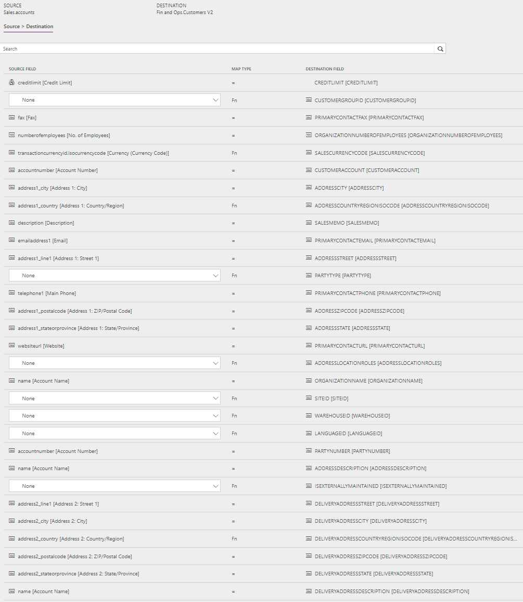

# Synchronize accounts directly from Sales to customers in Supply Chain Management

[!include [banner](../../../finance/includes/banner.md)]

> [!NOTE]
> Before you can use the Prospect to cash solution, you should be familiar with [Integrate data into Microsoft Dataverse for Apps](/powerapps/administrator/data-integrator).

This article discusses the templates and underlying tasks that are used to synchronize accounts directly from Dynamics 365 Sales to Dynamics 365 Supply Chain Management.

## Data flow in Prospect to cash

The Prospect to cash solution uses the Data integration feature to synchronize data across instances of Supply Chain Management and Sales.  The Prospect to cash templates that are available with the Data integration feature enable the flow of data about accounts, contacts, products, sales quotations, sales orders, and sales invoices between Supply Chain Management and Sales. The following illustration shows how the data is synchronized between Supply Chain Management and Sales.

](/media/prospect-to-cash-data-flow.png)

## Templates and tasks

To access the available templates, open [Power Apps Admin Center](https://preview.admin.powerapps.com/dataintegration). Select **Projects**, and then, in the upper-right corner, select **New project** to select public templates.

The following template and underlying task are used to synchronize accounts from Sales to Supply Chain Management:

- **Name of the template in Data integration:** Accounts (Sales to Fin and Ops) - Direct
- **Name of the task in the project:** Accounts - Customers

No synchronization tasks are required before Account/Customer synchronization can occur.

## Entity set

| Sales    | Supply Chain Management |
|----------|------------------------|
| Accounts | Customers V2           |

## Entity flow

Accounts are managed in Sales and synchronized to Supply Chain Management as customers. The **Is Externally Maintained** property on these customers is set to **Yes** to track customers that originate from Sales. During invoicing, this information is used to filter invoices that are synchronized to Sales.

## Prospect to cash solution for Sales

The **Account Number** column is available on the **Account** page. It has been made a natural and unique key in order to support the integration. The natural key feature of the Customer Relationship Management (CRM) solution might affect customers who already use the **Account Number** column, but who don't use unique **Account Number** values per account. Currently, the integration solution doesn't support this case.

When a new account is created, if an **Account Number** value doesn't already exist, it's automatically generated by using a number sequence. The value consists of **ACC**, followed by an increasing number sequence and then a suffix of six characters. Here is an example: **ACC-01000-BVRCPS**

When the integration solution for Sales is applied, an upgrade script sets the **Account Number** column for existing accounts in Sales. If there are no **Account Number** values, the number sequence that was mentioned earlier is used.

## Preconditions and mapping setup

- The **CustomerGroupId** mapping must be updated to a valid value in Supply Chain Management. You can specify a default value, or you can set the value by using a value map.

    The default template value is **10**.

- By adding the following mappings, you can help reduce the number of manual updates that are required in Supply Chain Management. You can use a default value or a value map from, for example, **Country/Region** or **City**.

    - **SiteId** – A site is required in order to generate quotations and sales order lines in Supply Chain Management. A default site can be taken either from the product, or from the customer from the order header.

        The default template value is **1**.

    - **WarehouseId** – A warehouse is required in order to process quotations and sales order lines in Supply Chain Management. A default warehouse can be taken either from the product, or from the customer from the order header in Supply Chain Management.

        The default template value is **13**.

    - **LanguageId** – A language is required in order to generate quotations and sales orders in Supply Chain Management. By default, the language from the order header from the customer is used.

        The default template value is **en-us**.

## Template mapping in Data integration

> [!NOTE]
> The **Payment terms**, **Freight terms**, **Delivery terms**, **Shipping method**, and **Delivery mode** columns aren't included in the default mappings. To map these columns, you must set up a value mapping that is specific to the data in the organizations that the table is synchronized between.

The following illustrations show an example of a template mapping in Data integration. 

> [!NOTE]
> The mapping shows which column information will be synchronized from Sales to Supply Chain Management.

## Related articles

[Prospect to cash](prospect-to-cash.md)

[Synchronize accounts directly from Sales to customers in Supply Chain Management]()

[Synchronize contacts directly from Sales to contacts or customers in Supply Chain Management](contacts-template-mapping-direct.md)

[Synchronization of sales orders directly between Sales and Supply Chain Management](sales-order-template-mapping-direct-two-ways.md)

[Synchronize sales invoice headers and lines directly from Supply Chain Management to Sales](sales-invoice-template-mapping-direct.md)

[!INCLUDE[footer-include](../../../includes/footer-banner.md)]
