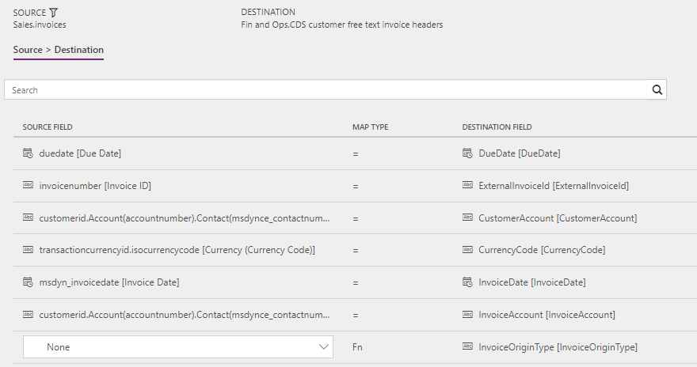
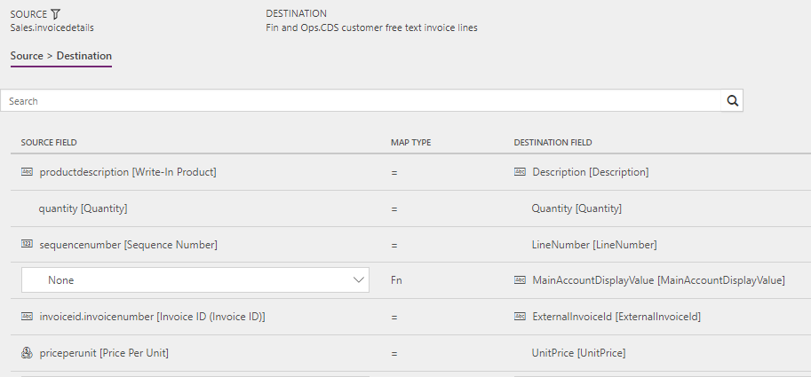

# Synchronize agreement invoices in Field Service to free text invoices in Supply Chain Management

[!include[banner](../../../finance/includes/banner.md)]

This article discusses the templates and underlying tasks that are used to synchronize agreement invoices in Dynamics 365 Field Service to free text invoices in Dynamics 365 Supply Chain Management.

## Templates and tasks

The following template and underlying tasks are used to run synchronization of agreement invoices from Field Service to free text invoices in Supply Chain Management.

**Name of the template in Data integration**

- Agreement invoices (Field Service to Supply Chain Management)

**Names of the tasks in the Data integration project**

- Invoice headers
- Invoice lines

The following synchronization is required before synchronization of agreement invoices can occur:

- Accounts (Sales to Supply Chain Management) – Direct

## Entity set

| Field Service  | Supply Chain Management                 |
|----------------|----------------------------------------|
| invoices       | Dataverse customer free text invoice headers |
| invoicedetails | Dataverse customer free text invoice lines   |

## Entity flow

Invoices that are created from an agreement in Field Service can be synchronized to Supply Chain Management via a Microsoft Dataverse Data integration project. Updates to these invoices will be synchronized to the free text invoices in Supply Chain Management if the accounting status of the free text invoices is **In process**. After the free text invoices are posted in Supply Chain Management, and the accounting status is updated to **Completed**, you can no longer synchronize updates from Field Service.

## Field Service CRM solution

The **Has Lines With Agreement Origin** column has been added to the **Invoice** table. This column helps guarantee that only invoices that are created from an agreement are synchronized. The value is **true** if the invoice contains at least one invoice line that originates from an agreement.

The **Has Agreement Origin** column has been added to the **Invoice Line** table. This column helps guarantee that only invoice lines that are created from an agreement are synchronized. The value is **true** if the invoice line originates from an agreement.

**Invoice date** is a mandatory field in Supply Chain Management. Therefore, the column must have a value in Field Service before synchronization occurs. To meet this requirement, the following logic is added:

- If the **Invoice Date** column is blank on the **Invoice** table (that is, if it has no value), it's set to the current date when an invoice line that originates from an agreement is added.
- The user can change the **Invoice Date** column. However, when the user tries to save an invoice that originates from an agreement, they receive a business process error if the **Invoice Date** column is blank on the invoice.

## Prerequisites and mapping setup

### In Supply Chain Management

An invoice origin must be set up for the integration, to distinguish the free text invoices in Supply Chain Management that are created from agreement invoices in Field Service. When an invoice has an invoice origin of the **Agreement invoice integration** type, the **External invoice number** field is shown on the **Sales invoice** header.

Besides appearing on the invoice header, the **External invoice number** information can be used to help guarantee that invoices that are created from Field Service agreement invoices are filtered out during invoice synchronization from Supply Chain Management to Field Service.

1. Go to **Accounts receivable** \> **Setup** \> **Invoice origin codes**.
2. Select **New** to create a new invoice origin.
3. In the **Invoice origin** field, enter a name for the invoice origin, such as **FS**.
4. In the **Description** field, enter a description, such as **Field Service Agreement Invoice**.
5. Select the **Origin type assignment** check box.
6. Set the **Invoice origin type** field to **Agreement invoice integration**.
7. Select **Save**.

### In the Data Integration project

Task: **Invoice lines**  

Make sure that the default value for the Supply Chain Management field **Main Account Display Value** is updated to match the desired value.

The default template value is **401100**.

## Template mapping in Data integration

The following illustrations show the template mapping in Data integration.

### Agreement invoices (Field Service to Supply Chain Management): Invoice headers

### Agreement invoices (Field Service to Supply Chain Management): Invoice lines

[!INCLUDE[footer-include](../../../includes/footer-banner.md)]
