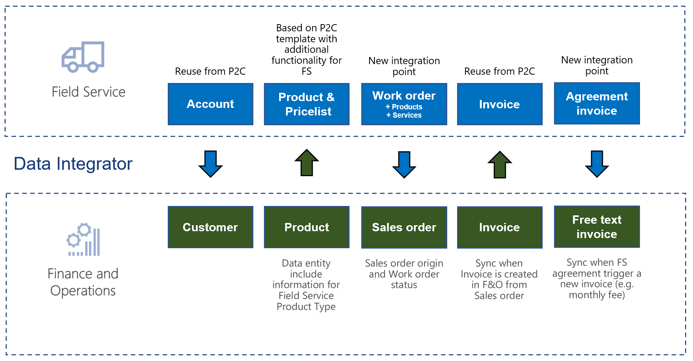
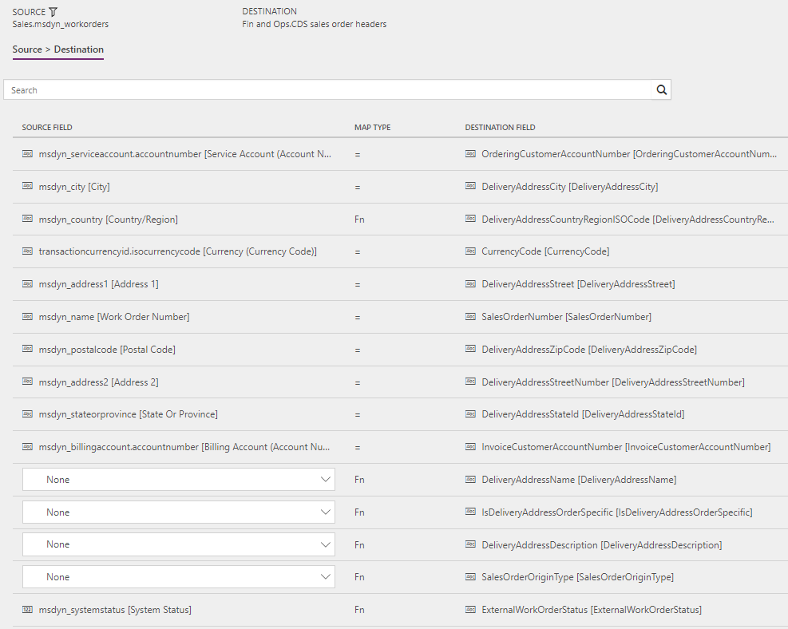
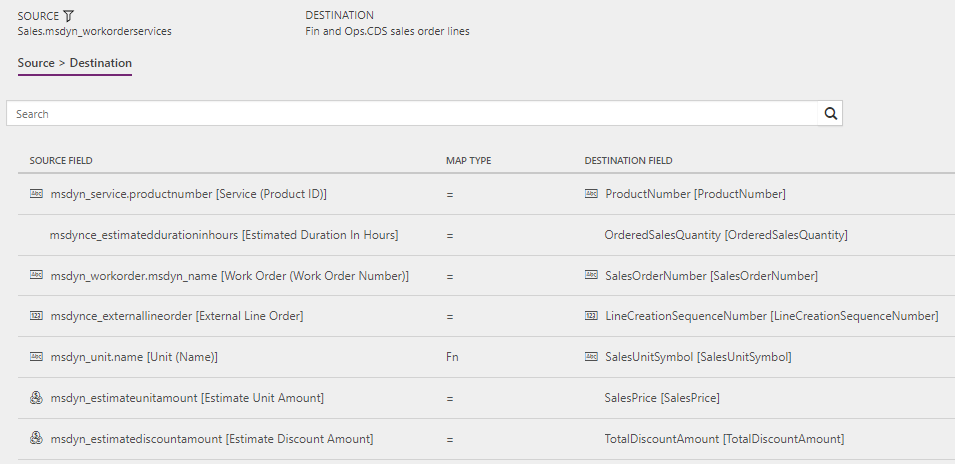
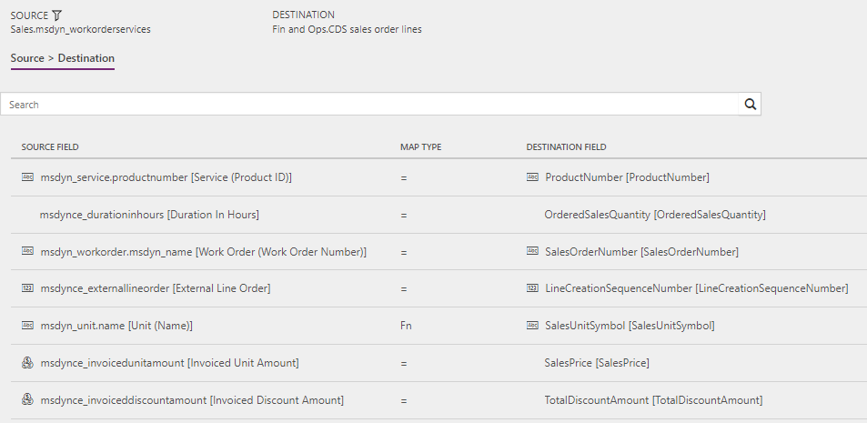
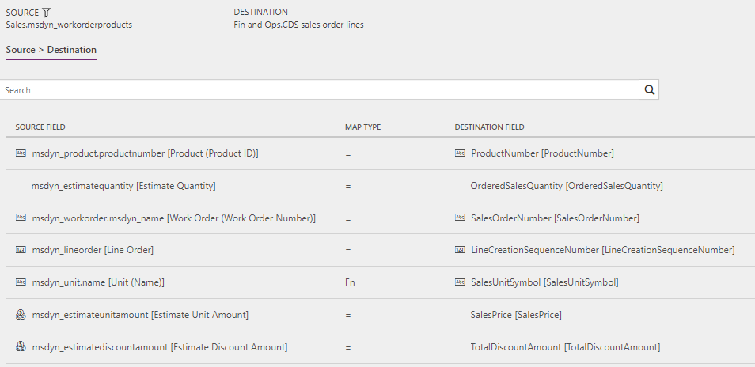

# Synchronize work orders in Field Service to sales orders in Supply Chain Management

[!include[banner](../../../finance/includes/banner.md)]

This article discusses the templates and underlying tasks that are used to synchronize work orders in Dynamics 365 Field Service to sales order in Dynamics 365 Supply Chain Management.

## Templates and tasks

The following templates and underlying tasks are used to run the synchronization of work orders in Field Service to sales orders in Supply Chain Management.

### Names of the templates in Data integration

The **Work orders to Sales orders (Field Service to Supply Chain Management)** template is used to run synchronization.

### Names of the tasks in the Data integration project

- WorkOrderHeader
- WorkOrderServiceLineEstimate
- WorkOrderServiceLineUsed
- WorkOrderProductLineEstimate
- WorkOrderProductLineUsed

The following synchronization tasks are required before synchronization of sales order headers and lines can occur:

- Field Service Products (Supply Chain Management to Field Service)
- Accounts (Sales to Supply Chain Management) – Direct

## Entity set

| **Field Service** | **Supply Chain Management** |
|-------------------------|-------------------------|
| msdyn_workorders        | Dataverse sales order headers |
| msdyn_workorderservices | Dataverse sales order lines   |
| msdyn_workorderproducts | Dataverse sales order lines   |

## Entity flow

Work orders are created in Field Service. If the work orders include only externally maintained products, and if the **Work order status** value differs from **Open-Unscheduled** and **Closed – Cancelled**, the work orders can be synchronized to Supply Chain Management via a Microsoft Dataverse Data integration project. Updates on the work orders will be synchronized as sales orders in Supply Chain Management. These updates include the information about the origin type and status.

## Estimated versus Used

In Field Service, products and services on work orders have both **Estimated** values and **Used** values for quantities and amounts. However, in Supply Chain Management, sales orders don't have the same concept of **Estimated** and **Used** values. To support product allocation that uses the expected quantity on the sales order in Supply Chain Management, but to keep the used quantity that should be consumed and invoiced, two sets of tasks synchronize the products and services on the work order. One set of tasks is for **Estimated** values, and the other set of tasks is for **Used** values.

This behavior enables scenarios where estimated values are used for allocation or reservation in Supply Chain Management, whereas used values are used for consumption and invoicing.

### Estimated

For synchronization of product lines, the **Estimated** values are used when the **Line Status** value is **Estimated**, the **Allocated** option is set to **Yes**, and **System Status** value isn't **Closed – Posted**.

For synchronization of service lines, the **Estimated** values are used when the **Line Status** value is **Estimated** and the **System Status** value isn't **Closed – Posted**.

### Used

The **Used** values are used for consumption and invoicing. In these cases, the **Used** values are synchronized.

The following table provides an overview of the various combinations for product lines.

| System Status  (Field Service) | Line Status  (Field Service) | Allocated  (Field Service) |Synchronized value  (Supply Chain Management) |
|--------------------|-------------|-----------|---------------------------------|
| Open - Scheduled   | Estimated   | Yes       | Estimated                       |
| Open - Scheduled   | Estimated   | No        | Used                            |
| Open - Scheduled   | Used        | Yes       | Used                            |
| Open - Scheduled   | Used        | No        | Used                            |
| Open - In Progress | Estimated   | Yes       | Estimated                       |
| Open - In Progress | Estimated   | No        | Used                            |
| Open - In Progress | Used        | Yes       | Used                            |
| Open - In Progress | Used        | No        | Used                            |
| Open - Completed   | Estimated   | Yes       | Estimated                       |
| Open - Completed   | Estimated   | No        | Used                            |
| Open - Completed   | Used        | Yes       | Used                            |
| Open - Completed   | Used        | No        | Used                            |
| Closed - Posted    | Estimated   | Yes       | Used                            |
| Closed - Posted    | Estimated   | No        | Used                            |
| Closed - Posted    | Used        | Yes       | Used                            |
| Closed - Posted    | Used        | No        | Used                            |

The following table provides an overview of the various combinations for service lines.

| System Status  (Field Service) | Line Status  (Field Service) | Synchronized value  (Supply Chain Management) |
|--------------------|-------------|-----------|
| Open - Scheduled   | Estimated   | Estimated |
| Open - Scheduled   | Used        | Used      |
| Open - In Progress | Estimated   | Estimated |
| Open - In Progress | Used        | Used      |
| Open - Completed   | Estimated   | Estimated |
| Open - Completed   | Used        | Used      |
| Closed - Posted    | Estimated   | Used      |
| Closed - Posted    | Used        | Used      |

Synchronization of **Estimated** values versus **Used** values is managed through the two sets of tasks for product lines and service lines. Predefined filters trigger the correct task, and the underlying mapping helps guarantee that the correct values for **Expected** versus **Used** are synchronized.

### Example

1. A work order is created and scheduled in Field Service.

    The **System Status** value is **Open – Scheduled**.

    - **Product line:** Estimated Qty = 5ea, Used Qty = 0ea, Line Status = Estimated, Allocated = No
    - **Service line:** Estimated Qty = 2h, Used Qty = 0h, Line Status = Estimated

    In this example, the product's **Used Qty** value of **0** (zero) and the service's **Estimated Qty** value of **2h** are synchronized to Supply Chain Management.

2. Products are allocated in Field Service.

    The **System Status** value is **Open – Scheduled**.

    - **Product line:** Estimated Qty = 5ea, Used Qty = 0ea, Line Status = Estimated, Allocated = Yes
    - **Service line:** Estimated Qty = 2h, Used Qty = 0h, Line Status = Estimated

    In this example, the product's **Estimated Qty** value of **5ea** and the service's **Estimated Qty** value of **2h** are synchronized to Supply Chain Management.

3. The service technician starts to work on the work order and registers material usage of 6.

    The **System Status** value is **Open – In Progress**.

    - **Product line:** Estimated Qty = 5ea, Used Qty = 6ea, Line Status = Used, Allocated = Yes
    - **Service line:** Estimated Qty = 2h, Used Qty = 0h, Line Status = Estimated

    In this example, the product's **Used Qty** value of **6** and the service's **Estimated Qty** value of **2h** are synchronized to Supply Chain Management.

4. The service technician completes the work order and registers used time of 1.5 hours.

    The **System Status** value is **Open – Completed**.

    - **Product line:** Estimated Qty = 5ea, Used Qty = 6ea, Line Status = Used, Allocated = Yes
    - **Service line:** Estimated Qty = 2h, Used Qty = 1.5h, Line Status = Used

    In this example, the product's **Used Qty** value of **6** and the service's **Used Qty** of **1.5h** are synchronized to Supply Chain Management.

## Sales order origin and status

### Sales origin

To keep track of sales orders that originate from work orders, you can create a sales origin where the **Origin type assignment** option is set to **Yes** and the **Sales origin type** field is set to **Work order integration**.

By default, the mapping selects the sales origin for the **Work order integration** sales origin type for all sales orders that are created from work orders. This behavior can be useful when you work with the sales order in Supply Chain Management. You must make sure that sales orders that originate from work orders aren't synchronized back to Field Service as work orders.

For details about how to create the correct sales origin setup in Supply Chain Management, see the "Preconditions and mapping setup" section of this article.

### Status

When the sales order originates from a work order, the **External work order status** field appears on the **Setup** tab on the sales order header. This field shows the system status from the work order in Field Service, to help track the synchronized work order status of sales orders in the Supply Chain Management. This field can also help the user determine when the sales order should be shipped or invoiced.

The **External work order status** field can have the following values:

- Open - Scheduled
- Open - In Progress
- Open - Completed
- Closed - Posted

## Field Service CRM solution

To support the integration between Field Service and Supply Chain Management, additional functionality from the Field Service CRM solution is required. The solution includes the following changes.

### Work Order entity

The **Has Externally Maintained Products Only** field has been added to the **Work Order** entity and appears on the page. It's used to consistently track whether a work order consists entirely of externally maintained products. A work order consists entirely of externally maintained products when all the related products are maintained in Supply Chain Management. This field helps guarantee that users don't synchronize work orders that have products that are unknown.

### Work Order Product entity

- The **Order Has Externally Maintained Products Only** field has been added to the **Work Order Product** entity and appears on the page. It's used to consistently track whether the work order product is maintained in Supply Chain Management. This field helps guarantee that users don't synchronize work order products that are unknown to Supply Chain Management.
- The **Header System Status** field has been added to the **Work Order Product** entity and appears on the page. It's used to consistently track the system status of the work order and helps guarantee correct filtering when work order products are synchronized to Supply Chain Management. When filters are set on the integration tasks, **Header System Status** information is also used to determine whether the estimated or used values should be synchronized.
- The **Invoiced Unit Amount** field shows the amount that is invoiced per actual unit that is used. The value is calculated as the **Total Amount** value divided by the **Actual Quantity** value. The field is used for integration to systems that don't support different values for the used quantity and the billed quantity. This field doesn't appear in the user interface (UI). 
- The **Invoiced Discount Amount** field is calculated as the **Discount Amount** value plus the rounding from the calculation of the **Invoiced Unit Amount** value. This field is used for integration and doesn't appear in the UI.
- The **Decimal Quantity** field stores the value from the **Quantity** field as a decimal number. This field is used for integration and doesn't appear in the UI. 
- The value in **Used** fields is reset to **0** (zero) if the **Line Status** value of the work order product is changed from **Used** to **Estimated**. This change helps prevent situations where a used quantity that is mistakenly entered is used for synchronization when the **Line Status** value is **Estimated** and the **Allocated** option is set to **No**.

### Work Order Service entity

- The **Order Has Externally Maintained Products Only** field has been added to the **Work Order Service** entity and appears on the page. It's used to consistently track whether the work order service is maintained in Supply Chain Management. This field helps guarantee that users don't synchronize work order services that are unknown to Supply Chain Management.
- The **Header System Status** field has been added to the **Work Order Service** entity and appears on the page. It's used to consistently track the system status of the work order and helps guarantee correct filtering when work order services are synchronized to Supply Chain Management. When filters are set on the integration tasks, **Header System Status** information is also used to determine whether the estimated or used values should be synchronized.
- The **Duration In Hours** field stores the value from the **Duration** field after that value is converted from minutes to hours. This field is used for integration and doesn't appear in the UI.
- The **Estimated Duration In Hours** field stores the value from the **Estimated Duration** field after that value is converted from minutes to hours. This field is used for integration and doesn't appear in the UI.
- The **Invoiced Unit Amount** field stores the amount that is invoiced per actual unit that is used. The value is calculated as the **Total Amount** value divided by the **Actual Quantity** value. This field is used for integration to systems that don't support different values for the used quantity and the billed quantity. The field doesn't appear in the UI.
- The **Invoiced Discount Amount** field is calculated as the **Discount Amount** value plus the rounding from the calculation of the **Invoiced Unit Amount** value. This field is used for integration and doesn't appear in the UI.
- The **External Line Order** field is a calculated negative line order number that can be used in external systems where work order product and service lines are combined. This field enables work order products that are inserted to have positive line numbers and work order services to have negative line numbers. The value of this this field is calculated as the **Line Order** value multiplied by -1. This field doesn't appear in the UI.
- The value in **Used** fields is reset to **0** (zero) if the **Line Status** value of the work order service is changed from **Used** to **Estimated** for some reason. This change helps prevent situations where a used quantity that is mistakenly entered is used for synchronization when the **Line Status** value is **Estimated** and the **Header System Status** value is **Closed – Posted**.

## Preconditions and mapping setup

Before you synchronize work orders, it's important that you update the following settings in the systems.

### Setup in Field Service

- Make sure that the number series that is used for work orders in Field Service doesn't overlap the number sequence that is used for sales orders in Supply Chain Management. Otherwise, existing sales orders can be incorrectly updated in Field Service or Supply Chain Management.
- The **Work Order Invoice Creation** field must be set to **Never**, because the invoicing will be done from Supply Chain Management. Go to **Field Service** \> **Settings** \> **Administration** \> **Field Service Settings**, and make sure that the **Work Order Invoice Creation** field is set to **Never**.

### Setup in Supply Chain Management

Work order integration requires that you set up the sales origin. The sales origin is used to distinguish sales orders in Supply Chain Management that were created from work orders in Field Service. When a sales order has a sales origin of the **Work order integration** type, the **External work order status** field appears on the sales order header. Additionally, the sales origin helps guarantee that sales orders that were created from work orders in Field Service are filtered out during sales order synchronization from Supply Chain Management to Field Service.

1. Go to **Sales and marketing** \> **Setup** \> **Sales orders** \> **Sales origin**.
2. Select **New** to create a new sales origin.
3. In the **Sales origin** field, enter a name for the sales origin, such as **WorkOrder**.
4. In the **Description** field, enter a description, such as **Field Service Work Order**.
5. Select the **Origin type assignment** check box.
6. Set the **Sales origin type** field to **Work order integration**.
7. Select **Save**.

### Setup in Data integration

Ensure the **Integration key** exist for **msdyn_workorders**
1. Go to Data Integration
2. Select **Connection Set** tab
3. Select the Connection set used for Work order synchronization
4. Select **Integration key** tab
5. Find msdyn_workorders and check that the key **msdyn_name (Work Order Number)** is added. If it is not shown, add it by click **Add key** and click **Save** in the top of the page

## Template mapping in Data integration

The following illustrations show the template mapping in Data integration.

### Work orders to Sales orders (Field Service to Supply Chain Management): WorkOrderHeader

Filter: 
(msdyn_systemstatus ne 690970005) and (msdyn_systemstatus ne 690970000) and (msdynce_hasexternallymaintainedproductsonly eq true)

### Work orders to Sales orders (Field Service to Supply Chain Management): WorkOrderServiceLineEstimate

Filter: 
(msdynce_headersystemstatus ne 690970005) and (msdynce_headersystemstatus ne 690970000) and (msdynce_orderhasexternalmaintainedproductsonly eq true) and (msdyn_linestatus eq 690970000) and (msdynce_headersystemstatus ne 690970004)

### Work orders to Sales orders (Field Service to Supply Chain Management): WorkOrderServiceLineUsed

Filter:
(msdynce_headersystemstatus ne 690970005) and (msdynce_headersystemstatus ne 690970000) and (msdynce_orderhasexternalmaintainedproductsonly eq true) and ((msdyn_linestatus eq 690970001) or (msdynce_headersystemstatus eq 690970004))

### Work orders to Sales orders (Field Service to Supply Chain Management): WorkOrderProductLineEstimate

Filter:
(msdynce_headersystemstatus ne 690970005) and (msdynce_headersystemstatus ne 690970000) and (msdynce_orderhasexternalmaintainedproductsonly eq true) and (msdyn_linestatus eq 690970000) and (msdynce_headersystemstatus ne 690970004) and (msdyn_allocated eq true)

### Work orders to Sales orders (Field Service to Supply Chain Management): WorkOrderProductLineUsed

Filter:
(msdynce_headersystemstatus ne 690970005) and (msdynce_headersystemstatus ne 690970000) and (msdynce_orderhasexternalmaintainedproductsonly eq true) and ((msdyn_linestatus eq 690970001) or (msdynce_headersystemstatus eq 690970004) or (msdyn_allocated ne true))

[!INCLUDE[footer-include](../../../includes/footer-banner.md)]
