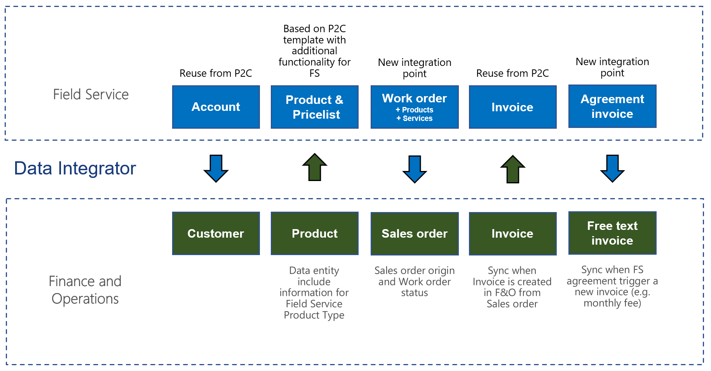
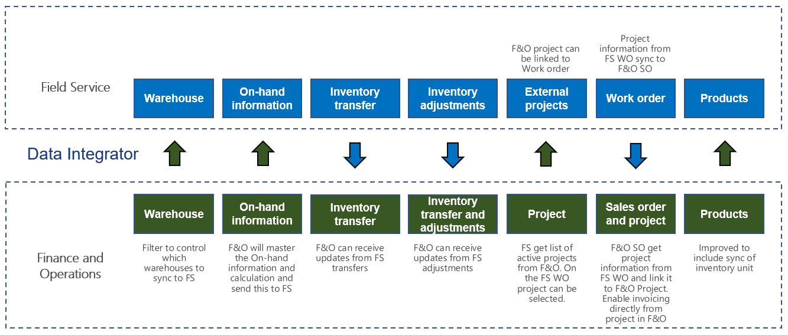

# Integration with Microsoft Dynamics 365 Field Service overview

[!include[banner](../../../finance/includes/banner.md)]

Supply Chain Management enables synchronization of business processes between Dynamics 365 Supply Chain Management and Dynamics 365 Field Service. The integration scenarios are configured by using extensible Data integrator templates and Microsoft Dataverse to enable the synchronization of business processes.
Standard templates can be used to create custom integration projects, where more standard and custom columns and tables can be mapped to adjust the integration and meet specific business needs. 

The field service integration builds on top of the existing prospect-to-cash functionality.

The first phase  of the integration between Field Service and Supply Chain Management is focused on enabling work orders and agreements in Field Service to be invoiced in Supply Chain Management. The supported flow starts in Field Service, where information from work orders is synchronized to Supply Chain Management as sales orders. In Supply Chain Management, the sales orders are invoiced to generate invoice documents. In addition, the information from Field Service agreement invoices is synchronized to Supply Chain Management. The Microsoft Dynamics 365 Data integrator synchronizes data by using customizable projects. Standard templates can be used to create custom integration projects where more standard and custom columns, and also tables, can be mapped to adjust the integration and meet specific requirements.

The first phase of the integration between Field Service and Supply Chain Management enables synchronization of the following items:

- [Synchronize products in Supply Chain Management to products in Field Service](field-service-product.md)
- [Synchronize work orders in Field Service to sales orders in Supply Chain Management](field-service-work-order.md)
- [Synchronize agreement invoices in Field Service to free text invoices in Supply Chain Management](field-service-invoice.md)

To see an example of how you can synchronize a work order between Field Service and Supply Chain Management, watch the short YouTube video [How to synchronize a work order with Microsoft Dynamics 365 Integration](https://www.youtube.com/watch?v=46ylO7raZAo).

## Integration with Field Service, including inventory and project information

The functionality in this second phase focused on giving field technicians insight about the inventory information from Supply Chain Management, allowing them to update inventory levels and do material transfers. In addition, companies installing or servicing sold goods benefit from better control and visibility to the full sales and service process with integration from projects.

### Functionality includes integration of:
- Warehouse information
- On-hand inventory information
- Inventory transfers
- Inventory adjustments
- Supply Chain Management projects connected with Dynamics 365 Field Service work orders
- Dynamics 365 Field Service work orders with link to Supply Chain Management projects, apply this project number to the sales order to allow invoicing from the project. 

### The second phase of the integration between Field Service and Supply Chain Management enables synchronization with the following templates:
- Warehouses (Supply Chain Management to Field Service) - Warehouses from Supply Chain Management to Field Service [Advanced Query] 
- Product Inventory (Supply Chain Management to Field Service) - Inventory level information from Supply Chain Management to Field Service [Advanced Query] 
- Inventory Adjustment (Field Service to Supply Chain Management) - Inventory adjustments from Field Service to Supply Chain Management [Advanced Query] 
- Inventory Transfers (Field Service to Supply Chain Management) - Inventory transfers from Field Service to Supply Chain Management [Advanced Query] 
- Projects (Supply Chain Management to Field Service) - Project list from Supply Chain Management to Field Service 
- Work Orders with Project (Field Service to Supply Chain Management) - Work orders in Field Service to Sales orders  in Supply Chain Management, with support for Project [Advanced Query] 
- Field Service Products with Inventory unit (Supply Chain Management to Sales) - Supply Chain Management 'Sellable released products' to Sales 'Products' for Field Service, including Inventory unit 

## System requirements

### System requirements for Supply Chain Management
Field Service integration supports the following versions:

- Dynamics 365 Finance and Operations version 8.1.2 (December 2018) was released in December 2018 and has an application build number 8.1.195 with Platform update 22 (7.0.5095). 

### System requirements for Field Service
To use the Field Service integration solution, you must install the following components:

- Field Service (version 8.2.0.286) or a later version on Dynamics 365 9.1.x - Released November 2018
- Prospect to Cash (P2C) solution for Dynamics 365, version 1.15.0.1 or a later version. The solution is available for download from [AppSource](https://appsource.microsoft.com/product/dynamics-365/mscrm.c7a48b40-eed3-4d67-93ba-f2364281feb3).
  > [!NOTE]
  > The P2C solution is incompatible with Dual-write and this integration is layered on top of the P2C solution, meaning it can't be used in conjuction with Dual-write.
- 'Field Service Integration, Project and Inventory' solution for Dynamics 365, version 2.0.0.0 or a later version. The solution is available for download from [AppSource](https://appsource.microsoft.com/product/dynamics-365/mscrm.p2cfieldserviceintegrationv2).

[!INCLUDE[footer-include](../../../includes/footer-banner.md)]
