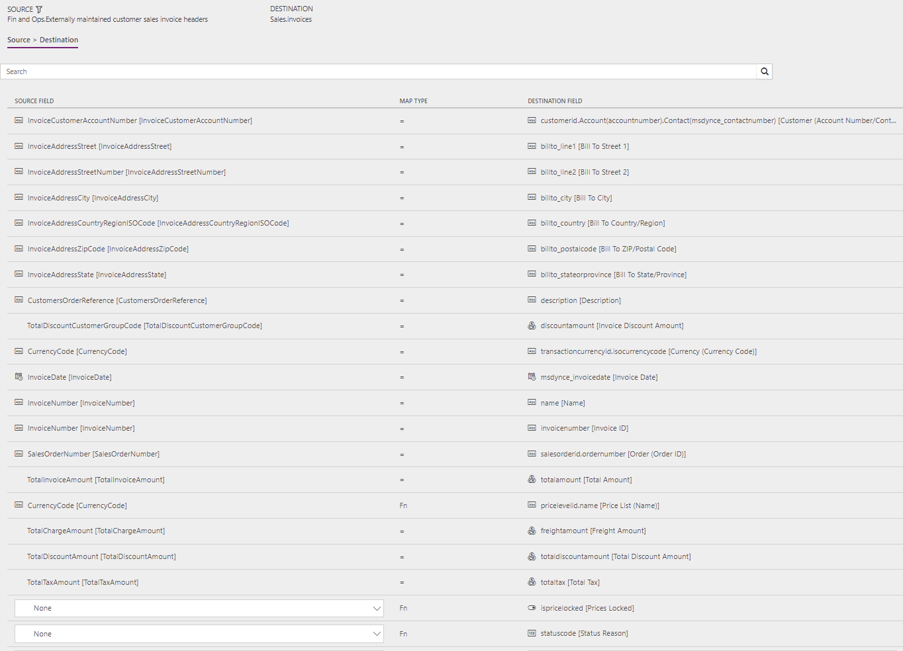
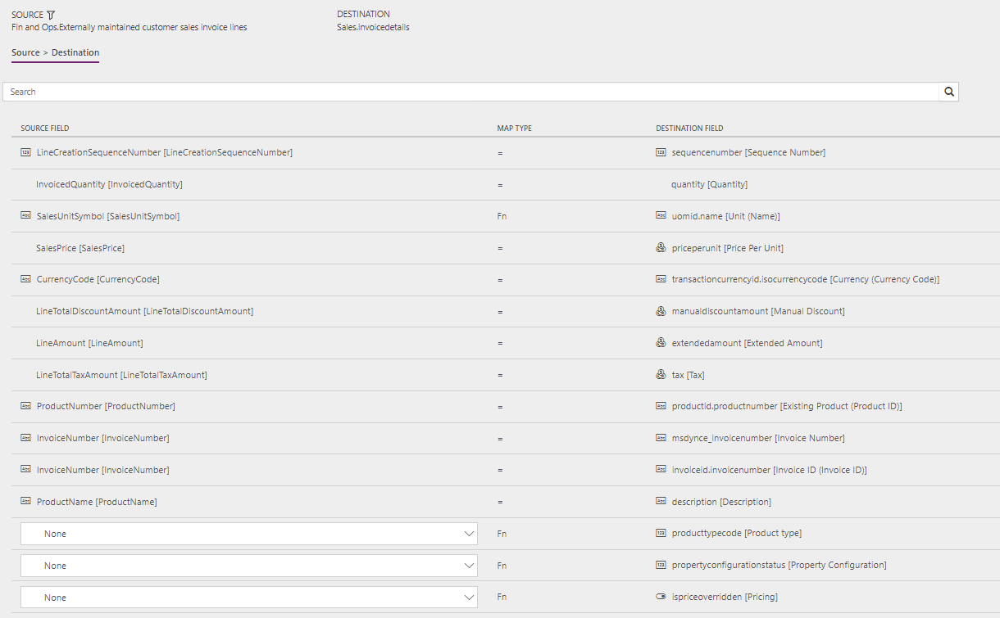

# Synchronize sales invoice headers and lines directly from finance and operations to Sales

[!include [banner](../../../finance/includes/banner.md)]

This article discusses the templates and underlying tasks that are used to synchronize sales invoice headers and lines directly from Dynamics 365 Supply Chain Management to Dynamics 365 Sales.

## Data flow in Prospect to cash

The Prospect to cash solution uses the Data integration feature to synchronize data across instances of Supply Chain Management and Sales. The Prospect to cash templates that are available with the Data integration feature enable the flow of data about accounts, contacts, products, sales quotations, sales orders, and sales invoices between Supply Chain Management and Sales. The following illustration shows how the data is synchronized between Supply Chain Management and Sales.

## Templates and tasks

To access the available templates, open [Power Apps Admin Center](https://preview.admin.powerapps.com/dataintegration). Select **Projects**, and then, in the upper-right corner, select **New project** to select public templates.

The following template and underlying tasks are used to synchronize sales invoice headers and lines from Supply Chain Management to Sales:

- **Name of the template in Data integration:** Sales Invoices (Fin and Ops to Sales) - Direct
- **Names of the tasks in the Data integration project:**

    - SalesInvoiceHeader
    - SalesInvoiceLine

The following synchronization tasks are required before synchronization of sales invoice headers and lines can occur:

- Products (Supply Chain Management to Sales) - Direct
- Accounts (Sales to Supply Chain Management) - Direct (if used)
- Contacts (Sales to Supply Chain Management) - Direct (if used)
- Sales order header and lines (Supply Chain Management to Sales) - Direct

## Entity set

| Supply Chain Management                              | Sales          |
|------------------------------------------------------|----------------|
| Externally maintained customer sales invoice headers | Invoices       |
| Externally maintained customer sales invoice lines   | InvoiceDetails |

## Entity flow

Sales invoices are created in Supply Chain Management and synchronized to Sales.

> [!NOTE]
> Currently, tax that is related to charges on the sales invoice header isn't included in the synchronization from Supply Chain Managements to Sales. Sales doesn't support tax information at the header level. However, tax that is related to charges at the line level is included in the synchronization.

## Prospect to cash solution for Sales

- An **Invoice number** field has been added to the **Invoice** entity and appears on the page.
- The **Create invoice** button on the **Sales order** page is hidden, because invoices will be created in Supply Chain Management and synchronized to Sales. The **Invoice** page can't be edited, because invoices will be synchronized from Supply Chain Management.
- The **Sales order status** value is automatically changed to **Invoiced** when the related invoice from Supply Chain Management has been synchronized to Sales. Additionally, the owner of the sales order that the invoice was created from is assigned as the owner of the invoice. Therefore, the owner of the sales order can view the invoice.

## Preconditions and mapping setup

Before you synchronize sales invoices, it's important that you update the following settings in the systems.

### Setup in Sales

Go to **Settings** > **Administration** > **System settings** > **Sales**, and make sure that the following settings are used:

- The **Use system prizing calculation system** option is set to **Yes**.
- The **Discount calculation method** field is set to **Line item**.

### Setup in the Data integration project

#### SalesInvoiceHeader task

- Make sure that the required mapping exists for **InvoiceCountryRegionId** to **BillingAddress\_Country**.

    The template value is a value map where several countries or regions are mapped.

- A price list is required in order to create invoices in Sales. Update the value map for **pricelevelid.name \[Price list name\]** to the price list that is used in Sales per currency. You can use the default price list for a single currency. Alternatively, if you have price lists in multiple currencies, you can use a value map.

    The template value for **pricelevelid.name \[Price list name\]** is a value map that is based on currency with USD = CRM Service USA (sample).  
    
#### SalesInvoiceLine task

- Make sure that the required mapping exists for **Unit of measure**.
- Make sure that the required value map for **SalesUnitSymbol** in Supply Chain Management exists.

    A template value that has a value map is defined for **SalesUnitSymbol** to **Quantity\_UOM**.

## Template mapping in Data integration

> [!NOTE]
> The **Payment terms**, **Freight terms**, **Delivery terms**, **Shipping method**, and **Delivery mode** fields aren't included in the default mappings. To map these fields, you must set up a value mapping that is specific to the data in the organizations that the entity is synchronized between.

The following illustrations show an example of a template mapping in Data integration. 

> [!NOTE]
> The mapping shows which field information will be synchronized from Sales to Supply Chain Management.

### SalesInvoiceHeader

### SalesInvoiceLine

## Related articles

[Prospect to cash](prospect-to-cash.md)

[Synchronize accounts directly from Sales to customers in Supply Chain Management](accounts-template-mapping-direct.md)

[Synchronize products directly from Supply Chain Management to products in Sales](products-template-mapping-direct.md)

[Synchronize contacts directly from Sales to contacts or customers in Supply Chain Management](contacts-template-mapping-direct.md)

[Synchronization of sales orders directly between Sales and Supply Chain Management](sales-order-template-mapping-direct-two-ways.md)

[!INCLUDE[footer-include](../../../includes/footer-banner.md)]
