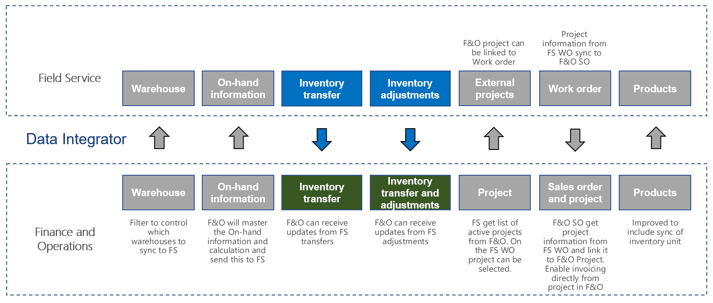

# Synchronize inventory transfers and adjustments from Field Service to Supply Chain Management

[!include[banner](../../../finance/includes/banner.md)]

This article discusses the templates and underlying tasks that are used to synchronize inventory adjustments and transfers from Dynamics 365 Supply Chain Management to Dynamics 365 Field Service.

## Templates and tasks
The following template and underlying tasks are used to synchronize inventory adjustments and transfers from Field Service to Supply Chain Management.

**Templates in Data integration**
- Inventory Adjustment (Field Service to Supply Chain Management)
- Inventory Transfers (Field Service to Supply Chain Management)

**Tasks in the Data integration projects**
- Inventory Adjustments
- Inventory Transfers

## Table set
| Field Service                     | Supply Chain Management                          |
|-----------------------------------|----------------------------------------------------|
| msdyn_inventoryadjustmentproducts | Dataverse Inventory adjustment journal headers and lines |
| msdyn_inventoryadjustmentproducts | Dataverse inventory transfer journal headers and lines   |

## Table flow
Inventory adjustments and transfers made in Field Service will synchronize to Supply Chain Management after the **Post status** changes from **Created** to **Posted**. When this occurs, the adjustment or the transfer order will be locked and become read only. This means that adjustments and transfers can be posted in Supply Chain Management, but cannot be modified. In Supply Chain Management, you can set up a batch job to automatically post the adjustments and transfer inventory journals that have been generated during the integration. See the following prerequisites for details on how to enable the batch job.

## Field Service CRM solution 
The **Inventory unit** column has been added to the **Product** table. This column is needed because the Sales and Inventory unit is not always the same in Supply Chain Management, and the Inventory Unit is needed for the Warehouse Inventory in Supply Chain Management.
When you set the product on an Inventory adjustment product for both Inventory adjustments and Inventory transfers, the unit will be fetched from the inventory product value. If a value is found, the **Unit** column will be locked on the Inventory adjustment product.

The **Post status** column has been added to both the **Inventory adjustment** table and the **Inventory transfer** table. This column is used as a filter when an adjustment or transfer is sent to Supply Chain Management. The default for this column is Created (1), however it is not sent to Supply Chain Management. When you update the value to Posted (2), it is sent to Supply Chain Management, but after that you will no longer be able to change the adjustment or transfer or add new lines.

The **Number sequence** column has been added to the **Inventory adjustment product** table. This column ensures that the integration has a unique number, so the integration can create and update the adjustment. When you create your first inventory adjustment product, it will create a new record in the **P2C AutoNumber** table to maintain the number series and the prefix that is used.

## Prerequisites and mapping setup

### Supply Chain Management
The integration inventory journals generated by the integration can automatically be posted using a batch job. This is enabled from **Inventory management > Periodic tasks > Dataverse integration > Post integration inventory journals**.

## Template mapping in Data integration

The following illustrations show the template mapping in Data integration.

### Inventory adjustment (Field Service to Supply Chain Management): Inventory adjustment

### Inventory transfer (Field Service to Supply Chain Management): Inventory transfer

[!INCLUDE[footer-include](../../../includes/footer-banner.md)]
