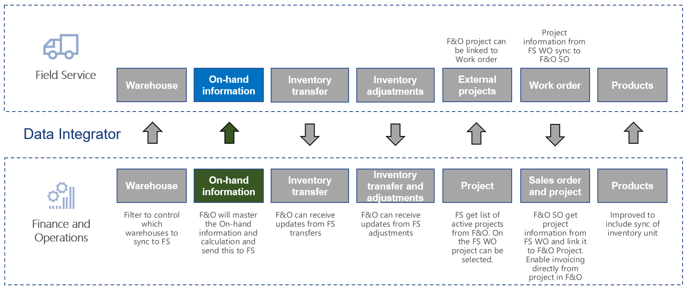
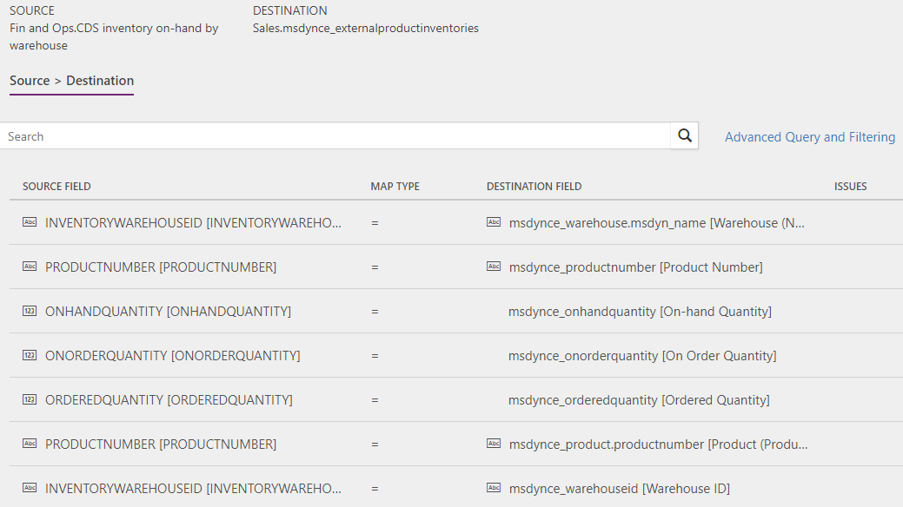

# Synchronize inventory level information from Supply Chain Management to Field Service 

[!include[banner](../../../finance/includes/banner.md)]

This article discusses the templates and underlying tasks that are used to synchronize inventory-level information from Dynamics 365 Supply Chain Management to Dynamics 365 Field Service.

## Templates and tasks
The following template and underlying tasks are used to synchronize inventory on-hand levels from Supply Chain Management to Field Service.

**Template in Data integration**
- Product Inventory (Supply Chain Management to Field Service)
  
**Task in the Data integration project**
- Product inventory

The following synchronization tasks are required before synchronization of inventory levels can occur:
- Warehouses (Supply Chain Management to Field Service) 
- Field Service products with Inventory unit (Supply Chain Management to Sales) 

## Entity set

| Field Service                      | Supply Chain Management                |
|------------------------------------|----------------------------------------|
| msdynce_externalproductinventories | Dataverse inventory on-hand by warehouse     |

## Entity flow
Inventory-level information from Finance and Operation is sent to Field Service for selected products. The inventory-level information includes: 
- On hand quantity (current recorded physical quantity located in the warehouse)
- On order quantity (total recorded quantity on order, such as sales orders)
- Ordered quantity (total recorded ordered quantity, such as purchase orders)

This information is captured per released product for each warehouse and synchronized based on change tracking, when the inventory level changes.

In Field Service, the integration solution creates inventory journals for the delta, so that the levels in Field Service match the levels in Supply Chain Management.

Supply Chain Management will act as the master for inventory levels. Therefore it is important to set up integration for work orders, transfers, and adjustments from Field Service to Supply Chain Management if this functionality is used in Field Service, together with synchronization of inventory levels from Supply Chain Management.

The products and warehouses where inventory levels are mastered from Supply Chain Management can be controlled with the Advanced Query and Filtering (Power Query).

> [!NOTE]
> It is possible to create multiple warehouses in Field Services (with **Is Externally Maintained = No**) and then map them to a single warehouse in Supply Chain Management, with the Advanced query and filtering functionality. This is used in situations where you want Field Service to master the detailed inventory level and only send updates to Supply Chain Management. In this case, Field Service will not receive inventory-level updates from Supply Chain Management. For additional information, see [Synchronize inventory adjustments from Field Service to Supply Chain Management](/dynamics365/unified-operations/supply-chain/sales-marketing/synchronize-inventory-adjustments) and [Synchronize work orders in Field Service to sales orders linked to project in Supply Chain Management](/dynamics365/unified-operations/supply-chain/sales-marketing/field-service-work-order).

## Field Service CRM solution
The **External product inventory** entity is only used for back end in to the integration. This entity receives the inventory level values from Supply Chain Management in the integration and then transforms those values to Manual inventory journals, which then changes the Inventory products in the Warehouse.

## Prerequisites and mapping setup

### Data integration
For the project to work, you need to ensure that the Integration key is updated for msdynce_externalproductinventories.
1.  Go to **Data integration > Connection sets**.
2.  Select the used Connection set.
3.  On the **Integration key** tab, ensure that the following keys are added to msdynce_externalproductinventories:
      - msdynce_productnumber (Product Number)
      - msdynce_warehouseid (Warehouse ID)
      
### Data integration project
You can apply filters with Advanced Query and Filtering so that only certain products and warehouses send inventory-level information from Supply Chain Management to Field Service.

## Template mapping in Data integration

### Product inventory (Supply Chain Management to Field Service): Product inventory

[!INCLUDE[footer-include](../../../includes/footer-banner.md)]
