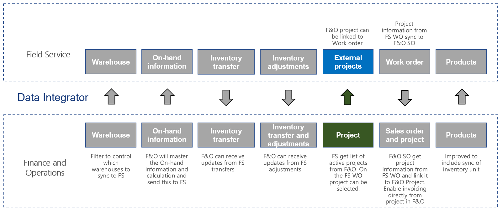

# Synchronize project list from Supply Chain Management to Field Service

[!include[banner](../../../finance/includes/banner.md)]

This article discusses the templates and underlying tasks that are used to synchronize projects from Dynamics 365 Supply Chain Management to Dynamics 365 Field Service.

## Templates and tasks
The following template and underlying tasks are used to run synchronization of projects from Supply Chain Management to Field Service.

**Template in Data integration**
- Projects (Supply Chain Management to Field Service)

**Task in the Data integration project**
- Projects

The following synchronization tasks are required before synchronization of project list can occur:
- Accounts (Sales to Supply Chain Management) 

## Entity set
| Field Service           | Supply Chain Management  |
|-------------------------|-------------------------|
|msdynce_externalprojects |	Projects                |

## Entity flow
Projects are created in Supply Chain Management. Projects with **Project type** set to **Time and material** and **Project stage** set to **In process** will synchronize to the **External Project** entity in Field Service, including Project number, Project name, Project stage, and Customer account information. The **External Project** list is used to pair Field service work orders with Supply Chain Management projects.

## Field Service CRM solution
The **External Project** entity gets all the projects from Supply Chain Management. The **External Project** field has been added to the **Work Order** entity. This is a lookup field, so by tagging your work order with a project, the sales order will be connected to a project within Supply Chain Management. After the **System Status** changes **Open – In Progress(690,970,000)** to a higher status, the **External Project** field will be locked and you can no longer add, remove, or change the value.

## Prerequisites and mapping setup
### Supply Chain Management
Enable change tracking for Data entity projects.

## Template mapping in Data integration

### Projects (Supply Chain Management to Field Service): Projects

[!INCLUDE[footer-include](../../../includes/footer-banner.md)]
